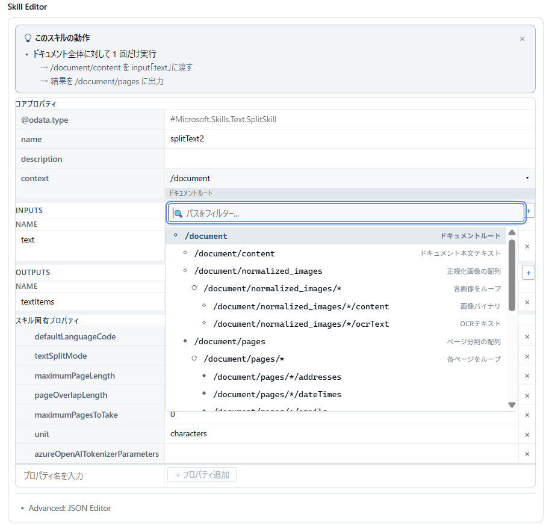
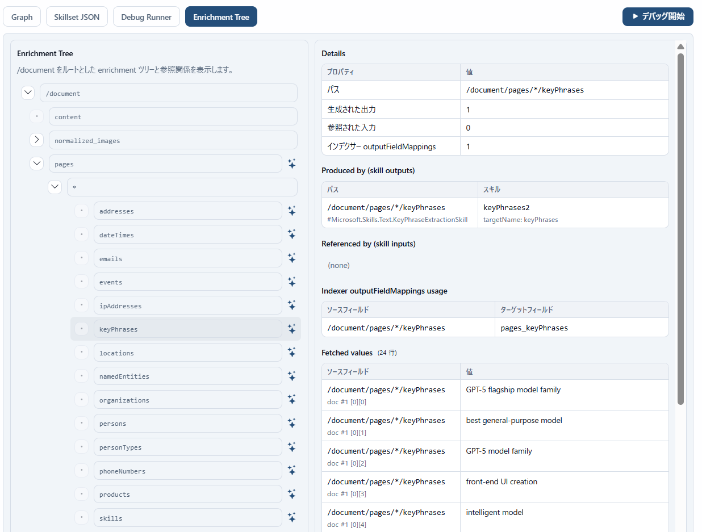
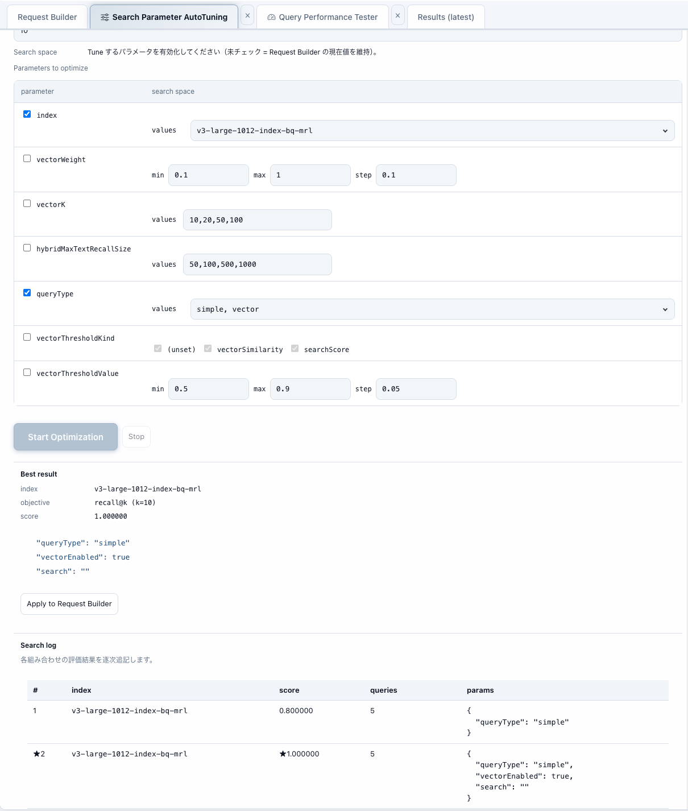
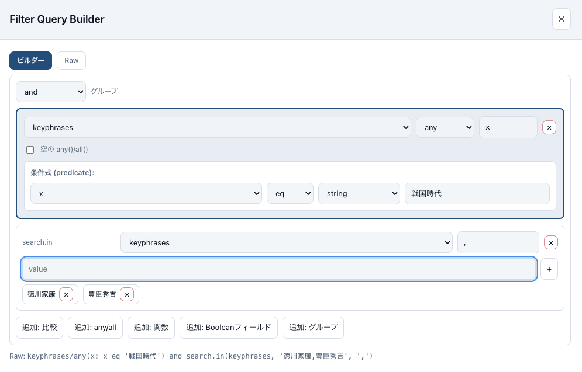

# RAGOps Studio — for Azure AI Search

**RAGOps, from query to quality.**

Azure AI Search の高度な機能を学習・実験できる Web ベースの開発ツールです。検索クエリのテスト、セマンティック検索、ベクトル検索、エージェント検索（Knowledge Retrieval API）、テキスト分析など、さまざまな機能を GUI で簡単に試すことができます。

## Table of Contents

1. [検索モード（4つのLabモード）](#1-検索モード4つのlabモード)
2. [ビルダーツール](#2-ビルダーツール)
3. [開発者ツール](#3-開発者ツール)
4. [実験管理（Experiments & Runs）](#4-実験管理experiments--runs)
5. [UI/UX](#5-uiux)
6. [技術スタック](#技術スタック)
7. [セットアップ](#セットアップ)
8. [プロジェクト構造](#プロジェクト構造)
9. [接続設定](#接続設定)
10. [主な使い方](#主な使い方)
11. [開発者向け情報](#開発者向け情報)

## 主な機能

### 1. **検索モード（4つのLabモード）**

#### Query モード（クラシック検索）
- **フルテキスト検索**: `simple` / `full` クエリタイプ
- **基本パラメータ**: `search`, `top`, `skip`, `count`, `select`, `filter`, `orderby`, `searchMode`, `searchFields`, `facets`, `highlight`
- **スコアリング**: `scoringProfile`, `scoringParameters`
- **高度なオプション**: `minimumCoverage`, `scoringStatistics`, `sessionId`
- **フォーム/JSONモード切替**: GUIフォームまたは生JSONでリクエスト編集


#### Semantic-Vector モード（セマンティック & ベクトル検索）
- **セマンティック検索**: `queryType='semantic'`, `semanticConfiguration`, `semanticQuery`, `captions`, `answers`, `queryLanguage`
- **ベクトルクエリ**: 複数のベクトルクエリを追加可能
  - `vectorKind`: `text` / `vector` / `imageUrl` / `imageBinary`
  - パラメータ: `vectorFields`, `vectorK`, `vectorWeight`, `vectorExhaustive`, `vectorThresholdKind`, `vectorThresholdValue`, `vectorOversampling`, `vectorPerDocumentVectorLimit`, `vectorFilterOverride`, `vectorQueryRewrites`
- **ハイブリッド検索**: テキストとベクトルの組み合わせ
  - `vectorFilterMode`, `hybridMaxTextRecallSize`, `hybridCountAndFacetMode`
- **speller機能**: スペル修正 (`none` / `lexicon`)
- **debug パラメータ**: `semantic`, `all` などでデバッグ情報取得


#### Agentic モード（Knowledge Retrieval API）
- **ナレッジベース検索**: `knowledgeBaseName` を指定してエージェント的な検索
- **ナレッジソースパラメータ**: `knowledgeSourceName`, `includeReferences`, `includeReferenceSourceData`, `alwaysQuerySource`
- **出力制御**: `outputMode`, `maxRuntimeInSeconds`, `maxOutputSize`
- **検索効率**: `retrievalReasoningEffort` (`low` / `medium` / `minimal`)
- **アクティビティログ**: `includeActivity` でプロセスを可視化
- **Agentic Activity Timeline（アクティビティタイムライン）**: エージェント検索アクティビティの階層的フロー可視化
  - ラウンドベースのグルーピング: `modelQueryPlanning` → ソース検索（並列） → `agenticReasoning` → `modelAnswerSynthesis`
  - アクティビティタイプ別のカラーバッジ（プランニング、ソース検索、推論、合成）
  - 各ステップのメトリクス表示: 経過時間（ms）、入力/出力/推論トークン数、ヒット数
  - 同一ラウンド内の複数ソース検索を並列レーンで表示
  - 検索クエリと Knowledge Source 名のインライン表示
  - 各ステップの展開可能な RAW JSON ビュー
  - サマリーバー: ステップ総数、合計経過時間、合計トークン数
- **API バージョン**: `2025-11-01-preview` を自動使用


#### Analyze モード（テキスト分析）
- **Analyze API**: インデックスに対してテキスト分析を実行
- **アナライザー**: `analyzerName` でビルトインまたはカスタムアナライザーをテスト
- **トークナイザー + フィルター**: `tokenizerName`, `charFilters`, `tokenFilters` の組み合わせ
- **ノーマライザー**: `normalizerName` で正規化処理をテスト
- **トークン結果表示**: 分析結果のトークン一覧を表示


### 2. **ビルダーツール**

#### Index Builder（インデックスビルダー）
- **インデックス一覧**: 接続中のサービスの全インデックスを表示
- **インデックス作成/更新**: JSON エディターでスキーマを編集して作成・更新
- **インデックス削除**: 既存インデックスの削除
- **統計情報取得**: `documentCount`, `storageSize`, `vectorIndexSize` の表示
- **JSON インポート/エクスポート**: ファイルからのインポート、クリップボードへのエクスポート


#### Knowledge Source Builder（ナレッジソースビルダー）
- **ナレッジソース一覧**: 既存のナレッジソースを表示
- **ナレッジソース作成/更新**: 
  - `name`, `kind='searchIndex'`, `description`
  - `searchIndexParameters`: `searchIndexName`, `semanticConfigurationName`, `sourceDataFields`, `searchFields`
- **ナレッジソース削除**: 既存ナレッジソースの削除


#### Knowledge Base Builder（ナレッジベースビルダー）
- **ナレッジベース一覧**: 既存のナレッジベースを表示
- **ナレッジベース作成/更新**: `name`, `description`, `knowledgeSources` の配列
- **ナレッジベース削除**: 既存ナレッジベースの削除


#### Synonym Map Builder（シノニムマップビルダー）
- **シノニムマップ一覧**: 既存のシノニムマップを表示
- **Solr形式編集**: 
  - 等価シノニム（カンマ区切り）: `東京, Tokyo, とうきょう`
  - 明示的マッピング（=> 記法）: `TV, television => テレビ`
- **ルール編集UI**: フォームでシノニムルールを個別に追加・編集
- **検証機能**: ルール数制限（最大20000）、書式チェック
- **作成/更新/削除**: シノニムマップの完全なCRUD操作
- **ファイルインポート**: .txt ファイルからのインポート


#### Skill Pipeline Builder（スキルパイプラインビルダー）

Azure AI Search のスキルセットをビジュアルフローエディターでオーサリングできるビルダーです。各スキルをノード、入出力をエッジとして左から右への DAG（有向非巡回グラフ）で可視化します。

- **ビジュアルフローエディター**: ReactFlow + dagre による自動レイアウトの DAG 表示
  - ドキュメントノード → スキルノード → インデクサーノード → インデックスノードの4層構造
  - ドラッグ＆ドロップでスキル間の入出力を接続
  - ノードの選択・移動・削除、エッジの接続・削除を GUI で操作
- **スキルセットの CRUD 操作**:
  - 既存のスキルセット一覧表示・読み込み（`listSkillsets` / `getSkillset`）
  - スキルセットの作成・更新（`createOrUpdateSkillset`）、削除（`deleteSkillset`）
  - JSON のインポート/エクスポート（クリップボードコピー、ファイル読み込み）
- **ビルトインスキルテンプレート（15種類）**: ワンクリックでスキルノードを追加
  - テキスト系: Text Split, Key Phrase Extraction, Language Detection, PII Detection, Text Translation, Sentiment V3, Entity Recognition V3, Entity Linking V3, Text Merge
  - ビジョン系: OCR, Image Analysis
  - ユーティリティ系: Conditional, Document Extraction
  - AI 系: Azure OpenAI Embedding, ChatCompletion (GenAI Prompt), Custom Web API
- **エンリッチメントツリー（`/document/…` パス）**:
  - スキル間の入出力パスをツリー構造で可視化
  - パス補完付きの EnrichmentPathPicker コンボボックス
  - 配列出力の自動 `/*` ワイルドカード伝播（Collection 型スキル出力を自動検出）
  
- **インデクサー連携**:
  - 既存インデクサーの読み込み（`listIndexers` / `getIndexerDefinition`）
  - `outputFieldMappings` の GUI 編集（エンリッチメントパス → インデックスフィールド）
  - インデクサーノードからインデックスノードへの接続
- **右ペイン: スキル JSON 編集**:
  - 選択スキルの JSON を CodeMirror で編集
  - スキルセットレベルプロパティ（`indexProjections`, `knowledgeStore`, `cognitiveServices` 等）の編集
  - 変更前後の JSON 差分ハイライト表示
- **Debug Runner（デバッグランナー）**:
  - Azure Blob Storage 接続設定（接続文字列、コンテナ名）
  - デバッグ用の一時リソース（データソース、インデックス、インデクサー、スキルセット）の自動プロビジョニング
  - Knowledge Store プロジェクション経由でスキル出力を実データでプレビュー
  - Shaper スキルの自動生成
  - プロビジョニング → 実行 → 取得 → クリーンアップの4ステップ UI
  - 自動クリーンアップ機能（デバッグ完了後に一時リソースを自動削除）
- **エンリッチメントツリープレビュー**:
  - デバッグ実行後のスキル出力値を `/document/…` パスごとにツリー表示
  - 実際のエンリッチメント結果の展開・折りたたみ表示
  - フィールドマッピングの可視化
  

- **Azure への Publish（差分確認付き公開）**:
  - ビルダーから直接 Azure AI Search にスキルセットを Publish（作成/更新）
  - Publish 前にフルスクリーンの差分確認ダイアログを表示
  - **セマンティック Diff ビュー**: 追加/削除/変更/並び替えを構造的に表示するテーブル
    
  - **テキスト Diff ビュー**: 正規化済み JSON の左右並列比較（CodeMirror による行ハイライト）
    
  - ターゲットスキルセット名の選択: 既存スキルセットのドロップダウンまたは新規作成
  - 新規 vs 更新の自動判別（CREATE NEW / UPDATE EXISTING バッジ）
  - ノイズ除去: `@odata.etag`、JSON キー順序、`null` vs 欠損、空配列 vs 欠損を自動無視
  - 差分サマリーのクリップボードコピー
  - フォーマットのみの変更検出通知
- **パイプライン状態の保存/復元**:
  - LocalStorage によるパイプライン構成の永続化
  - 複数パイプラインの保存・切替・削除


#### Custom Skill LiveEditor（カスタムスキルライブエディター）

RAGOps Studio を離れることなく、Azure AI Search の Custom Skill をブラウザ上で開発・テスト・デプロイできる Python 統合開発環境です。

- **3つのタブで構成されたワークスペース**:
  - **Code タブ**: CodeMirror による Python シンタックスハイライト付きエディター、スキルの入出力がコード内で参照されているかを示す I/O 接続パネル（🟢 接続済み / 🟡 テストデータ未設定 / 🔴 未接続）
  - **Test タブ**: JSON テスト入出力エディター、stdout/stderr キャプチャ付き実行ログ、バリデーション通知、実行時間表示
  - **Settings タブ**: ランタイム URL 設定、ヘルスチェック、スキルのロード/パブリッシュ操作
- **2つの実行モード**:
  - **Local Run（Pyodide）**: WebAssembly 経由でブラウザ内で Python コードを直接実行 — サーバー不要、即座にフィードバック
  - **Remote Run**: クラウドランタイム（Azure Container Apps + FastAPI）上で実行し、本番環境に近いテストが可能
- **クラウドランタイムアーキテクチャ**:
  - Azure Container Apps 上の FastAPI ベースの Skill Host
  - Dynamic Skill Loading: コードを Azure Blob Storage に保存し、コンテナの再デプロイなしでランタイム時にロード
  - 6つの HTTP エンドポイント: `/health`, `/simulate`, `/execute`, `/upload`, `/skills/{name}`, `/skills/{name}/code`
  - スキルモジュール規約: `def process(input: dict) -> dict`
  - Azure Container Apps 用デプロイスクリプト同梱（`deploy-aca.ps1`, `deploy-aca.sh`）
- **Blob Storage 連携**:
  - アップロードフロー: ローカルコード → 差分プレビュー → 確認 → POST /upload → Blob Storage
  - ダウンロードフロー: エディター起動時に自動ロード、手動ロードボタン、競合時の差分表示
  - SHA-256 ハッシュによる同期状態追跡とビジュアルステータスバッジ（Synced / Dirty / Unknown）
- **スキルパイプラインとの統合**:
  - Skill Pipeline Builder のスキルノードから直接起動
  - スキルの入出力定義に基づくサンプル Python コードの自動生成
  - アップロード成功後に Custom Web API スキルの URI を自動更新
  - ドラフト永続化: リンクされたスキルノードごとにエディター状態を自動保存
- **Diff モード**: ローカルとリモートのコードが異なる場合のサイドバイサイド比較（ハンクナビゲーション付き）
- **ダーク/ライトテーマ対応**、**多言語対応**（日本語/英語）


### 3. **開発者ツール**

#### Search Pipeline Visualizer（検索パイプライン可視化）
- **4ステージ比較**: `text`, `vector`, `hybrid`, `semantic_hybrid` の4つの検索ステージを並列実行
- **ステージごとの結果**: 各ステージで同じクエリを実行して結果を比較
- **スコア変化の追跡**: 
  - Text/Vectorステージ: `@search.score`
  - Hybridステージ: `@search.score`（RRF適用後）
  - Semantic Hybridステージ: `@search.score` と `@search.rerankerScore`
- **ドキュメント比較**: 各ステージでどのドキュメントが返されるかを可視化
- **キーフィールド自動推定**: インデックスから一意キーフィールドを自動判定


#### QPS Tester（クエリパフォーマンステスター）
- **5つの検索モード同時測定**: `query`, `semantic`, `vector`, `hybrid`, `semantic_hybrid`
- **並行実行**: 指定した並行数でリクエストを同時実行
- **パフォーマンス指標**: 
  - QPS（Queries Per Second）
  - レイテンシー（p50, p95）
  - 成功/エラー数
- **結果保存**: 実験ランとしてテスト結果を保存


### Eval Dataset Generator（評価データセットジェネレーター）
- **LLM による評価データセット自動生成**: Azure AI Search インデックス内の実ドキュメントから、Search Parameter AutoTuning 互換の JSONL 評価データセットを自動生成
- **2つの生成モード**:
  - **Classic モード**: インデックスから N 件のドキュメントをサンプリングし、Azure OpenAI でドキュメントごとに M 件のクエリを生成
  - **Ragas モード**: 4 象限（Single/Multi × Specific/Abstract）にクエリ総数を largest-remainder 法で按分し、Persona・Style（web_search/chat/formal/informal）・Length（short/medium/long）を直交軸として多様なクエリ分布を実現
- **多段階品質パイプライン**:
  - **表層重複排除**: Jaccard 類似度による重複排除（閾値: 0.85）
  - **Round-trip Consistency（Promptagator）**: 再検索して元ドキュメントが top-k に入らないクエリを棄却
  - **意味的重複排除**: Azure OpenAI Embeddings のコサイン類似度による重複排除
  - **Difficulty Evolution（Evol-Instruct）**: パラフレーズ・否定・集約・抽象化によるクエリ難化
  - **Hard Negative Mining（DPR スタイル）**: expected_ids 外の上位 k 件を `hard_negative_ids` として記録し、対比学習信号を強化
- **Domain Schema 注入（RAGEval）**: ドメイン固有のエンティティ・関係・制約をプロンプトに注入し、事実性とスキーマ整合性を向上
- **NDCG 互換 relevance_grades**: 関連度スコアを自動付与（`expected_ids[0]` → 3、副ドキュメント → 2、hard negatives → 0）
- **Entity-KG**: ドキュメントごとに固有名詞・専門用語を LLM 抽出し、entity Jaccard で multi-hop ペアを精緻化（token Jaccard へ自動フォールバック）
- **LLM 認証**: Azure OpenAI 向けの API Key、Bearer Token、Azure AD（Entra ID）認証に対応
- **データセット永続化**: 生成済みデータセットを IndexedDB に保存・読み込み・削除
- **JSONL エクスポート**: JSONL 形式でのダウンロード、または Search Parameter AutoTuning への直接送信
- **リアルタイム進捗表示**: フェーズごとの進捗表示（サンプリング → 生成 → グラウンディング → 埋め込み → 難化 → ハードネガティブ → 完了）
- **キャンセル対応**: 任意の時点で生成をキャンセル可能（部分的な結果は保持）

#### Search Parameter AutoTuning（検索パラメータ自動チューニング）
- **パラメータ自動最適化**: パラメータの組み合わせを網羅的にテストして最適な設定を発見
- **JSONLデータセット対応**: クエリ/回答フィールドを含むJSONL形式の評価データセットをアップロード
- **複数の最適化目標**: 
  - Precision@k: 上位k件中の関連文書の割合
  - Recall@k: 全関連文書のうち取得できた割合
  - NDCG (Normalized Discounted Cumulative Gain): ランク付き関連度スコア
  - MRR (Mean Reciprocal Rank): 最初の関連結果の逆順位の平均
- **パラメータグリッドサーチ**: 
  - インデックス選択: 複数のインデックスを横断テスト
  - ベクトルウェイト: ハイブリッド検索の重み付けを最適化（0.0-1.0）
  - ベクトルk: 異なる取得件数（k値）をテスト
  - ハイブリッドmaxTextRecallSize: テキスト再現率の上限を最適化
  - クエリタイプ: クエリ構文の比較 (`simple`, `full`, `semantic`)
  - ベクトル閾値: `vectorSimilarity` と `searchScore` の閾値設定をテスト
- **リアルタイム進捗追跡**: 最適化の進行状況をライブ更新で監視
- **結果可視化**: スコア付きでパラメータの組み合わせをランキング表示
- **最良設定の自動検出**: 最適なパラメータを自動識別して適用
- **実行履歴**: 最適化結果を実験ランとして保存し将来の参照用に保持
- **復帰機能**: 過去の最適化ランを復元・レビュー可能



#### Filter Builder Modal（フィルタービルダー）
- **OData フィルター構築**: GUIでフィルター式を構築
- **複数条件の組み合わせ**: AND/OR ロジック
- **演算子サポート**: `eq`, `ne`, `gt`, `ge`, `lt`, `le`, `search.in` など
- **構文検証**: フィルター式の検証とプレビュー



#### Index Inspector Modal（インデックスインスペクター）
- **スキーマ詳細表示**: フィールド定義、ベクトル設定、セマンティック構成などを表示
- **JSON ビューアー**: インデックス定義の完全なJSONを表示
- **クリップボードコピー**: 定義をコピーして再利用可能

#### Text to Vector Modal（テキストからベクトル変換）
- **テキスト埋め込み変換**: text-embedding-ada-002 などを使用
- **ベクトル次元確認**: 生成されたベクトルの次元数を表示
- **結果のコピー**: 生成されたベクトルをクエリに貼り付け可能

#### JWT Decoder Modal（JWT デコーダー）
- **JWT トークン解析**: `x-ms-query-source-authorization` 用のトークンをデコード
- **ヘッダー・ペイロード表示**: JWT の各部を JSON で表示
- **JWE対応**: 暗号化トークン（JWE）も部分的に解析
- **有効期限確認**: `exp`, `iat`, `nbf` などのタイムスタンプを ISO8601 とローカル時刻で表示

#### Vector Optimizer（ベクトルオプティマイザー）
- **ベクトル最適化計算**: `quantization`, `truncationDimension`, `stored`, `rescoring` の組み合わせによるサイズ計算
- **最適化設定比較**:
  - 量子化: `scalarQuantization` (int8) / `binaryQuantization` (1bit)
  - `truncationDimension`: MRL による次元削減
  - `stored`: ソースデータの保存有無
  - `rescoring`: 再スコアリング用の全精度コピー保持
- **理論サイズ計算**: vector index, source, originals の各要素のバイト数を表示
- **オーバーヘッド注記**: HNSW グラフなど実際のオーバーヘッドについての説明


### 4. **実験管理（Experiments & Runs）**


#### 実験（Experiments）
- **実験作成**: 名前、説明、タグ、ピン留めで実験を整理
- **実験一覧**: 更新日時順に表示、ピン留め実験を上位表示
- **デフォルトコンテキスト**: 実験ごとに apiVersion などを保存
- **実験削除**: 実験と配下の全ラン・アーティファクトを一括削除

#### ラン（Runs）
- **ラン保存**: クエリ実行結果をランとして保存
  - `runType`: 例）`query`, `semantic`, `vector`, `hybrid`, `semantic_hybrid`, `analyze`, `agentic_retrieve`, `qps_test`, `auto_tuning`
  - `status`: `success` / `error` / `canceled`
  - `context`: endpoint / apiVersion / authType（必要に応じて indexName / knowledgeBaseName）
  - `params`: リクエストボディ
  - `metrics`: レイテンシ/経過時間、request id など
  - `startedAt` / `endedAt`: 実行時刻
- **ラン一覧**: 実験配下のランを時系列表示（最大200件）
- **ラン選択**: 複数ラン（最大10件）を選択して結果を並べて比較
- **ラン削除**: 個別ランの削除
- **クエリフィルター**: クエリテキストでランを絞り込み
- **実験ノート**: 実行前にメモを記録し、次に保存される Run に注釈を紐付け
  - ビルダーエリアに折りたたみ可能なノートパネル
  - ノートは Run データの一部として IndexedDB に永続化（`note` フィールド）
  - ラン一覧でジャーナルアイコン付きでノートプレビューを表示
  

#### アーティファクト（Artifacts）
- **アーティファクト保存**: ランに紐づく追加データ
  - QPSテスト結果
  - その他カスタムデータ
- **アーティファクト取得**: ランIDから関連アーティファクトを取得

#### エクスポート/インポート
- **Bundle形式**: JSON形式でラン・アーティファクトをまとめてエクスポート
  - `kind`: `'ragops-studio:runs'`
  - `version`: `1`
  - `exportedAt`: エクスポート日時（ISO8601）
  - `runs`, `artifacts` の配列
- **インポート**: エクスポートしたBundleを別環境でインポート

### Feature Portal（フィーチャーポータル）
- **ウェルカム画面 / 機能ディレクトリ**: RAGOps Studio の全機能をカード形式で一覧表示する起動時画面
- **カテゴリ別グルーピング**: 検索モード、ビルダーツール、最適化 & テスト、開発者ツール、実験管理、Azure AI Search 機能（Coming Soon）の 6 カテゴリで整理
- **機能カード**: 各カードに機能名・アイコン・説明を表示し、クリックで直接機能を起動
- **ステップバイステップガイド**: カードの `?` ボタンをクリックして使い方ガイドを表示
  - **2つのガイドモード**: Basic（初心者向け簡易版）と Advanced（詳細版 + Tips）
  - **Modal モード**: ポータルからフルオーバーレイでガイドを表示
  - **Companion モード**: 機能起動後もフローティングで持続し、対象の UI 要素をハイライト
  - **DOM 要素ハイライト**: アクティブなステップに対応する UI 要素をハイライトし、スムーズにスクロール
  - **Tips セクション**: 各機能のエキスパート向けヒントとベストプラクティス
  - **ドキュメントリンク**: Microsoft Learn の公式ドキュメントへの直接リンク
- **起動時表示の制御**: 「次回から自動表示しない」チェックボックスで非表示設定（localStorage に永続化）
- **日英バイリンガル対応**: すべてのカードタイトル・説明・ガイド内容が日本語と英語で利用可能

### 5. **UI/UX**

#### テーマ
- **6つのテーマ**: System, Dark, Light, Midnight, Forest, Solarized
- **システム連動**: Systemテーマ選択時はOS設定に追従

#### 多言語対応
- **2言語サポート**: 日本語（ja）、英語（en）
- **ブラウザ言語自動検出**: 初回起動時にブラウザ言語を検出
- **UI完全翻訳**: 全てのラベル、メッセージ、エラー文が翻訳済み

#### レイアウト
- **3ペイン構造**: 
  - 左ペイン: 実験・ラン一覧（リサイズ可能）
  - 中央ペイン: クエリビルダー / 各種ビルダー / ツール
  - 右ペイン: JSON ビューアー（リクエスト/レスポンス/ファセット、リサイズ・折りたたみ可能）
- **タブ機能**: 
  - Builder: メインクエリビルダー
  - Latest: 最新の実行結果
  - Run タブ: 選択したランの結果（最大10個まで開ける）
  - ツールタブ: QPS Tester, Search Pipeline Visualizer, Vector Optimizer, 各種Builder
- **ドラッグリサイズ**: パネル境界をドラッグしてサイズ調整、設定はブラウザに保存

## 技術スタック

### フロントエンド
- **React 19.2** - UI フレームワーク
- **TypeScript 5.9** - 型安全な開発
- **Vite 7.2** - 高速ビルドツール
- **Bootstrap 5.3** - UI コンポーネント

### 主要ライブラリ
- **@uiw/react-codemirror 4.25** - CodeMirror 6 ベースの React コンポーネント
  - @codemirror/lang-json - JSON 構文ハイライト
  - @codemirror/search - 検索・置換機能
  - @uiw/codemirror-theme-github - GitHub テーマ
- **react-window 2.2** - 仮想スクロール（大量データの効率的な表示）
- **idb 8.0** - IndexedDB ラッパー（クライアントサイドデータベース）
- **diff 8.0** - テキスト差分計算
- **DOMPurify 3.3** - XSS 対策（HTML サニタイゼーション）
- **uuid 13.0** - UUID v4 生成
- **undici 7.16** - 高速 HTTP クライアント（fetch polyfill）
- **@xyflow/react 12** - フローチャート可視化（Skill Pipeline Builder で使用）
- **dagre 0.8** - 有向グラフの自動レイアウト
- **Pyodide** - WebAssembly によるブラウザ内 Python 実行（Custom Skill LiveEditor で使用）

### 開発ツール
- **ESLint 9.39** + **typescript-eslint 8.46** - コード品質チェック
- **Vitest 4.0** - ユニットテスト

## セットアップ

### 必要要件
- Node.js 18以降
- npm または yarn

### インストール

```bash
# 依存パッケージのインストール
npm install
```

### 開発サーバーの起動

```bash
npm run dev
```

ブラウザで `http://localhost:5173` を開きます。

### ビルド

```bash
npm run build
```

ビルド成果物は `dist/` ディレクトリに出力されます。

### その他のコマンド

```bash
# ESLint による静的解析
npm run lint

# シノニムマップの生成
npm run gen:synonymmap

# テストの実行
npm run test

# プレビュー（ビルド後の確認）
npm run preview
```

## プロジェクト構造

```
ragops-studio/
├── src/
│   ├── components/          # React コンポーネント
│   │   ├── AppHeader.tsx    # ヘッダー（言語/テーマ切替、ツールメニュー）
│   │   ├── InfoTooltip.tsx  # ツールチップコンポーネント
│   │   ├── builders/        # 各種ビルダーコンポーネント
│   │   │   ├── AgenticBuilderForm.tsx        # エージェント検索フォーム
│   │   │   ├── AnalyzeBuilderForm.tsx        # テキスト分析フォーム
│   │   │   ├── ClassicSearchBuilderForm.tsx  # クラシック検索フォーム
│   │   │   ├── BuilderActions.tsx            # 実行ボタン等のアクション
│   │   │   ├── BuilderConnectionSection.tsx  # 接続情報セクション
│   │   │   ├── BuilderErrorNotice.tsx        # エラー表示
│   │   │   ├── BuilderTabPane.tsx            # ビルダータブペイン
│   │   │   ├── FilterQueryBuilder.tsx        # フィルタークエリ入力
│   │   │   ├── IndexBuilder.tsx              # インデックスビルダー
│   │   │   ├── KnowledgeBaseBuilder.tsx      # ナレッジベースビルダー
│   │   │   ├── KnowledgeSourceBuilder.tsx    # ナレッジソースビルダー
│   │   │   ├── SearchParameterAutoTuning.tsx # 検索パラメータ自動チューニング
│   │   │   ├── SkillPipelineBuilder.tsx       # スキルパイプラインビルダー
│   │   │   ├── SkillPipelineDebugRunner.tsx   # デバッグランナー
│   │   │   ├── SkillPipelineEnrichmentTreePreview.tsx # エンリッチメントツリー
│   │   │   ├── SkillPipelineRightPane.tsx     # スキルパイプライン右ペイン
│   │   │   ├── EnrichmentPathPicker.tsx       # エンリッチメントパスピッカー
│   │   │   ├── PublishDiffModal.tsx           # スキルセット Publish 差分確認
│   │   │   ├── SkillCodeEditor.tsx            # Custom Skill Python コードエディター
│   │   │   ├── SynonymMapBuilder.tsx         # シノニムマップビルダー
│   │   │   └── VectorOptimizerBuilder.tsx    # ベクトルオプティマイザー
│   │   ├── modals/          # モーダルダイアログ
│   │   │   ├── FilterBuilderModal.tsx        # フィルタービルダー
│   │   │   ├── IndexInspectorModal.tsx       # インデックスインスペクター
│   │   │   ├── JwtDecoderModal.tsx           # JWT デコーダー
│   │   │   └── TextToVectorModal.tsx         # テキスト→ベクトル変換
│   │   └── viewers/         # 結果表示・可視化コンポーネント
│   │       ├── JsonViewer.tsx                # JSON 表示
│   │       ├── LeftPane.tsx                  # 左ペイン（実験・ラン一覧）
│   │       ├── QueryPerformanceTester.tsx    # QPS テスター
│   │       ├── RequestJsonEditor.tsx         # リクエスト JSON エディター
│   │       ├── ResultViewPanel.tsx           # 結果表示パネル
│   │       ├── RightJsonViewerPane.tsx       # 右ペイン（JSON ビューアー）
│   │       ├── AgenticActivityTimeline.tsx    # エージェントアクティビティタイムライン
│   │       └── SearchPipelineVisualizer.tsx  # 検索パイプライン可視化
│   ├── hooks/               # カスタムフック
│   │   └── useApiOperations.ts  # API 操作フック（Execute処理）
│   ├── lib/                 # コアロジック
│   │   ├── aiSearchRest.ts  # Azure AI Search REST API クライアント
│   │   ├── azureBlobStorage.ts # Azure Blob Storage REST クライアント
│   │   ├── analyzeCatalog.ts # アナライザーカタログ定義
│   │   ├── db.ts            # IndexedDB 操作
│   │   ├── diffText.ts      # テキスト差分計算
│   │   ├── model.ts         # データモデル定義
│   │   ├── odataFilter.ts   # OData フィルター解析
│   │   ├── odataFilter.test.ts # OData フィルターテスト
│   │   ├── pyodideRunner.ts # Pyodide WASM Python 実行
│   │   ├── skillRuntime.ts  # Skill Runtime HTTP クライアント
│   │   └── translations.ts  # 多言語対応（ja/en）
│   ├── types/               # TypeScript 型定義
│   │   ├── app.ts           # アプリケーション型
│   │   └── index.ts         # エクスポート
│   ├── utils/               # ユーティリティ関数
│   │   ├── apiHelpers.ts           # API ヘルパー関数
│   │   ├── appRequestBodies.ts     # リクエストボディ構築
│   │   ├── debugRunnerHelpers.ts   # デバッグランナーヘルパー
│   │   ├── enrichmentTree.ts       # エンリッチメントツリー構築
│   │   ├── helpers.ts              # 汎用ヘルパー
│   │   ├── localStorage.ts         # ローカルストレージ操作
│   │   ├── searchFacets.ts         # ファセット抽出
│   │   ├── skillPipelineOutputFieldMappings.ts # outputFieldMappings ヘルパー
│   │   ├── skillsetDiff.ts                 # スキルセットセマンティック差分計算
│   │   └── index.ts                # エクスポート
│   └── App.tsx              # メインアプリケーションコンポーネント
├── skill-runtime/           # クラウド Skill Runtime（Python）
│   ├── main.py              # FastAPI Skill Host サーバー
│   ├── Dockerfile           # コンテナイメージ定義
│   ├── requirements.txt     # Python 依存パッケージ
│   └── skills/              # スキルモジュールディレクトリ
├── scripts/                 # ビルドスクリプト
│   ├── generateSynonymMap.mjs  # シノニムマップ生成スクリプト
│   └── skill-runtime/       # ACA デプロイスクリプト（deploy-aca.ps1/.sh）
├── public/                  # 静的ファイル
├── index.html               # HTML エントリーポイント
├── vite.config.ts           # Vite 設定
├── tsconfig.json            # TypeScript 設定
└── package.json             # npm パッケージ設定
```

## 接続設定

アプリケーション起動後、ヘッダーの「Settings」から Azure AI Search の接続情報を設定します：

### 認証方式
1. **API Key 認証**（推奨）
   - Endpoint: Azure AI Search サービスのエンドポイント URL（例: `https://your-service.search.windows.net`）
   - API Key: 管理者キーまたはクエリキー
   - API Version: REST API バージョン（デフォルト: 2025-09-01、Agenticモードでは 2025-11-01-preview を自動使用）

2. **Bearer Token 認証**
   - Endpoint: Azure AI Search サービスのエンドポイント URL
   - Bearer Token: Azure AD トークン（`Bearer` プレフィックスあり/なし両対応）
   - API Version: REST API バージョン

### その他の設定
- **Query Source Authorization**: Knowledge Retrieval API 用の `x-ms-query-source-authorization` ヘッダー（オプション）
- **Connection Profiles**: 複数の接続プロファイルを作成して切り替え可能
- **Display Fields**: 結果表示時のタイトル/テキストフィールド設定
  - `displayTitleFields`: タイトルに使うフィールド（カンマ区切り、デフォルト: `title,name,id,key,documentId,chunkId,path,url,metadata_storage_name`）
  - `displayTextFields`: テキストに使うフィールド（カンマ区切り、デフォルト: `text,content,description,chunk`）

### 開発環境のプロキシ
開発時（`npm run dev`）は、CORS エラー回避のため Vite の開発プロキシを自動使用します。Azure AI Search エンドポイント（`*.search.windows.net` または `*.search.azure.com`）への接続は `/api-proxy` 経由で行われます。

## 主な使い方

### 基本的な検索フロー

1. **接続設定**: ヘッダーの Settings から Azure AI Search に接続
2. **モード選択**: 画面上部のタブでモード選択（Query / Semantic-Vector / Agentic / Analyze）
3. **インデックス/ナレッジベース選択**: 
   - Query/Semantic-Vector/Analyze: `indexName` を選択
   - Agentic: `knowledgeBaseName` を選択
4. **クエリ作成**: 
   - **Form モード**: GUI でパラメータを入力（デフォルト）
   - **JSON モード**: 「JSON」タブで JSON を直接編集
5. **実行**: 「Run」ボタン（または Ctrl/Cmd + Enter）でクエリ実行
6. **結果確認**: 
   - 中央ペイン: ドキュメント一覧、ファセット、エラー表示
   - 右ペイン: Request/Response/Facets の JSON 表示

### 実験管理

1. **実験作成**: 左ペインの「+ New Experiment」で新しい実験を作成
2. **実行**: 実験を選択した状態でクエリを実行
  - 実行ごとにRunが自動で保存される
3. **履歴確認**: 実験配下のランをクリックして過去の結果を再確認
4. **複数ラン比較**: 
   - ランのチェックボックスを選択（最大10個）
   - タブに各ランの結果が表示される
   - 並べて比較できる
5. **エクスポート**: 「Export Runs」で選択したランを JSON ファイルに出力
6. **インポート**: 「Import Runs」で他の環境からエクスポートしたランをインポート

### 開発者ツールの使い方

#### Search Pipeline Visualizer
1. ヘッダー「Tools」→「Search Pipeline Visualizer」を選択
2. index, search, vector text などを入力
3. 「Run All Stages」で4ステージ（text, vector, hybrid, semantic_hybrid）を並列実行
4. 各ステージのスコアと返却ドキュメントを比較

#### QPS Tester
1. ヘッダー「Tools」→「QPS Tester」を選択
2. Query/Semantic-Vector モードで検索条件を設定
3. Requests per mode（モードごとのリクエスト数）と Concurrency（並行数）を設定
4. 「Run Test」で5つのモード（query, semantic, vector, hybrid, semantic_hybrid）のパフォーマンスを測定
5. 結果を Run として保存可能

#### ビルダー系ツール
- ヘッダー「Tools」から各ビルダーを開く
- 一覧から既存リソースを選択して編集、または新規作成
- JSON エディターで直接編集し、Create/Update で保存

## 開発者向け情報

### データ永続化

- **IndexedDB** を使用してブラウザ内にデータを保存
- データベース名: `ragops-studio`、バージョン: 1
- ストア構成:
  - **experiments**: 実験データ（`experimentId`, `name`, `description`, `tags`, `pinned`, `createdAt`, `updatedAt`, `defaultContext`）
  - **runs**: ランデータ（`runId`, `experimentId`, `runType`, `status`, `startedAt`, `endedAt`, `context`, `params`, `metrics`, `artifactIds`, `note`）
  - **artifacts**: アーティファクト（`artifactId`, `runId`, `type`, `content`, `createdAt`）
  - **settings**: 設定データ（`id='app'`, `settings`）
- `src/lib/db.ts` でデータベース操作を実装
- 初回起動時に `ensureSeedData()` でデフォルトプロファイルと最初の実験を自動作成

### API クライアント

- `src/lib/aiSearchRest.ts` で Azure AI Search REST API との通信を実装
- 標準的な `fetch` API を使用
- 実装されている API 関数:
  - **searchDocuments**: POST /indexes/{indexName}/docs/search（検索）
  - **analyzeIndex**: POST /indexes/{indexName}/analyze（テキスト分析）
  - **agenticRetrieve**: POST /knowledgebases/{knowledgeBaseName}/retrieve（Knowledge Retrieval API）
  - **listIndexes**: GET /indexes（インデックス一覧）
  - **getIndexDefinition**: GET /indexes/{indexName}（インデックス定義取得）
  - **getIndexStatistics**: GET /indexes/{indexName}/stats（統計情報）
  - **createOrUpdateIndex**: PUT /indexes/{indexName}（インデックス作成/更新）
  - **deleteIndex**: DELETE /indexes/{indexName}（インデックス削除）
  - **listKnowledgeBases**: GET /knowledgebases（ナレッジベース一覧）
  - **getKnowledgeBase**: GET /knowledgebases/{name}（ナレッジベース取得）
  - **createOrUpdateKnowledgeBase**: PUT /knowledgebases/{name}（作成/更新）
  - **deleteKnowledgeBase**: DELETE /knowledgebases/{name}（削除）
  - **listKnowledgeSources**: GET /knowledgesources（ナレッジソース一覧）
  - **getKnowledgeSource**: GET /knowledgesources/{name}（取得）
  - **createOrUpdateKnowledgeSource**: PUT /knowledgesources/{name}（作成/更新）
  - **deleteKnowledgeSource**: DELETE /knowledgesources/{name}（削除）
  - **listSynonymMaps**: GET /synonymmaps（シノニムマップ一覧）
  - **getSynonymMap**: GET /synonymmaps/{name}（取得）
  - **createOrUpdateSynonymMap**: PUT /synonymmaps/{name}（作成/更新）
  - **deleteSynonymMap**: DELETE /synonymmaps/{name}（削除）
  - **listSkillsets**: GET /skillsets（スキルセット一覧）
  - **getSkillset**: GET /skillsets/{name}（スキルセット取得）
  - **createOrUpdateSkillset**: PUT /skillsets/{name}（スキルセット作成/更新）
  - **deleteSkillset**: DELETE /skillsets/{name}（スキルセット削除）
  - **listIndexers**: GET /indexers（インデクサー一覧）
  - **getIndexerDefinition**: GET /indexers/{name}（インデクサー定義取得）
  - **createOrUpdateIndexer**: PUT /indexers/{name}（インデクサー作成/更新）
  - **deleteIndexer**: DELETE /indexers/{name}（インデクサー削除）
  - **runIndexer**: POST /indexers/{name}/run（インデクサー実行）
  - **getIndexerStatus**: GET /indexers/{name}/status（インデクサー状態取得）
  - **createOrUpdateDataSource**: PUT /datasources/{name}（データソース作成/更新）
  - **deleteDataSource**: DELETE /datasources/{name}（データソース削除）
- **Azure Blob Storage REST クライアント** (`src/lib/azureBlobStorage.ts`):
  - Account SAS トークンのクライアントサイド生成（Web Crypto API / HMAC-SHA256）
  - Blob 一覧取得、JSON Blob の読み込み、コンテナ削除
  - Knowledge Store プロジェクションデータの取得・解析
- エラーハンドリング: RestResult 型で成功/失敗を統一的に処理
- リクエスト ID トラッキング: `x-ms-client-request-id`（UUID v4）を自動付与、レスポンスの `request-id` ヘッダーを取得
- 開発環境プロキシ: `import.meta.env.DEV` 時は `/api-proxy` 経由で Azure へ接続（CORS 回避）

### 状態管理

- React の `useState` / `useEffect` / `useMemo` / `useCallback` を使用
- グローバル状態は `App.tsx` で管理:
  - 実験・ラン一覧
  - 現在の検索フォーム（`SearchFormState` / `AgenticFormState` / `AnalyzeFormState`）
  - UI状態（`centerTab`, `labMode`, `builderMode`, `isRightPaneCollapsed` など）
  - 結果データ（`latestResponse`, `runResultMap`, `resultPages`）
- カスタムフック:
  - `useApiOperations`: API 実行ロジック（onExecute, onExecuteAllModes）を抽象化
- ローカルストレージ:
  - `localStorage` に `theme`, `paneSizes`, `isRightPaneCollapsed` を保存
  - `src/utils/localStorage.ts` でラッパー関数を提供

### テスト

```bash
npm run test
```

- **Vitest** を使用したユニットテスト
- テストファイル: `src/lib/odataFilter.test.ts`
  - OData フィルター式の解析テスト
  - 演算子、論理演算、関数呼び出しなどの検証

### リクエストボディ構築

- `src/utils/appRequestBodies.ts` で各モードのリクエストボディを構築:
  - **buildSearchBodyFromForm**: `SearchFormState` → Search API リクエストボディ
    - `vectorQueries` 配列の構築（`text`/`vector`/`imageUrl`/`imageBinary`）
    - semantic パラメータの展開
    - 空文字列・デフォルト値の除外
  - **buildAgenticBodyFromForm**: `AgenticFormState` → Knowledge Retrieval API リクエストボディ
  - **buildAnalyzeBodyFromForm**: `AnalyzeFormState` → Analyze API リクエストボディ

### コードエディター

- **CodeMirror 6** ベースの `@uiw/react-codemirror` を使用
- 使用箇所:
  - Request JSON Editor（中央ペイン）
  - JSON Viewer（右ペイン）
  - 各種ビルダーの JSON エディター
- 機能:
  - JSON 構文ハイライト（`@codemirror/lang-json`）
  - 検索・置換（`@codemirror/search`）
  - テーマ切替（githubLight / githubDark）
  - 行番号表示
  - 折りたたみ（foldGutter）

### ファセット表示

- `src/utils/searchFacets.ts` で Search API レスポンスから `@search.facets` を抽出
- 各ファセットフィールドの値と件数を表示
- 右ペインの「Facets」タブに表示

### OData フィルター解析

- `src/lib/odataFilter.ts` で OData フィルター式をトークン化・解析
- サポート機能:
  - 演算子: `eq`, `ne`, `gt`, `ge`, `lt`, `le`, `and`, `or`, `not`
  - 関数: `search.in`, `geo.distance`, `search.ismatch` など
  - 文字列リテラル、数値、`null`, `true`/`false`
- Filter Builder Modal で使用

## ライセンス

このプロジェクトは [LICENSE](LICENSE) ファイルに基づいてライセンスされています。

## 貢献

プルリクエストを歓迎します。大きな変更の場合は、まず Issue を開いて変更内容を議論してください。

## 関連リンク

- [Azure AI Search ドキュメント](https://learn.microsoft.com/azure/search/)
- [Azure AI Search REST API リファレンス](https://learn.microsoft.com/rest/api/searchservice/)
- [React ドキュメント](https://react.dev/)
- [Vite ドキュメント](https://vitejs.dev/)
