# RAGOps Studio — for Azure AI Search - Features

**RAGOps, from query to quality.**

A comprehensive guide to all features available in RAGOps Studio — for Azure AI Search. This web-based tool helps you learn and experiment with advanced Azure AI Search capabilities through an intuitive GUI interface.

[日本語版はこちら](FEATURES.jp.md)

## Table of Contents

1. [Search Modes (4 Lab Modes)](#1-search-modes-4-lab-modes)
2. [Builder Tools](#2-builder-tools)
3. [Developer Tools](#3-developer-tools)
4. [Experiment Management](#4-experiment-management)
5. [UI/UX Features](#5-uiux-features)
6. [Tech Stack](#tech-stack)
7. [Project Structure](#project-structure)
8. [Connection Settings](#connection-settings)
9. [How to Use](#how-to-use)
10. [Developer Information](#developer-information)

## 1. Search Modes (4 Lab Modes)

### Query Mode (Classic Search)
- **Full-text search**: `simple` / `full` query types
- **Basic parameters**: `search`, `top`, `skip`, `count`, `select`, `filter`, `orderby`, `searchMode`, `searchFields`, `facets`, `highlight`
- **Scoring**: `scoringProfile`, `scoringParameters`
- **Advanced options**: `minimumCoverage`, `scoringStatistics`, `sessionId`
- **Form/JSON mode toggle**: Edit requests via GUI form or raw JSON
- **Result document actions**: Edit or delete returned index documents from the Results tab using the Index Documents API

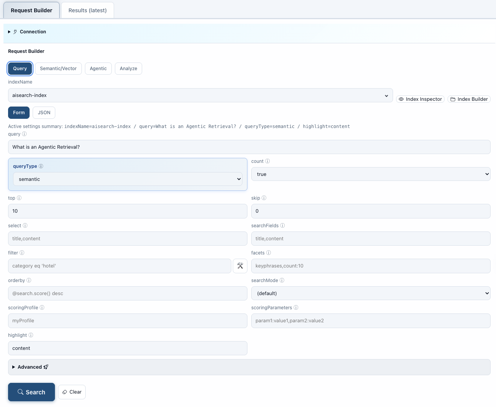

### Semantic-Vector Mode (Semantic & Vector Search)
- **Semantic search**: `queryType='semantic'`, `semanticConfiguration`, `semanticQuery`, `captions`, `answers`, `queryLanguage`
- **Vector queries**: Support for multiple vector queries
  - `vectorKind`: `text` / `vector` / `imageUrl` / `imageBinary`
  - Parameters: `vectorFields`, `vectorK`, `vectorWeight`, `vectorExhaustive`, `vectorThresholdKind`, `vectorThresholdValue`, `vectorOversampling`, `vectorPerDocumentVectorLimit`, `vectorFilterOverride`, `vectorQueryRewrites`
- **Hybrid search**: Combination of text and vector
  - `vectorFilterMode`, `hybridMaxTextRecallSize`, `hybridCountAndFacetMode`
- **Speller**: Spell correction (`none` / `lexicon`)
- **Debug parameters**: Get debug information with `semantic`, `all`, etc.

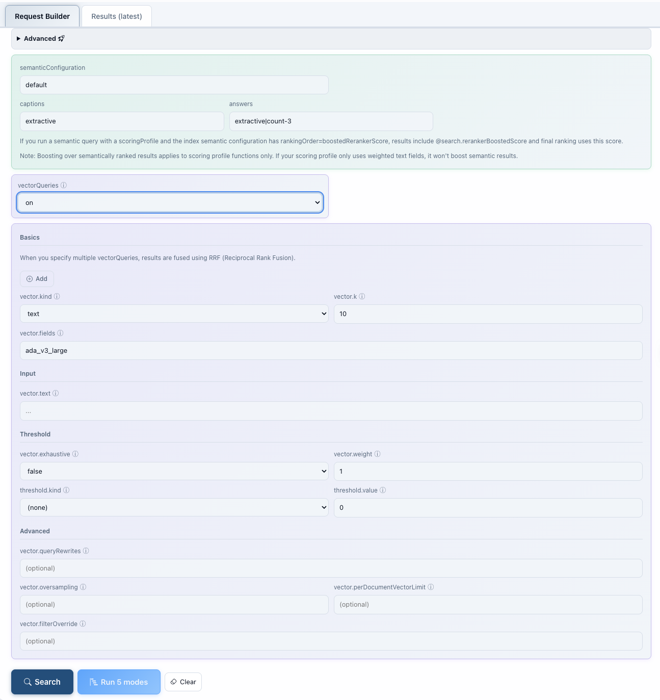

### Agentic Mode (Knowledge Retrieval API)
- **Knowledge base search**: Specify `knowledgeBaseName` for agentic search
- **Knowledge source parameters**: `knowledgeSourceName`, `includeReferences`, `includeReferenceSourceData`, `alwaysQuerySource`
- **Output control**: `outputMode`, `maxRuntimeInSeconds`, `maxOutputSize`
- **Search efficiency**: `retrievalReasoningEffort` (`low` / `medium` / `minimal`)
- **Activity log**: Visualize process with `includeActivity`
- **Agentic Activity Timeline**: Hierarchical flow visualization of agentic retrieval activity
  - Round-based grouping: `modelQueryPlanning` → source searches (parallel) → `agenticReasoning` → `modelAnswerSynthesis`
  - Color-coded type badges for each activity type (planning, source search, reasoning, synthesis)
  - Key metrics display per step: elapsed time (ms), input/output/reasoning tokens, hit count
  - Parallel lane display for concurrent source searches within a round
  - Inline display of search queries and Knowledge Source names
  - Expandable raw JSON view for each step
  - Summary bar: total steps, total elapsed time, total tokens
- **API version**: Automatically uses `2025-11-01-preview`

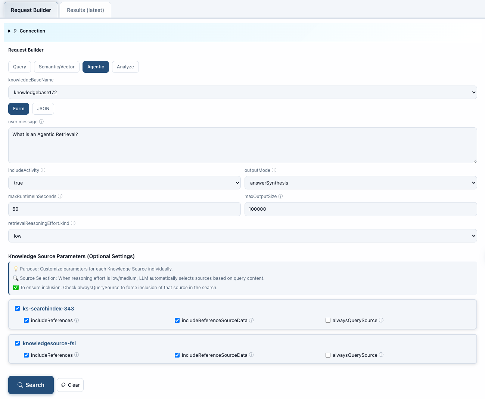

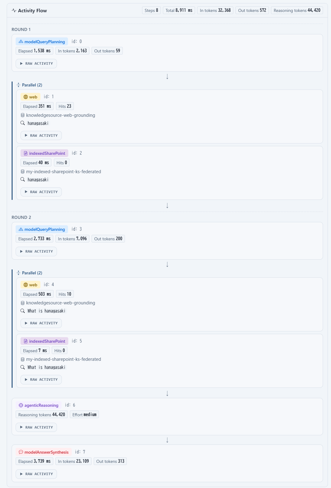

### Analyze Mode (Text Analysis)
- **Analyze API**: Execute text analysis on indexes
- **Analyzers**: Test built-in or custom analyzers with `analyzerName`
- **Tokenizer + Filters**: Combination of `tokenizerName`, `charFilters`, `tokenFilters`
- **Normalizers**: Test normalization with `normalizerName`
- **Token results**: Display list of analyzed tokens

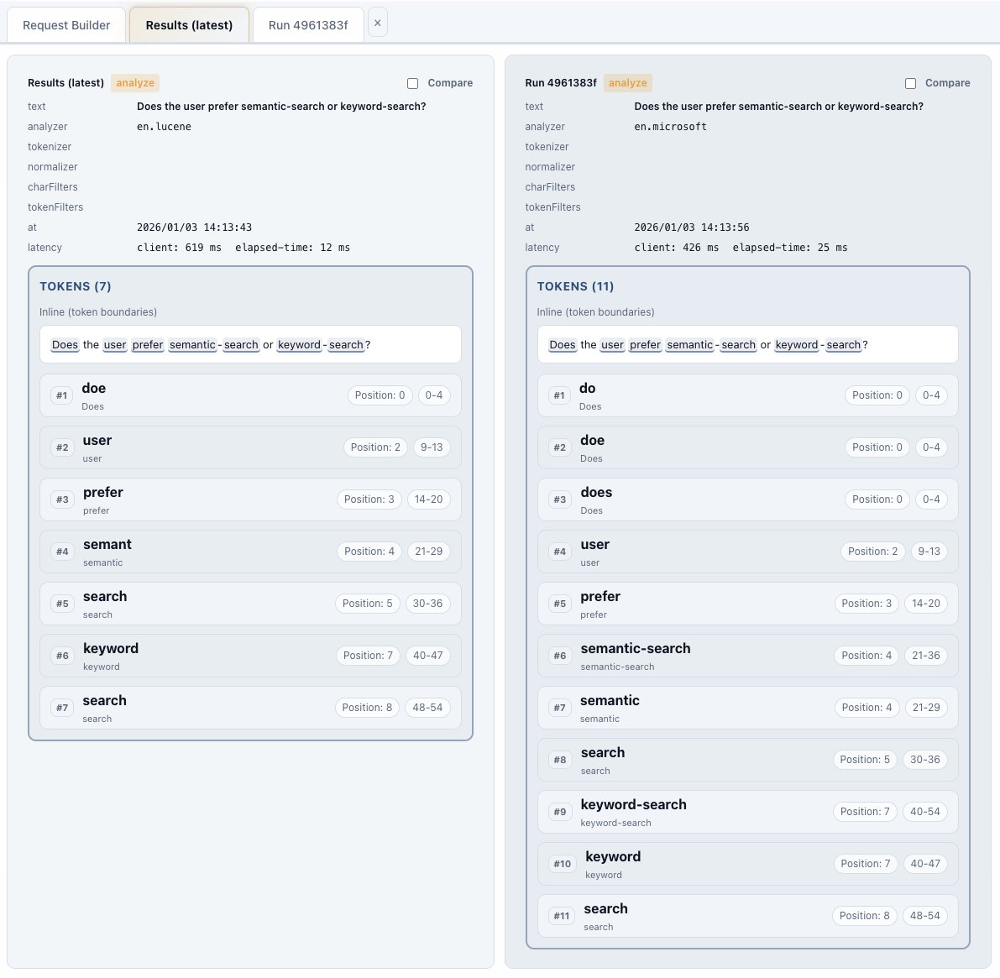

## 2. Builder Tools

### Index Builder
- **Index list**: Display all indexes from connected service
- **Create/update indexes**: Edit schema in JSON editor and create/update
- **Schema Workbench**: Edit fields through Field Matrix toggles for `key`, `searchable`, `filterable`, `sortable`, `facetable`, `retrievable`, lexical settings, synonym maps, and vector dimensions/profiles
- **Index-level configuration editors**: Form editors for semantic configurations, scoring profiles, suggesters, analyzers, normalizers, and vector profiles that sync back to JSON
- **Diff-reviewed publishing**: Review semantic and normalized JSON diffs before updating existing indexes
- **Clone Assistant**: Create a replacement index definition from an existing index and prepare rebuilds that require destructive schema changes
- **Delete indexes**: Remove existing indexes
- **Statistics**: Display `documentCount`, `storageSize`, `vectorIndexSize`
- **Alias management**: Create, update, delete, and repoint index aliases for safe index swaps
- **JSON import/export**: Import from file, export to clipboard

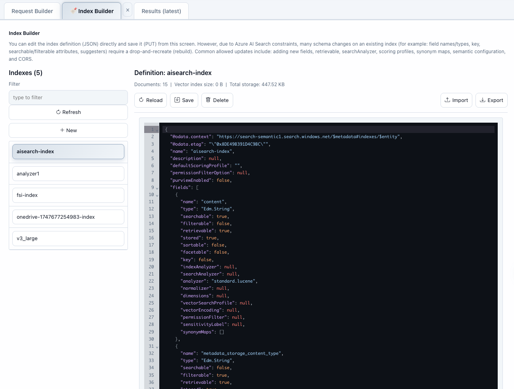

### Indexing Pipeline Builder
- **Pipeline hub**: Load an existing indexer and inspect its related data source and target index in one workspace
- **Per-node inspectors**: Switch between Pipeline, Source, Target index, Indexer, Run tracker, and Raw JSON views without losing context
- **Local draft library**: Create, save, clone, load, and delete pipeline drafts while redacting data source secrets before browser storage
- **Data source design**: Select source type, configure connection/authentication, paste Azure portal Storage Account URLs, and choose connection string, system-assigned Managed Identity, or user-assigned Managed Identity
- **Indexer configuration**: Edit identity, schedule, field mappings, output field mappings, and source-specific parameters with target-field suggestions and validation notices
- **Raw JSON and checks**: Review and directly edit final data source / index / indexer payloads, then inspect validation issues before publishing
- **Publish & Run pipeline**: Review diffs against existing resources, then track data source publish → index create/update → indexer publish → indexer run → status refresh
- **Target verification**: Check document count, sample documents, key fields, and mapped fields after ingestion

### Knowledge Source Builder
- **Knowledge source list**: Display existing knowledge sources
- **Create/update knowledge sources**: 
  - `name`, `kind='searchIndex'`, `description`
  - `searchIndexParameters`: `searchIndexName`, `semanticConfigurationName`, `sourceDataFields`, `searchFields`
- **Delete knowledge sources**: Remove existing knowledge sources

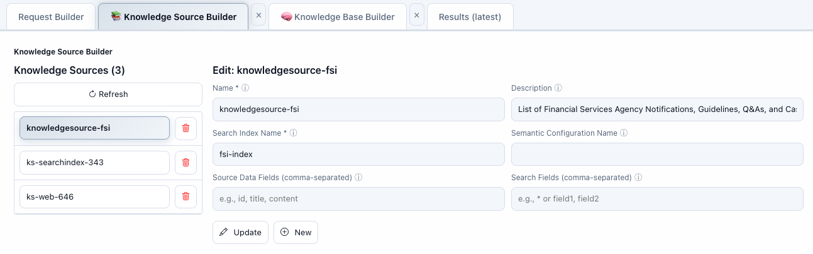

### Knowledge Base Builder
- **Knowledge base list**: Display existing knowledge bases
- **Create/update knowledge bases**: `name`, `description`, `knowledgeSources` array
- **Delete knowledge bases**: Remove existing knowledge bases

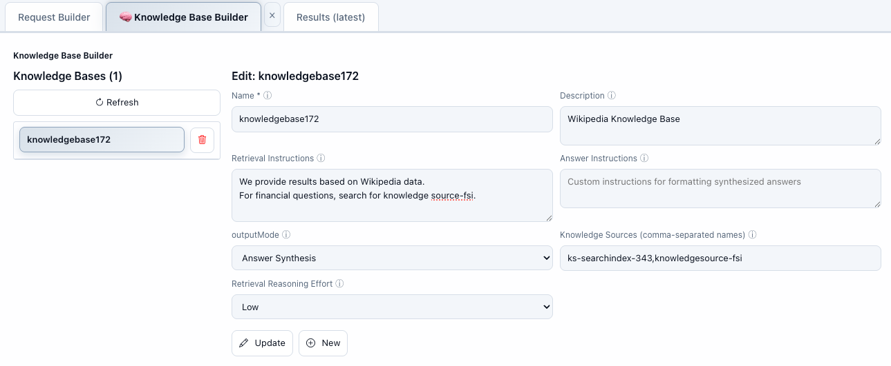

### Synonym Map Builder
- **Synonym map list**: Display existing synonym maps
- **Solr format editing**: 
  - Equivalency synonyms (comma-separated): `laptop, notebook, portable computer`
  - Explicit mapping (=> notation): `USA, U.S.A. => United States`
- **Rule editing UI**: Add and edit synonym rules individually via form
- **Validation**: Rule count limit (max 20000), format checking
- **Full CRUD**: Complete create/update/delete operations
- **File import**: Import from .txt files

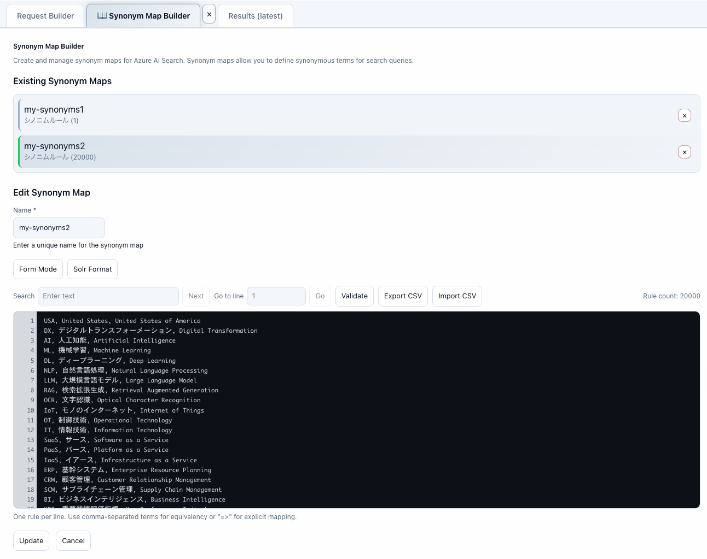

### Skill Pipeline Builder

A visual flow editor for authoring Azure AI Search skillsets. Each skill is represented as a node, and inputs/outputs are connected as edges in a left-to-right DAG (Directed Acyclic Graph).

- **Visual flow editor**: DAG visualization with auto-layout powered by ReactFlow + dagre
  - 4-layer structure: Document node → Skill nodes → Indexer node → Index node
  - Drag & drop to connect skill inputs/outputs
  - GUI operations for node selection, movement, deletion, and edge connection/removal
- **Skillset CRUD operations**:
  - List and load existing skillsets (`listSkillsets` / `getSkillset`)
  - Create/update skillsets (`createOrUpdateSkillset`), delete (`deleteSkillset`)
  - JSON import/export (clipboard copy, file import)
- **Built-in skill template catalog (15 types)**: Add skill nodes with one click
  - Text: Text Split, Key Phrase Extraction, Language Detection, PII Detection, Text Translation, Sentiment V3, Entity Recognition V3, Entity Linking V3, Text Merge
  - Vision: OCR, Image Analysis
  - Utility: Conditional, Document Extraction
  - AI: Azure OpenAI Embedding, ChatCompletion (GenAI Prompt), Custom Web API
- **Enrichment tree (`/document/…` paths)**:
  - Visualize skill input/output paths as a tree structure
  - EnrichmentPathPicker combo-box with path auto-completion
  - Automatic `/*` wildcard propagation for array outputs (auto-detection of Collection-type skill outputs)
  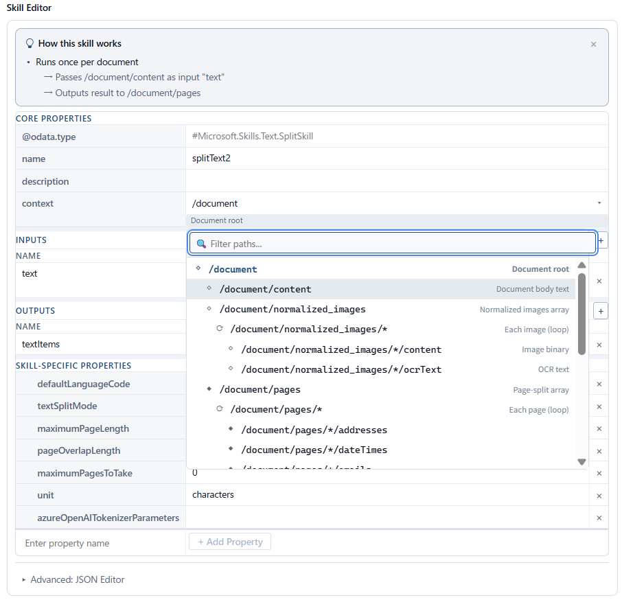
- **Indexer integration**:
  - Load existing indexers (`listIndexers` / `getIndexerDefinition`)
  - GUI editing of `outputFieldMappings` (enrichment path → index field)
  - Connection from indexer node to index node
- **Right pane: Skill JSON editing**:
  - Edit selected skill JSON with CodeMirror
  - Edit skillset-level properties (`indexProjections`, `knowledgeStore`, `cognitiveServices`, etc.)
  - JSON diff highlight display showing before/after changes
- **Debug Runner**:
  - Azure Blob Storage connection settings (connection string, container name)
  - Auto-provisioning of temporary debug resources (data source, index, indexer, skillset)
  - Preview skill outputs with real data via Knowledge Store projections
  - Automatic Shaper skill generation
  - 4-step UI: Provision → Run → Fetch → Cleanup
  - Auto-cleanup feature (automatically delete temporary resources after debug)
- **Enrichment tree preview**:
  - Display skill output values in tree structure by `/document/…` path after debug run
  - Expandable/collapsible display of actual enrichment results
  - Field mapping visualization
  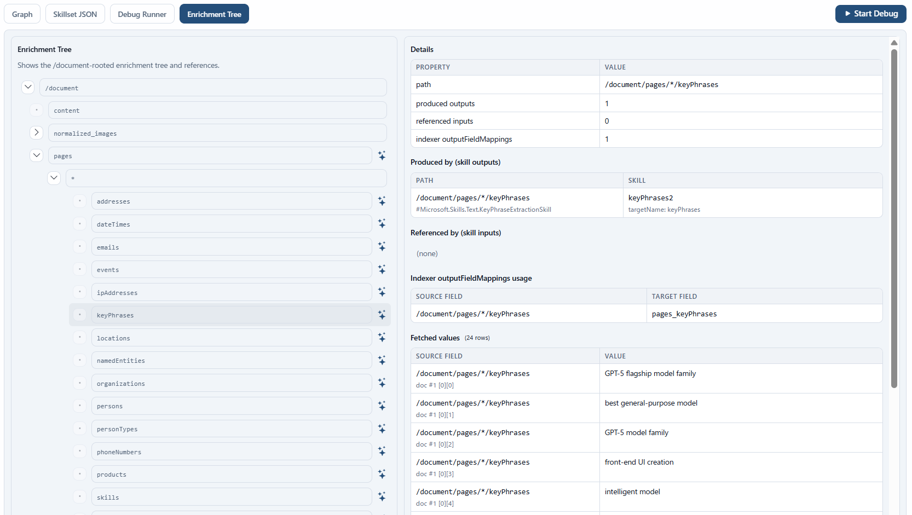
- **Publish to Azure with Diff Confirmation**:
  - Publish (create/update) skillsets directly to Azure AI Search from the builder
  - Full-screen diff confirmation dialog before publish
  - **Semantic diff view**: Structural change table showing added/removed/changed/reordered skills and properties
    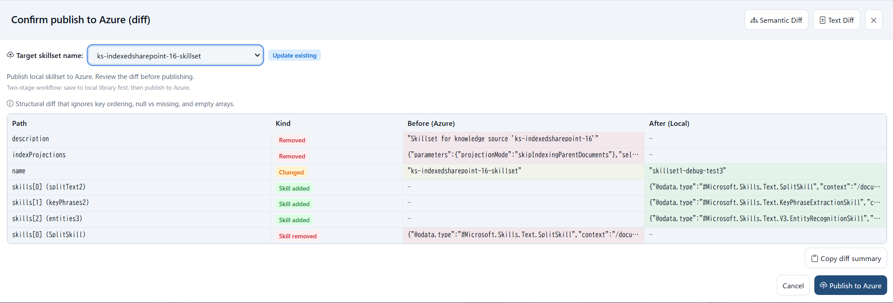
  - **Text diff view**: Normalized JSON side-by-side comparison with line highlighting (CodeMirror)
    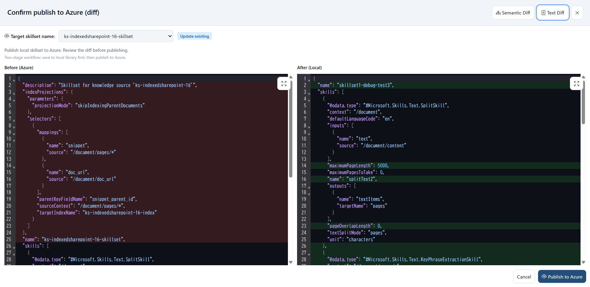
  - Target skillset name selection: dropdown of existing skillsets or create new
  - Auto-detection of new vs update (CREATE NEW / UPDATE EXISTING badges)
  - Noise reduction: ignores `@odata.etag`, JSON key ordering, `null` vs missing, empty arrays vs missing
  - Diff summary clipboard copy
  - Format-only change detection notification
- **Pipeline state save/restore**:
  - Persist pipeline configurations in LocalStorage
  - Save, switch, and delete multiple pipelines

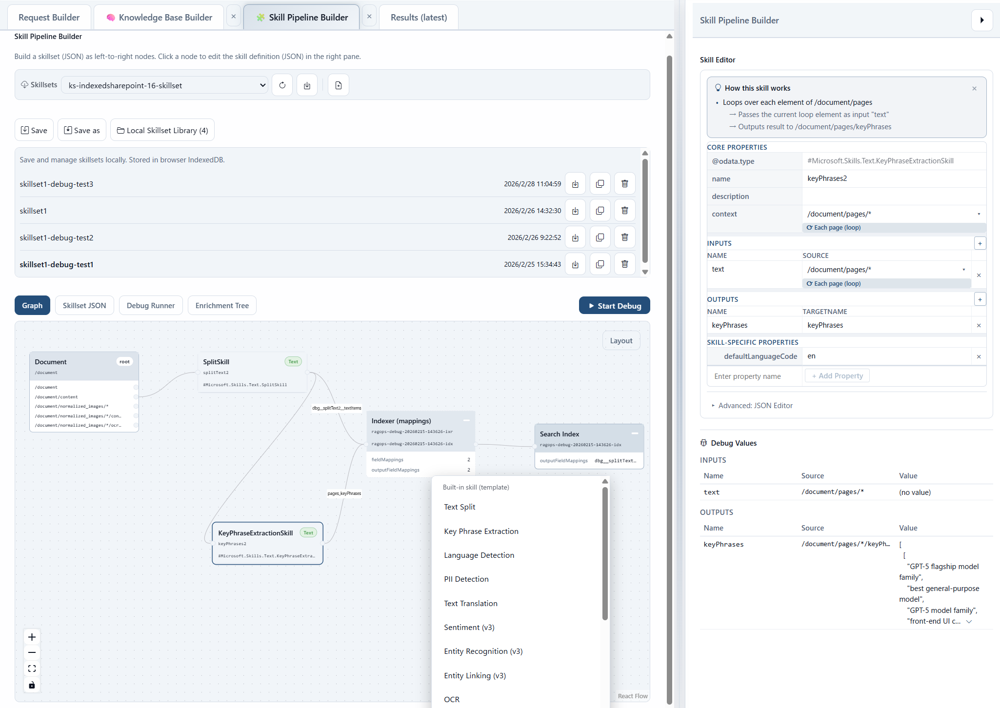


### Custom Skill LiveEditor

A browser-integrated Python development environment for building, testing, and deploying Azure AI Search Custom Skills without leaving RAGOps Studio.

- **Three-tab workspace**:
  - **Code tab**: CodeMirror editor with Python syntax highlighting, I/O connection panel showing which skill inputs/outputs are referenced in code (color-coded: green = connected, yellow = test data missing, red = not connected)
  - **Test tab**: JSON test input/output editor, execution logs with stdout/stderr capture, validation notices, execution time display
  - **Settings tab**: Runtime URL configuration, health check, skill load/publish controls
- **Two execution modes**:
  - **Local Run (Pyodide)**: Execute Python code in-browser via WebAssembly — no server required, instant feedback
  - **Remote Run**: Execute on cloud runtime (Azure Container Apps + FastAPI) for production-realistic testing
- **Cloud runtime architecture**:
  - FastAPI-based Skill Host on Azure Container Apps
  - Dynamic Skill Loading: code stored in Azure Blob Storage, loaded at runtime without container redeployment
  - 6 HTTP endpoints: `/health`, `/simulate`, `/execute`, `/upload`, `/skills/{name}`, `/skills/{name}/code`
  - Skill module contract: `def process(input: dict) -> dict`
  - Deploy scripts included (`deploy-aca.ps1`, `deploy-aca.sh`)
- **Blob Storage integration**:
  - Upload workflow: local code → diff preview → confirm → POST /upload → Blob Storage
  - Download workflow: auto-load on editor open, manual load button, diff on conflict
  - SHA-256 hash sync tracking with visual status badges (Synced / Dirty / Unknown)
- **Skill Pipeline integration**:
  - Opens directly from skill nodes in the Skill Pipeline Builder
  - Auto-generates sample Python code based on skill input/output definitions
  - Updates Custom Web API skill URI after successful upload
  - Draft persistence: auto-saves editor state per linked skill node
- **Diff mode**: Side-by-side comparison with hunk navigation when local and remote code diverge
- **Dark/light theme support** and **multi-language support** (EN/JP)

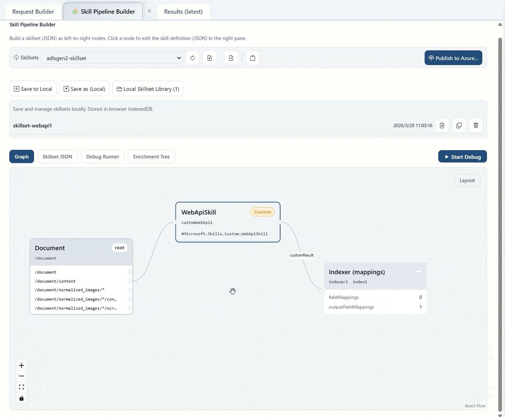

## 3. Developer Tools

### Search Pipeline Visualizer
- **4-stage comparison**: Run 4 search stages in parallel (`text`, `vector`, `hybrid`, `semantic_hybrid`)
- **Stage results**: Execute same query in each stage and compare results
- **Score tracking**: 
  - Text/Vector stages: `@search.score`
  - Hybrid stage: `@search.score` (after RRF)
  - Semantic Hybrid stage: `@search.score` and `@search.rerankerScore`
- **Document comparison**: Visualize which documents are returned in each stage
- **Auto key field detection**: Automatically detect unique key field from index

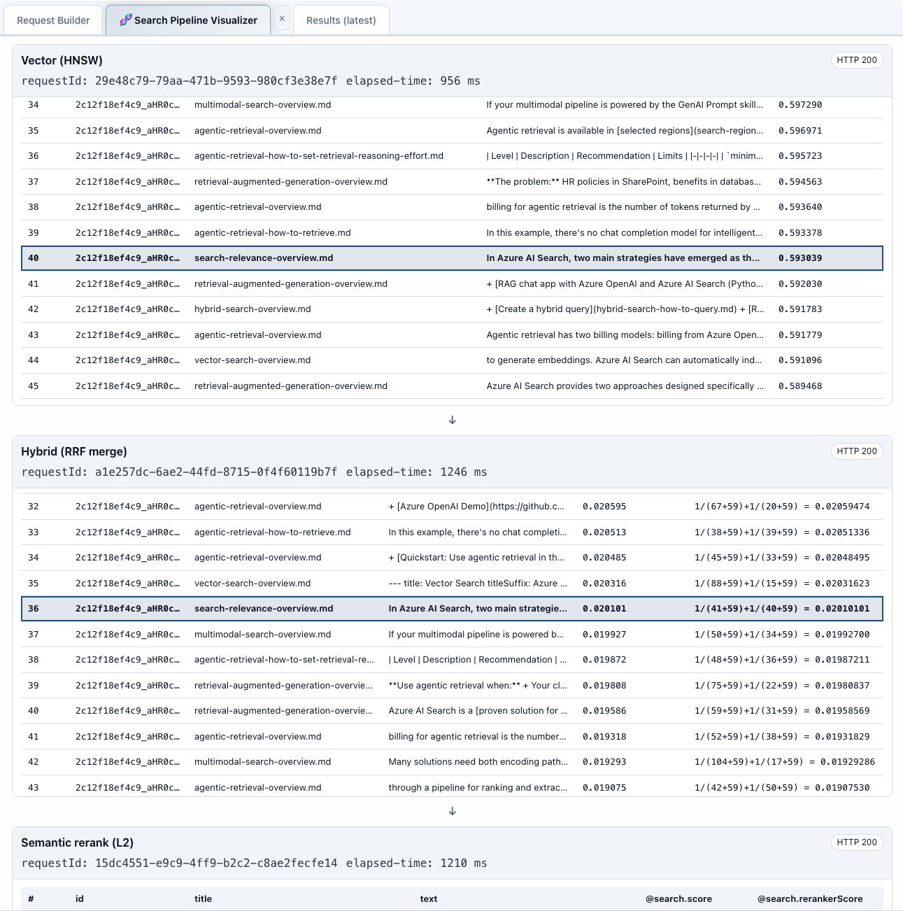

### QPS Tester (Query Performance Tester)
- **5 search modes measurement**: `query`, `semantic`, `vector`, `hybrid`, `semantic_hybrid`
- **Concurrent execution**: Execute requests simultaneously with specified concurrency
- **Performance metrics**: 
  - QPS (Queries Per Second)
  - Latency (p50, p95)
  - Success/error counts
- **Save results**: Save test results as experiment runs

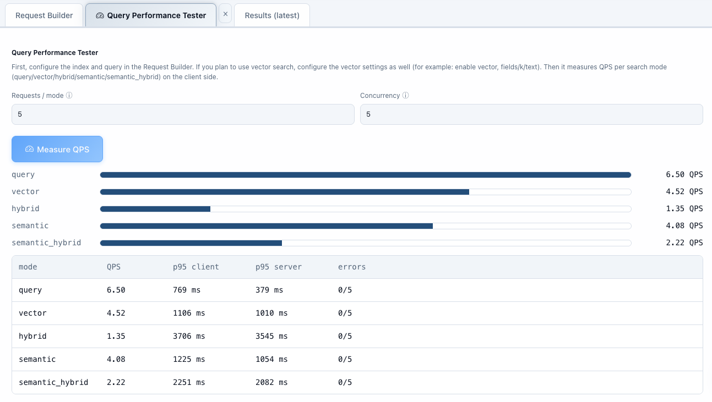

### Index Cluster Visualizer
- **EFLC-based index exploration**: Scan existing vector fields and discover document groups using Embedding-First Lightweight Clustering
- **Adaptive Sampling**: Detect chunked, independent, or unknown index structures and choose a sampling strategy that avoids over-representing one source document
- **Clustering and projection**: Run K-Means++ clustering, optional Macro → Micro hierarchical clustering, and 2D projection via PCA, UMAP, t-SNE, or PCA → UMAP
- **Cluster scatter and document browsing**: Explore the scatter plot, hover/highlight clusters, and open cluster member documents from the visualization
- **Cluster relationship graph**: Build centroid-similarity graphs, inspect bridge documents, shared facets/keywords, edge confidence, and drill down from macro graphs into micro cluster graphs
- **EFLC v1/v2 summary modes**: Keep the lightweight v1 path, or use v2 for role-aware evidence, multi-facet naming, sibling-aware inclusion/exclusion criteria, ETA topology diagnostics, and HSA bottom-up macro summaries
- **Meta-index generation**: Store cluster summaries, facets, criteria, centroid data, traces, and token usage in an Azure AI Search meta-index
- **Global → Local 2-stage search**: Search the meta-index first, route through macro / micro / facet / question nodes, then run local document search against the source index with trace and stats views
- **Visualization and Meta JSON persistence**: Save `.ragvis.json` for cluster coordinates/graph structure and `.ragmeta.json` for LLM summaries, traces, token usage, and reusable meta state

### Eval Dataset Generator
- **LLM-powered evaluation dataset generation**: Automatically generate Search Parameter AutoTuning-compatible JSONL evaluation datasets from real documents in your Azure AI Search index
- **Two generation modes**:
  - **Classic mode**: Sample N documents from the index, then generate M queries per document via Azure OpenAI
  - **Ragas mode**: Plan scenarios across 4 quadrants (Single/Multi × Specific/Abstract) with orthogonal axes (Persona, Style, Length) using the largest-remainder method for diverse, real-world-like query distributions
- **Multi-stage quality pipeline**:
  - **Surface dedup**: Jaccard similarity-based deduplication (threshold: 0.85)
  - **Round-trip consistency (Promptagator)**: Reject queries whose source document does not appear in top-k search results
  - **Semantic dedup**: Embedding cosine similarity-based deduplication via Azure OpenAI embeddings
  - **Difficulty Evolution (Evol-Instruct)**: Rewrite queries via paraphrase/negation/aggregation/abstraction to increase difficulty
  - **Hard Negative Mining (DPR-style)**: Record top-k non-expected documents as `hard_negative_ids` for contrastive training
- **Domain Schema injection (RAGEval)**: Inject domain-specific entities, relations, and constraints into prompts for improved factuality
- **NDCG-compatible relevance grades**: Automatically assign graded relevance scores (`expected_ids[0]` → 3, secondary → 2, hard negatives → 0)
- **Entity-KG**: Optional LLM entity extraction per document for refined multi-hop pairing via entity Jaccard (with token Jaccard fallback)
- **RAFT (Retrieval Augmented Fine-Tuning)**: Generate Chain-of-Thought fine-tuning datasets mixing oracle + distractor documents; export as RAFT JSONL (Zhang et al., 2024)
- **LLM authentication**: API Key, Bearer Token, and Azure AD (Entra ID) authentication for Azure OpenAI
- **Dataset persistence**: Save/load/delete generated datasets in browser local storage (`localStorage`), with browser-local durability
- **JSONL export**: Download evaluation datasets in JSONL format, or send directly to Search Parameter AutoTuning
- **Real-time progress tracking**: Phase-by-phase progress display (sampling → generating → grounding → embedding → difficulty → hard negatives → done)
- **Cancellation support**: Cancel generation at any point with partial results preserved

### Search Parameter AutoTuning
- **Automated parameter optimization**: Systematically test parameter combinations to find the best configuration
- **JSONL dataset support**: Upload evaluation datasets in JSONL format with query/answer fields
- **Multiple optimization targets**: 
  - Precision@k: Ratio of relevant documents in top-k results
  - Recall@k: Ratio of retrieved relevant documents out of all relevant documents
  - NDCG (Normalized Discounted Cumulative Gain): Ranked relevance scoring
  - MRR (Mean Reciprocal Rank): Average of reciprocal ranks of first relevant result
- **Parameter grid search**: 
  - Index selection: Test across multiple indexes
  - Vector weight: Optimize hybrid search weighting (0.0-1.0)
  - Vector k: Test different retrieval counts (k values)
  - Hybrid maxTextRecallSize: Optimize text recall limits
  - Query type: Compare query syntax (`simple`, `full`, `semantic`)
  - Vector threshold: Test `vectorSimilarity` and `searchScore` threshold settings
- **Real-time progress tracking**: Monitor optimization progress with live updates
- **Result visualization**: View ranked parameter combinations with scores
- **Best configuration detection**: Automatically identify and apply optimal parameters
- **Run history**: Save optimization results as experiment runs for future reference
- **Resume capability**: Restore and review previous optimization runs

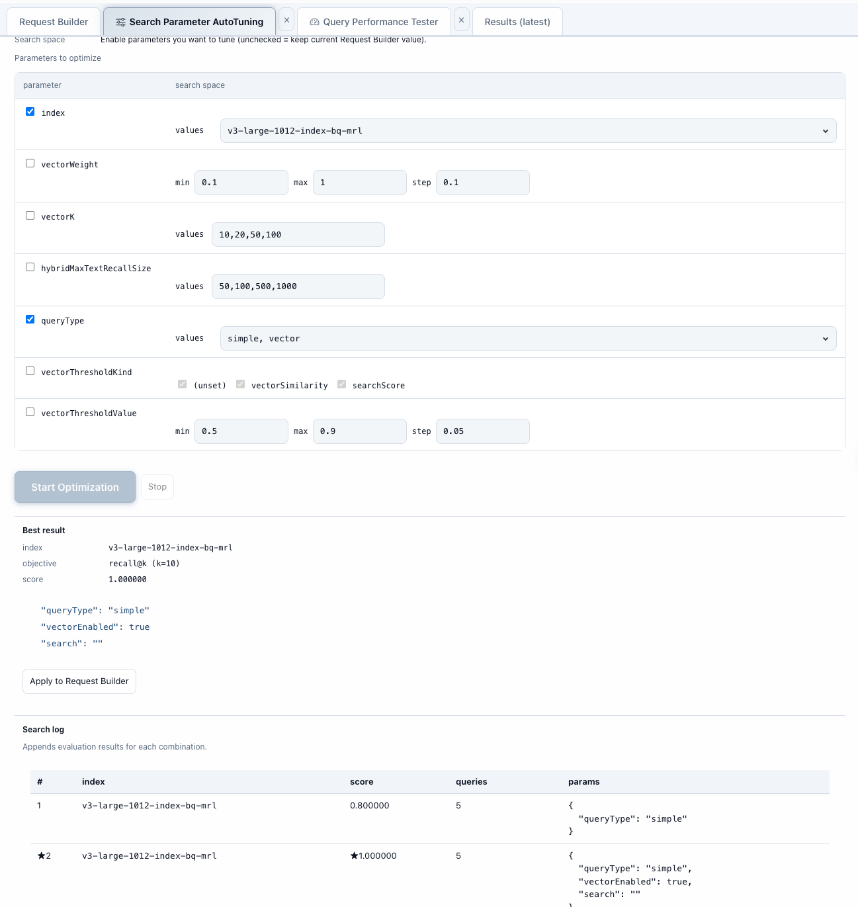

### Filter Builder Modal
- **OData filter construction**: Build filter expressions via GUI
- **Multiple conditions**: AND/OR logic
- **Operator support**: `eq`, `ne`, `gt`, `ge`, `lt`, `le`, `search.in`, etc.
- **Syntax validation**: Validate and preview filter expressions

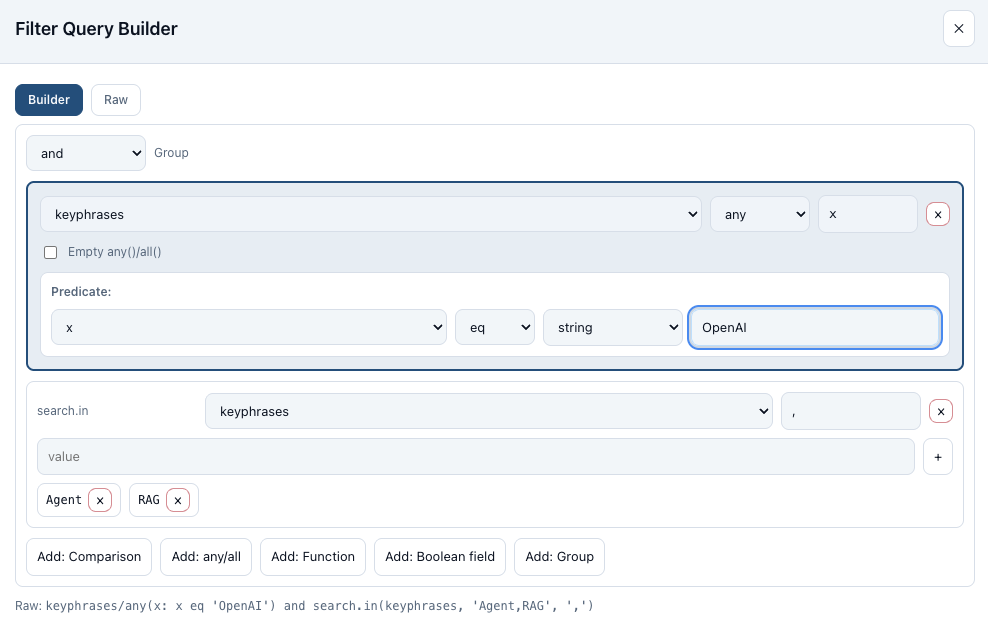

### Index Inspector Modal
- **Schema details**: Display field definitions, vector settings, semantic configurations
- **JSON viewer**: Show complete index definition JSON
- **Copy to clipboard**: Copy definition for reuse

### Text to Vector Modal
- **Text embedding conversion**: Use text-embedding-ada-002, etc.
- **Vector dimension check**: Display dimension count of generated vectors
- **Copy results**: Paste generated vectors into queries

### JWT Decoder Modal
- **JWT token analysis**: Decode tokens for `x-ms-query-source-authorization`
- **Header/payload display**: Show each JWT part as JSON
- **JWE support**: Partial analysis of encrypted tokens (JWE)
- **Expiration check**: Display `exp`, `iat`, `nbf` timestamps in ISO8601 and local time

### Vector Optimizer
- **Vector optimization calculation**: Calculate size based on `quantization`, `truncationDimension`, `stored`, `rescoring` combinations
- **Optimization settings comparison**:
  - Quantization: `scalarQuantization` (int8) / `binaryQuantization` (1bit)
  - `truncationDimension`: Dimension reduction via MRL
  - `stored`: Whether to save source data
  - `rescoring`: Keep full-precision copy for rescoring
- **Theoretical size calculation**: Display byte count for vector index, source, originals
- **Overhead notes**: Explanation about actual overhead like HNSW graphs

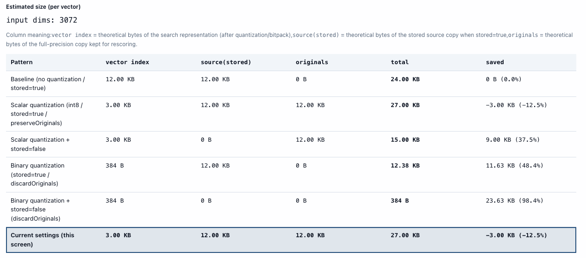

## 4. Experiment Management

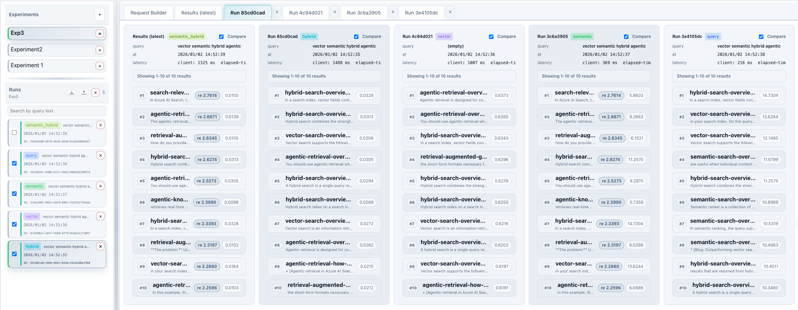

### Experiments
- **Create experiments**: Organize with name, description, tags, pinning
- **Experiment list**: Display by update time, pinned experiments at top
- **Default context**: Save apiVersion, etc. per experiment
- **Delete experiments**: Bulk delete experiment with all runs and artifacts

### Runs
- **Save runs**: Save query execution results as runs
  - `runType`: e.g. `query`, `semantic`, `vector`, `hybrid`, `semantic_hybrid`, `analyze`, `agentic_retrieve`, `qps_test`, `auto_tuning`
  - `status`: `success` / `error` / `canceled`
  - `context`: endpoint / apiVersion / authType (+ indexName or knowledgeBaseName when applicable)
  - `params`: Request body
  - `metrics`: latency/elapsed time, request ids, etc.
  - `startedAt` / `endedAt`: Execution time
- **Run list**: Display runs under experiment in chronological order (max 200)
- **Run selection**: Select multiple runs (max 10) to compare results side by side
- **Delete runs**: Delete individual runs
- **Query filter**: Filter runs by query text
- **Experiment note**: Record notes before execution to annotate the next saved run
  - Collapsible note panel in the builder area
  - Notes are persisted as part of the Run data (`note` field)
  - Note preview displayed in the run list with journal icon
  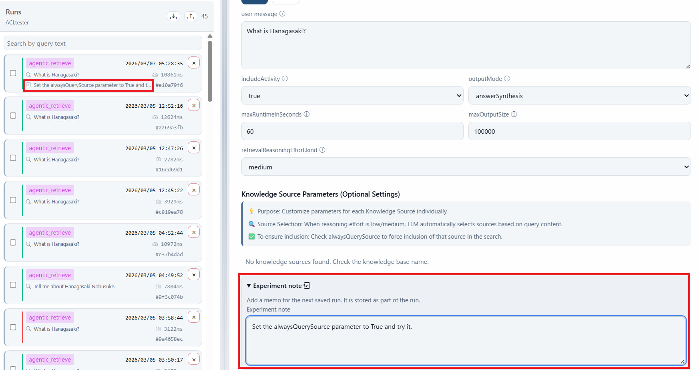
### Artifacts
- **Save artifacts**: Additional data tied to runs
  - QPS test results
  - Other custom data
- **Get artifacts**: Retrieve related artifacts from run ID

### Export/Import
- **Bundle format**: Export runs and artifacts together in JSON format
  - `kind`: `'ragops-studio:runs'`
  - `version`: `1`
  - `exportedAt`: Export timestamp (ISO8601)
  - `runs`, `artifacts` arrays
- **Import**: Import exported bundles in other environments

### Feature Portal
- **Welcome screen / feature directory**: Card-based overview of all available RAGOps Studio features, displayed on startup
- **Category grouping**: Features organized into 6 categories — Search Modes, Builder Tools, Optimization & Testing, Developer Tools, Experiment Management, Azure AI Search Features (Coming Soon)
- **Feature cards**: Each card shows feature name, icon, and description; click to launch the feature directly
- **Step-by-step guides**: Click the `?` button on any card to open a guided walkthrough
  - **Two guide modes**: Basic (beginner-friendly) and Advanced (detailed with tips)
  - **Modal mode**: Full guide overlay opened from the Portal
  - **Companion mode**: Persistent floating guide that highlights target UI elements while you use the feature
  - **DOM element highlighting**: Active step highlights the relevant UI element with smooth scroll-into-view
  - **Tips section**: Expert tips and best practices for each feature
  - **Documentation links**: Direct links to official Microsoft Learn documentation
- **Startup control**: "Don't show on startup" checkbox to dismiss automatic display (persisted in localStorage)
- **Bilingual support**: All card titles, descriptions, and guide content available in Japanese and English

## 5. UI/UX Features

### Themes
- **6 themes**: System, Dark, Light, Midnight, Forest, Solarized
- **System sync**: Follows OS settings when System theme is selected

### Multi-language Support
- **2 languages**: Japanese (ja), English (en)
- **Auto-detect**: Detect browser language on first launch
- **Full translation**: All labels, messages, error texts are translated

### Layout
- **3-pane structure**: 
  - Left pane: Experiment and run list (resizable)
  - Center pane: Query builder / various builders / tools
  - Right pane: JSON viewer (request/response/facets, resizable and collapsible)
- **Tab functionality**: 
  - Builder: Main query builder
  - Latest: Latest execution result
  - Run tabs: Selected run results (up to 10 tabs)
  - Tool tabs: QPS Tester, Search Pipeline Visualizer, Vector Optimizer, various Builders
- **Drag resize**: Adjust panel sizes by dragging borders, settings saved in browser

## Tech Stack

### Frontend
- **React 19.2** - UI framework
- **TypeScript 5.9** - Type-safe development
- **Vite 7.2** - Fast build tool
- **Bootstrap 5.3** - UI components

### Major Libraries
- **@uiw/react-codemirror 4.25** - CodeMirror 6 based React component
  - @codemirror/lang-json - JSON syntax highlighting
  - @codemirror/search - Search and replace
  - @uiw/codemirror-theme-github - GitHub theme
- **react-window 2.2** - Virtual scrolling (efficient display of large data)
- **idb 8.0** - IndexedDB wrapper (client-side database)
- **diff 8.0** - Text diff calculation
- **DOMPurify 3.3** - XSS protection (HTML sanitization)
- **uuid 13.0** - UUID v4 generation
- **undici 7.16** - Fast HTTP client (fetch polyfill)
- **@xyflow/react 12** - Flow chart visualization (used by Skill Pipeline Builder)
- **dagre 0.8** - Automatic directed graph layout
- **Pyodide** - In-browser Python execution via WebAssembly (used by Custom Skill LiveEditor)

### Development Tools
- **ESLint 9.39** + **typescript-eslint 8.46** - Code quality checking
- **Vitest 4.0** - Unit testing

## Project Structure

```
ragops-studio/
├── src/
│   ├── components/          # React components
│   │   ├── AppHeader.tsx    # Header (language/theme switch, tools menu)
│   │   ├── InfoTooltip.tsx  # Tooltip component
│   │   ├── builders/        # Builder components
│   │   │   ├── AgenticBuilderForm.tsx        # Agentic search form
│   │   │   ├── AnalyzeBuilderForm.tsx        # Text analysis form
│   │   │   ├── ClassicSearchBuilderForm.tsx  # Classic search form
│   │   │   ├── BuilderActions.tsx            # Action buttons
│   │   │   ├── BuilderConnectionSection.tsx  # Connection info section
│   │   │   ├── BuilderErrorNotice.tsx        # Error display
│   │   │   ├── BuilderTabPane.tsx            # Builder tab pane
│   │   │   ├── FilterQueryBuilder.tsx        # Filter query input
│   │   │   ├── IndexBuilder.tsx              # Index builder
│   │   │   ├── KnowledgeBaseBuilder.tsx      # Knowledge base builder
│   │   │   ├── KnowledgeSourceBuilder.tsx    # Knowledge source builder
│   │   │   ├── SearchParameterAutoTuning.tsx # Search parameter auto-tuning
│   │   │   ├── SkillPipelineBuilder.tsx       # Skill pipeline builder
│   │   │   ├── SkillPipelineDebugRunner.tsx   # Debug runner
│   │   │   ├── SkillPipelineEnrichmentTreePreview.tsx # Enrichment tree preview
│   │   │   ├── SkillPipelineRightPane.tsx     # Skill pipeline right pane
│   │   │   ├── EnrichmentPathPicker.tsx       # Enrichment path picker
│   │   │   ├── PublishDiffModal.tsx           # Skillset publish diff confirmation
│   │   │   ├── SkillCodeEditor.tsx            # Custom Skill Python code editor
│   │   │   ├── SynonymMapBuilder.tsx         # Synonym map builder
│   │   │   └── VectorOptimizerBuilder.tsx    # Vector optimizer
│   │   ├── modals/          # Modal dialogs
│   │   │   ├── FilterBuilderModal.tsx        # Filter builder
│   │   │   ├── IndexInspectorModal.tsx       # Index inspector
│   │   │   ├── JwtDecoderModal.tsx           # JWT decoder
│   │   │   └── TextToVectorModal.tsx         # Text-to-vector conversion
│   │   └── viewers/         # Result display and visualization
│   │       ├── JsonViewer.tsx                # JSON display
│   │       ├── LeftPane.tsx                  # Left pane (experiments/runs)
│   │       ├── QueryPerformanceTester.tsx    # QPS tester
│   │       ├── RequestJsonEditor.tsx         # Request JSON editor
│   │       ├── ResultViewPanel.tsx           # Result display panel
│   │       ├── RightJsonViewerPane.tsx       # Right pane (JSON viewer)
│   │       ├── AgenticActivityTimeline.tsx    # Agentic activity timeline
│   │       └── SearchPipelineVisualizer.tsx  # Search pipeline visualizer
│   ├── hooks/               # Custom hooks
│   │   └── useApiOperations.ts  # API operations hook (Execute logic)
│   ├── lib/                 # Core logic
│   │   ├── aiSearchRest.ts  # Azure AI Search REST API client
│   │   ├── azureBlobStorage.ts # Azure Blob Storage REST client
│   │   ├── analyzeCatalog.ts # Analyzer catalog definitions
│   │   ├── db.ts            # IndexedDB operations
│   │   ├── diffText.ts      # Text diff calculation
│   │   ├── model.ts         # Data model definitions
│   │   ├── odataFilter.ts   # OData filter parsing
│   │   ├── odataFilter.test.ts # OData filter tests
│   │   ├── pyodideRunner.ts # Pyodide WASM Python execution
│   │   ├── skillRuntime.ts  # Skill Runtime HTTP client
│   │   └── translations.ts  # Multi-language support (ja/en)
│   ├── types/               # TypeScript type definitions
│   │   ├── app.ts           # Application types
│   │   └── index.ts         # Exports
│   ├── utils/               # Utility functions
│   │   ├── apiHelpers.ts           # API helper functions
│   │   ├── appRequestBodies.ts     # Request body construction
│   │   ├── debugRunnerHelpers.ts   # Debug runner helpers
│   │   ├── enrichmentTree.ts       # Enrichment tree construction
│   │   ├── helpers.ts              # General helpers
│   │   ├── localStorage.ts         # Local storage operations
│   │   ├── searchFacets.ts         # Facet extraction
│   │   ├── skillPipelineOutputFieldMappings.ts # outputFieldMappings helpers
│   │   ├── skillsetDiff.ts                 # Skillset semantic diff calculation
│   │   └── index.ts                # Exports
│   └── App.tsx              # Main application component
├── skill-runtime/           # Cloud Skill Runtime (Python)
│   ├── main.py              # FastAPI skill host server
│   ├── Dockerfile           # Container image definition
│   ├── requirements.txt     # Python dependencies
│   └── skills/              # Skill module directory
├── scripts/                 # Build scripts
│   ├── generateSynonymMap.mjs  # Synonym map generation script
│   └── skill-runtime/       # ACA deploy scripts (deploy-aca.ps1/.sh)
├── public/                  # Static files
├── index.html               # HTML entry point
├── vite.config.ts           # Vite configuration
├── tsconfig.json            # TypeScript configuration
└── package.json             # npm package configuration
```

## Connection Settings

After launching the application, configure your Azure AI Search connection from "Settings" in the header:

### Authentication Methods
1. **API Key Authentication** (Recommended)
   - Endpoint: Azure AI Search service endpoint URL (e.g., `https://your-service.search.windows.net`)
   - API Key: Admin key or query key
  - API Version: Data-plane REST API version (new connections default to `2026-05-01-preview`; Agentic mode uses the selected version and only raises versions older than `2025-11-01-preview` to that minimum)

2. **Bearer Token Authentication**
   - Endpoint: Azure AI Search service endpoint URL
   - Bearer Token: Azure AD token (supports with or without `Bearer` prefix)
   - API Version: REST API version

### Other Settings
- **Query Source Authorization**: Optional `x-ms-query-source-authorization` header for Knowledge Retrieval API
- **Connection Profiles**: Create and switch between multiple connection profiles
- **Display Fields**: Settings for title/text fields in result display
  - `displayTitleFields`: Fields to use for title (comma-separated, default: `title,name,id,key,documentId,chunkId,path,url,metadata_storage_name`)
  - `displayTextFields`: Fields to use for text (comma-separated, default: `text,content,description,chunk`)

### Development Proxy
During development (`npm run dev`), a Vite development proxy is automatically used to avoid CORS errors. Connections to Azure AI Search endpoints (`*.search.windows.net` or `*.search.azure.com`) go through `/api-proxy`.

Serverless Developer (preview) uses the regular Azure AI Search endpoint and authentication methods. Select `2026-05-01-preview` or later in the connection settings when using Serverless indexer features. Some features, including index aliases, aren't supported on Serverless.

## How to Use

### Basic Search Flow

1. **Connection settings**: Configure Azure AI Search connection from Settings in header
2. **Select mode**: Choose mode from tabs (Query / Semantic-Vector / Agentic / Analyze)
3. **Select index/knowledge base**: 
   - Query/Semantic-Vector/Analyze: Select `indexName`
   - Agentic: Select `knowledgeBaseName`
4. **Create query**: 
   - **Form mode**: Enter parameters via GUI (default)
   - **JSON mode**: Edit JSON directly in "JSON" tab
5. **Execute**: Click "Run" button (or Ctrl/Cmd + Enter) to execute query
6. **View results**: 
   - Center pane: Document list, facets, error display
   - Right pane: JSON display of Request/Response/Facets

### Experiment Management

1. **Create experiment**: Click "+ New Experiment" in left pane to create new experiment
2. **Execute**: Run a query while an experiment is selected
  - Each execution is saved automatically as a Run under the selected experiment
3. **View history**: Click on runs under experiment to review past results
4. **Compare multiple runs**: 
   - Select run checkboxes (up to 10)
   - Each run's results appear in tabs
   - Compare side by side
5. **Export**: Click "Export Runs" to output selected runs to JSON file
6. **Import**: Click "Import Runs" to import runs exported from other environments

### Using Developer Tools

#### Search Pipeline Visualizer
1. Select "Tools" → "Search Pipeline Visualizer" from header
2. Enter index, search, vector text, etc.
3. Click "Run All Stages" to execute 4 stages in parallel (text, vector, hybrid, semantic_hybrid)
4. Compare scores and returned documents for each stage

#### QPS Tester
1. Select "Tools" → "QPS Tester" from header
2. Set search conditions in Query/Semantic-Vector mode
3. Configure Requests per mode and Concurrency
4. Click "Run Test" to measure performance of 5 modes (query, semantic, vector, hybrid, semantic_hybrid)
5. Can save results as Run

#### Builder Tools
- Open each builder from "Tools" in header
- Select existing resource from list to edit, or create new
- Edit directly in JSON editor and save with Create/Update

## Developer Information

### Data Persistence

- Uses **IndexedDB** to store data in browser
- Database name: `ragops-studio`, version: 1
- Store structure:
  - **experiments**: Experiment data (`experimentId`, `name`, `description`, `tags`, `pinned`, `createdAt`, `updatedAt`, `defaultContext`)
  - **runs**: Run data (`runId`, `experimentId`, `runType`, `status`, `startedAt`, `endedAt`, `context`, `params`, `metrics`, `artifactIds`, `note`)
  - **artifacts**: Artifacts (`artifactId`, `runId`, `type`, `content`, `createdAt`)
  - **settings**: Settings data (`id='app'`, `settings`)
- Database operations implemented in `src/lib/db.ts`
- `ensureSeedData()` automatically creates default profile and first experiment on initial launch

### API Client

- Implements Azure AI Search REST API communication in `src/lib/aiSearchRest.ts`
- Uses standard `fetch` API
- Implemented API functions:
  - **searchDocuments**: POST /indexes/{indexName}/docs/search (search)
  - **analyzeIndex**: POST /indexes/{indexName}/analyze (text analysis)
  - **agenticRetrieve**: POST /knowledgebases/{knowledgeBaseName}/retrieve (Knowledge Retrieval API)
  - **listIndexes**: GET /indexes (index list)
  - **getIndexDefinition**: GET /indexes/{indexName} (get index definition)
  - **getIndexStatistics**: GET /indexes/{indexName}/stats (statistics)
  - **createOrUpdateIndex**: PUT /indexes/{indexName} (create/update index)
  - **deleteIndex**: DELETE /indexes/{indexName} (delete index)
  - **listKnowledgeBases**: GET /knowledgebases (knowledge base list)
  - **getKnowledgeBase**: GET /knowledgebases/{name} (get knowledge base)
  - **createOrUpdateKnowledgeBase**: PUT /knowledgebases/{name} (create/update)
  - **deleteKnowledgeBase**: DELETE /knowledgebases/{name} (delete)
  - **listKnowledgeSources**: GET /knowledgesources (knowledge source list)
  - **getKnowledgeSource**: GET /knowledgesources/{name} (get)
  - **createOrUpdateKnowledgeSource**: PUT /knowledgesources/{name} (create/update)
  - **deleteKnowledgeSource**: DELETE /knowledgesources/{name} (delete)
  - **listSynonymMaps**: GET /synonymmaps (synonym map list)
  - **getSynonymMap**: GET /synonymmaps/{name} (get)
  - **createOrUpdateSynonymMap**: PUT /synonymmaps/{name} (create/update)
  - **deleteSynonymMap**: DELETE /synonymmaps/{name} (delete)
  - **listSkillsets**: GET /skillsets (skillset list)
  - **getSkillset**: GET /skillsets/{name} (get skillset)
  - **createOrUpdateSkillset**: PUT /skillsets/{name} (create/update skillset)
  - **deleteSkillset**: DELETE /skillsets/{name} (delete skillset)
  - **listIndexers**: GET /indexers (indexer list)
  - **getIndexerDefinition**: GET /indexers/{name} (get indexer definition)
  - **createOrUpdateIndexer**: PUT /indexers/{name} (create/update indexer)
  - **deleteIndexer**: DELETE /indexers/{name} (delete indexer)
  - **runIndexer**: POST /indexers/{name}/run (run indexer)
  - **getIndexerStatus**: GET /indexers/{name}/status (get indexer status)
  - **createOrUpdateDataSource**: PUT /datasources/{name} (create/update data source)
  - **deleteDataSource**: DELETE /datasources/{name} (delete data source)
- **Azure Blob Storage REST client** (`src/lib/azureBlobStorage.ts`):
  - Client-side Account SAS token generation (Web Crypto API / HMAC-SHA256)
  - Blob listing, JSON blob reading, container deletion
  - Knowledge Store projection data retrieval and parsing
- Error handling: Unified success/failure handling with RestResult type
- Request ID tracking: Automatically adds `x-ms-client-request-id` (UUID v4), retrieves response `request-id` header
- Development proxy: Connects to Azure via `/api-proxy` when `import.meta.env.DEV` (CORS workaround)

### State Management

- Uses React's `useState` / `useEffect` / `useMemo` / `useCallback`
- Global state managed in `App.tsx`:
  - Experiment and run lists
  - Current search form (`SearchFormState` / `AgenticFormState` / `AnalyzeFormState`)
  - UI state (`centerTab`, `labMode`, `builderMode`, `isRightPaneCollapsed`, etc.)
  - Result data (`latestResponse`, `runResultMap`, `resultPages`)
- Custom hooks:
  - `useApiOperations`: Abstracts API execution logic (onExecute, onExecuteAllModes)
- Local storage:
  - Saves `theme`, `paneSizes`, `isRightPaneCollapsed` to `localStorage`
  - Wrapper functions provided in `src/utils/localStorage.ts`

### Testing

```bash
npm run test
```

- Unit testing using **Vitest**
- Test file: `src/lib/odataFilter.test.ts`
  - OData filter expression parsing tests
  - Validation of operators, logical operations, function calls, etc.

### Request Body Construction

- Constructs request bodies for each mode in `src/utils/appRequestBodies.ts`:
  - **buildSearchBodyFromForm**: `SearchFormState` → Search API request body
    - Constructs `vectorQueries` array (`text`/`vector`/`imageUrl`/`imageBinary`)
    - Expands semantic parameters
    - Excludes empty strings and default values
  - **buildAgenticBodyFromForm**: `AgenticFormState` → Knowledge Retrieval API request body
  - **buildAnalyzeBodyFromForm**: `AnalyzeFormState` → Analyze API request body

### Code Editor

- Uses `@uiw/react-codemirror` based on **CodeMirror 6**
- Used in:
  - Request JSON Editor (center pane)
  - JSON Viewer (right pane)
  - JSON editors in various builders
- Features:
  - JSON syntax highlighting (`@codemirror/lang-json`)
  - Search and replace (`@codemirror/search`)
  - Theme switching (githubLight / githubDark)
  - Line numbers
  - Folding (foldGutter)

### Facet Display

- Extracts `@search.facets` from Search API response in `src/utils/searchFacets.ts`
- Displays values and counts for each facet field
- Displayed in "Facets" tab of right pane

### OData Filter Parsing

- Tokenizes and parses OData filter expressions in `src/lib/odataFilter.ts`
- Supported features:
  - Operators: `eq`, `ne`, `gt`, `ge`, `lt`, `le`, `and`, `or`, `not`
  - Functions: `search.in`, `geo.distance`, `search.ismatch`, etc.
  - String literals, numbers, `null`, `true`/`false`
- Used in Filter Builder Modal

---

For the Japanese version, see [FEATURES.jp.md](FEATURES.jp.md).
