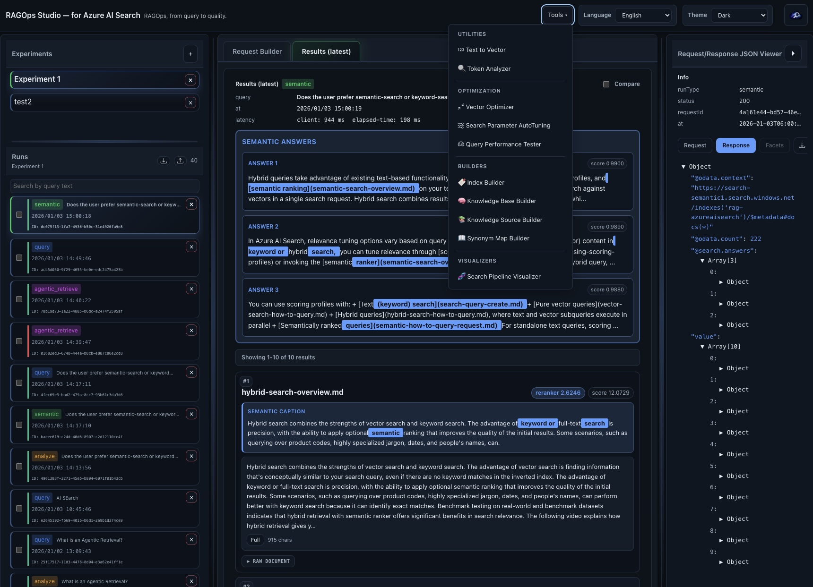

<p align="center">
  
</p>

# RAGOps Studio — for Azure AI Search

**RAGOps, from query to quality.**

A web-based development tool for learning and experimenting with advanced features of Azure AI Search.


[日本語版 README](README.jp.md) | [日本語版機能ガイド](FEATURES.jp.md)



> **📖 For a comprehensive introduction to RAGOps Studio, see [Introduction](docs/INTRODUCTION.md)**

## Features

- 🔍 **4 Search Modes**: Classic search, Semantic & Vector search, Agentic search (Knowledge Retrieval API), Text analysis
- 🛠️ **Builder Tools**: Create and manage indexes, knowledge sources, knowledge bases, and synonym maps
- 📊 **Performance Testing**: QPS tester, search pipeline visualizer
- 🎯 **Search Parameter AutoTuning**: Automatically optimize search parameters using evaluation datasets
- 🧪 **Experiment Management**: Save query history, compare results, export/import
- 🎨 **Rich UI**: 6 themes, bilingual (EN/JP), 3-pane layout, resizable panels
- 💾 **Offline Support**: Data storage in browser using IndexedDB

## Setup

### Requirements
- Node.js 18 or later
- Azure AI Search service

### Installation

```bash
# Clone the repository
git clone https://github.com/nohanaga/ragops-studio.git
cd ragops-studio

# Install dependencies
npm install
```

### Start Development Server

```bash
npm run dev
```

Open `http://localhost:5173` in your browser.

### Build

```bash
npm run build
```

Build artifacts will be output to the `dist/` directory.

## Usage

1. **Connection Settings**: Configure your Azure AI Search endpoint and API key from the "Settings" in the header
2. **Select Mode**: Choose from Query / Semantic-Vector / Agentic / Analyze
3. **Create Query**: Enter search conditions using the form or JSON editor
4. **Execute**: Click "Run" button (or Enter)
5. **View Results**: Check results in the center pane, JSON in the right pane

For detailed feature documentation, see [FEATURES.md](FEATURES.md).

## Commands

```bash
# Development server
npm run dev

# Production build
npm run build

# Lint
npm run lint

# Test
npm run test

# Preview (after build)
npm run preview

# Generate synonym map
npm run gen:synonymmap
```

## Tech Stack

- **React 19.2** - UI framework
- **TypeScript 5.9** - Type-safe development
- **Vite 7.2** - Fast build tool
- **Bootstrap 5.3** - UI components
- **CodeMirror 6** - Code editor
- **IndexedDB (idb)** - Client-side database

## Project Structure

```
ragops-studio/
├── src/
│   ├── components/     # React components
│   ├── hooks/          # Custom hooks
│   ├── lib/            # Core logic (API, DB, translations)
│   ├── types/          # TypeScript type definitions
│   ├── utils/          # Utility functions
│   └── App.tsx         # Main component
├── public/             # Static files
├── scripts/            # Build scripts
└── package.json        # npm configuration
```

## Security & CORS notice

- This app is primarily a **local development/learning tool**. Connection settings (including API keys or bearer tokens) are handled by the browser.
- **Do not ship a public deployment that exposes Azure AI Search credentials to end users.** For production/public use, put credentials on a **server-side** component and call Azure AI Search via your own back-end/proxy.
- Azure AI Search CORS is limited. Microsoft documentation notes that, **for security reasons, only query APIs support CORS** (configured via index `corsOptions`).
- `npm run dev` includes a development proxy to avoid CORS during local development. `npm run preview` serves the production build and will make direct browser requests unless you provide a back-end/proxy.


## License

This project is licensed under the terms specified in the [LICENSE](LICENSE) file.


This is a personal project and is not an official Microsoft product. This project is community-driven and provided AS-IS without any warranties. The developers, including Microsoft, assume no responsibility for any issues arising from the use of this software, and no official support is provided.

## Related Links

- [Azure AI Search Documentation](https://learn.microsoft.com/azure/search/)
- [Azure AI Search REST API Reference](https://learn.microsoft.com/rest/api/searchservice/)
- [Introduction](docs/INTRODUCTION.md)
- [Detailed Feature Guide](FEATURES.md)

---

**RAGOps, from query to quality.**
