# Eval Dataset Generator — LLM による評価データセット自動生成

> **GRADE** (**G**rounded **R**AG **A**ssessment **D**ataset **E**ngine)

Azure AI Search インデックス内の実ドキュメントから Azure OpenAI を使って評価データセットを自動生成する機能です。生成されるデータセットは **Search Parameter AutoTuning** 互換の JSONL 形式であり、生成からパラメータ最適化まで一気通貫で実行できます。さらに、**RAFT（LLM ファインチューニング）** 用データセットや **HyDE（ベクトル検索評価）** 用仮説パッセージも同一パイプラインから出力可能です。

---

## 目次

- [なぜ評価データセットが必要なのか](#なぜ評価データセットが必要なのか)
- [なぜ GRADE か — 合成クエリ生成の三大欠陥と設計原則](#なぜ-grade-か--合成クエリ生成の三大欠陥と設計原則)
- [アーキテクチャ概要](#アーキテクチャ概要)
- [Index Structure Detection + Adaptive Sampling](#index-structure-detection--adaptive-sampling)
- [2つの生成モード：Classic と Ragas](#2つの生成モードclassic-と-ragas)
- [GRADE パイプライン（13段階品質パイプライン）](#grade-パイプライン13段階品質パイプライン)
- [Style Evolution（SNS モード）](#style-evolutionsns-モード)
- [RAFT データセット生成](#raft-データセット生成)
- [HyDE 仮説パッセージ生成](#hyde-仮説パッセージ生成)
- [Judge LLM と Eval Tracing](#judge-llm-と-eval-tracing)
- [JSONL 出力スキーマ](#jsonl-出力スキーマ)
- [並行制御とキャンセル](#並行制御とキャンセル)
- [永続化レイヤー](#永続化レイヤー)
- [工学的基盤：採用した先行研究と手法の解説](#工学的基盤採用した先行研究と手法の解説)
- [合成評価データセットの限界と緩和策](#合成評価データセットの限界と緩和策)
- [実運用での使い方](#実運用での使い方)
- [参考文献](#参考文献)

---

## なぜ評価データセットが必要なのか

RAG システムの検索品質を定量的に評価するには、「どのクエリに対して、どのドキュメントが返されるべきか」を定義した**評価データセット**が不可欠です。しかし、この評価データセットを人手で作成するのは非常にコストが高く、検索対象のドキュメントが数千〜数万件に及ぶ場合には現実的ではありません。

Eval Dataset Generator は、Azure AI Search インデックス内の**実ドキュメント**から Azure OpenAI を使って評価データセットを自動生成する機能です。「LLM に質問を投げてクエリを返すだけ」の機能ではなく、**生成後の品質フィルター、難化、実トラフィック近似、学習向け拡張、評価向けメタデータ付与まで含む多段階パイプライン**です。

---

## なぜ GRADE か — 合成クエリ生成の三大欠陥と設計原則

既存の合成クエリ生成ツールの多くは「文書 → LLM → 質問リスト」で止まります。しかしそれだけでは、**生成したデータで何かを評価したとき、その結論は信頼できるのか？**という問いに答えられません。GRADE が 13 段のパイプラインを持つのは、この問いに対する工学的な回答です。

### 合成クエリの三大欠陥を構造で潰す

| 欠陥 | 起きること | GRADE パイプライン上の対策 |
|---|---|---|
| **Self-fulfilling bias** | 生成元 doc が必ず検索上位に来る前提で評価が甘くなる | Step ⑤ Round-trip Consistency: 現行設定で実際に top-k に入らないクエリを棄却 |
| **Distribution shift** | LLM 生成文はきれいすぎて実ユーザーと乖離 | Step ⑧ Style Evolution（SNS mode）: keyword / typo / colloquial / code-switch で実トラフィックに近似 |
| **Homogeneity** | 同じ言い回しが何度も出て多様性がない | Step ④ Surface Dedup + Step ⑥ Semantic Dedup: 表層・意味の二重フィルターで圧縮 |

### 評価用途と学習用途を 1 本のパイプラインで兼ねる

通常、検索評価データセットと fine-tuning 用データセットは**別々の工程**で作ります。GRADE はパイプラインの前半（Step ⓪〜⑩）で検索評価用の JSONL を仕上げつつ、後半のオプション（Step ⑪ RAFT / Step ⑫ HyDE）で学習用素材も同時に生成します。

| 用途 | 出力フィールド |
|---|---|
| 検索評価 | `query` + `expected_ids` + `hard_negative_ids` + `relevance_grades` |
| RAFT fine-tuning | `question` + `context[oracle + distractors]` + `cot_answer` |
| HyDE ベクトル検索 | `query` + `hyde_hypothesis`（vectorText 入力として即座に利用可能） |

### 段階的 ON/OFF で費用対効果を制御できる

すべてのステップを有効にすれば最大品質のデータセットが得られますが、トークンコストもそのぶん膨らみます。GRADE は**各段を独立に ON/OFF 可能**に設計されています。

```text
最小構成（LLM 1回/doc）:
  Sampling → Generation → Surface Dedup → Export

推奨構成（信頼性重視）:
  + Adaptive Sampling + Grounding + Semantic Dedup + Relevance Grading

最大構成（学習データ兼用）:
  + Ragas mode + Difficulty + SNS + Hard Negative + RAFT + HyDE
```

最小構成なら LLM コールはドキュメント数ぶんだけで済み、残りはすべてローカル計算か Search REST API です。「とりあえず 10 件で試す → 品質を確認 → 本番用に 100 件で全段 ON」という段階的スケールアップが無理なく可能です。

---

## アーキテクチャ概要

Eval Dataset Generator は、以下のレイヤーで構成されています。

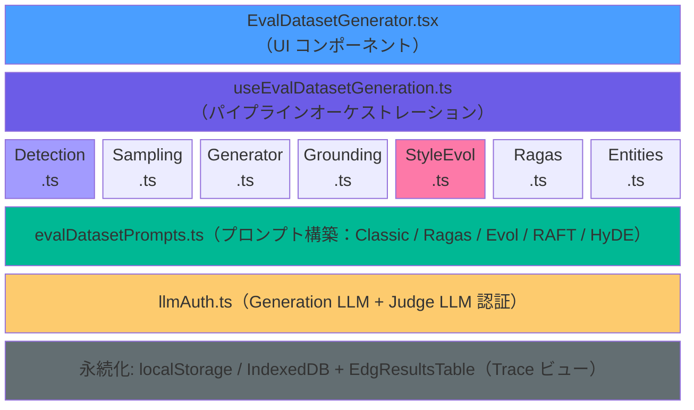

### モジュール一覧

| モジュール | 役割 |
|---|---|
| `evalDatasetSampling.ts` | Index Structure Detection + Adaptive Sampling（構造検出 → 最適サンプリング） |
| `evalDatasetGenerator.ts` | Azure OpenAI Chat Completions 呼び出し、JSON パース、表層重複排除、JSONL 変換、RAFT CoT 生成、HyDE 仮説生成 |
| `evalDatasetPrompts.ts` | Classic / Ragas / Evol-Instruct / RAFT / HyDE 各モードのシステム/ユーザープロンプト構築 |
| `evalDatasetGrounding.ts` | Round-trip Consistency フィルター、Hard Negative Mining、Distractor 取得 |
| `evalDatasetEmbeddings.ts` | Azure OpenAI Embeddings によるセマンティック重複排除 |
| `evalDatasetRagas.ts` | Ragas 4象限シナリオプランニングと Multi-hop ペアリング |
| `evalDatasetEntities.ts` | LLM ベースのエンティティ抽出（Entity-KG） |
| `evalDatasetStyleEvolution.ts` | Style Evolution（SNS モード）— 5 種の表層劣化 |

---

## Index Structure Detection + Adaptive Sampling

### なぜ適応的サンプリングが必要なのか

Azure AI Search のインデックスには大きく分けて**2つの構造パターン**があります。

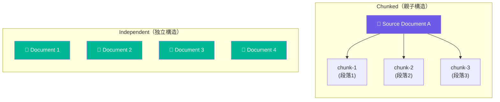

**Chunked インデックス**（RAG で最も一般的）では、1つのソースドキュメントが複数のチャンクに分割されてインデックスに格納されています。シンプルな `search=*&top=N` サンプリングでは、**同じソースドキュメントの異なるチャンクを重複サンプリングしてしまう**問題がありました。

**Independent インデックス**では各ドキュメントが独立した単位ですが、`search=*&top=N` は常にインデックスの先頭から N 件を返すため、**インデックス全体から均一にサンプリングできない**問題がありました。

### 検出アルゴリズム

Index Structure Detection は **LLM 呼び出し 0 回**で動作し、GET（スキーマ取得）+ POST（ファセットプローブ）の最大 2 API コールで完了します。

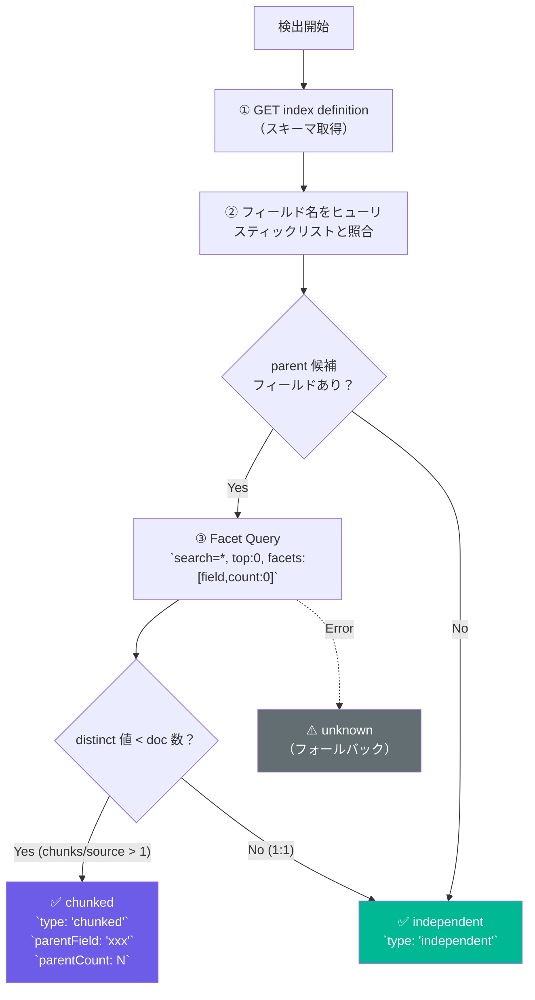

ヒューリスティックリスト（優先順位順）:

```typescript
const PARENT_FIELD_HEURISTICS: string[] = [
  'parent_id', 'parent_key', 'parentId', 'parentKey',
  'metadata_storage_path', 'metadata_storage_name',
  'source_url', 'source_uri', 'sourceUrl', 'source',
  'title', 'document_title', 'file_name', 'fileName',
]
```

検出結果は以下の型で返されます。

```typescript
interface IndexStructureInfo {
  type: 'chunked' | 'independent' | 'unknown'
  parentField?: string      // チャンクのグループ化に使用するフィールド
  parentCount?: number      // distinct なソース数
  documentCount: number     // インデックス内の総ドキュメント数
  reason: string            // UI ツールチップ表示用の検出根拠
}
```

### 3 つのサンプリング戦略

検出結果に基づき、`sampleDocsAdaptive()` が最適なサンプリング戦略を自動選択します。

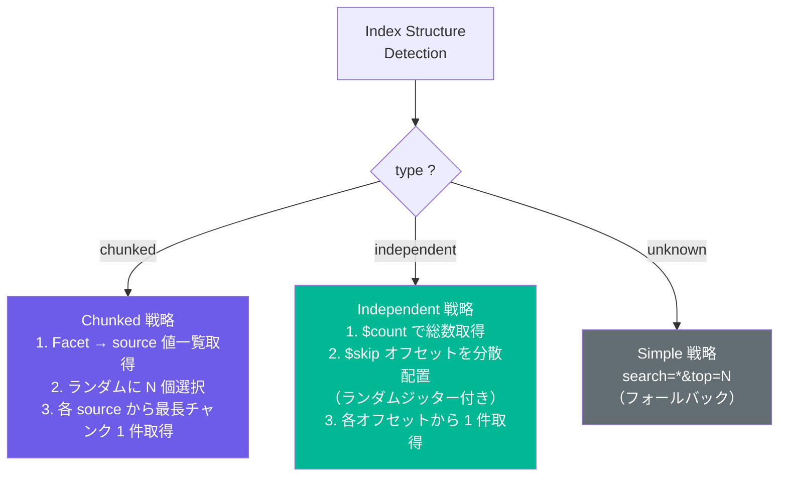

**Chunked 戦略の詳細**:

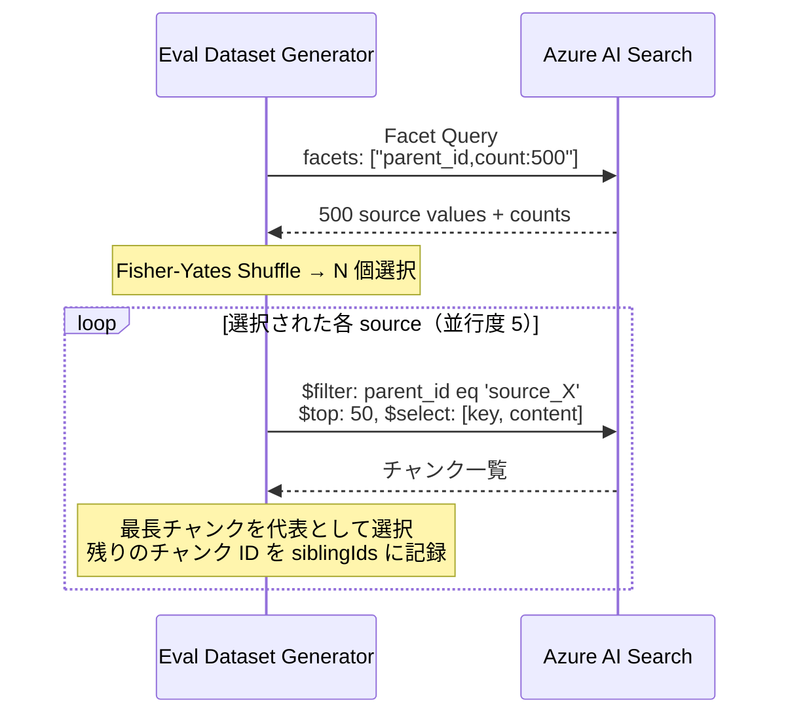

**最長チャンクを選ぶ理由**: 長いチャンクはより多くの情報を含み、LLM がより質の高いクエリを生成できます。短すぎるチャンク（ヘッダーのみ、目次のみ等）を避けることで、生成品質が安定します。

**Independent 戦略**: `$skip` オフセットを分散配置（stride = total / sampleSize）し、ランダムジッターを加えてインデックス全体から均一にサンプリングします。`$skip` は Azure AI Search の制限（100,000）にキャップされます。

### Sibling-Aware Grounding

Chunked インデックスでは、サンプリング時に各ドキュメントに `siblingIds`（同じ source に属する他のチャンク ID の配列）を付与します。Round-trip Consistency チェック時に候補 ID を兄弟チャンクまで拡張することで、「正解は同じソースの別チャンクに含まれている」ケースでの False Negative 棄却を防ぎます。

---

## 2つの生成モード：Classic と Ragas

### Classic モード

最もシンプルな生成モードです。インデックスから N 件のドキュメントをサンプリングし、各ドキュメントに対して Azure OpenAI で M 件のクエリを生成します。

```
ドキュメント D1 → クエリ Q1-1, Q1-2, ..., Q1-M
ドキュメント D2 → クエリ Q2-1, Q2-2, ..., Q2-M
  ...
ドキュメント DN → クエリ QN-1, QN-2, ..., QN-M
```

プロンプトは **InPars/Promptagator スタイル**を採用しています。ドキュメントのテキストを最大 4,000 文字でトランケートし、`response_format: { type: 'json_object' }` で Azure OpenAI に JSON 形式の出力を強制します。温度は `0.3` に設定し、多様性と一貫性のバランスを取っています。

### Ragas モード

[Ragas](https://docs.ragas.io/) の評価体系に着想を得た高度な生成モードです。クエリを**4象限**に分類し、直交軸として **Persona・Style・Length** を組み合わせることで、現実世界の多様なクエリ分布を模倣します。

```
                   Specific（事実検索）       Abstract（合成・比較）
                 ┌────────────────────┬────────────────────────────┐
  Single-Hop     │ single_specific    │ single_abstract            │
  （単一文書）    │ "X とは何ですか？"  │ "X はどう発展しましたか？"   │
                 ├────────────────────┼────────────────────────────┤
  Multi-Hop      │ multi_specific     │ multi_abstract             │
  （複数文書横断）│ "A と B の違いは？" │ "A, B, C の進化をまとめて" │
                 └────────────────────┴────────────────────────────┘
```

各象限への割当数は **Largest-Remainder 法**（最大剰余法）で決定します。これはユーザーが指定した百分率分布（デフォルト: `single_specific: 50%`, `single_abstract: 20%`, `multi_specific: 20%`, `multi_abstract: 10%`）を整数に変換する際に、端数の切り捨てで生じる誤差を最小化する手法です。

```typescript
// 概念的な実装
function distributionToCounts(distribution, totalQueries) {
  const exact = Object.entries(distribution).map(([k, pct]) => ({
    key: k, count: totalQueries * pct / 100
  }));
  // 1. floor で整数部分を割当て
  const floored = exact.map(e => ({ ...e, int: Math.floor(e.count) }));
  // 2. 残余を降順ソートし、1ずつ加算して合計を一致させる
  const remainder = totalQueries - sum(floored.map(e => e.int));
  const sorted = floored.sort((a, b) => frac(b.count) - frac(a.count));
  for (let i = 0; i < remainder; i++) sorted[i].int += 1;
  return sorted;
}
```

**Multi-hop ペアリング**では、ドキュメント間の **Token Jaccard 類似度**（NFKC 正規化 + Unicode 句読点分割）を計算し、一定の類似度範囲内（閾値〜0.95）にあるドキュメントペアを見つけます。Entity-KG を有効化した場合は、LLM で抽出した固有名詞のエンティティ集合間の Jaccard に置き換えることで、より意味的に適切なペアリングが可能になります。

**Same-source pair exclusion**: Adaptive Sampling でチャンクインデックスが検出された場合、`parentId` が同じドキュメント同士のペアリングは**自動的に除外**されます。同一ソース由来のチャンク 2 本で「cross-document question」を作っても評価として意味がないためです。

---

## GRADE パイプライン（13段階品質パイプライン）

Eval Dataset Generator の最大の特徴は、生成されたクエリに対して**13段階の品質パイプライン（GRADE）**を逐次適用する点です。各ステージはオプトインで有効化でき、任意の組み合わせで利用できます。

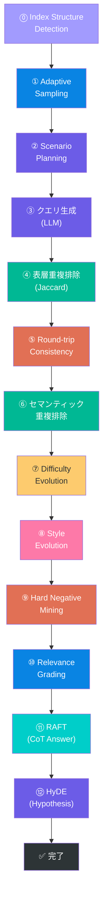

> **凡例**: 🟣 構造検出/生成 / 🔵 サンプリング/メタデータ付与 / 🟢 重複排除系 / 🔴 検索検証系 / 🟡 難化系 / 🩷 表層劣化系 / 🩵 拡張データセット生成

| # | ステップ | 何をするか | 引用技術名 | コスト源 | 必須/任意 |
|---|---|---|---|---|---|
| ⓪ | Index Structure Detection | スキーマ + facet でインデックス構造を自動判定 | — (独自) | Search REST ×2 | 任意（デフォルト ON） |
| ① | Document Sampling | 判定結果に応じた Adaptive Sampling で多様性を確保 | — (独自) | Search REST | 必須 |
| ② | Scenario Planning | 4象限 × Persona × Style × Length に割当て | Ragas, RAGEval | ローカル計算 | Ragas mode 時のみ |
| ③ | Query Generation | Azure OpenAI JSON mode でクエリ合成 | InPars, RAGEval | LLM（生成） | 必須 |
| ④ | Surface Dedup | Token Jaccard ≥ 0.85 を除外 | — (Jaccard) | ローカル計算 | 常時有効 |
| ⑤ | Round-trip Consistency | 再検索で expected_ids が top-k に入るか検証 | Promptagator | Search REST | 任意 |
| ⑥ | Semantic Dedup | Embedding cosine で意味重複を除外 | — (Embedding cosine) | Embeddings API | 任意 |
| ⑦ | Difficulty Evolution | Evol-Instruct 風に harder variant へ書き換え | Evol-Instruct | LLM（Judge） | 任意 |
| ⑧ | Style Evolution (SNS) | 実ユーザー風の表層崩しを適用 | — (独自) | LLM（Judge） | 任意 |
| ⑨ | Hard Negative Mining | top-k の非正解 doc id を hard_negative_ids に格納 | DPR | Search REST | 任意 |
| ⑩ | Relevance Grading | NDCG/XDCG 互換の relevance_grades を付与 | TREC / NDCG | ローカル計算 | 任意 |
| ⑪ | RAFT mode | oracle + distractor で CoT 回答を生成 | RAFT | LLM（Judge）+ Search REST | 任意 |
| ⑫ | HyDE mode | 仮想回答 passage をベクトル検索入力用に生成 | HyDE | LLM（Judge） | 任意 |

### Stage ③: Query Generation — Content Filter リトライ

Azure OpenAI の Content Filter が 400 で発火した場合、現行コードは最大 3 回まで自動リトライします。リトライごとに `temperature` を段階的に引き上げ、異なる生成パターンを試行することで Content Filter の発火を回避できる可能性を高めます。

```text
attempt 0: temperature = 0.30
attempt 1: temperature = 0.45  (delay: 1s)
attempt 2: temperature = 0.60  (delay: 2s)
attempt 3: temperature = 0.75  (delay: 3s)
```

3 回超過しても解消しなければ例外として伝搬しますが、パイプライン全体は当該ドキュメントをスキップして次へ進みます。

### Stage ④: Surface Dedup（表層重複排除）

生成されたクエリ間の**トークンレベル Jaccard 類似度**を計算し、閾値 0.85 以上の重複を除去します。

```
Jaccard(A, B) = |A ∩ B| / |A ∪ B|
```

テキストは NFKC 正規化後に Unicode の句読点で分割してトークン化します。Greedy Forward Scan アルゴリズムにより、先着のクエリを優先して保持します。

### Stage ⑤: Round-trip Consistency（Promptagator + Sibling-Aware）

[Dai et al., ICLR 2023](https://arxiv.org/abs/2209.11755) の Promptagator 手法に着想を得たフィルターです。生成されたクエリで**実際のインデックスを再検索**し、元のソースドキュメントが top-k 結果に含まれるかを検証します。

Chunked インデックスの場合は、候補 ID を `siblingIds` まで拡張し、同じソースの兄弟チャンクが検索結果に含まれていれば grounded と判定します。Multi-hop クエリの場合は、`expected_ids` のいずれかが top-k 内にあれば grounded と判定します。

```
クエリ "Azure のセマンティック検索とは？"
  → search API で再検索
  → source doc (+ siblings) が top-10 に含まれる？
    → Yes: grounding_rank = 3 (grounded)
    → No:  rejected = true, rejection_reason = 'grounding'
```

### Stage ⑥: Semantic Dedup（セマンティック重複排除）

Stage ④ の Jaccard では検出できない**パラフレーズ重複**を排除するために、Azure OpenAI Embeddings API でクエリをベクトル化し、**コサイン類似度**で重複を検出します。

```
cosine(a, b) = dot(a, b) / (‖a‖ · ‖b‖)
```

バッチサイズ 16 で Embeddings API を呼び出し、閾値（デフォルト 0.92）以上のペアを重複として除去します。

### Stage ⑦: Difficulty Evolution（Evol-Instruct）

[WizardLM の Evol-Instruct](https://arxiv.org/abs/2304.12244) 手法に基づき、生成済みのクエリを LLM で**より難しいバリアント**に書き換えます。具体的には、パラフレーズ・否定表現・集約・一段階の抽象化・同義語置換といった戦略を適用します。

```
easy: "Azure AI Search のセマンティックランカーとは？"
  ↓ Evol-Instruct LLM rewrite
hard: "セマンティックランカーを無効化した場合、ハイブリッド検索の精度にどのような影響があるか？"
```

書き換えに失敗した場合は元のクエリ（`difficulty: 'easy'`）をそのまま保持する**グレースフルデグレード**設計です。

### Stage ⑨: Hard Negative Mining（DPR スタイル）

[DPR（Dense Passage Retrieval）](https://arxiv.org/abs/2004.04906)の対比学習から着想を得ています。各クエリで top-k 検索を実行し、`expected_ids` に**含まれない**上位 k 件を `hard_negative_ids` として記録します。

```json
{
  "query": "ベクトル検索の設定方法",
  "expected_ids": ["doc-020"],
  "hard_negative_ids": ["doc-055", "doc-033"]
}
```

### Stage ⑩: Relevance Grading（NDCG 互換）

各ドキュメントに**段階的な関連度スコア**を自動付与します。このステージは LLM を使わず、**ローカル計算のみ**で実行されます。

| ドキュメント | スコア | 説明 |
|---|---|---|
| `source_doc_id`（Primary Anchor） | 3 | 最も関連度が高い |
| 残りの `expected_ids`（Secondary） | 2 | 副次的に関連 |
| `hard_negative_ids` | 0 | 関連性なし |

このスコアは **NDCG（Normalized Discounted Cumulative Gain）** および **XDCG** で直接利用可能な形式であり、Azure AI Foundry の Document Retrieval Evaluator や TREC 系の評価器にそのまま入力できます。

### Domain Schema 注入（RAGEval）

オプションとして、ドメイン固有の**エンティティ・関係・制約**をプロンプトに注入できます。これにより、生成されるクエリの事実性とスキーマ整合性が向上します。

```typescript
interface DomainSchema {
  entities?: string    // 例: "Azure AI Search, セマンティックランカー, HNSW"
  relations?: string   // 例: "セマンティックランカーはハイブリッド検索を強化する"
  constraints?: string // 例: "API バージョンは 2024-07-01 以降が必要"
}
```

---

## Style Evolution（SNS モード）

### なぜクエリの表層劣化が必要なのか

LLM が生成するクエリは**文法的に完璧で、語彙が整いすぎている**という根本的な問題があります。現実のユーザーは以下のような「乱雑な」クエリを入力します。

| 実ユーザーの検索 | LLM が生成する検索 |
|---|---|
| `azure 検索 ベクトル 設定` | `Azure AI Search でベクトル検索を設定する方法は？` |
| `セマンティックランカーってなに` | `セマンティックランカーの機能と用途を説明してください` |
| `hnsw パラメタ efSearch` | `HNSW アルゴリズムの efSearch パラメータの最適値はいくつですか？` |
| `AI serch hybrit search` | `Azure AI Search でハイブリッド検索を実行するにはどうすればよいですか？` |

検索エンジンが**整形されたクエリでしか評価されない**と、実トラフィックでの品質劣化を見逃すリスクがあります。Style Evolution は、品質パイプラインの Stage ⑧ で LLM 生成クエリを**意図的に「劣化」**させ、実ユーザーの表層パターンを再現します。

### 5 種類の劣化パターン

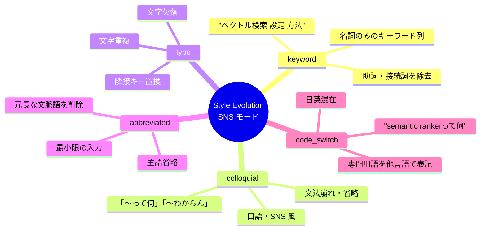

| Kind | 説明 | 入力例 | 出力例 |
|---|---|---|---|
| `keyword` | 助詞・接続詞を除去してキーワード列に | `ベクトル検索の設定方法は？` | `ベクトル検索 設定 方法` |
| `colloquial` | SNS・口語形式に変換 | `セマンティック検索とは何ですか？` | `セマンティック検索ってなに` |
| `typo` | 1〜2 箇所のリアルなタイポを挿入 | `hybrid search configuration` | `hybrit search configration` |
| `abbreviated` | 主語・文脈語を省略して最小化 | `Azure AI Search でフィルターを使う方法` | `フィルター 使い方` |
| `code_switch` | 日英をミックスした表現に | `HNSW のパラメータ設定` | `HNSW parameter設定` |

### 実装アーキテクチャ

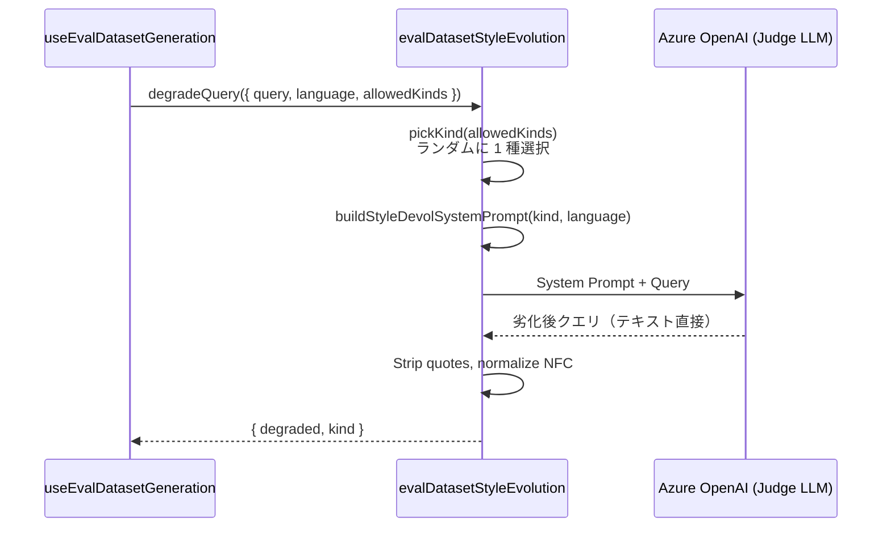

**設計上のポイント**:

- **JSON mode を使わない**: 出力は純テキスト（`jsonMode: false`）。JSON ラッパーを要求すると表層劣化の「自然さ」が失われるため
- **Judge LLM を使用**: 生成 LLM とは別のデプロイメントで実行可能（コスト/品質分離）
- **ランダム選択**: `allowedKinds` 配列からランダムに 1 種を選択。空の場合は全 5 種から均等サンプリング
- **グレースフルデグレード**: 劣化結果が元クエリと NFC 正規化後に同一の場合、`style_evolution_kind` は記録されない

---

## RAFT データセット生成

### RAFT とは何か

**論文**: Zhang, T. et al., *"RAFT: Adapting Language Model to Domain Specific RAG"*, 2024 (arXiv:2403.10131)

RAFT は、RAG システムにおいて**ドメイン固有の正確な回答を生成できるように LLM をファインチューニング**するための訓練データ形式です。核となるアイデアは、LLM に「正解の文書（Oracle）」と「紛らわしいが不正解な文書（Distractor）」を同時に提示し、**正解文書を自ら見つけ出して引用しながら回答する能力**を学習させることです。

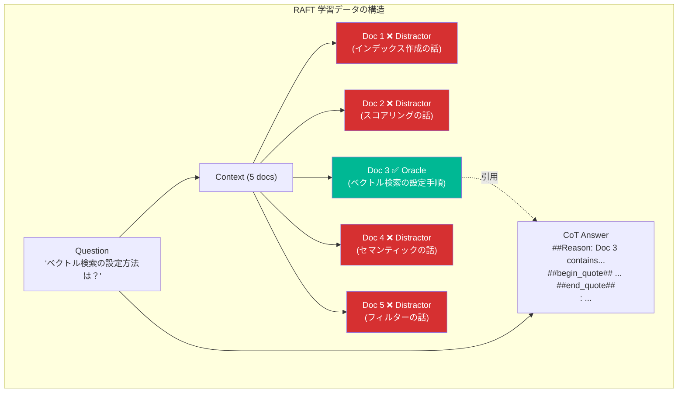

### Chain-of-Thought 回答生成

RAFT モードでは、以下のプロンプト設計で CoT 回答を生成します。

**システムプロンプトの要件**:
- 複数のドキュメントを受け取り、1つだけがオラクル（正解）
- ステップバイステップの推論を提示
- 引用部分を `##begin_quote##` / `##end_quote##` で囲む
- 最終回答は `<ANSWER>:` プレフィックス付き
- ディストラクターの情報を根拠にしてはいけない

**重要な設計判断**: Oracle ドキュメントは Distractor の中に **Fisher-Yates Shuffle** でランダムに配置されます。これにより、モデルが「常に N 番目の文書が正解」という位置バイアスを学習することを防ぎます。

### Oracle + Distractor コンテキスト構築

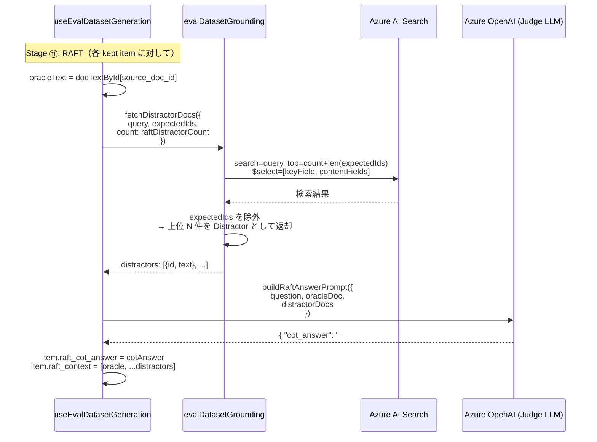

**Distractor の選定基準**: クエリで実際の検索を実行し、`expected_ids` に含まれない上位結果を Distractor として使います。これは Hard Negative Mining と同じ原理 — 「検索エンジンが返しやすいが正解ではない文書」こそが、最も有効な Distractor です。

**トランケーション戦略**: 各ドキュメントのテキストは `MAX_CHUNK_CHARS / (1 + distractorCount)` で均等にバジェットを割り当て、コンテキストウィンドウ内に収まるようにします。

### RAFT JSONL 出力スキーマ

```json
{
  "question": "ベクトル検索の設定方法は？",
  "context": [
    { "doc_id": "doc-020", "text": "ベクトル検索を設定するには...", "oracle": true },
    { "doc_id": "doc-055", "text": "スコアリングプロファイルは...", "oracle": false },
    { "doc_id": "doc-033", "text": "インデックス作成時に...", "oracle": false },
    { "doc_id": "doc-041", "text": "セマンティック構成の...", "oracle": false },
    { "doc_id": "doc-072", "text": "フィルター式の構文...", "oracle": false }
  ],
  "cot_answer": "##Reason: The question asks about vector search configuration. Looking at the documents, Document 1 (doc-020) contains the relevant setup instructions. ##begin_quote## ベクトル検索を設定するには... ##end_quote## <ANSWER>: ベクトル検索を設定するには、vectorSearch セクションで algorithms と profiles を定義し...",
  "expected_ids": ["doc-020"],
  "query_type": "how-to",
  "language": "ja",
  "source_doc_id": "doc-020",
  "generation_model": "gpt-5.4-mini",
  "provenance": "synthetic",
  "generated_at": "2026-04-27T14:00:00.000Z",
  "generated_against_index": "my-rag-index",
  "generation_run_id": "edg-abc-456"
}
```

---

## HyDE 仮説パッセージ生成

### HyDE の理論的背景

**論文**: Gao, L. et al., *"Precise Zero-Shot Dense Retrieval without Relevance Labels (HyDE)"*, ACL 2023

従来のベクトル検索では、ユーザーのクエリをそのまま埋め込みベクトルに変換して検索します。しかし、クエリ（短い質問文）とドキュメント（長い説明文）は**埋め込み空間上で異なる分布**に位置するため、類似度が低くなることがあります。

HyDE は、クエリに対する「**仮想的な回答文書**」を LLM で生成し、その仮説パッセージを埋め込みベクトルに変換して検索する手法です。仮説パッセージはドキュメントと同じ形式・語彙を持つため、ベクトル空間上でのアライメントが改善されます。

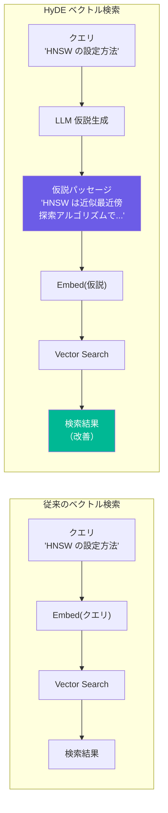

### 仮説パッセージ生成

パイプラインの最終段階（Stage ⑫）で各 kept アイテムに対して仮説パッセージを生成します。

**プロンプト設計**:
- 100〜200 語程度の自然な文章を生成
- 具体的で情報豊富な内容
- ベクトル検索でマッチしやすい表現を使用
- JSON mode: `{ "hypothesis": string }`

生成された仮説パッセージは以下のフィールドに格納されます。

```json
{
  "query": "HNSW のパラメータ設定方法",
  "hyde_hypothesis": "HNSW (Hierarchical Navigable Small World) は Azure AI Search で使用される近似最近傍探索アルゴリズムです。主要なパラメータには m (各ノードの最大接続数、推奨値4-10)、efConstruction (構築時の探索幅、推奨値400-1000)、efSearch (検索時の探索幅、推奨値500-1000) があります...",
  "hyde_model": "gpt-5.4",
  "hyde_generated_at": "2026-04-27T16:00:00.000Z"
}
```

### AutoTuning との統合

生成された HyDE 仮説パッセージは、Search Parameter AutoTuning の**評価実行時**に活用されます。AutoTuning に新たに追加された **HyDE Eval モード** では、以下の 2 つの適用戦略を選択できます。

| 適用モード | 動作 | 推奨シーン |
|---|---|---|
| `vectorTextOnly` | 仮説パッセージを `vectorText` として使用、`search` は元クエリのまま | ハイブリッド検索の評価 |
| `replaceQueryAndVectorText` | 仮説パッセージで `search` と `vectorText` の両方を置換 | 純粋なベクトル検索の評価 |

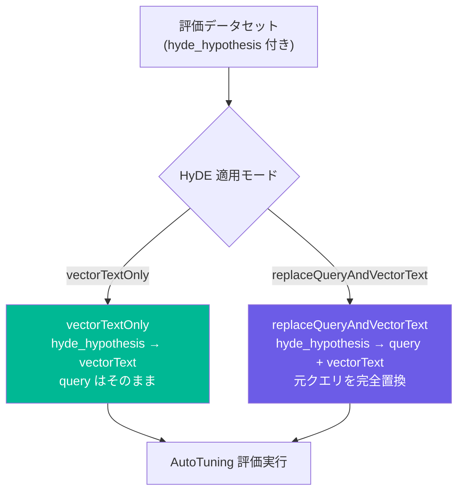

これにより、「HyDE を使った場合と使わない場合で Recall@k がどう変わるか」を AutoTuning で自動的に A/B 比較できます。

---

## Judge LLM と Eval Tracing

### Judge LLM — 品質フィルター専用デプロイメント

**生成用 LLM** と**品質フィルター用 LLM（Judge LLM）** を分離するオプションです。

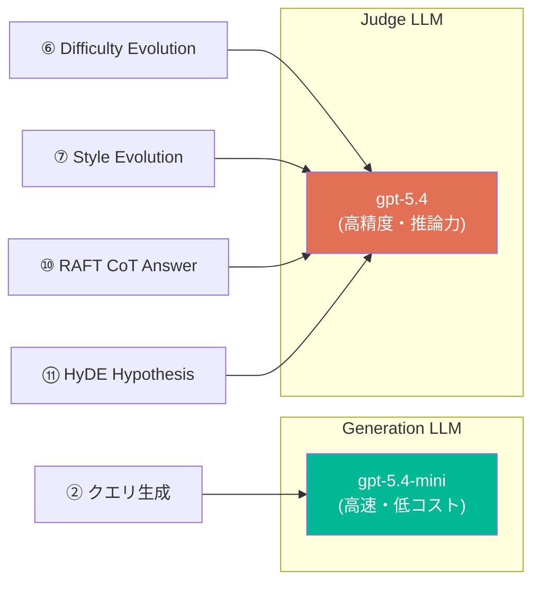

| 設定 | 用途 | 推奨モデル |
|---|---|---|
| `llmDeployment` | クエリ生成（Stage ②） | gpt-5.4-mini（高速・低コスト） |
| `judgeLlmDeployment` | 品質フィルター・難化・RAFT・HyDE（Stage ⑥⑦⑩⑪） | gpt-5.4（高精度） |

**分離のメリット**:
- **コスト最適化**: 大量生成には廉価なモデル、品質評価には高精度モデルを使い分け
- **レートリミット分散**: 2 つのデプロイメントに負荷を分散
- **品質向上**: 難化や CoT 回答生成は推論力の高いモデルの方が質が良い

`judgeLlmDeployment` が未設定の場合は `llmDeployment` にフォールバックするため、完全な後方互換性を維持しています。

### Eval Tracing — クエリ変換トレース

`enableTrace: true` を設定すると、各クエリアイテムがパイプラインの**各ステップでどのように変換（または棄却）されたか**をイベントログとして記録します。

```typescript
interface TraceEvent {
  step: number       // 1-based パイプラインステップ番号
  phase: 'generation' | 'surface-dedup' | 'grounding' | 'semantic-dedup' 
       | 'difficulty' | 'style-evolution' | 'hardneg' | 'relevance'
  action: 'created' | 'kept' | 'rejected' | 'modified' | 'enriched'
  timestamp: string  // ISO 8601
  detail?: {
    before?: string              // 変更前のクエリテキスト
    after?: string               // 変更後のクエリテキスト
    reason?: string              // 棄却理由 or アクション理由
    score?: number               // Jaccard / cosine / grounding rank
    styleKind?: StyleEvolutionKind  // Style Evolution で適用された種別
  }
}
```

**ライフサイクル可視化の例**:

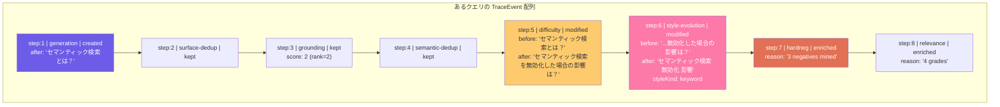
#### Query Transformation Trace Result


トレースの活用シーン:
- **パイプラインのデバッグ**: 特定のクエリがどのステップで棄却されたか即座に特定
- **品質フィルターの効果測定**: 各ステージの reject 率や modification 率を集計
- **再現性の確保**: 同一設定での再実行時にトレースを比較し、LLM の非決定性の影響を把握
- **JSONL エクスポート**: `trace` フィールドが JSONL に含まれるため、下流の分析パイプラインでも利用可能

---

## JSONL 出力スキーマ

生成されるデータセットは以下の JSONL 形式です。`rejected` なアイテムはエクスポート時に自動的にフィルタリングされます。

```json
{
  "query": "Azure AI Search のセマンティックランカーは何のために使うのか？",
  "expected_ids": ["doc-123"],
  "query_type": "factoid",
  "language": "ja",
  "source_doc_id": "doc-123",
  "generation_model": "gpt-5.4-mini",
  "provenance": "synthetic",
  "generated_at": "2026-04-21T10:00:00.000Z",
  "generated_against_index": "my-index",
  "generation_run_id": "edg-abc-123",
  "grounding_rank": 1,
  "grounding_top_k": 10,
  "query_shape": "single_specific",
  "persona": "developer",
  "style": "web_search",
  "length": "short",
  "difficulty": "hard",
  "style_evolution_kind": "keyword",
  "hard_negative_ids": ["doc-456", "doc-789"],
  "relevance_grades": { "doc-123": 3, "doc-456": 0, "doc-789": 0 },
  "hyde_hypothesis": "セマンティックランカーは Azure AI Search の機能で...",
  "hyde_model": "gpt-5.4",
  "hyde_generated_at": "2026-04-21T10:05:00.000Z",
  "trace": [
    { "step": 1, "phase": "generation", "action": "created", "timestamp": "...", "detail": { "after": "..." } },
    { "step": 6, "phase": "style-evolution", "action": "modified", "timestamp": "...", "detail": { "styleKind": "keyword" } }
  ]
}
```

### 3 つのエクスポート形式

| 形式 | 用途 | エクスポート関数 |
|---|---|---|
| AutoTuning 互換 JSONL | 検索パラメータ最適化 | `toJsonl()` |
| RAFT JSONL | LLM ファインチューニング | `toRaftJsonl()` |
| HyDE 付き JSONL | ベクトル検索 A/B 評価 | `toJsonl()`（`hyde_*` フィールド含む） |

---

## 並行制御とキャンセル

パイプライン全体は `useEvalDatasetGeneration` React Hook で管理されます。

- **並行度制御**: 生成・難化・Style Evolution・RAFT・HyDE は `CONCURRENCY=3`、Grounding・Hard Negative Mining は `GROUNDING_CONCURRENCY=4` で並行実行
- **ワーカーパターン**: 共有カーソル + 非同期ワーカープールの Producer-Consumer パターンを採用。`cursor++` で次タスクを取得し、`Promise.all(workers)` で全ワーカーの完了を待機
- **キャンセル**: `AbortController` ベース。`cancel()` 呼び出しで `controller.abort()` が発火し、全 fetch リクエストとワーカーが `AbortError` で即座に停止
- **プログレス**: `EdgPhase` 型で各フェーズの進捗をリアルタイム表示

```typescript
type EdgPhase =
  | 'idle'
  | 'detecting'    // ⓪ Index Structure Detection
  | 'sampling'     // ① Adaptive Sampling
  | 'generating'   // ③ Query Generation
  | 'grounding'    // ⑤ Round-trip Consistency
  | 'embedding'    // ⑥ Semantic Dedup
  | 'difficulty'   // ⑦ Difficulty Evolution
  | 'styleevol'    // ⑧ Style Evolution
  | 'hardneg'      // ⑨ Hard Negative Mining
  | 'raft'         // ⑪ RAFT
  | 'hyde'         // ⑫ HyDE
  | 'done'
```

- **認証エラー**: HTTP 401/403 は `LlmAuthError` として即座にパイプライン全体を停止（レートリミットなどの一時的なエラーとは区別）

---

## 永続化レイヤー

| レイヤー | ストレージ | キー | 内容 |
|---|---|---|---|
| データセット | `localStorage` | `ragops.evalDatasets.v1` | 生成済みデータセットの CRUD 操作（id, title, updatedAt, indexName, itemCount, items[]） |
| フォーム設定 | IndexedDB | `AppSettings.evalDatasetFormJson` | 全フォームフィールドの自動保存（300ms debounce）。API Key や Bearer Token を含む |

フォーム設定は IndexedDB に保存されるため、ブラウザを閉じても設定が保持されます。レガシーの `localStorage` からの自動移行にも対応しています。

---

## 工学的基盤：採用した先行研究と手法の解説

Eval Dataset Generator は「プロンプトを 1 本書いて LLM に投げるだけ」の単純な実装ではなく、**情報検索（IR）と自然言語処理（NLP）の最新研究で学術的に有効性が報告された手法**を工学的に組み合わせて設計されています。

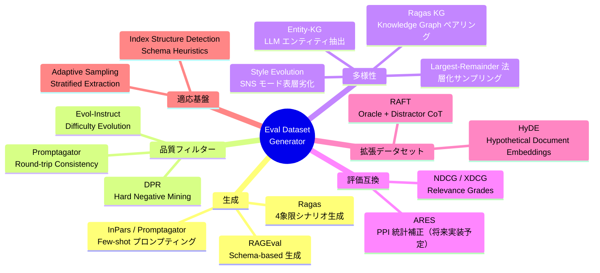

### InPars / Promptagator — Few-shot によるクエリ生成

**論文**: Bonifacio et al., *"InPars: Data Augmentation for Information Retrieval using Large Language Models"*, SIGIR 2022 / Dai et al., *"Promptagator: Few-shot Dense Retrieval From 8 Examples"*, ICLR 2023

**課題**: IR モデルの学習には大量の「クエリ ↔ 関連ドキュメント」ペアが必要ですが、人手で作るのは高コストです。

**解決策**: LLM にドキュメントを見せて「このドキュメントに対してユーザーが検索しそうなクエリ」を生成させます。InPars の研究では、few-shot 例を加えることで**生成クエリの検索適合率が 20〜40% 向上**することが示されています。

**GRADE での適用**: Stage ③ Query Generation（Few-shot プロンプティング）および Stage ⑤ Round-trip Consistency Filter。詳細は各ステージの説明を参照してください。

### Ragas — 4象限シナリオによるクエリ多様性

**出典**: [Ragas Testset Generation](https://docs.ragas.io/en/stable/concepts/test_data_generation/rag/)

クエリを **Specific ↔ Abstract** × **Single-Hop ↔ Multi-Hop** の 4 象限に分類し、Persona / Style / Length の直交軸を掛け合わせることで、現実世界のクエリ分布を模倣します。

**GRADE での適用**: Stage ② Scenario Planning。詳細は「2つの生成モード：Classic と Ragas」セクションを参照してください。

### Evol-Instruct — クエリの難化

**論文**: Xu et al., *"WizardLM: Empowering Large Language Models to Follow Complex Instructions"*, arXiv:2304.12244, 2023

パラフレーズ・否定表現・集約・抽象化の戦略でクエリを難化します。難化は元ドキュメントで回答可能な範囲に制約され、失敗時は元のクエリを保持するグレースフルデグレード設計です。

**GRADE での適用**: Stage ⑦ Difficulty Evolution。詳細は該当ステージの説明を参照してください。

### DPR — Hard Negative Mining

**論文**: Karpukhin et al., *"Dense Passage Retrieval for Open-Domain Question Answering"*, EMNLP 2020

DPR の対比学習から着想を得て、クエリの top-k 検索結果のうち `expected_ids` に含まれないドキュメントを Hard Negative として記録します。Hard Negative を評価データセットに含めることで、NDCG などのランキング評価指標がより鋭敏になります。

**GRADE での適用**: Stage ⑨ Hard Negative Mining。詳細は該当ステージの説明を参照してください。

### RAGEval — Domain Schema による生成品質向上

**論文**: Zhu et al., *"RAGEval: Scenario Specific RAG Evaluation Dataset Generation Framework"*, 2024 (arXiv:2408.01262)

ドメインの**エンティティ・関係・制約**を構造化したスキーマをプロンプトに注入することで、生成されるクエリの事実性とスキーマ整合性を向上させます。

### Entity-KG — 軽量ナレッジグラフによる Multi-hop ペアリング

**出典**: Ragas Knowledge Graph + RAGOps Studio 独自実装

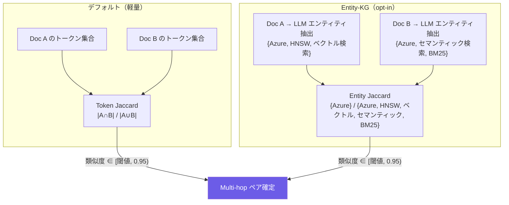

### ARES / PPI — 統計的バイアス補正（未実装・設計参考）

**論文**: Saad-Falcon et al., *"ARES: An Automated Evaluation Framework for RAG Systems"*, NAACL 2024

> **注**: 本機能は現行バージョンでは未実装です。将来の拡張として設計上の参考文献に含めています。

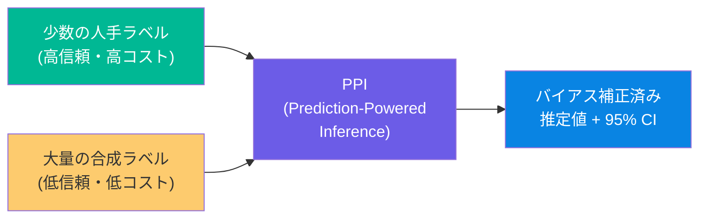

### 手法の全体マップ

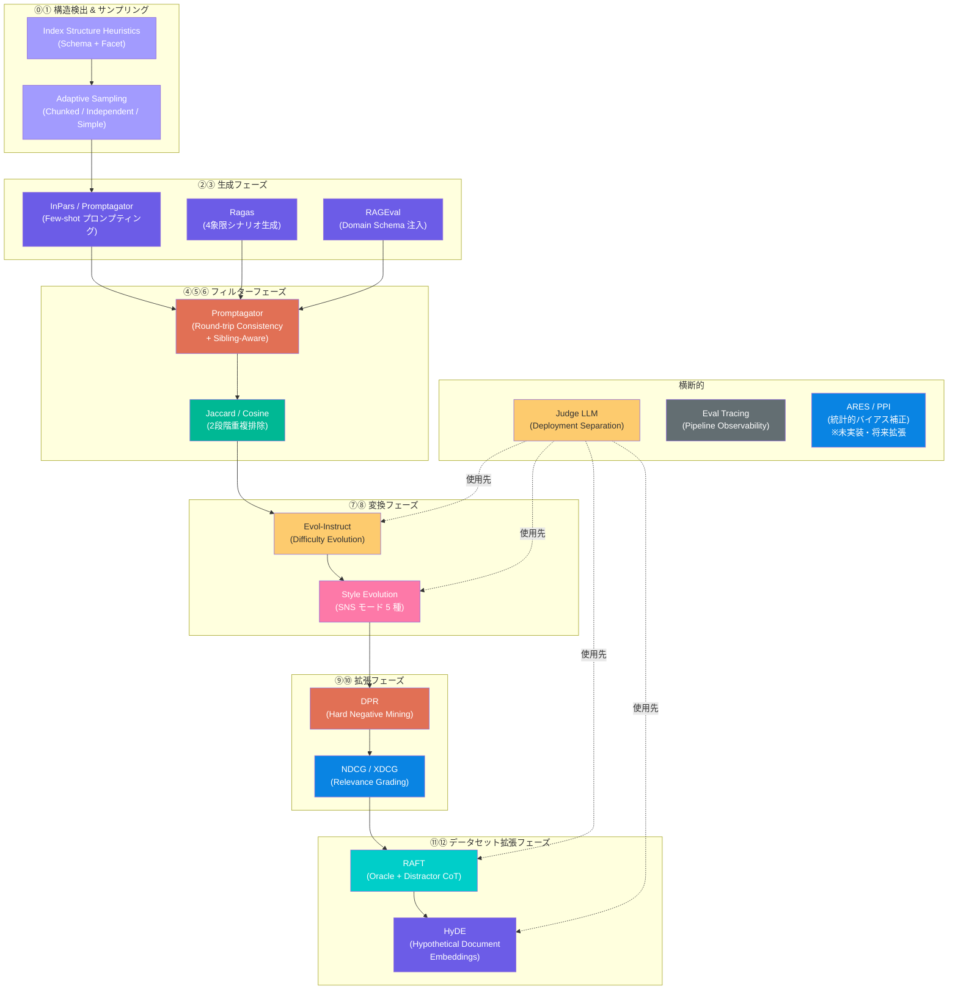

---

## 合成評価データセットの限界と緩和策

合成評価データセットは強力なツールですが、**無批判に使うと「自作自演評価」に陥る**リスクがあります。

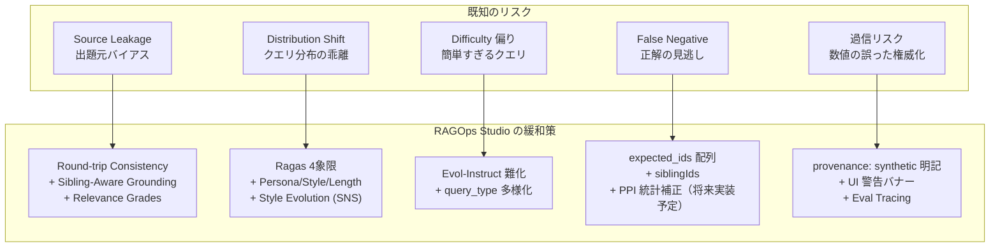

| リスク | 内容 | 緩和策 |
|---|---|---|
| **Source Leakage** | チャンクからクエリを生成 → そのチャンクが検索に引っかかれば正解、という循環 | Round-trip Consistency + Sibling-Aware Grounding + `relevance_grades` で段階的評価 |
| **Distribution Shift** | LLM のクエリは語彙・構文が整いすぎて、実ユーザーの曖昧・口語・誤字混じりのクエリを再現しない | Ragas 4象限 × Persona × Style × Length + **Style Evolution（SNS モード）** で実トラフィックを再現 |
| **Difficulty 偏り** | factoid 型の簡単なクエリばかり量産される | Evol-Instruct による難化、4 種の `query_type` 強制分散、multi-hop 横断クエリ生成 |
| **False Negative** | 生成元チャンク以外のドキュメントでも正答可能なケースを誤って不正解と判定する | `expected_ids` を配列設計 + `siblingIds` 拡張 + PPI で人手ラベルとの統計的結合（将来実装予定） |
| **過信リスク** | 合成データのスコアを「本番品質」として意思決定に使ってしまう | `provenance: 'synthetic'` + UI 警告バナー + **Eval Tracing** で判断根拠を透明化 |

> **⚠️ 重要**: 合成評価データセットは、パラメータの A/B 比較や回帰検知には非常に有効ですが、**本番環境の絶対的な品質スコアの代替にはなりません**。本番品質の正確な測定には、少数でも人手でレビューした正解データとの併用を推奨します。

---

## 実運用での使い方

現行実装に合わせるなら、次の順で使うのが安全です。

```text
1. まずは少量サンプル（10件）で生成する
2. Grounding と Trace を ON にして挙動を見る
3. 実データに近づけたいなら SNS mode を追加する
4. 重複が多いなら Semantic Dedup を有効にする
5. 学習再利用まで見据えるなら Hard Negative と relevance_grades を ON にする
6. RAFT と HyDE は評価品質の確認後に追加する
```

このツールは**本番品質の絶対スコアを出す装置**ではなく、**構成比較、回帰検知、初期データ整備を高速化する装置**として使うのが正しい位置づけです。

### Save / Load / AutoTuning 連携

| 機能 | 説明 |
|---|---|
| **Save / Load** | 生成したデータセットを `ragops.evalDatasets.v1` キーで localStorage に保存。あとで同じデータセットを UI から再ロード可能 |
| **Send to AutoTuning** | ダウンロードと再アップロードを挟まずに AutoTuning へ直接渡せる |
| **RAFT / HyDE エクスポート** | 通常の評価 JSONL に加えて、fine-tuning 用データや HyDE vectorText 用素材も同時に出力 |

### コーパスドリフトへの注意

インデックスが更新された後の合成データセットはすぐ古くなります。`generated_against_index` と `generated_at` フィールドを確認し、インデックス更新後はデータセットの再生成を検討してください。

---

## 参考文献

| # | 論文 / プロジェクト | 年 | 会議 | 本機能での活用 |
|---|---|---|---|---|
| 1 | Bonifacio, L. et al. **InPars: Data Augmentation for Information Retrieval using Large Language Models** | 2022 | SIGIR | Few-shot プロンプティングによるクエリ生成 |
| 2 | Dai, Z. et al. **Promptagator: Few-shot Dense Retrieval From 8 Examples** | 2023 | ICLR | Round-trip Consistency Filter |
| 3 | Xu, C. et al. **WizardLM: Empowering Large Language Models to Follow Complex Instructions (Evol-Instruct)** | 2023 | arXiv:2304.12244 | Difficulty Evolution（クエリ難化） |
| 4 | Karpukhin, V. et al. **Dense Passage Retrieval for Open-Domain Question Answering (DPR)** | 2020 | EMNLP | Hard Negative Mining |
| 5 | Zhu, K. et al. **RAGEval: Scenario Specific RAG Evaluation Dataset Generation Framework** | 2024 | arXiv:2408.01262 | Domain Schema 注入 |
| 6 | Saad-Falcon, J. et al. **ARES: An Automated Evaluation Framework for RAG Systems** | 2024 | NAACL | PPI 統計的バイアス補正（設計参考・未実装） |
| 7 | Gao, L. et al. **Precise Zero-Shot Dense Retrieval without Relevance Labels (HyDE)** | 2023 | ACL | HyDE 仮説パッセージ生成 + AutoTuning 統合 |
| 8 | Zhang, T. et al. **RAFT: Adapting Language Model to Domain Specific RAG** | 2024 | arXiv:2403.10131 | RAFT データセット生成（Oracle + Distractor CoT） |
| 9 | Wei, J. et al. **Chain-of-Thought Prompting Elicits Reasoning in Large Language Models** | 2022 | NeurIPS | RAFT の CoT 回答形式の基盤 |
| 10 | **Ragas Testset Generation** | 2024- | OSS | 4象限タクソノミー、Persona/Style/Length |
| 11 | **Azure AI Foundry RAG Evaluators** | 2024- | Microsoft Learn | NDCG / XDCG 互換 `relevance_grades` |
| 12 | **Azure AI Search Indexer: Document Chunking** | 2024- | Microsoft Learn | Index Structure Detection のヒューリスティック設計 |
