# Eval Dataset Generator — Automatic Evaluation Dataset Generation with LLM

> **GRADE** (**G**rounded **R**AG **A**ssessment **D**ataset **E**ngine)

Automatically generates evaluation datasets from real documents in your Azure AI Search index using Azure OpenAI. The generated datasets are in **Search Parameter AutoTuning**-compatible JSONL format, enabling an end-to-end workflow from generation to parameter optimization. Additionally, **RAFT (LLM fine-tuning)** datasets and **HyDE (vector search evaluation)** hypothesis passages can be produced from the same pipeline.

---

## Table of Contents

- [Why Evaluation Datasets Matter](#why-evaluation-datasets-matter)
- [Why GRADE — Three Fundamental Flaws of Synthetic Query Generation](#why-grade--three-fundamental-flaws-of-synthetic-query-generation)
- [Architecture Overview](#architecture-overview)
- [Index Structure Detection + Adaptive Sampling](#index-structure-detection--adaptive-sampling)
- [Two Generation Modes: Classic and Ragas](#two-generation-modes-classic-and-ragas)
- [GRADE Pipeline (13-Stage Quality Pipeline)](#grade-pipeline-13-stage-quality-pipeline)
- [Style Evolution (SNS Mode)](#style-evolution-sns-mode)
- [RAFT Dataset Generation](#raft-dataset-generation)
- [HyDE Hypothesis Passage Generation](#hyde-hypothesis-passage-generation)
- [Judge LLM and Eval Tracing](#judge-llm-and-eval-tracing)
- [JSONL Output Schema](#jsonl-output-schema)
- [Concurrency Control and Cancellation](#concurrency-control-and-cancellation)
- [Persistence Layer](#persistence-layer)
- [Engineering Foundation: Prior Research and Techniques](#engineering-foundation-prior-research-and-techniques)
- [Limitations and Mitigations of Synthetic Evaluation Datasets](#limitations-and-mitigations-of-synthetic-evaluation-datasets)
- [Usage in Practice](#usage-in-practice)
- [References](#references)

---

## Why Evaluation Datasets Matter

To quantitatively evaluate the retrieval quality of a RAG system, an **evaluation dataset** that defines "which documents should be returned for which queries" is essential. However, manually creating such datasets is extremely costly and impractical when the document corpus spans thousands to tens of thousands of items.

Eval Dataset Generator automatically generates evaluation datasets from **real documents** in your Azure AI Search index using Azure OpenAI. It is not simply a "send text to LLM and get queries back" feature — it is a **multi-stage pipeline that includes post-generation quality filtering, difficulty evolution, real-traffic approximation, training data augmentation, and evaluation metadata annotation**.

---

## Why GRADE — Three Fundamental Flaws of Synthetic Query Generation

Most existing synthetic query generation tools stop at "document → LLM → list of questions." But that alone cannot answer the question: **when you evaluate something with generated data, can you trust the conclusion?** GRADE's 13-stage pipeline is an engineering answer to this question.

### Eliminating Three Fundamental Flaws Through Pipeline Structure

| Flaw | What Happens | GRADE Pipeline Countermeasure |
|---|---|---|
| **Self-fulfilling bias** | Evaluation becomes lenient because the source doc always ranks high | Step ⑤ Round-trip Consistency: Rejects queries whose source doc doesn't actually appear in top-k |
| **Distribution shift** | LLM-generated text is too polished, diverging from real users | Step ⑧ Style Evolution (SNS mode): Approximates real traffic with keyword / typo / colloquial / code-switch |
| **Homogeneity** | Same phrasings appear repeatedly, lacking diversity | Step ④ Surface Dedup + Step ⑥ Semantic Dedup: Dual-layer filtering by surface and semantic similarity |

### Serving Both Evaluation and Training from a Single Pipeline

Typically, search evaluation datasets and fine-tuning datasets are created through **separate processes**. GRADE produces search evaluation JSONL in the first half (Steps ⓪–⑩) while optionally generating training materials in the second half (Step ⑪ RAFT / Step ⑫ HyDE).

| Purpose | Output Fields |
|---|---|
| Search evaluation | `query` + `expected_ids` + `hard_negative_ids` + `relevance_grades` |
| RAFT fine-tuning | `question` + `context[oracle + distractors]` + `cot_answer` |
| HyDE vector search | `query` + `hyde_hypothesis` (directly usable as vectorText input) |

### Granular ON/OFF for Cost-Effectiveness Control

Enabling all steps yields maximum-quality datasets, but token costs scale accordingly. GRADE is designed so that **each stage can be independently toggled ON/OFF**.

```text
Minimal configuration (1 LLM call/doc):
  Sampling → Generation → Surface Dedup → Export

Recommended configuration (reliability-focused):
  + Adaptive Sampling + Grounding + Semantic Dedup + Relevance Grading

Maximum configuration (training data included):
  + Ragas mode + Difficulty + SNS + Hard Negative + RAFT + HyDE
```

In the minimal configuration, LLM calls equal the number of documents only — everything else is local computation or Search REST API calls. Gradual scale-up from "try 10 docs first → verify quality → run 100 docs with all stages ON" is straightforward.

---

## Architecture Overview

Eval Dataset Generator is composed of the following layers.

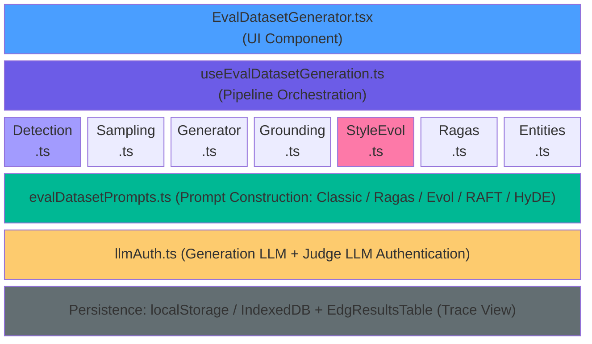
```mermaid
block-beta
  columns 7
  UI["EvalDatasetGenerator.tsx\n(UI Component)"]:7
  Hook["useEvalDatasetGeneration.ts\n(Pipeline Orchestration)"]:7
  Detect["Detection\n.ts"]:1
  Sampling["Sampling\n.ts"]:1
  Generator["Generator\n.ts"]:1
  Grounding["Grounding\n.ts"]:1
  StyleEvol["StyleEvol\n.ts"]:1
  Ragas["Ragas\n.ts"]:1
  Entities["Entities\n.ts"]:1
  Prompts["evalDatasetPrompts.ts (Prompt Construction: Classic / Ragas / Evol / RAFT / HyDE)"]:7
  Auth["llmAuth.ts (Generation LLM + Judge LLM Authentication)"]:7
  Storage["Persistence: localStorage / IndexedDB + EdgResultsTable (Trace View)"]:7

  style UI fill:#4a9eff,color:#fff
  style Hook fill:#6c5ce7,color:#fff
  style Detect fill:#a29bfe,color:#fff
  style StyleEvol fill:#fd79a8,color:#fff
  style Prompts fill:#00b894,color:#fff
  style Auth fill:#fdcb6e,color:#333
  style Storage fill:#636e72,color:#fff
```

### Module List

| Module | Role |
|---|---|
| `evalDatasetSampling.ts` | Index Structure Detection + Adaptive Sampling (structure detection → optimal sampling) |
| `evalDatasetGenerator.ts` | Azure OpenAI Chat Completions calls, JSON parsing, surface dedup, JSONL conversion, RAFT CoT generation, HyDE hypothesis generation |
| `evalDatasetPrompts.ts` | System/user prompt construction for Classic / Ragas / Evol-Instruct / RAFT / HyDE modes |
| `evalDatasetGrounding.ts` | Round-trip Consistency filter, Hard Negative Mining, Distractor retrieval |
| `evalDatasetEmbeddings.ts` | Semantic deduplication via Azure OpenAI Embeddings |
| `evalDatasetRagas.ts` | Ragas 4-quadrant scenario planning and Multi-hop pairing |
| `evalDatasetEntities.ts` | LLM-based entity extraction (Entity-KG) |
| `evalDatasetStyleEvolution.ts` | Style Evolution (SNS mode) — 5 types of surface degradation |

---

## Index Structure Detection + Adaptive Sampling

### Why Adaptive Sampling Is Needed

Azure AI Search indexes have two primary **structural patterns**.

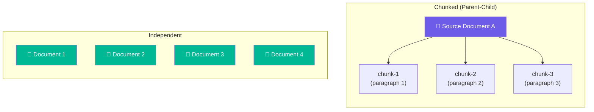
```mermaid
flowchart TD
  subgraph "Chunked (Parent-Child)"
    direction TB
    P1["📄 Source Document A"]
    C1["chunk-1\n(paragraph 1)"]
    C2["chunk-2\n(paragraph 2)"]
    C3["chunk-3\n(paragraph 3)"]
    P1 --> C1
    P1 --> C2
    P1 --> C3
  end

  subgraph "Independent"
    direction TB
    D1["📄 Document 1"]
    D2["📄 Document 2"]
    D3["📄 Document 3"]
    D4["📄 Document 4"]
  end

  style P1 fill:#6c5ce7,color:#fff
  style D1 fill:#00b894,color:#fff
  style D2 fill:#00b894,color:#fff
  style D3 fill:#00b894,color:#fff
  style D4 fill:#00b894,color:#fff
```

**Chunked indexes** (the most common in RAG) store a single source document as multiple chunks. A simple `search=*&top=N` sampling **duplicates chunks from the same source document**.

**Independent indexes** treat each document as a standalone unit, but `search=*&top=N` always returns the first N items from the index, making it impossible to **sample uniformly across the entire index**.

### Detection Algorithm

Index Structure Detection operates with **zero LLM calls** and completes in at most 2 API calls — a GET (schema retrieval) + POST (facet probe).

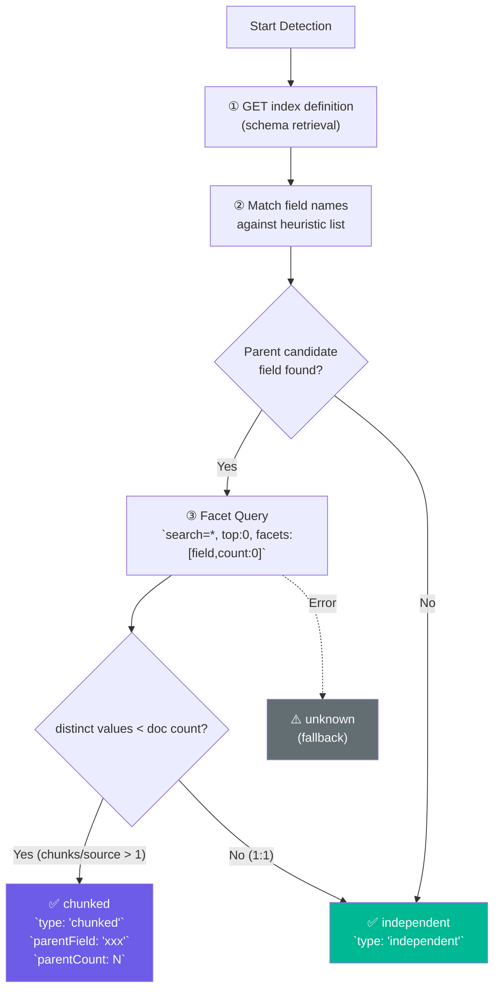
```mermaid
flowchart TD
    START["Start Detection"]
    SCHEMA["① GET index definition\n(schema retrieval)"]
    SCAN["② Match field names\nagainst heuristic list"]
    FOUND{"Parent candidate\nfield found?"}
    FACET["③ Facet Query\n`search=*, top:0, facets:[field,count:0]`"]
    RATIO{"distinct values < doc count?"}
    CHUNKED["✅ chunked\n`type: 'chunked'`\n`parentField: 'xxx'`\n`parentCount: N`"]
    INDEPENDENT["✅ independent\n`type: 'independent'`"]
    UNKNOWN["⚠️ unknown\n(fallback)"]

    START --> SCHEMA --> SCAN --> FOUND
    FOUND -->|Yes| FACET
    FOUND -->|No| INDEPENDENT
    FACET --> RATIO
    RATIO -->|"Yes (chunks/source > 1)"| CHUNKED
    RATIO -->|"No (1:1)"| INDEPENDENT
    FACET -.->|"Error"| UNKNOWN

    style CHUNKED fill:#6c5ce7,color:#fff
    style INDEPENDENT fill:#00b894,color:#fff
    style UNKNOWN fill:#636e72,color:#fff
```

Heuristic list (priority order):

```typescript
const PARENT_FIELD_HEURISTICS: string[] = [
  'parent_id', 'parent_key', 'parentId', 'parentKey',
  'metadata_storage_path', 'metadata_storage_name',
  'source_url', 'source_uri', 'sourceUrl', 'source',
  'title', 'document_title', 'file_name', 'fileName',
]
```

Detection results are returned as the following type:

```typescript
interface IndexStructureInfo {
  type: 'chunked' | 'independent' | 'unknown'
  parentField?: string      // Field used to group chunks
  parentCount?: number      // Number of distinct sources
  documentCount: number     // Total documents in the index
  reason: string            // Detection rationale for UI tooltip
}
```

### Three Sampling Strategies

Based on the detection result, `sampleDocsAdaptive()` automatically selects the optimal sampling strategy.

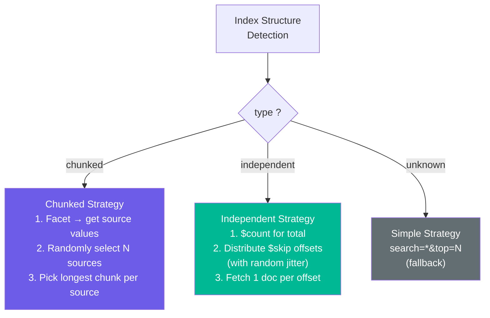
```mermaid
flowchart TD
    DETECT["Index Structure\nDetection"]
    SWITCH{"type ?"}
    CHUNKED["Chunked Strategy\n1. Facet → get source values\n2. Randomly select N sources\n3. Pick longest chunk per source"]
    INDEP["Independent Strategy\n1. $count for total\n2. Distribute $skip offsets\n(with random jitter)\n3. Fetch 1 doc per offset"]
    SIMPLE["Simple Strategy\nsearch=*&top=N\n(fallback)"]

    DETECT --> SWITCH
    SWITCH -->|chunked| CHUNKED
    SWITCH -->|independent| INDEP
    SWITCH -->|unknown| SIMPLE

    style CHUNKED fill:#6c5ce7,color:#fff
    style INDEP fill:#00b894,color:#fff
    style SIMPLE fill:#636e72,color:#fff
```

**Chunked Strategy Details**:

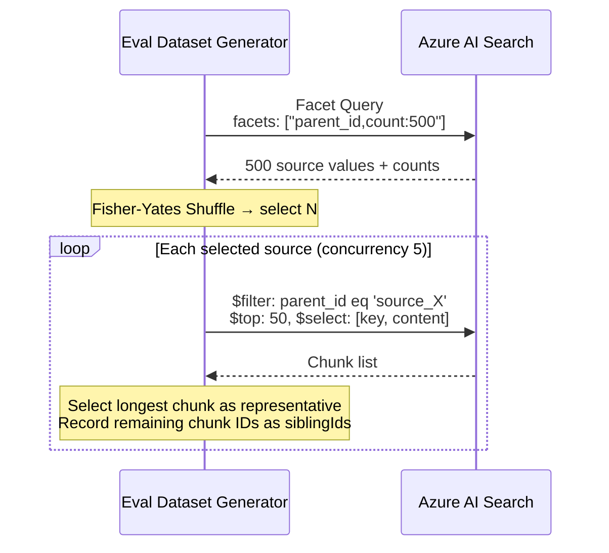
```mermaid
sequenceDiagram
    participant EDAG as Eval Dataset Generator
    participant Search as Azure AI Search

    EDAG->>Search: Facet Query<br/>facets: ["parent_id,count:500"]
    Search-->>EDAG: 500 source values + counts

    Note over EDAG: Fisher-Yates Shuffle → select N

    loop Each selected source (concurrency 5)
        EDAG->>Search: $filter: parent_id eq 'source_X'<br/>$top: 50, $select: [key, content]
        Search-->>EDAG: Chunk list
        Note over EDAG: Select longest chunk as representative<br/>Record remaining chunk IDs as siblingIds
    end
```

**Why pick the longest chunk**: Longer chunks contain more information, enabling the LLM to generate higher-quality queries. Avoiding overly short chunks (header-only, table of contents, etc.) stabilizes generation quality.

**Independent Strategy**: Distributes `$skip` offsets (stride = total / sampleSize) with random jitter to sample uniformly across the entire index. `$skip` is capped at the Azure AI Search limit of 100,000.

### Sibling-Aware Grounding

For chunked indexes, each document is annotated with `siblingIds` (an array of other chunk IDs from the same source) during sampling. During Round-trip Consistency checks, candidate IDs are expanded to include sibling chunks, preventing false negative rejections when "the correct answer is in a different chunk from the same source."

---

## Two Generation Modes: Classic and Ragas

### Classic Mode

The simplest generation mode. Samples N documents from the index and generates M queries per document using Azure OpenAI.

```
Document D1 → Queries Q1-1, Q1-2, ..., Q1-M
Document D2 → Queries Q2-1, Q2-2, ..., Q2-M
  ...
Document DN → Queries QN-1, QN-2, ..., QN-M
```

Prompts follow the **InPars/Promptagator style**. Document text is truncated to a maximum of 4,000 characters, and `response_format: { type: 'json_object' }` forces Azure OpenAI to output JSON. Temperature is set to `0.3` to balance diversity and consistency.

### Ragas Mode

An advanced generation mode inspired by the [Ragas](https://docs.ragas.io/) evaluation framework. Queries are classified into **4 quadrants**, combined with orthogonal axes of **Persona, Style, and Length** to simulate diverse real-world query distributions.

```
                   Specific (Fact Retrieval)     Abstract (Synthesis/Comparison)
                 ┌────────────────────────┬──────────────────────────────────┐
  Single-Hop     │ single_specific        │ single_abstract                  │
  (Single Doc)   │ "What is X?"           │ "How has X evolved?"             │
                 ├────────────────────────┼──────────────────────────────────┤
  Multi-Hop      │ multi_specific         │ multi_abstract                   │
  (Cross-Doc)    │ "What's the diff       │ "Summarize the evolution of      │
                 │  between A and B?"     │  A, B, and C"                    │
                 └────────────────────────┴──────────────────────────────────┘
```

Allocation counts per quadrant are determined using the **Largest-Remainder method**, which minimizes rounding errors when converting user-specified percentage distributions (default: `single_specific: 50%`, `single_abstract: 20%`, `multi_specific: 20%`, `multi_abstract: 10%`) to integers.

```typescript
// Conceptual implementation
function distributionToCounts(distribution, totalQueries) {
  const exact = Object.entries(distribution).map(([k, pct]) => ({
    key: k, count: totalQueries * pct / 100
  }));
  // 1. Floor to get integer parts
  const floored = exact.map(e => ({ ...e, int: Math.floor(e.count) }));
  // 2. Sort remainders descending and add 1 to each until total matches
  const remainder = totalQueries - sum(floored.map(e => e.int));
  const sorted = floored.sort((a, b) => frac(b.count) - frac(a.count));
  for (let i = 0; i < remainder; i++) sorted[i].int += 1;
  return sorted;
}
```

**Multi-hop Pairing** computes **Token Jaccard similarity** (NFKC normalization + Unicode punctuation splitting) between documents and finds pairs within a similarity range (threshold–0.95). When Entity-KG is enabled, it substitutes entity set Jaccard (using LLM-extracted proper noun entities) for more semantically appropriate pairing.

**Same-source pair exclusion**: When Adaptive Sampling detects a chunked index, pairs of documents with the same `parentId` are **automatically excluded**. Creating a "cross-document question" from two chunks of the same source is meaningless for evaluation.

---

## GRADE Pipeline (13-Stage Quality Pipeline)

The key feature of Eval Dataset Generator is the **13-stage quality pipeline (GRADE)** applied sequentially to generated queries. Each stage is opt-in and can be used in any combination.

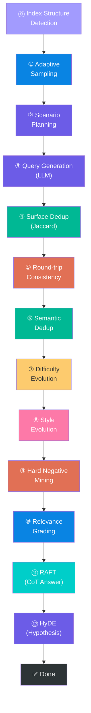
```mermaid
flowchart TD
  S0["⓪ Index Structure\nDetection"]
  S1["① Adaptive\nSampling"]
  S2["② Scenario\nPlanning"]
  S3["③ Query Generation\n(LLM)"]
  S4["④ Surface Dedup\n(Jaccard)"]
  S5["⑤ Round-trip\nConsistency"]
  S6["⑥ Semantic\nDedup"]
  S7["⑦ Difficulty\nEvolution"]
  S8["⑧ Style\nEvolution"]
  S9["⑨ Hard Negative\nMining"]
  S10["⑩ Relevance\nGrading"]
  S11["⑪ RAFT\n(CoT Answer)"]
  S12["⑫ HyDE\n(Hypothesis)"]
  DONE["✅ Done"]

  S0 --> S1 --> S2 --> S3 --> S4 --> S5 --> S6
  S6 --> S7 --> S8 --> S9 --> S10 --> S11 --> S12 --> DONE

  style S0 fill:#a29bfe,color:#fff
  style S1 fill:#0984e3,color:#fff
  style S2 fill:#6c5ce7,color:#fff
  style S3 fill:#6c5ce7,color:#fff
  style S4 fill:#00b894,color:#fff
  style S5 fill:#e17055,color:#fff
  style S6 fill:#00b894,color:#fff
  style S7 fill:#fdcb6e,color:#333
  style S8 fill:#fd79a8,color:#fff
  style S9 fill:#e17055,color:#fff
  style S10 fill:#0984e3,color:#fff
  style S11 fill:#00cec9,color:#fff
  style S12 fill:#6c5ce7,color:#fff
  style DONE fill:#2d3436,color:#fff
```

> **Legend**: 🟣 Structure detection/generation / 🔵 Sampling/metadata annotation / 🟢 Deduplication / 🔴 Search verification / 🟡 Difficulty evolution / 🩷 Surface degradation / 🩵 Extended dataset generation

| # | Stage | What It Does | Referenced Technique | Cost Source | Required/Optional |
|---|---|---|---|---|---|
| ⓪ | Index Structure Detection | Auto-detect index structure via schema + facet | — (proprietary) | Search REST ×2 | Optional (default ON) |
| ① | Document Sampling | Adaptive Sampling based on detection results | — (proprietary) | Search REST | Required |
| ② | Scenario Planning | Allocate to 4 quadrants × Persona × Style × Length | Ragas, RAGEval | Local computation | Ragas mode only |
| ③ | Query Generation | Synthesize queries via Azure OpenAI JSON mode | InPars, RAGEval | LLM (generation) | Required |
| ④ | Surface Dedup | Soft-reject queries with Token Jaccard ≥ 0.85 | — (Jaccard) | Local computation | Always active |
| ⑤ | Round-trip Consistency | Verify expected_ids appear in top-k via re-search | Promptagator | Search REST | Optional |
| ⑥ | Semantic Dedup | Exclude semantic duplicates via Embedding cosine | — (Embedding cosine) | Embeddings API | Optional |
| ⑦ | Difficulty Evolution | Rewrite to harder variants via Evol-Instruct | Evol-Instruct | LLM (Judge) | Optional |
| ⑧ | Style Evolution (SNS) | Apply real-user surface degradation | — (proprietary) | LLM (Judge) | Optional |
| ⑨ | Hard Negative Mining | Store non-relevant top-k doc ids as hard_negative_ids | DPR | Search REST | Optional |
| ⑩ | Relevance Grading | Assign NDCG/XDCG-compatible relevance_grades | TREC / NDCG | Local computation | Optional |
| ⑪ | RAFT mode | Generate CoT answers with oracle + distractors | RAFT | LLM (Judge) + Search REST | Optional |
| ⑫ | HyDE mode | Generate hypothetical passages for vector search input | HyDE | LLM (Judge) | Optional |

### Stage ③: Query Generation — Content Filter Retry

When Azure OpenAI's Content Filter triggers a 400 error, the current code automatically retries up to 3 times. Each retry incrementally raises `temperature` to produce a different generation pattern, increasing the likelihood of avoiding the Content Filter trigger.

```text
attempt 0: temperature = 0.30
attempt 1: temperature = 0.45  (delay: 1s)
attempt 2: temperature = 0.60  (delay: 2s)
attempt 3: temperature = 0.75  (delay: 3s)
```

If the issue persists after 3 retries, the exception is propagated, but the overall pipeline skips the affected document and proceeds to the next.

### Stage ④: Surface Dedup

Computes **token-level Jaccard similarity** between generated queries and marks duplicates at or above the 0.85 threshold as rejected.

```
Jaccard(A, B) = |A ∩ B| / |A ∪ B|
```

Text is tokenized after NFKC normalization using Unicode punctuation splitting. A Greedy Forward Scan algorithm prioritizes earlier queries for retention. Rejected duplicates remain in the results table when **Show rejected** is enabled, so their `surface-dup` trace can explain why they were filtered out. They are still excluded from JSONL export by default.

### Stage ⑤: Round-trip Consistency (Promptagator + Sibling-Aware)

A filter inspired by the Promptagator technique from [Dai et al., ICLR 2023](https://arxiv.org/abs/2209.11755). It **re-searches the actual index** with the generated query and verifies whether the source document appears in the top-k results.

For chunked indexes, candidate IDs are expanded to include `siblingIds`, so sibling chunks from the same source are treated as valid matches. For multi-hop queries, the query is considered grounded if any of the `expected_ids` appear in the top-k.

```
Query "What is semantic search in Azure?"
  → Re-search via search API
  → Source doc (+ siblings) in top-10?
    → Yes: grounding_rank = 3 (grounded)
    → No:  rejected = true, rejection_reason = 'grounding'
```

### Stage ⑥: Semantic Dedup

Eliminates **paraphrase duplicates** that surface-level Jaccard (Stage ④) cannot detect by vectorizing queries via Azure OpenAI Embeddings API and detecting duplicates using **cosine similarity**.

```
cosine(a, b) = dot(a, b) / (‖a‖ · ‖b‖)
```

Embeddings API is called with batch size 16, and pairs at or above the threshold (default 0.92) are removed as duplicates.

### Stage ⑦: Difficulty Evolution (Evol-Instruct)

Based on [WizardLM's Evol-Instruct](https://arxiv.org/abs/2304.12244), generated queries are rewritten by the LLM into **harder variants**. Strategies include paraphrasing, negation, aggregation, one-level abstraction, and synonym substitution.

```
easy: "What is the semantic ranker in Azure AI Search?"
  ↓ Evol-Instruct LLM rewrite
hard: "How does disabling the semantic ranker affect hybrid search precision?"
```

If rewriting fails, the original query (`difficulty: 'easy'`) is retained — a **graceful degradation** design.

### Stage ⑨: Hard Negative Mining (DPR Style)

Inspired by contrastive learning from [DPR (Dense Passage Retrieval)](https://arxiv.org/abs/2004.04906). For each query, a top-k search is executed and the top k results **not in** `expected_ids` are recorded as `hard_negative_ids`.

```json
{
  "query": "How to configure vector search",
  "expected_ids": ["doc-020"],
  "hard_negative_ids": ["doc-055", "doc-033"]
}
```

### Stage ⑩: Relevance Grading (NDCG-Compatible)

Automatically assigns **graded relevance scores** to each document. This stage uses **local computation only** — no LLM calls.

For Azure AI Foundry Document Retrieval Evaluator compatibility, the JSONL includes `retrieval_ground_truth`. This field is the Foundry-required array of `document_id` / `query_relevance_label` entries. The legacy `relevance_grades` map is still emitted for RAGOps / TREC-style tooling.

| Document | Score | Description |
|---|---|---|
| `source_doc_id` (Primary Anchor) | `query_relevance_label: 4` / `relevance_grades: 3` | Highest relevance |
| Remaining `expected_ids` (Secondary) | 2 | Secondary relevance |
| `hard_negative_ids` | 0 | Not relevant |

```json
{
  "query": "How to configure vector search",
  "expected_ids": ["doc-020"],
  "retrieval_ground_truth": [
    { "document_id": "doc-020", "query_relevance_label": 4 },
    { "document_id": "doc-055", "query_relevance_label": 0 }
  ],
  "relevance_grades": {
    "doc-020": 3,
    "doc-055": 0
  }
}
```

In Foundry's Document Retrieval Evaluator, map `retrieval_ground_truth` from the dataset and provide actual search results as `retrieved_documents` during evaluation.

### Domain Schema Injection (RAGEval)

Optionally, domain-specific **entities, relations, and constraints** can be injected into prompts. This improves the factuality and schema consistency of generated queries.

```typescript
interface DomainSchema {
  entities?: string    // e.g., "Azure AI Search, Semantic Ranker, HNSW"
  relations?: string   // e.g., "Semantic Ranker enhances hybrid search"
  constraints?: string // e.g., "API version 2024-07-01 or later required"
}
```

---

## Style Evolution (SNS Mode)

### Why Surface Degradation of Queries Is Needed

LLM-generated queries have a fundamental problem: they are **grammatically perfect and have overly polished vocabulary**. Real users enter "messy" queries like the following:

| Real User Search | LLM-Generated Search |
|---|---|
| `azure search vector setup` | `How to configure vector search in Azure AI Search?` |
| `whats semantic ranker` | `Please explain the features and use cases of the Semantic Ranker` |
| `hnsw params efSearch` | `What is the optimal value for the efSearch parameter in the HNSW algorithm?` |
| `AI serch hybrit search` | `How to execute hybrid search in Azure AI Search?` |

If a search engine is **only evaluated with polished queries**, quality degradation in real traffic goes undetected. Style Evolution intentionally **"degrades"** LLM-generated queries at Stage ⑧ to reproduce real user surface patterns.

### 5 Types of Degradation Patterns

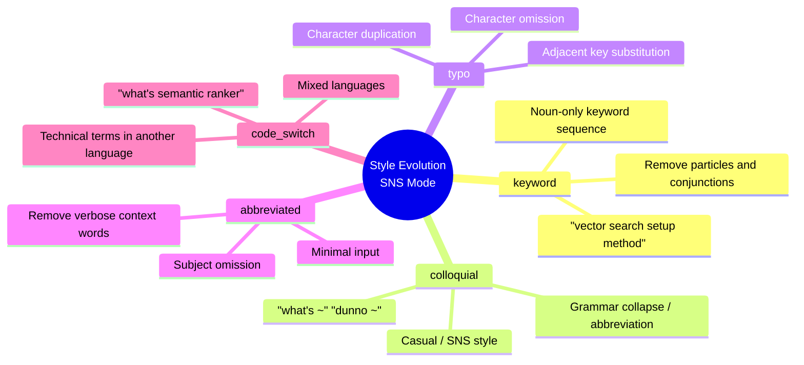
```mermaid
mindmap
  root((Style Evolution<br/>SNS Mode))
    keyword
      Remove particles and conjunctions
      Noun-only keyword sequence
      "vector search setup method"
    colloquial
      Casual / SNS style
      "what's ~" "dunno ~"
      Grammar collapse / abbreviation
    typo
      Adjacent key substitution
      Character omission
      Character duplication
    abbreviated
      Subject omission
      Remove verbose context words
      Minimal input
    code_switch
      Mixed languages
      Technical terms in another language
      "what's semantic ranker"
```

| Kind | Description | Input Example | Output Example |
|---|---|---|---|
| `keyword` | Strip particles/conjunctions to keyword sequence | `How to configure vector search?` | `vector search setup method` |
| `colloquial` | Convert to casual/SNS style | `What is semantic search?` | `whats semantic search` |
| `typo` | Insert 1–2 realistic typos | `hybrid search configuration` | `hybrit search configration` |
| `abbreviated` | Omit subject/context words to minimize | `How to use filters in Azure AI Search` | `filter usage` |
| `code_switch` | Mix languages in expression | `HNSW parameter configuration` | `HNSW parameter setup` |

### Implementation Architecture

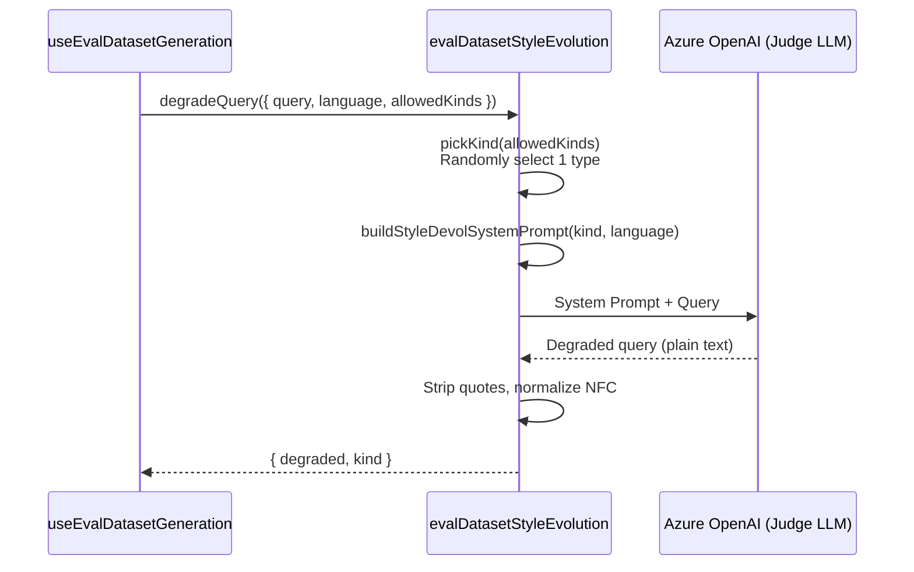
```mermaid
sequenceDiagram
    participant Hook as useEvalDatasetGeneration
    participant SE as evalDatasetStyleEvolution
    participant LLM as Azure OpenAI (Judge LLM)

    Hook->>SE: degradeQuery({ query, language, allowedKinds })
    SE->>SE: pickKind(allowedKinds)<br/>Randomly select 1 type
    SE->>SE: buildStyleDevolSystemPrompt(kind, language)
    SE->>LLM: System Prompt + Query
    LLM-->>SE: Degraded query (plain text)
    SE->>SE: Strip quotes, normalize NFC
    SE-->>Hook: { degraded, kind }
```

**Design Points**:

- **No JSON mode**: Output is plain text (`jsonMode: false`). Requiring a JSON wrapper undermines the "naturalness" of surface degradation
- **Uses Judge LLM**: Can run on a separate deployment from the generation LLM (cost/quality separation)
- **Random selection**: Randomly picks 1 type from the `allowedKinds` array. When empty, uniformly samples from all 5 types
- **Graceful degradation**: If the degraded result is identical to the original query after NFC normalization, `style_evolution_kind` is not recorded

---

## RAFT Dataset Generation

### What Is RAFT

**Paper**: Zhang, T. et al., *"RAFT: Adapting Language Model to Domain Specific RAG"*, 2024 (arXiv:2403.10131)

RAFT is a training data format for **fine-tuning LLMs to generate accurate, domain-specific answers** in RAG systems. The core idea is to present the LLM with both "the correct document (Oracle)" and "plausible but incorrect documents (Distractors)" simultaneously, teaching it **the ability to identify and cite the correct document while answering**.

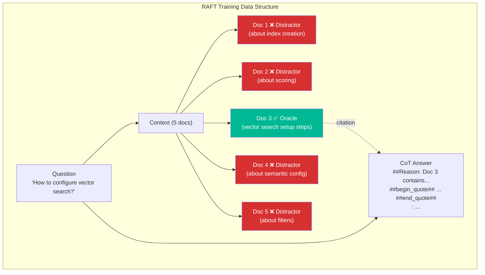
```mermaid
flowchart TD
    subgraph "RAFT Training Data Structure"
        Q["Question\n'How to configure vector search?'"]
        CTX["Context (5 docs)"]
        D1["Doc 1 ❌ Distractor\n(about index creation)"]
        D2["Doc 2 ❌ Distractor\n(about scoring)"]
        D3["Doc 3 ✅ Oracle\n(vector search setup steps)"]
        D4["Doc 4 ❌ Distractor\n(about semantic config)"]
        D5["Doc 5 ❌ Distractor\n(about filters)"]
        ANS["CoT Answer\n##Reason: Doc 3 contains...\n##begin_quote## ... ##end_quote##\n<ANSWER>: ..."]

        Q --> CTX
        CTX --> D1
        CTX --> D2
        CTX --> D3
        CTX --> D4
        CTX --> D5
        Q --> ANS
        D3 -.->|"citation"| ANS
    end

    style D3 fill:#00b894,color:#fff
    style D1 fill:#d63031,color:#fff
    style D2 fill:#d63031,color:#fff
    style D4 fill:#d63031,color:#fff
    style D5 fill:#d63031,color:#fff
```

### Chain-of-Thought Answer Generation

In RAFT mode, CoT answers are generated with the following prompt design.

**System prompt requirements**:
- Receive multiple documents, only one of which is the oracle (correct answer)
- Present step-by-step reasoning
- Wrap quoted sections with `##begin_quote##` / `##end_quote##`
- Prefix final answer with `<ANSWER>:`
- Must not use distractor information as evidence

**Key design decision**: The Oracle document is placed randomly among the Distractors using **Fisher-Yates Shuffle**. This prevents the model from learning a positional bias such as "the Nth document is always correct."

### Oracle + Distractor Context Construction

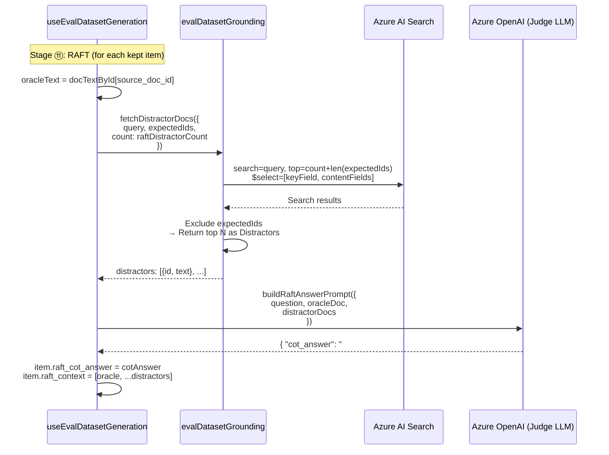
```mermaid
sequenceDiagram
    participant Hook as useEvalDatasetGeneration
    participant Ground as evalDatasetGrounding
    participant Search as Azure AI Search
    participant LLM as Azure OpenAI (Judge LLM)

    Note over Hook: Stage ⑪: RAFT (for each kept item)

    Hook->>Hook: oracleText = docTextById[source_doc_id]

    Hook->>Ground: fetchDistractorDocs({<br/>  query, expectedIds,<br/>  count: raftDistractorCount<br/>})
    Ground->>Search: search=query, top=count+len(expectedIds)<br/>$select=[keyField, contentFields]
    Search-->>Ground: Search results
    Ground->>Ground: Exclude expectedIds<br/>→ Return top N as Distractors
    Ground-->>Hook: distractors: [{id, text}, ...]

    Hook->>LLM: buildRaftAnswerPrompt({<br/>  question, oracleDoc,<br/>  distractorDocs<br/>})
    LLM-->>Hook: { "cot_answer": "##Reason: ... <ANSWER>: ..." }

    Hook->>Hook: item.raft_cot_answer = cotAnswer<br/>item.raft_context = [oracle, ...distractors]
```

**Distractor selection criteria**: Executes a real search with the query and uses top results not in `expected_ids` as Distractors. This follows the same principle as Hard Negative Mining — "documents the search engine is likely to return but that are not correct" make the most effective Distractors.

**Truncation strategy**: Each document's text is allocated an equal budget of `MAX_CHUNK_CHARS / (1 + distractorCount)` to fit within the context window.

### RAFT JSONL Output Schema

```json
{
  "question": "How to configure vector search?",
  "context": [
    { "doc_id": "doc-020", "text": "To configure vector search...", "oracle": true },
    { "doc_id": "doc-055", "text": "Scoring profiles are...", "oracle": false },
    { "doc_id": "doc-033", "text": "When creating an index...", "oracle": false },
    { "doc_id": "doc-041", "text": "Semantic configuration of...", "oracle": false },
    { "doc_id": "doc-072", "text": "Filter expression syntax...", "oracle": false }
  ],
  "cot_answer": "##Reason: The question asks about vector search configuration. Looking at the documents, Document 1 (doc-020) contains the relevant setup instructions. ##begin_quote## To configure vector search... ##end_quote## <ANSWER>: To configure vector search, define algorithms and profiles in the vectorSearch section...",
  "expected_ids": ["doc-020"],
  "query_type": "how-to",
  "language": "en",
  "source_doc_id": "doc-020",
  "generation_model": "gpt-5.4-mini",
  "provenance": "synthetic",
  "generated_at": "2026-04-27T14:00:00.000Z",
  "generated_against_index": "my-rag-index",
  "generation_run_id": "edg-abc-456"
}
```

---

## HyDE Hypothesis Passage Generation

### Theoretical Background of HyDE

**Paper**: Gao, L. et al., *"Precise Zero-Shot Dense Retrieval without Relevance Labels (HyDE)"*, ACL 2023

Conventional vector search converts the user's query directly into an embedding vector for retrieval. However, queries (short questions) and documents (long explanatory text) reside in **different distributions within the embedding space**, which can result in low similarity.

HyDE generates a "**hypothetical answer document**" for a query using an LLM, then converts this hypothesis passage into an embedding vector for search. Since the hypothesis passage shares the same format and vocabulary as actual documents, alignment in the vector space improves.

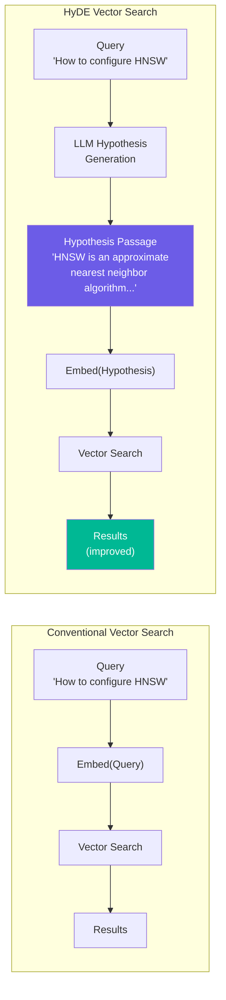
```mermaid
flowchart LR
    subgraph "Conventional Vector Search"
        Q1["Query\n'How to configure HNSW'"]
        E1["Embed(Query)"]
        S1["Vector Search"]
        R1["Results"]
        Q1 --> E1 --> S1 --> R1
    end

    subgraph "HyDE Vector Search"
        Q2["Query\n'How to configure HNSW'"]
        LLM2["LLM Hypothesis\nGeneration"]
        H2["Hypothesis Passage\n'HNSW is an approximate\nnearest neighbor algorithm...'"]
        E2["Embed(Hypothesis)"]
        S2["Vector Search"]
        R2["Results\n(improved)"]
        Q2 --> LLM2 --> H2 --> E2 --> S2 --> R2
    end

    style H2 fill:#6c5ce7,color:#fff
    style R2 fill:#00b894,color:#fff
```

### Hypothesis Passage Generation

At the pipeline's final stage (Stage ⑫), a hypothesis passage is generated for each kept item.

**Prompt design**:
- Generate natural text of approximately 100–200 words
- Specific and information-rich content
- Use expressions likely to match in vector search
- JSON mode: `{ "hypothesis": string }`

Generated hypothesis passages are stored in the following fields:

```json
{
  "query": "How to configure HNSW parameters",
  "hyde_hypothesis": "HNSW (Hierarchical Navigable Small World) is an approximate nearest neighbor search algorithm used in Azure AI Search. Key parameters include m (maximum connections per node, recommended 4-10), efConstruction (construction-time search width, recommended 400-1000), and efSearch (search-time search width, recommended 500-1000)...",
  "hyde_model": "gpt-5.4",
  "hyde_generated_at": "2026-04-27T16:00:00.000Z"
}
```

### Integration with AutoTuning

Generated HyDE hypothesis passages are utilized during Search Parameter AutoTuning **evaluation runs**. The newly added **HyDE Eval mode** in AutoTuning offers two application strategies:

| Application Mode | Behavior | Recommended Scenario |
|---|---|---|
| `vectorTextOnly` | Use hypothesis passage as `vectorText`, keep original query as `search` | Hybrid search evaluation |
| `replaceQueryAndVectorText` | Replace both `search` and `vectorText` with hypothesis passage | Pure vector search evaluation |

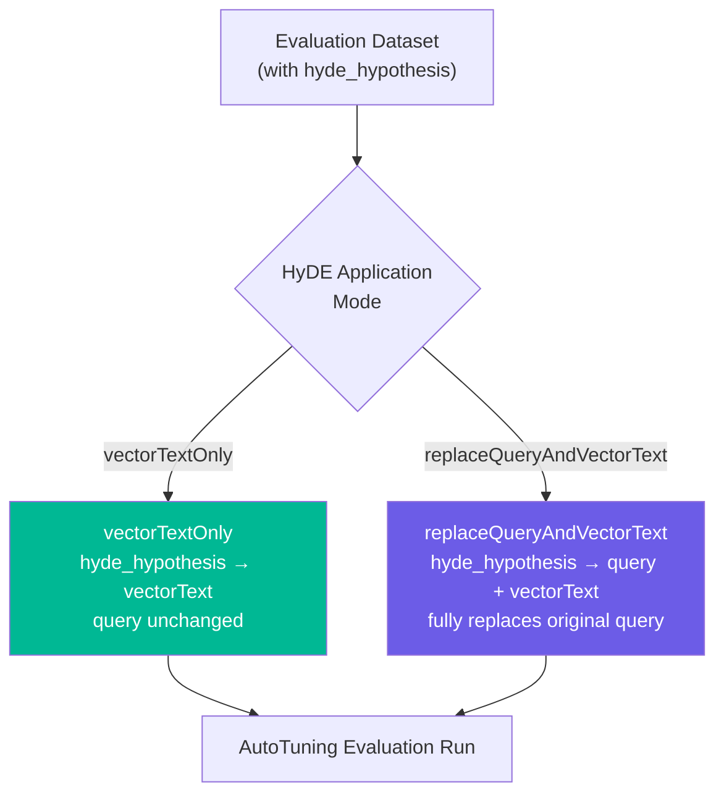
```mermaid
flowchart TD
    DATASET["Evaluation Dataset\n(with hyde_hypothesis)"]
    MODE{"HyDE Application\nMode"}
    VTO["vectorTextOnly\nhyde_hypothesis → vectorText\nquery unchanged"]
    REPLACE["replaceQueryAndVectorText\nhyde_hypothesis → query + vectorText\nfully replaces original query"]
    
    DATASET --> MODE
    MODE -->|vectorTextOnly| VTO
    MODE -->|replaceQueryAndVectorText| REPLACE
    
    VTO --> EVAL["AutoTuning Evaluation Run"]
    REPLACE --> EVAL
    
    style VTO fill:#00b894,color:#fff
    style REPLACE fill:#6c5ce7,color:#fff
```

This enables automatic A/B comparison of "how Recall@k changes with and without HyDE" through AutoTuning.

---

## Judge LLM and Eval Tracing

### Judge LLM — Dedicated Deployment for Quality Filters

An option to separate the **generation LLM** from the **quality filter LLM (Judge LLM)**.

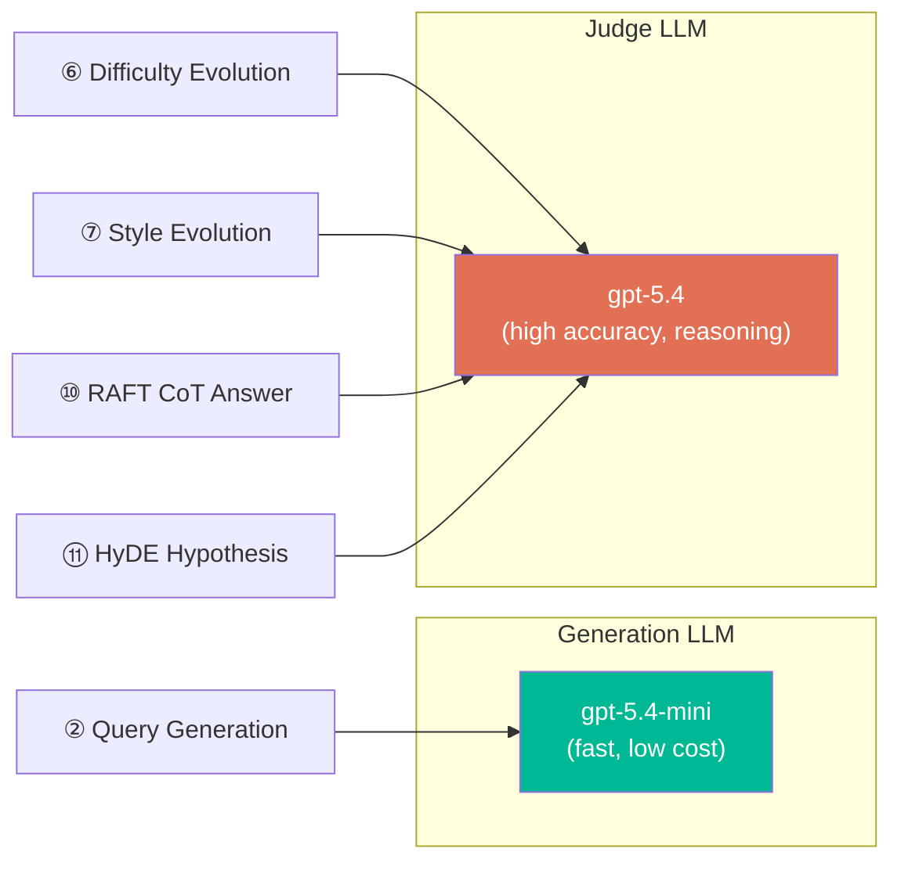
```mermaid
flowchart LR
    subgraph "Generation LLM"
        G["gpt-5.4-mini\n(fast, low cost)"]
    end

    subgraph "Judge LLM"
        J["gpt-5.4\n(high accuracy, reasoning)"]
    end

    GEN["② Query Generation"] --> G
    DIFF["⑥ Difficulty Evolution"] --> J
    SE["⑦ Style Evolution"] --> J
    RAFT["⑩ RAFT CoT Answer"] --> J
    HYDE["⑪ HyDE Hypothesis"] --> J

    style G fill:#00b894,color:#fff
    style J fill:#e17055,color:#fff
```

| Setting | Purpose | Recommended Model |
|---|---|---|
| `llmDeployment` | Query generation (Stage ②) | gpt-5.4-mini (fast, low cost) |
| `judgeLlmDeployment` | Quality filters, difficulty evolution, RAFT, HyDE (Stages ⑥⑦⑩⑪) | gpt-5.4 (high accuracy) |

**Benefits of separation**:
- **Cost optimization**: Use an affordable model for bulk generation, a high-accuracy model for quality evaluation
- **Rate limit distribution**: Spread load across 2 deployments
- **Quality improvement**: Difficulty evolution and CoT answer generation benefit from a model with stronger reasoning

When `judgeLlmDeployment` is not set, it falls back to `llmDeployment`, maintaining full backward compatibility.

### Eval Tracing — Query Transformation Trace

Setting `enableTrace: true` records how each query item was **transformed (or rejected) at each pipeline step** as an event log.

```typescript
interface TraceEvent {
  step: number       // 1-based pipeline step number
  phase: 'generation' | 'surface-dedup' | 'grounding' | 'semantic-dedup' 
       | 'difficulty' | 'style-evolution' | 'hardneg' | 'relevance'
  action: 'created' | 'kept' | 'rejected' | 'modified' | 'enriched'
  timestamp: string  // ISO 8601
  detail?: {
    before?: string              // Query text before change
    after?: string               // Query text after change
    reason?: string              // Rejection/action reason
    score?: number               // Jaccard / cosine / grounding rank
    styleKind?: StyleEvolutionKind  // Style Evolution type applied
  }
}
```

**Lifecycle Visualization Example**:

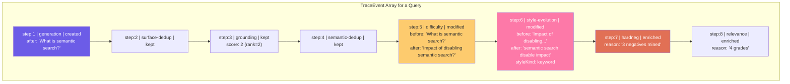
```mermaid
flowchart TD
    subgraph "TraceEvent Array for a Query"
        T1["step:1 | generation | created\nafter: 'What is semantic search?'"]
        T2["step:2 | surface-dedup | kept"]
        T3["step:3 | grounding | kept\nscore: 2 (rank=2)"]
        T4["step:4 | semantic-dedup | kept"]
        T5["step:5 | difficulty | modified\nbefore: 'What is semantic search?'\nafter: 'Impact of disabling semantic search?'"]
        T6["step:6 | style-evolution | modified\nbefore: 'Impact of disabling...'\nafter: 'semantic search disable impact'\nstyleKind: keyword"]
        T7["step:7 | hardneg | enriched\nreason: '3 negatives mined'"]
        T8["step:8 | relevance | enriched\nreason: '4 grades'"]
    end

    T1 --> T2 --> T3 --> T4 --> T5 --> T6 --> T7 --> T8

    style T1 fill:#6c5ce7,color:#fff
    style T5 fill:#fdcb6e,color:#333
    style T6 fill:#fd79a8,color:#fff
    style T7 fill:#e17055,color:#fff
```
#### Query Transformation Trace Result
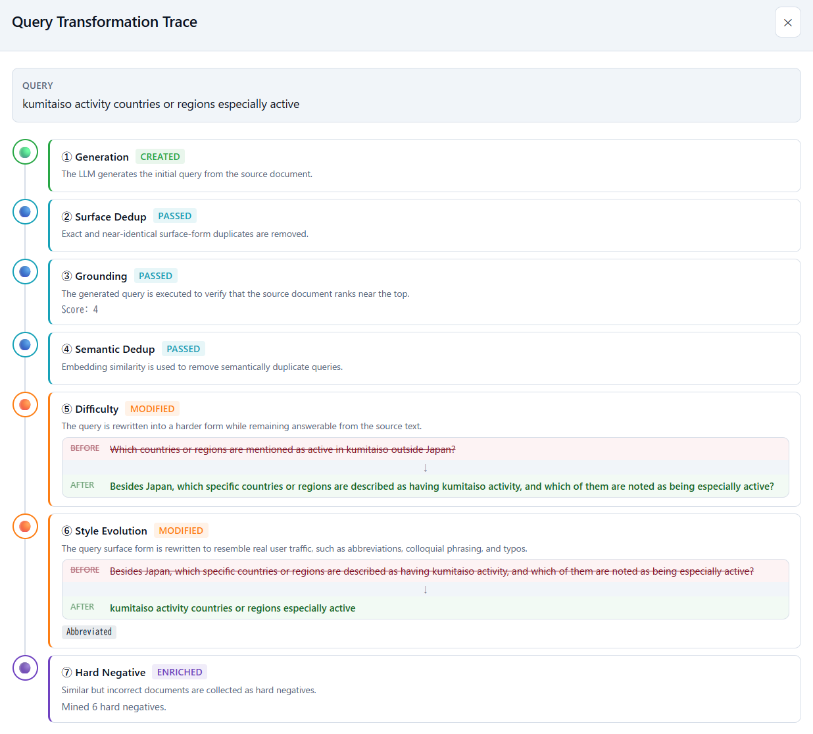

Trace use cases:
- **Pipeline debugging**: Instantly identify at which step a specific query was rejected
- **Quality filter effectiveness**: Aggregate reject and modification rates per stage
- **Reproducibility**: Compare traces across re-runs with the same settings to understand LLM non-determinism impact
- **JSONL export**: The `trace` field is included in JSONL, enabling downstream analysis pipelines

---

## JSONL Output Schema

Generated datasets use the following JSONL format. `rejected` items are automatically filtered out during export.

```json
{
  "query": "What is the Azure AI Search semantic ranker used for?",
  "expected_ids": ["doc-123"],
  "query_type": "factoid",
  "language": "en",
  "source_doc_id": "doc-123",
  "generation_model": "gpt-5.4-mini",
  "provenance": "synthetic",
  "generated_at": "2026-04-21T10:00:00.000Z",
  "generated_against_index": "my-index",
  "generation_run_id": "edg-abc-123",
  "grounding_rank": 1,
  "grounding_top_k": 10,
  "query_shape": "single_specific",
  "persona": "developer",
  "style": "web_search",
  "length": "short",
  "difficulty": "hard",
  "style_evolution_kind": "keyword",
  "hard_negative_ids": ["doc-456", "doc-789"],
  "relevance_grades": { "doc-123": 3, "doc-456": 0, "doc-789": 0 },
  "hyde_hypothesis": "The semantic ranker is a feature of Azure AI Search that...",
  "hyde_model": "gpt-5.4",
  "hyde_generated_at": "2026-04-21T10:05:00.000Z",
  "trace": [
    { "step": 1, "phase": "generation", "action": "created", "timestamp": "...", "detail": { "after": "..." } },
    { "step": 6, "phase": "style-evolution", "action": "modified", "timestamp": "...", "detail": { "styleKind": "keyword" } }
  ]
}
```

### Three Export Formats

| Format | Purpose | Export Function |
|---|---|---|
| AutoTuning-compatible JSONL | Search parameter optimization | `toJsonl()` |
| RAFT JSONL | LLM fine-tuning | `toRaftJsonl()` |
| HyDE-enriched JSONL | Vector search A/B evaluation | `toJsonl()` (includes `hyde_*` fields) |

---

## Concurrency Control and Cancellation

The entire pipeline is managed by the `useEvalDatasetGeneration` React Hook.

- **Concurrency control**: Generation, difficulty evolution, Style Evolution, RAFT, and HyDE run at `CONCURRENCY=3`; Grounding and Hard Negative Mining at `GROUNDING_CONCURRENCY=4`
- **Worker pattern**: Uses a Producer-Consumer pattern with a shared cursor + async worker pool. `cursor++` fetches the next task, and `Promise.all(workers)` awaits all worker completion
- **Cancellation**: Based on `AbortController`. Calling `cancel()` fires `controller.abort()`, immediately stopping all fetch requests and workers with `AbortError`
- **Progress**: Real-time progress display via `EdgPhase` type

```typescript
type EdgPhase =
  | 'idle'
  | 'detecting'    // ⓪ Index Structure Detection
  | 'sampling'     // ① Adaptive Sampling
  | 'generating'   // ③ Query Generation
  | 'grounding'    // ⑤ Round-trip Consistency
  | 'embedding'    // ⑥ Semantic Dedup
  | 'difficulty'   // ⑦ Difficulty Evolution
  | 'styleevol'    // ⑧ Style Evolution
  | 'hardneg'      // ⑨ Hard Negative Mining
  | 'raft'         // ⑪ RAFT
  | 'hyde'         // ⑫ HyDE
  | 'done'
```

- **Authentication errors**: HTTP 401/403 immediately halt the entire pipeline as `LlmAuthError` (distinguished from transient errors like rate limiting)

---

## Persistence Layer

| Layer | Storage | Key | Contents |
|---|---|---|---|
| Datasets | `localStorage` | `ragops.evalDatasets.v1` | CRUD operations for generated datasets (id, title, updatedAt, indexName, itemCount, items[]) |
| Form settings | IndexedDB | `AppSettings.evalDatasetFormJson` | Auto-save all form fields (300ms debounce). Includes API Keys and Bearer Tokens |

Form settings are stored in IndexedDB, so they persist across browser sessions. Automatic migration from legacy `localStorage` is also supported.

---

## Engineering Foundation: Prior Research and Techniques

Eval Dataset Generator is not a simple "write one prompt and send it to an LLM" implementation. It is engineered by combining **techniques whose effectiveness has been reported in the latest information retrieval (IR) and natural language processing (NLP) research**.

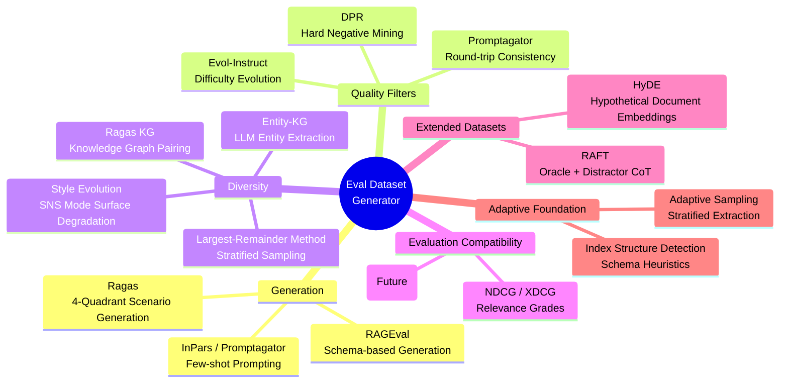
```mermaid
mindmap
  root((Eval Dataset<br/>Generator))
    Generation
      InPars / Promptagator<br/>Few-shot Prompting
      Ragas<br/>4-Quadrant Scenario Generation
      RAGEval<br/>Schema-based Generation
    Quality Filters
      Promptagator<br/>Round-trip Consistency
      Evol-Instruct<br/>Difficulty Evolution
      DPR<br/>Hard Negative Mining
    Diversity
      Ragas KG<br/>Knowledge Graph Pairing
      Entity-KG<br/>LLM Entity Extraction
      Largest-Remainder Method<br/>Stratified Sampling
      Style Evolution<br/>SNS Mode Surface Degradation
    Evaluation Compatibility
      NDCG / XDCG<br/>Relevance Grades
      ARES<br/>PPI Statistical Correction (Future)
    Extended Datasets
      RAFT<br/>Oracle + Distractor CoT
      HyDE<br/>Hypothetical Document Embeddings
    Adaptive Foundation
      Index Structure Detection<br/>Schema Heuristics
      Adaptive Sampling<br/>Stratified Extraction
```

### InPars / Promptagator — Few-shot Query Generation

**Papers**: Bonifacio et al., *"InPars: Data Augmentation for Information Retrieval using Large Language Models"*, SIGIR 2022 / Dai et al., *"Promptagator: Few-shot Dense Retrieval From 8 Examples"*, ICLR 2023

**Problem**: Training IR models requires large volumes of "query ↔ relevant document" pairs, but manual creation is costly.

**Solution**: Show a document to the LLM and have it generate "queries a user might search for this document." InPars research shows that adding few-shot examples **improves search relevance of generated queries by 20–40%**. The Promptagator Consistency Filter **eliminates 15–30% of noisy synthetic queries**, achieving Retriever accuracy equal to or exceeding human-labeled data.

**Application in GRADE**: Stage ③ Query Generation (few-shot prompting) and Stage ⑤ Round-trip Consistency Filter. See the respective stage descriptions for details.

### Ragas — 4-Quadrant Scenarios for Query Diversity

**Source**: [Ragas Testset Generation](https://docs.ragas.io/en/stable/concepts/test_data_generation/rag/)

Classifies queries into **Specific ↔ Abstract** × **Single-Hop ↔ Multi-Hop** quadrants, combined with orthogonal axes of Persona / Style / Length to simulate real-world query distributions.

**Application in GRADE**: Stage ② Scenario Planning. See the "Two Generation Modes: Classic and Ragas" section for details.

### Evol-Instruct — Query Difficulty Evolution

**Paper**: Xu et al., *"WizardLM: Empowering Large Language Models to Follow Complex Instructions"*, arXiv:2304.12244, 2023

Applies paraphrase, negation, aggregation, and abstraction strategies to evolve queries into harder variants. Difficulty evolution is constrained to what is answerable from the source document, with graceful degradation on failure.

**Application in GRADE**: Stage ⑦ Difficulty Evolution. See the respective stage description for details.

### DPR — Hard Negative Mining

**Paper**: Karpukhin et al., *"Dense Passage Retrieval for Open-Domain Question Answering"*, EMNLP 2020

Inspired by DPR's contrastive learning, records top-k search results not in `expected_ids` as Hard Negatives. Including Hard Negatives in evaluation datasets makes ranking metrics like NDCG more sensitive, enabling accurate measurement of parameter tuning effects.

**Application in GRADE**: Stage ⑨ Hard Negative Mining. See the respective stage description for details.

### RAGEval — Generation Quality Improvement via Domain Schema

**Paper**: Zhu et al., *"RAGEval: Scenario Specific RAG Evaluation Dataset Generation Framework"*, 2024 (arXiv:2408.01262)

Injecting structured schemas of domain-specific **entities, relations, and constraints** into prompts improves the factuality and schema consistency of generated queries.

### Entity-KG — Lightweight Knowledge Graph for Multi-hop Pairing

**Source**: Ragas Knowledge Graph + RAGOps Studio proprietary implementation

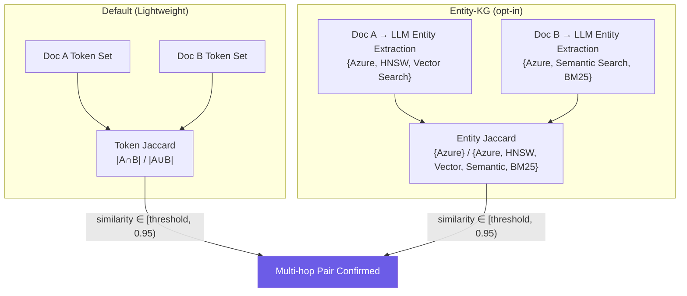
```mermaid
flowchart TD
    subgraph "Default (Lightweight)"
        D1["Doc A Token Set"]
        D2["Doc B Token Set"]
        TJ["Token Jaccard\n|A∩B| / |A∪B|"]
        D1 --> TJ
        D2 --> TJ
    end

    subgraph "Entity-KG (opt-in)"
        E1["Doc A → LLM Entity Extraction\n{Azure, HNSW, Vector Search}"]
        E2["Doc B → LLM Entity Extraction\n{Azure, Semantic Search, BM25}"]
        EJ["Entity Jaccard\n{Azure} / {Azure, HNSW, Vector, Semantic, BM25}"]
        E1 --> EJ
        E2 --> EJ
    end

    TJ -->|"similarity ∈ [threshold, 0.95)"| PAIR["Multi-hop Pair Confirmed"]
    EJ -->|"similarity ∈ [threshold, 0.95)"| PAIR

    style PAIR fill:#6c5ce7,color:#fff
```

### ARES / PPI — Statistical Bias Correction (Not Implemented — Design Reference)

**Paper**: Saad-Falcon et al., *"ARES: An Automated Evaluation Framework for RAG Systems"*, NAACL 2024

> **Note**: This feature is not implemented in the current version. It is included as a design reference for future extension.

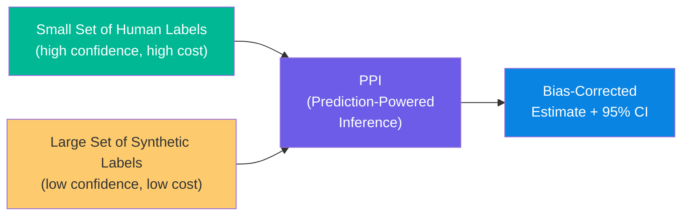
```mermaid
flowchart LR
    HUMAN["Small Set of Human Labels\n(high confidence, high cost)"]
    SYNTH["Large Set of Synthetic Labels\n(low confidence, low cost)"]
    PPI["PPI\n(Prediction-Powered\nInference)"]
    RESULT["Bias-Corrected\nEstimate + 95% CI"]

    HUMAN --> PPI
    SYNTH --> PPI
    PPI --> RESULT

    style HUMAN fill:#00b894,color:#fff
    style SYNTH fill:#fdcb6e,color:#333
    style PPI fill:#6c5ce7,color:#fff
    style RESULT fill:#0984e3,color:#fff
```

### Overall Technique Map

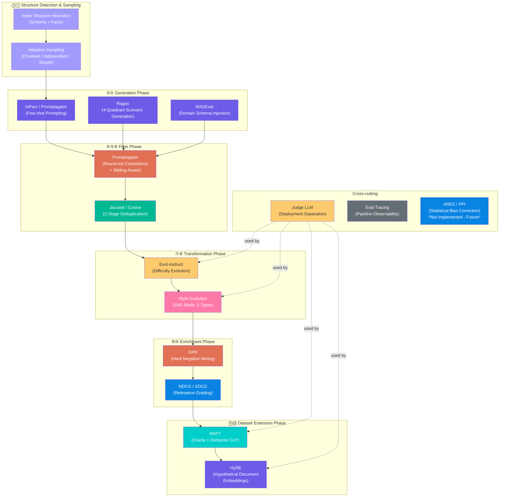
```mermaid
flowchart TB
    subgraph "⓪① Structure Detection & Sampling"
        A0["Index Structure Heuristics\n(Schema + Facet)"]
        A1["Adaptive Sampling\n(Chunked / Independent / Simple)"]
    end

    subgraph "②③ Generation Phase"
        B1["InPars / Promptagator\n(Few-shot Prompting)"]
        B2["Ragas\n(4-Quadrant Scenario Generation)"]
        B3["RAGEval\n(Domain Schema Injection)"]
    end

    subgraph "④⑤⑥ Filter Phase"
        C1["Promptagator\n(Round-trip Consistency\n+ Sibling-Aware)"]
        C2["Jaccard / Cosine\n(2-Stage Deduplication)"]
    end

    subgraph "⑦⑧ Transformation Phase"
        D1["Evol-Instruct\n(Difficulty Evolution)"]
        D2["Style Evolution\n(SNS Mode, 5 Types)"]
    end

    subgraph "⑨⑩ Enrichment Phase"
        E1["DPR\n(Hard Negative Mining)"]
        E2["NDCG / XDCG\n(Relevance Grading)"]
    end

    subgraph "⑪⑫ Dataset Extension Phase"
        F1["RAFT\n(Oracle + Distractor CoT)"]
        F2["HyDE\n(Hypothetical Document\nEmbeddings)"]
    end

    subgraph "Cross-cutting"
        G1["Judge LLM\n(Deployment Separation)"]
        G2["Eval Tracing\n(Pipeline Observability)"]
        G3["ARES / PPI\n(Statistical Bias Correction)\n*Not Implemented - Future*"]
    end

    A0 --> A1 --> B1
    B1 --> C1
    B2 --> C1
    B3 --> C1
    C1 --> C2 --> D1 --> D2 --> E1 --> E2 --> F1 --> F2
    G1 -.->|"used by"| D1
    G1 -.->|"used by"| D2
    G1 -.->|"used by"| F1
    G1 -.->|"used by"| F2

    style A0 fill:#a29bfe,color:#fff
    style A1 fill:#a29bfe,color:#fff
    style B1 fill:#6c5ce7,color:#fff
    style B2 fill:#6c5ce7,color:#fff
    style B3 fill:#6c5ce7,color:#fff
    style C1 fill:#e17055,color:#fff
    style C2 fill:#00b894,color:#fff
    style D1 fill:#fdcb6e,color:#333
    style D2 fill:#fd79a8,color:#fff
    style E1 fill:#e17055,color:#fff
    style E2 fill:#0984e3,color:#fff
    style F1 fill:#00cec9,color:#fff
    style F2 fill:#6c5ce7,color:#fff
    style G1 fill:#fdcb6e,color:#333
    style G2 fill:#636e72,color:#fff
    style G3 fill:#0984e3,color:#fff
```

---

## Limitations and Mitigations of Synthetic Evaluation Datasets

Synthetic evaluation datasets are powerful tools, but using them **uncritically risks "self-serving evaluation."**

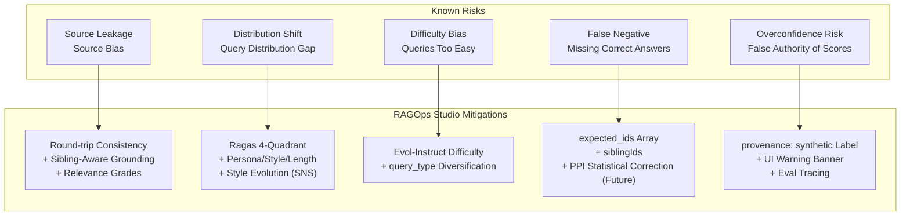
```mermaid
flowchart TD
    subgraph "Known Risks"
        R1["Source Leakage\nSource Bias"]
        R2["Distribution Shift\nQuery Distribution Gap"]
        R3["Difficulty Bias\nQueries Too Easy"]
        R4["False Negative\nMissing Correct Answers"]
        R5["Overconfidence Risk\nFalse Authority of Scores"]
    end

    subgraph "RAGOps Studio Mitigations"
        M1["Round-trip Consistency\n+ Sibling-Aware Grounding\n+ Relevance Grades"]
        M2["Ragas 4-Quadrant\n+ Persona/Style/Length\n+ Style Evolution (SNS)"]
        M3["Evol-Instruct Difficulty\n+ query_type Diversification"]
        M4["expected_ids Array\n+ siblingIds\n+ PPI Statistical Correction (Future)"]
        M5["provenance: synthetic Label\n+ UI Warning Banner\n+ Eval Tracing"]
    end

    R1 --> M1
    R2 --> M2
    R3 --> M3
    R4 --> M4
    R5 --> M5
```

| Risk | Description | Mitigation |
|---|---|---|
| **Source Leakage** | Generating a query from a chunk → that chunk naturally ranks high in search, creating a circular evaluation | Round-trip Consistency + Sibling-Aware Grounding + graded evaluation via `relevance_grades` |
| **Distribution Shift** | LLM queries have overly polished vocabulary and grammar, failing to reproduce real users' vague, colloquial, typo-laden queries | Ragas 4-Quadrant × Persona × Style × Length + **Style Evolution (SNS mode)** to replicate real traffic |
| **Difficulty Bias** | Mass-produces easy factoid-type queries | Evol-Instruct difficulty evolution, forced distribution across 4 `query_type`s, multi-hop cross-document query generation |
| **False Negative** | Documents other than the source chunk can also correctly answer the query, but are incorrectly judged as wrong | `expected_ids` as array + `siblingIds` expansion + PPI for statistical combination with human labels (future implementation) |
| **Overconfidence Risk** | Using synthetic data scores as "production quality" for decision making | `provenance: 'synthetic'` + UI warning banner + **Eval Tracing** for judgment transparency |

> **⚠️ Important**: Synthetic evaluation datasets are highly effective for parameter A/B comparison and regression detection, but **cannot substitute for absolute quality scores in production**. For accurate production quality measurement, combining with even a small number of human-reviewed ground truth data is recommended.

---

## Usage in Practice

For the current implementation, the following order is recommended:

```text
1. Start with a small sample (10 docs)
2. Enable Grounding and Trace to observe behavior
3. Add SNS mode to approximate real data
4. Enable Semantic Dedup if too many duplicates
5. Enable Hard Negative and relevance_grades for training reuse
6. Add RAFT and HyDE after confirming evaluation quality
```

This tool is **not a device for producing absolute production quality scores** — it is a **device for accelerating configuration comparison, regression detection, and initial data preparation**.

### Save / Load / AutoTuning Integration

| Feature | Description |
|---|---|
| **Save / Load** | Save generated datasets to localStorage under the `ragops.evalDatasets.v1` key. Reload the same dataset from the UI later |
| **Send to AutoTuning** | Pass directly to AutoTuning without downloading and re-uploading |
| **RAFT / HyDE Export** | Output fine-tuning data and HyDE vectorText materials alongside standard evaluation JSONL |

### Corpus Drift Warning

Synthetic datasets become stale after index updates. Check the `generated_against_index` and `generated_at` fields, and consider regenerating datasets after index updates.

---

## References

| # | Paper / Project | Year | Venue | Usage in This Feature |
|---|---|---|---|---|
| 1 | Bonifacio, L. et al. **InPars: Data Augmentation for Information Retrieval using Large Language Models** | 2022 | SIGIR | Few-shot prompting for query generation |
| 2 | Dai, Z. et al. **Promptagator: Few-shot Dense Retrieval From 8 Examples** | 2023 | ICLR | Round-trip Consistency Filter |
| 3 | Xu, C. et al. **WizardLM: Empowering Large Language Models to Follow Complex Instructions (Evol-Instruct)** | 2023 | arXiv:2304.12244 | Difficulty Evolution |
| 4 | Karpukhin, V. et al. **Dense Passage Retrieval for Open-Domain Question Answering (DPR)** | 2020 | EMNLP | Hard Negative Mining |
| 5 | Zhu, K. et al. **RAGEval: Scenario Specific RAG Evaluation Dataset Generation Framework** | 2024 | arXiv:2408.01262 | Domain Schema injection |
| 6 | Saad-Falcon, J. et al. **ARES: An Automated Evaluation Framework for RAG Systems** | 2024 | NAACL | PPI statistical bias correction (design reference, not implemented) |
| 7 | Gao, L. et al. **Precise Zero-Shot Dense Retrieval without Relevance Labels (HyDE)** | 2023 | ACL | HyDE hypothesis passage generation + AutoTuning integration |
| 8 | Zhang, T. et al. **RAFT: Adapting Language Model to Domain Specific RAG** | 2024 | arXiv:2403.10131 | RAFT dataset generation (Oracle + Distractor CoT) |
| 9 | Wei, J. et al. **Chain-of-Thought Prompting Elicits Reasoning in Large Language Models** | 2022 | NeurIPS | Foundation for RAFT CoT answer format |
| 10 | **Ragas Testset Generation** | 2024– | OSS | 4-Quadrant taxonomy, Persona/Style/Length |
| 11 | **Azure AI Foundry RAG Evaluators** | 2024– | Microsoft Learn | NDCG / XDCG compatible `relevance_grades` |
| 12 | **Azure AI Search Indexer: Document Chunking** | 2024– | Microsoft Learn | Index Structure Detection heuristic design |
