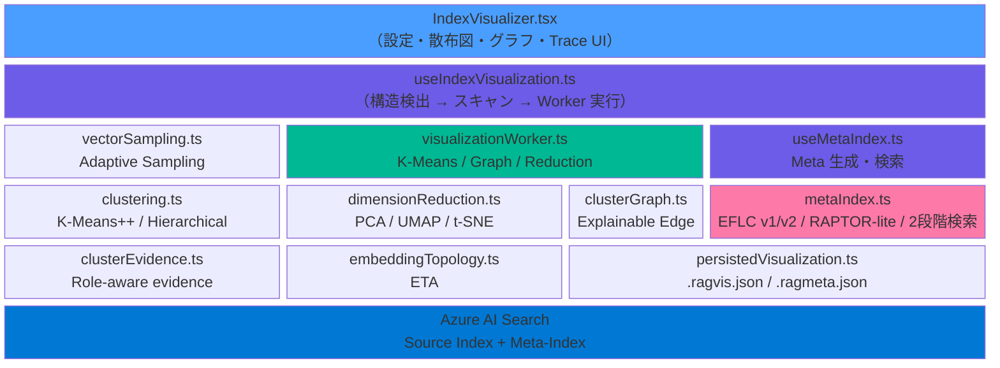
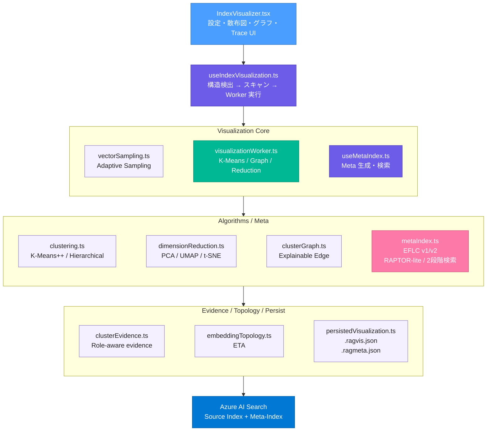
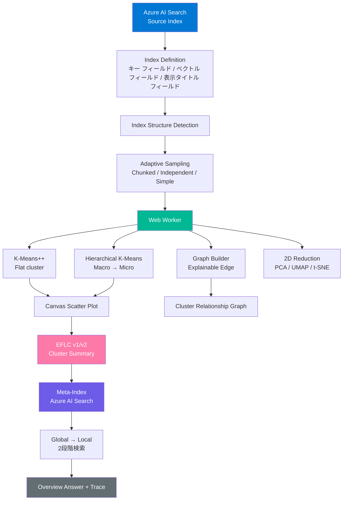
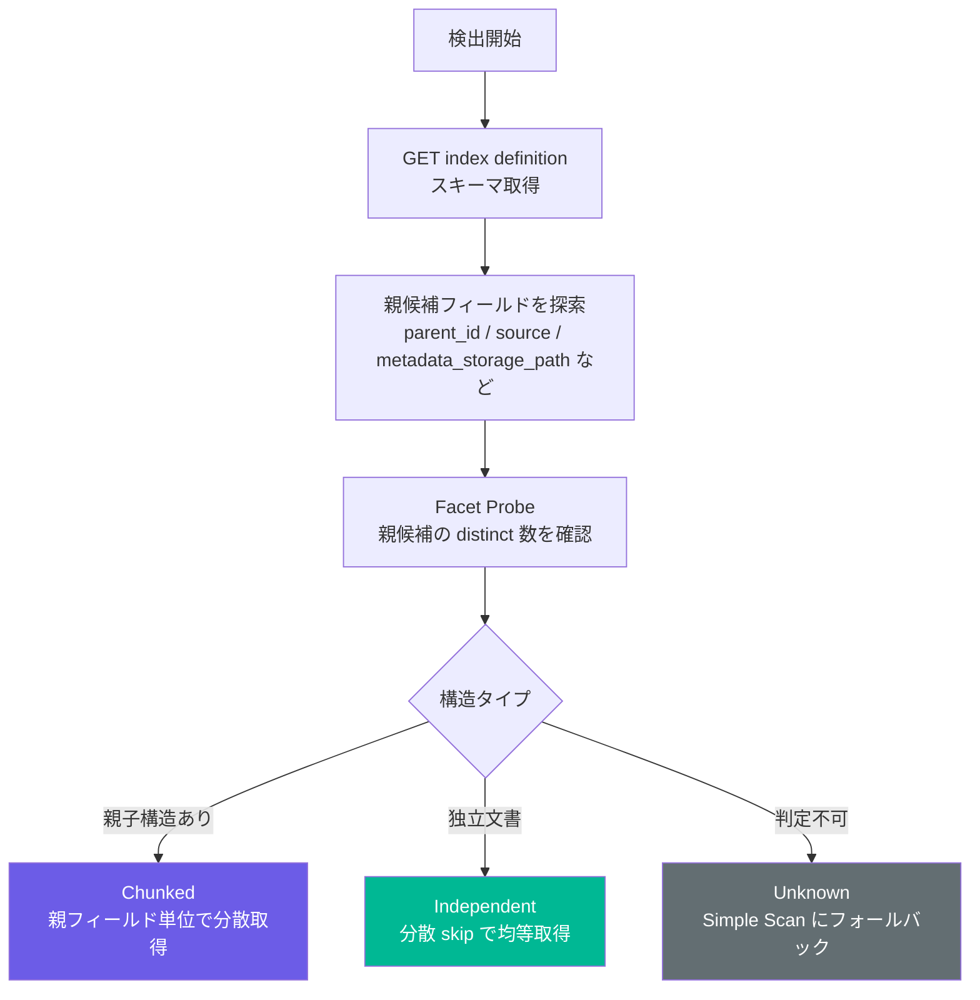
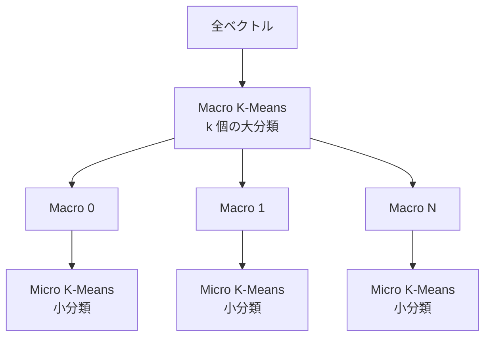
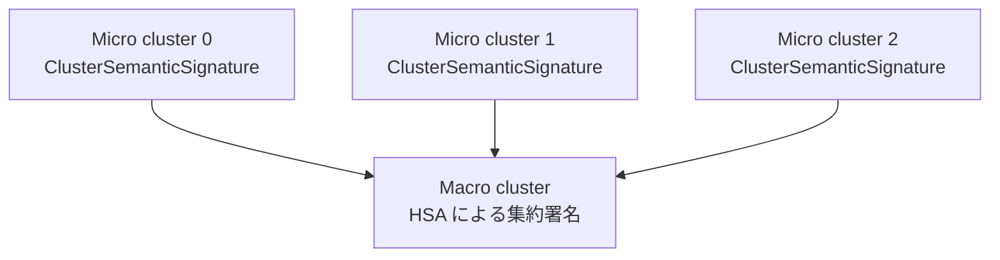
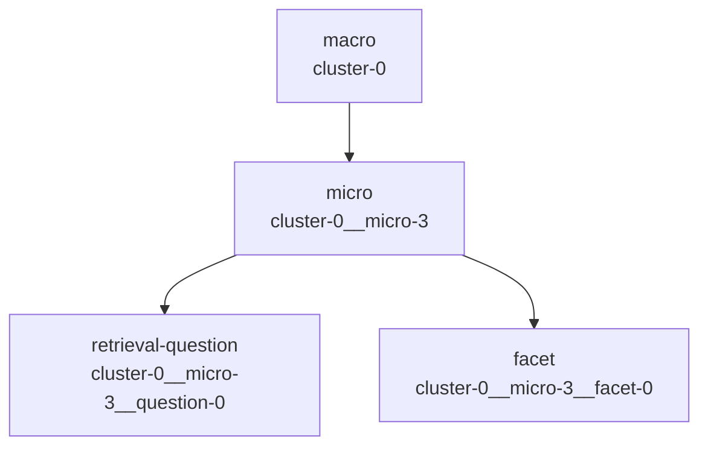
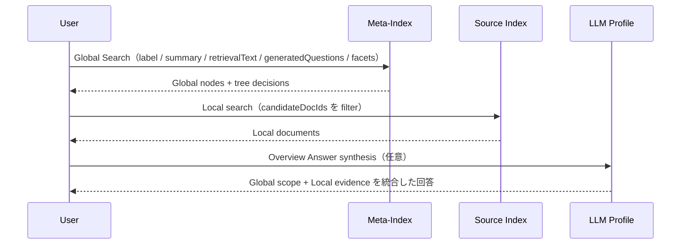
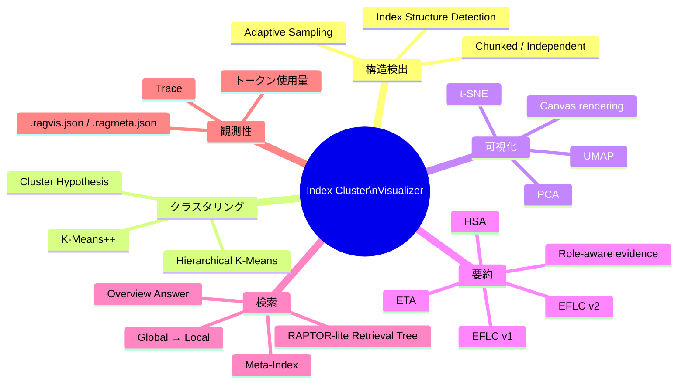

# Index Cluster Visualizer — EFLC によるインデックス構造可視化とメタインデックス検索

> **EFLC** (**E**mbedding-**F**irst **L**ightweight **C**lustering)

Azure AI Search の既存インデックスからベクトルフィールドを取得し、ドキュメント群をクラスタリングして、インデックス全体の意味構造を散布図・階層ビュー・クラスタ関係グラフとして可視化する機能です。さらに、クラスタ要約を Azure AI Search 上のメタインデックスとして保存し、Global（クラスタ/意味領域）→ Local（元ドキュメント）の 2 段階検索に利用できます。

Index Cluster Visualizer は「検索結果を見る」だけの画面ではなく、**インデックスがどのような意味領域で構成されているかを観測し、その構造を検索・評価・改善に再利用するためのワークベンチ**です。

---

## 目次

- [なぜ Index Cluster Visualizer が必要なのか](#なぜ-index-cluster-visualizer-が必要なのか)
- [なぜ EFLC か - GraphRAG との違い](#なぜ-eflc-か---graphrag-との違い)
- [初心者向け：クラスターから検索までの流れ](#初心者向けクラスターから検索までの流れ)
- [アーキテクチャ概要](#アーキテクチャ概要)
- [Index Structure Detection + Adaptive Sampling](#index-structure-detection--adaptive-sampling)
- [可視化パイプライン](#可視化パイプライン)
- [クラスタリングと次元削減](#クラスタリングと次元削減)
- [クラスタ関係グラフとドリルダウン](#クラスタ関係グラフとドリルダウン)
- [EFLC v1 / v2 クラスタ要約](#eflc-v1--v2-クラスタ要約)
- [メタインデックスと RAPTOR-lite Retrieval Tree](#メタインデックスと-raptor-lite-retrieval-tree)
- [Global → Local 2 段階検索](#global--local-2-段階検索)
- [Trace と観測性](#trace-と観測性)
- [保存形式：.ragvis.json と .ragmeta.json](#保存形式ragvisjson-と-ragmetajson)
- [並行制御とキャンセル](#並行制御とキャンセル)
- [永続化レイヤー](#永続化レイヤー)
- [工学的基盤：採用した先行研究と手法の解説](#工学的基盤採用した先行研究と手法の解説)
- [制約と緩和策](#制約と緩和策)
- [実運用での使い方](#実運用での使い方)
- [参考文献](#参考文献)

---

## なぜ Index Cluster Visualizer が必要なのか

RAG システムでは、検索インデックスに数千〜数十万件のチャンクやドキュメントが格納されます。しかし、通常の検索 UI だけでは「個別クエリに対して何が返るか」は分かっても、**インデックス全体がどの主題領域で構成され、どこに混在・重複・偏りがあるのか**を把握しにくい問題があります。

Index Cluster Visualizer は、既存の Azure AI Search インデックスに格納済みのベクトルを使って、次の問いに答えるための機能です。

| 問い | Visualizer が提供する見方 |
|---|---|
| このインデックスは何についての集合か | クラスタ散布図、LLM ラベル、クラスタ要約 |
| チャンクが特定ソースに偏っていないか | Adaptive Sampling の構造検出結果 |
| 大きすぎるクラスタの内部構造は何か | Macro → Micro 階層クラスタリング |
| 似たクラスタ同士はどこで接続しているか | クラスタ関係グラフ、Bridge Document、共有ファセット |
| 検索時にどの意味領域を通ったか | RAPTOR-lite Trace、Global ノード、Local ドキュメント |
| LLM 要約の根拠はどの文書か | EFLC v2 Trace、Role-aware evidence、使用フィールド表示 |

この機能の目的は、検索インデックスを「ただのドキュメント集合」ではなく、**観測可能な意味空間**として扱えるようにすることです。

---

## なぜ EFLC か - GraphRAG との違い

GraphRAG は、ドキュメントからエンティティとリレーションを抽出し、グラフ構造を作ってからコミュニティや近傍を検索します。この設計は強力ですが、全ドキュメントを LLM に通すため、初期構築コストと運用コストが大きくなります。

EFLC は、Azure AI Search にすでに存在するベクトルフィールドを先に使います。エンティティ抽出を最初に行わず、**埋め込み空間上の近さから軽量にクラスタ構造を発見する**のが基本方針です。

| 観点 | GraphRAG | EFLC |
|---|---|---|
| 初期入力 | 生テキスト全体 | 既存ベクトルフィールド |
| 主な前処理 | LLM によるエンティティ・リレーション抽出 | ベクトル取得とクラスタリング |
| LLM コスト | 全ドキュメント規模 | クラスタ代表文書のみ |
| 保存先 | 独自成果物やグラフストレージ | Azure AI Search のメタインデックス |
| 得意領域 | 知識グラフ化、関係推論 | インデックス全体像の把握、低コストな意味領域検索 |

### EFLC の設計原則

```text
1. 既存ベクトルを再利用する
   追加の埋め込み生成を既定では行わない。

2. クラスタリングはブラウザ内の数値計算で完結する
   K-Means++、階層 K-Means、次元削減を Web Worker で実行する。

3. LLM は「全件処理」ではなく「クラスタ説明」に限定する
   クラスタ単位のラベル、要約、意味プロファイルだけを生成する。

4. 生成物は Azure AI Search に戻す
   メタインデックスを作成し、既存の検索 API と同じ管理面で扱う。

5. 可視化と検索を分けない
   散布図・グラフ・Trace で見えた構造を 2 段階検索にも使う。
```

---

## 初心者向け：クラスターから検索までの流れ

この章の目的は、専門用語を覚えることではありません。画面の中で何が起きていて、なぜその処理が必要なのかを、先に普通の言葉でつかむための章です。

この機能がやっていることは、ひとことで言うと **大量の文書を地図にして、その地図を検索にも使う** ことです。

```text
文書の特徴を読む
  → 似ている文書をグループにする
  → 画面上に点として並べる
  → グループ同士の近さや境目を見る
  → グループに名前と説明を付ける
  → その説明を検索用の索引として保存する
  → まずグループを探し、次に元の文書を探す
```

技術名は、あとで詳しい章を読むときの見出しとして添えています。ここでは名前を覚える必要はありません。

| フェーズ | 説明 | 後で出てくる技術名 |
|---|---|---|
| 1. 文書の特徴を読む | 文書ごとに「内容の特徴を表す数字の並び」を取り出します。これにより、文書本文を全部読み直さなくても、似ている文書同士を比べられます。 | ベクトルフィールド |
| 2. 偏らないように文書を拾う | 同じPDFや同じサイトの文書ばかり拾わないように、取り方を調整します。偏った材料で地図を作ると、インデックス全体を誤解しやすくなります。 | Index Structure Detection、Adaptive Sampling |
| 3. 似ている文書をまとめる | 内容が近い文書を同じグループに入れます。何千件もの文書を1件ずつ見る代わりに、「話題のまとまり」として見られるようになります。 | K-Means++ |
| 4. 大きすぎるグループを分ける | 大きなグループの中を、さらに小さな話題に分けます。1つのグループに複数の話題が混ざっていると、何の集まりか分かりにくいためです。 | 階層K-Means |
| 5. 画面に点として置く | 似ている文書は近く、違う文書は離れるように並べます。数字の並びだけでは人間が見られないため、散布図として眺められる形にします。 | PCA、UMAP、t-SNE |
| 6. グループ同士の関係を見る | 近いグループや、どちらにも関係しそうな文書を表示します。話題同士の重なり、境目、比較すべき領域を見つけるためです。 | クラスター関係グラフ、Bridge Document |
| 7. まず短い名前を付ける | 代表的な文書を見て、グループに短い名前と説明を付けます。まず低コストで「このグループは何か」を把握できます。 | EFLC v1 |
| 8. より丁寧に説明する | 典型的な文書だけでなく、少し違う文書や境目の文書も見て説明を作ります。雑な名前で混ざった話題や例外を見落とさないためです。 | EFLC v2 |
| 9. 小さな説明を大きな説明へまとめる | 小さなグループの説明を材料に、大きなグループの説明を作ります。いきなり大きなグループを一言で説明するより、細かい話題から組み立てた方が分かりやすくなります。 | HSA |
| 10. 検索でも使えるように保存する | グループ名、説明、関連する文書IDを別の索引に保存します。画面で見た構造を、その場限りではなく検索の入口として再利用できます。 | メタインデックス |
| 11. まずグループを探し、次に文書を探す | いきなり全文書を探さず、まず関係しそうな話題の領域を探してから、その中の文書を探します。広い話題から具体的な根拠文書へ進めるため、検索の流れを追いやすくなります。 | Global → Local検索、RAPTOR-lite |
| 12. 理由を後から確認する | どの文書を見て、どの説明を作り、どの検索経路を通ったかを残します。ラベルや回答が正しいか、後から人間が確認できます。 | Trace |

### 素朴な Q&A

**Q. なぜ最初にLLMで全ドキュメントを読ませないのか？**  
A. コストと時間が大きくなるためです。この機能では、まず既存の数字データで「似ている文書のまとまり」を作り、LLMにはそのまとまりを説明させます。

**Q. なぜクラスタリングが必要なのか？**  
A. 検索インデックス全体を1件ずつ見るのは難しいためです。似ている文書をグループにすると、「このあたりは製品情報」「このあたりはトラブルシュート」のように全体像を掴めます。

**Q. なぜv1とv2があるのか？**  
A. v1は、まず素早く名前を付けるための簡易モードです。v2は、グループの中に複数の話題が混ざっていないか、どの文書を根拠にしたかをより丁寧に見るモードです。

**Q. なぜメタインデックスを作るのか？**  
A. 画面で見つけたグループ名や説明を、検索で使える形に保存するためです。そうすると、次回の検索で「まずどの話題領域を見るべきか」を判断しやすくなります。

**Q. なぜGlobal → Localの2段階検索にするのか？**  
A. まず「どの話題のまとまりが関係しそうか」を探し、その後で「実際に根拠になる文書」を探すためです。最初から全文書を相手にするより、検索の道筋を説明しやすくなります。

---

## アーキテクチャ概要

Index Cluster Visualizer は、UI、可視化パイプライン、メタインデックス生成、2 段階検索の 4 つの層で構成されています。



##  アーキテクチャ概要2




### モジュール一覧

| モジュール | 役割 |
|---|---|
| `IndexVisualizer.tsx` | 設定フォーム、散布図、階層ビュー、クラスタ関係グラフ、メタインデックス操作、2 段階検索、Trace 表示を統合する UI |
| `useIndexVisualization.ts` | インデックス定義取得、ベクトルフィールド検出、表示タイトルフィールド解決、Adaptive Sampling、Web Worker 実行を管理 |
| `vectorSampling.ts` | `detectIndexStructure()` を再利用し、Chunked / Independent / Unknown に応じたベクトルサンプリングを実行 |
| `visualizationWorker.ts` | K-Means++、階層 K-Means、クラスタ関係グラフ、次元削減をメインスレッド外で実行 |
| `clustering.ts` | K-Means++、階層 K-Means、コサイン類似度、Silhouette スコア、Elbow 法を提供 |
| `dimensionReduction.ts` | PCA、UMAP、t-SNE、PCA → UMAP の 2D 射影を提供 |
| `clusterGraph.ts` | セントロイド類似度、Bridge Document、共有ファセット、共有キーワードから説明可能なエッジを構築 |
| `clusterEvidence.ts` | Prototype / Diverse / Boundary / Outlier の Role-aware evidence を選定 |
| `embeddingTopology.ts` | KNN グラフから凝集度、分離度、境界率、外れ値率、曖昧度を算出する ETA を提供 |
| `metaIndex.ts` | EFLC v1/v2 要約、HSA、RAPTOR-lite ノード生成、メタインデックス作成、2 段階検索、Overview Answer を提供 |
| `persistedVisualization.ts` | `.ragvis.json` と `.ragmeta.json` の保存・復元を提供 |

### 全体フロー





---

## Index Structure Detection + Adaptive Sampling

### なぜ適応的サンプリングが必要なのか

Azure AI Search の RAG インデックスには、主に 2 つの構造があります。

| 構造 | 例 | 問題 |
|---|---|---|
| **Chunked** | 1 つの PDF や Web ページが複数チャンクに分割される | 先頭から単純取得すると、同じ親ドキュメント由来のチャンクに偏る |
| **Independent** | FAQ、商品、記事、チケットなどが 1 件ずつ独立している | 先頭から単純取得すると、インデックス順序の偏りを受ける |

Index Cluster Visualizer は、Eval Dataset Generator と同じ `detectIndexStructure()` を再利用します。スキーマヒューリスティックとファセットクエリでインデックス構造を推定し、スキャン戦略を切り替えます。



### 3 つのスキャン戦略

| 戦略 | 実装 | 説明 |
|---|---|---|
| Simple Scan | `scanVectorsSimple()` | `$skip` + `$top` による並列ページング。最大 10,000 件、`$skip` は Azure AI Search の上限に合わせて 100,000 以内 |
| Chunked Sampling | `scanVectorsFromChunkedIndex()` | 親フィールドをファセットで列挙し、親ソースをシャッフルして各ソースから必要件数のチャンクを取得 |
| Distributed Sampling | `scanVectorsDistributed()` | 総件数に対して stride を計算し、分散した `$skip` オフセットから取得 |

実装上の主な制御値は以下です。

| 項目 | 現行値 |
|---|---:|
| 最大サンプル数 | 10,000 件 |
| Simple Scan バッチサイズ | 100 件 |
| Distributed Sampling バッチサイズ | 50 件 |
| Simple / Independent 並行度 | 6 |
| Chunked Sampling 並行度 | 5 |
| `$skip` 上限 | 100,000 |

### 表示タイトルフィールドの解決

散布図やドキュメントブラウザに表示するタイトルは、ユーザー指定がない場合に自動検出されます。検出順は次の通りです。

```text
1. セマンティック構成の titleField
2. title / name / displayName / metadata_storage_name / path / url などの一般的な名称
3. searchable な Edm.String フィールド
4. キーフィールド
```

ユーザーが表示タイトルフィールドを指定した場合は、インデックス定義に存在すること、`Edm.String` であること、`retrievable: false` ではないことを検証します。ベクトルフィールドについても、`retrievable: false` または `stored: false` の場合は取得できないため、明確なエラーを表示します。

---

## 可視化パイプライン

可視化パイプラインは `useIndexVisualization` が管理し、重い計算は `visualizationWorker.ts` に移譲します。

```text
Phase 1: Detect
  インデックス構造を Chunked / Independent / Unknown に分類

Phase 2: Scan
  ベクトル、キー、表示タイトルを取得

Phase 3: Cluster
  K-Means++ を実行し、必要に応じて Macro → Micro 階層を作る

Phase 4: Graph
  クラスタ間の候補エッジと説明根拠を構築

Phase 5: Project
  高次元ベクトルを 2D に射影

Phase 6: Visualize
  Canvas 散布図、凡例、ツールチップ、グラフを表示
```

### Pipeline phase

| Phase | 内部状態 | 主な処理 | 出力 |
|---|---|---|---|
| Detect | `detecting` | `detectIndexStructure()` | `IndexStructureInfo` |
| Scan | `scanning` | `scanVectorsAdaptive()` または `scanVectorsSimple()` | `ScannedDoc[]` |
| Cluster | `clustering` | K-Means++、階層 K-Means | `ClusterResult`、`HierarchicalClusterResult` |
| Graph | `graphing` | Bridge Document、エッジ、Force-directed layout | `ClusterGraphData` |
| Project | `projecting` | PCA / UMAP / t-SNE / PCA → UMAP | `PcaResult` |
| Done | `done` | UI 表示 | `VisualizationData` |

### 可視化データの中心型

```typescript
type VisualizationData = {
  docs: ScannedDoc[]
  cluster: ClusterResult
  pca: PcaResult
  hierarchical?: HierarchicalClusterResult
  graph?: ClusterGraphData
}
```

`ScannedDoc` は、可視化に必要な最小単位です。

```typescript
type ScannedDoc = {
  id: string
  title: string
  vector: Float32Array
}
```

---

## クラスタリングと次元削減

### K-Means++

基本クラスタリングは `clustering.ts` の `kMeans()` です。

| 項目 | 内容 |
|---|---|
| 初期化 | K-Means++ |
| 距離 | 二乗ユークリッド距離 |
| 乱数 | `mulberry32` による seeded PRNG、既定 seed は 42 |
| 最大反復 | 50 |
| メモリ | `Float32Array` と `Uint16Array` を利用 |

K-Means++ は、クラスタ数 `k` をユーザーが指定する前提の軽量なアルゴリズムです。ブラウザ内で動かしやすく、Azure AI Search から取得したベクトルをそのまま扱えます。

### 階層 K-Means

階層モードを有効にすると、`hierarchicalKMeans()` が 2 段階のクラスタリングを行います。



| 型 | 内容 |
|---|---|
| `macroLabels` | 各文書の Macro クラスタ ID |
| `microLabels` | 各文書のグローバル Micro クラスタ ID |
| `microToMacro` | Micro ID から親 Macro ID へのマッピング |
| `microClusters` | Macro ごとの Micro クラスタリング結果 |
| `totalMicroClusters` | 全 Micro クラスタ数 |

階層ビューでは、散布図を Flat / Hierarchy で切り替えられます。Hierarchy では Micro クラスタを表示しつつ、同じ Macro に属する Micro は同系統の色で表現されます。

### 次元削減

高次元ベクトルはそのままでは見えないため、`dimensionReduction.ts` で 2D 座標へ射影します。

| 手法 | 実装 | 特徴 |
|---|---|---|
| PCA | `pcaReduce2D()` | 高速。全体の概観把握に向く。分散説明率を表示できる |
| UMAP | `umapReduce2D()` | 局所構造と大域構造の両方を見たい場合に有効 |
| t-SNE | `tsneReduce2D()` | 局所的なクラスタ分離の確認に向く |
| PCA → UMAP | `pcaUmapReduce2D()` | 高次元を 50 次元に落としてから UMAP を適用する高速化パス |

2D 射影は可視化のための近似です。散布図上で近く見える点が、元の高次元空間でも必ず同じ距離関係を持つとは限りません。クラスタ関係グラフや 2 段階検索では、元のベクトル空間のセントロイド類似度や Search API の結果を併用します。

---

## クラスタ関係グラフとドリルダウン

クラスタ関係グラフは、クラスタ同士を「関連あり」と断定するためのものではありません。まずセントロイド類似度から候補エッジを作り、追加の根拠がある場合に説明付きエッジとして扱います。

### エッジ生成の根拠

| 根拠 | 実装 | 説明 |
|---|---|---|
| Centroid similarity | `buildClusterEdges()` | クラスタ重心同士のコサイン類似度 |
| Bridge Document | `findBridgeNodes()` | 自クラスタだけでなく隣接クラスタにも近い境界文書 |
| Shared Facet | `signatureJson` / `facetLabels` | EFLC v2 の意味プロファイル上で共有される観点 |
| Shared Keyword | `keywords` / `inclusionCriteria` | 要約や criteria から抽出される共有語 |
| Signature overlap | `signatureJson` | ファセットやキーワードの重なりを統合した補助スコア |

実装上は、可視化直後に Web Worker で生成されるグラフは `buildClusterGraph()` により、元ベクトルから計算できる Centroid similarity と Bridge Document を主な根拠にします。Shared Facet / Shared Keyword / Signature overlap は、EFLC v2 の要約やメタキャッシュを読み込んだ後、`rebuildClusterGraphFromMeta()` でメタ要約からグラフを再構築するときに利用されます。

### Edge confidence

| confidence | relationKind | 意味 |
|---|---|---|
| `low` | `candidate` | セントロイドが近いだけの候補エッジ |
| `medium` | `explained` | Bridge Document または意味プロファイルの重なりがある |
| `high` | `explained` | Bridge Document と意味プロファイルの両方がある |

UI では、エッジの太さ・不透明度・線種を類似度や信頼度に応じて変え、クリック時に理由を確認できます。

### Macro → Micro ドリルダウン

階層クラスタリングがある場合、Macro グラフから特定 Macro を選び、その内部の Micro グラフへ展開できます。


Micro グラフは `buildHierarchicalClusterGraph()` でセッション内に生成されます。Micro ノードの ID は `hierarchical.microLabels` と同じグローバル ID を維持するため、文書ブラウザでは同じラベルを使って所属文書を抽出できます。

メタインデックスから再構築した Macro-only グラフは、元ベクトルと `VisualizationData.hierarchical` がない場合、完全な Micro ドリルダウンを再現できません。この不足を補うため、`.ragmeta.json` には必要に応じて `VisualizationSnapshot` を含められます。

---

## EFLC v1 / v2 クラスタ要約

クラスタリング結果は数値上のグループであり、そのままでは人間が意味を把握しにくい場合があります。メタインデックス生成では、選択した LLM プロファイルを使ってクラスタのラベル、要約、キーワード、意味プロファイルを生成します。

### v1: 軽量クラスタ要約

v1 は、クラスタ単位で代表文書を集め、短いラベル・要約・キーワードを JSON で生成します。現行実装ではセントロイド近傍だけに偏らないよう、Role-aware evidence も併用して代表候補を並べます。

```text
Cluster members
  → Centroid evidence
  → Role-aware evidence
  → トークン予算に合わせて代表文書を選定
  → LLM JSON 出力
  → label / summary / keywords
```

v1 は低コストで高速です。まず全体像を掴みたい場合や、クラスタ数が少ない場合に向いています。

### v2: 高カーディナリティ向け意味プロファイル

v2 は、高分散・高カーディナリティなインデックスでもクラスタ説明が雑にならないよう、より構造化された `ClusterSemanticSignature` を生成します。

| 要素 | 説明 |
|---|---|
| `primaryLabel` | 兄弟クラスタと区別できる主要ラベル |
| `shortSummary` | クラスタ全体を説明する短い要約 |
| `facets` | クラスタ内の主要観点。各 facet はラベル、要約、キーワード、代表文書 ID を持つ |
| `inclusionCriteria` | このクラスタに含める条件 |
| `exclusionCriteria` | 似ているが除外すべき条件 |
| `evidenceDocIds` | 根拠として使った文書 ID |
| `splitCandidate` | 混合クラスタとして分割候補かどうか |

v2 では次の補助信号を使います。

| 信号 | 実装 | 用途 |
|---|---|---|
| Role-aware evidence | `selectRoleAwareEvidence()` | Prototype / Diverse / Boundary / Outlier を混ぜて代表文書の偏りを減らす |
| Sibling contrast | `buildSiblingContexts()` | 近接する兄弟クラスタとの差分をプロンプトに含める |
| ETA | `analyzeEmbeddingTopology()` | 凝集度、分離度、境界率、外れ値率、曖昧度を要約に反映 |
| Quality scoring | `scoreSignature()` | ラベルの汎用性や分割必要性を確認 |
| Content Filter 再試行 | `contentFilterRetryUserPrompts` | Azure OpenAI の Content Filter 時に本文を省略した安全な再試行へ降級 |

### HSA: Hierarchical Signature Aggregation

階層クラスタリングと v2 を同時に使う場合、Micro クラスタの意味プロファイルを先に生成し、それを Macro クラスタへボトムアップに集約します。これを HSA（Hierarchical Signature Aggregation）として扱います。



HSA により、大きな Macro クラスタを 1 回の LLM 呼び出しで無理に要約するのではなく、Micro の意味プロファイルから Macro の上位概念を組み立てられます。

---

## メタインデックスと RAPTOR-lite Retrieval Tree

メタインデックスは、クラスタ要約や Retrieval Tree ノードを Azure AI Search に保存するための別インデックスです。名前は既定で `{sourceIndex}-meta` になります。

### メタインデックスの主なフィールド

| フィールド | 用途 |
|---|---|
| `id` | メタドキュメントのキー。例: `cluster-0`, `cluster-0__micro-2` |
| `clusterId` | 対応する Macro クラスタ ID |
| `nodeKind` | `macro` / `micro` / `retrieval-question` / `facet` / `bridge` など |
| `level` | Tree 上の階層レベル |
| `parentId` / `childIds` | RAPTOR-lite tree の親子関係 |
| `label` / `summary` | セマンティック検索対象の主要説明 |
| `retrievalText` | ラベル、要約、質問、ファセット、criteria を結合した検索面 |
| `generatedQuestions` | そのノードが答えやすい自然文クエリ |
| `retrievalIntents` | Overview、比較、トラブルシュートなどの検索意図 |
| `facetLabels` / `facetSummaries` | v2 意味プロファイルの観点 |
| `inclusionCriteria` / `exclusionCriteria` | クエリ時の絞り込み説明に使う条件 |
| `memberDocIds` | Source Index 側の候補文書 ID |
| `referenceDocIds` | 要約や質問ノードの根拠文書 ID |
| `centroidVector` | クラスタ重心ベクトル。メタインデックス側のベクトル検索拡張に備える |
| `signatureJson` / `qualityJson` / `topologyJson` / `hierarchyJson` | Trace や UI 表示用の構造化メタデータ |

### RAPTOR-lite ノード

v2 + 階層クラスタリング時は、Macro 要約だけでなく、Micro ノード、Retrieval Question ノード、Facet ノードもメタインデックスへアップロードします。



この設計は RAPTOR の「抽象度の異なる要約ノードを検索対象にする」考え方を、Azure AI Search のメタインデックス上で軽量に実現するものです。全ドキュメントを再帰的に LLM 要約するのではなく、EFLC v2 / HSA ですでに作った署名から検索面を派生します。

---

## Global → Local 2 段階検索

2 段階検索は、メタインデックスで意味領域を先に探し、その候補文書 ID を使って Source Index を検索する流れです。



### 現行の Global Search

RAPTOR-lite スキーマが利用できる場合、Global Search は次の検索面を使います。

```typescript
const RAPTOR_META_SEARCH_FIELDS = [
  'label',
  'summary',
  'retrievalText',
  'generatedQuestions',
  'retrievalIntents',
  'facetLabels',
  'facetSummaries',
  'inclusionCriteria',
]
```

旧スキーマのメタインデックスでは、`label` / `summary` / `keywords` 中心の旧式 Global Search にフォールバックします。

### Node Decision

Global Search でヒットしたノードは、種類に応じて候補文書の集め方が変わります。

| Hit ノード | 代表的な処理 | 説明 |
|---|---|---|
| `macro` | `use-node` / `descend-children` | 広い主題領域として使う、または子ノードに降りる |
| `micro` | `use-node` | より細かい意味単位として文書候補を絞る |
| `retrieval-question` | `ascend-parent` | 質問ノードから親 Micro / Macro へ戻り、関連文書を使う |
| `facet` | `ascend-parent` | 観点ノードから親クラスタへ戻り、観点に関係する文書を使う |
| `bridge` | `expand-bridge` | 境界・比較クエリで複数クラスタを広げる設計枠 |

Local Search は、候補文書 ID を `search.in()` フィルターに入れて Source Index に検索を実行します。フィルター構築に失敗した場合は、フィルターなし検索へフォールバックします。

### Overview Answer

検索結果に Local ドキュメントがある場合、選択済み LLM プロファイルを使って Overview Answer を 1 件生成します。Global ノードは検索スコープと意図の説明に使い、事実主張は Local ドキュメントを主根拠にする設計です。Trace には、Global ノード、Local ドキュメント、参照 ID、回答合成アクティビティ、トークン使用量が記録されます。

---

## Trace と観測性

Index Cluster Visualizer は、LLM がどのような根拠でクラスタ要約や回答を生成したかを追えるように Trace を保持します。

### MetaClusterTrace

| 項目 | 内容 |
|---|---|
| `clusterId` | 対象クラスタ ID |
| `summaryMode` | `v1` または `v2` |
| `traceLevel` | `flat` / `micro` / `macro` |
| `systemPrompt` / `userPrompt` | LLM に渡したプロンプト |
| `response` / `error` | LLM 応答またはエラー |
| `promptTokens` / `completionTokens` / `totalTokens` | トークン使用量 |
| `representativeDocIds` | 根拠として使った文書 ID |
| `evidenceStats` | evidence role の分布 |
| `indexFields` | どの Source Index フィールドを要約に使ったか |
| `pipelineSteps` | EFLC v2 の段階別処理記録 |
| `output` | 最終的な意味プロファイル、ETA、HSA 情報 |

### EFLC v2 pipeline steps

Flat / Micro の v2 Trace では `evidence-selection` を含みます。階層 v2 の Macro Trace では、生文書 evidence ではなく Micro の意味プロファイルを入力にするため、`hierarchical-aggregation` が入ります。

```text
member-collection
  クラスタ所属文書を収集

evidence-selection
  Prototype / Diverse / Boundary / Outlier を選定

hierarchical-aggregation
  HSA の Macro Trace で、Micro signature 群から Macro signature 候補を bottom-up に集約

topology-analysis
  ETA で凝集度・分離度・混合度を計算

sibling-contrast
  近接クラスタとの差分情報を追加

llm-signature
  LLM で ClusterSemanticSignature を生成

quality-scoring
  汎用すぎるラベルや分割候補を検査

meta-document
  メタインデックスに保存する形へ整形
```

Trace modal では、使用した Source Index のキー、ベクトルフィールド、表示タイトルフィールド、要約本文フィールドも確認できます。これにより、`.ragmeta.json` を後から読み込んだ場合でも、要約がどのフィールドを根拠に作られたかを追跡できます。

---

## 保存形式：.ragvis.json と .ragmeta.json

Index Cluster Visualizer は、可視化構造と LLM/Meta 状態を明確に分けて保存します。

| 形式 | 用途 | 含まれるもの | 含まれないもの |
|---|---|---|---|
| `.ragvis.json` | 可視化構造の保存・共有 | 設定、文書 ID とタイトル、クラスタラベル、セントロイド、座標、階層情報、グラフ | 元ベクトル、LLM 要約、Trace |
| `.ragmeta.json` | Meta 生成結果のキャッシュ | クラスタ要約、Trace、トークン使用量、必要に応じて可視化スナップショット | Azure AI Search 上のメタインデックス本体 |

### .ragvis.json

`.ragvis.json` は散布図やグラフを再現するためのスナップショットです。ファイルサイズを抑えるため、元ベクトルは保存しません。そのため、読み込み後に再クラスタリングするのではなく、保存時点のクラスタラベル、セントロイド、2D 座標を復元します。

主なフィールドは以下です。

```typescript
interface VisualizationSnapshot {
  version: 1
  kind?: 'ragops.visualization'
  createdAt: string
  indexName: string
  vectorField: string
  settings: {
    k: number
    microK: number
    maxDocs: number
    enableHierarchical: boolean
    enableGraph: boolean
    graphEdgeThreshold: number
    reductionMethod: string
    enableAdaptiveSampling: boolean
  }
  docs: Array<{ id: string; title: string }>
  labels: number[]
  centroids: number[][]
  counts: number[]
  inertia: number
  coords: [number, number][]
  explainedVariance: [number, number]
  hierarchical?: {
    macroLabels: number[]
    microLabels: number[]
    microToMacro: number[]
    totalMicroClusters: number
    microClusters?: Array<{
      labels: number[]
      centroids: number[][]
      counts: number[]
      inertia: number
    }>
  }
  graph?: ClusterGraphData
}
```

現行の `.ragvis.json` エクスポートは LLM 要約を含めません。過去互換の読み込み用に要約付きスナップショットを扱う余地は残していますが、新規保存では可視化構造は `.ragvis.json`、LLM/Meta 状態は `.ragmeta.json` に分けます。

### .ragmeta.json

`.ragmeta.json` は、LLM を再実行せずにクラスタ要約、Trace、Meta preview を復元するためのキャッシュです。開発時や検証時に、同じクラスタ結果へ何度も LLM 要約を実行するコストを避けられます。

```typescript
interface MetaIndexSnapshot {
  version: 1
  kind: 'ragops.meta-index-cache'
  createdAt: string
  indexName: string
  vectorField: string
  summaryMode: 'v1' | 'v2'
  metaIndexName?: string | null
  metaTokenUsage?: { prompt: number; completion: number; total: number }
  clusterSummaries: ClusterSummary[]
  metaTraces?: MetaClusterTrace[]
  visualization?: VisualizationSnapshot
}
```

重要なのは、**異なるクラスタリング実行の `.ragmeta.json` を新しい `.ragvis.json` に重ねない**ことです。クラスタ ID は、そのときの K-Means 実行に対してだけ意味を持ちます。新規可視化を実行した場合、既存のメタ要約、Trace、再構築グラフは破棄されます。

---

## 並行制御とキャンセル

### 可視化パイプライン

可視化パイプラインは `AbortController` と Web Worker を組み合わせてキャンセルできます。

- スキャン中は Search REST API 呼び出しに `AbortSignal` を渡します。
- クラスタリング、グラフ構築、次元削減は Web Worker を終了して停止します。
- UI には 2 段の Progress Bar を表示します。
  - 1 本目: 全体フェーズ（Detect / Scan / Cluster / Graph / Project）
  - 2 本目: 現在フェーズ内の進捗（Scan は取得件数、Worker フェーズは未確定表示）

```typescript
type Phase =
  | 'idle'
  | 'detecting'
  | 'scanning'
  | 'clustering'
  | 'graphing'
  | 'projecting'
  | 'done'
  | 'error'
```

### Meta 生成パイプライン

メタインデックス生成も同じく 2 段 Progress Bar を持ちます。

```typescript
type MetaIndexPhase =
  | 'idle'
  | 'fetching-texts'
  | 'summarizing'
  | 'creating-index'
  | 'uploading'
  | 'done'
  | 'error'
```

`summarizing` 中は、処理済みクラスタ数、総クラスタ数、現在のクラスタラベルを表示します。LLM 呼び出しに失敗したクラスタがある場合は、失敗数とエラーを warning として表示し、可能な範囲でフォールバックラベルを使います。

---

## 永続化レイヤー

| レイヤー | ストレージ | 内容 |
|---|---|---|
| 可視化スナップショット | `.ragvis.json` | UI から保存・読込する主導線。クラスタ構造、座標、階層、グラフを保持 |
| Meta キャッシュ | `.ragmeta.json` | LLM 要約、Trace、トークン使用量、必要に応じた可視化スナップショットを保持 |
| 小規模スナップショット API | `localStorage` | `persistedVisualization.ts` に CRUD 関数を持つ。大きいデータはファイル保存を推奨 |
| Azure AI Search | `{sourceIndex}-meta` | 実際のメタインデックス。検索可能なクラスタ要約と Retrieval Tree ノードを保持 |

`クリア` 操作は UI 上の可視化データ、メタ要約、Trace、検索結果、再構築グラフなどを破棄しますが、Azure AI Search 上のメタインデックスは削除しません。Azure 上の実体を削除する場合は、明示的に「メタインデックス削除」を実行します。

---

## 工学的基盤：採用した先行研究と手法の解説

Index Cluster Visualizer は、単に散布図を描く機能ではなく、情報検索、クラスタリング、可視化、RAG 向け要約の手法を軽量に組み合わせた実装です。



### Cluster Hypothesis

情報検索における Cluster Hypothesis は、関連する文書は互いに近くに配置される傾向がある、という考え方です。Dense embedding を使う Azure AI Search インデックスでは、意味的に近い文書がベクトル空間上でも近くなるため、クラスタリングによって主題領域を発見できます。

### K-Means++ と階層クラスタリング

K-Means++ は初期セントロイドを距離比例で選ぶため、単純なランダム初期化より安定したクラスタリングになりやすい手法です。Index Cluster Visualizer では、この軽量性を活かし、ブラウザ内の Web Worker で実行します。

階層 K-Means は、RAPTOR のような抽象度の違う検索単位と相性が良い設計です。Macro はインデックス全体の大分類、Micro は Macro 内の細分類として扱えます。

### PCA / UMAP / t-SNE

次元削減は、埋め込み空間の構造を人間が見られる 2D に射影するための手法です。

- PCA は高速で再現性が高く、全体傾向の把握に向きます。
- UMAP は局所構造と大域構造のバランスを見るのに向きます。
- t-SNE は局所的な分離を強く見せるため、クラスタ分離の確認に向きます。

これらは可視化のための射影であり、元の高次元距離を完全に保存するものではありません。

### Role-aware evidence と MMR 的多様化

クラスタ要約でセントロイド最近傍だけを見ると、典型例には強くなりますが、周縁トピックや境界文書を見落とします。現行実装では、Prototype、Diverse、Boundary、Outlier を混ぜる Role-aware evidence により、代表文書の偏りを抑えています。

これは MMR（Maximal Marginal Relevance）の「関連性と多様性のバランスを取る」考え方に近い設計です。

### ETA と HSA

ETA（Embedding Topology Analysis）は、クラスタがどれだけ凝集しているか、隣接クラスタとどれだけ混ざっているか、外れ値がどの程度あるかを測る補助分析です。EFLC v2 の要約では、曖昧なクラスタを単一ラベルへ無理に圧縮しないよう、ETA をプロンプトと Trace に含めます。

HSA（Hierarchical Signature Aggregation）は、Micro の意味プロファイルを Macro へ集約する手法です。大きなクラスタを一度に要約するより、細かい意味プロファイルをボトムアップに統合する方が、混在した主題を説明しやすくなります。

### RAPTOR-lite

RAPTOR は、抽象度の違う要約ノードを木構造にして検索する手法です。Index Cluster Visualizer では、フル RAPTOR を移植するのではなく、EFLC の Macro / Micro / 生成質問 / ファセットを Azure AI Search のメタインデックスに保存する RAPTOR-lite として実装しています。

これにより、検索時に「どの抽象度のノードがヒットし、どの親子関係をたどって候補文書に到達したか」を Trace できます。

---

## 制約と緩和策

Index Cluster Visualizer は強力ですが、ブラウザ内計算と Azure AI Search REST API を前提にしているため、いくつかの制約があります。

| 制約 | 内容 | 緩和策 |
|---|---|---|
| `$skip` 上限 | Azure AI Search の `$skip` は 100,000 を超えられない | Adaptive Sampling で分散取得し、最大件数を明示的に制御する |
| ブラウザメモリ | ベクトルを `Float32Array` として保持するため、大規模データではメモリを消費する | Web Worker に重い計算を移し、最初は 500〜1,000 件で試す |
| K-Means の k 依存 | クラスタ数が不適切だと、混合クラスタや細かすぎるクラスタが生じる | 高カーディナリティでは k を大きめにし、階層モードを使う |
| 2D 射影の誤読 | 散布図上の距離は元の高次元距離を完全には表さない | 散布図は概観、グラフや Trace は根拠確認として併用する |
| LLM 要約の品質 | 専門用語、ノイズ、短すぎる本文、混在クラスタで要約精度が落ちる | EFLC v2、Role-aware evidence、ETA、HSA、Trace で確認する |
| Content Filter | 代表文書本文が Azure OpenAI の Content Filter に該当する場合がある | 本文を省略した再試行プロンプトに段階的に降級する |
| Meta JSON の混在 | 別のクラスタリング実行の `.ragmeta.json` を重ねるとラベルが破綻する | `.ragvis.json` と `.ragmeta.json` を同じ実行単位で扱う |
| メタインデックスのコスト | `{sourceIndex}-meta` は Azure AI Search 上の実体として作成される | 不要になったら明示的に削除する |

### 高カーディナリティインデックスでの推奨設定

| インデックスタイプ | 推奨 k | 推奨モード |
|---|---:|---|
| 技術文書のチャンク | 5〜10 | Adaptive Sampling + Flat / Hierarchy |
| FAQ / サポート記事 | 5〜15 | Flat |
| Wikipedia 型の独立文書 | 15〜30 | Adaptive Sampling + Hierarchy |
| 商品カタログ | 10〜20 | Hierarchy |
| 学術論文コーパス | 10〜25 | Hierarchy + EFLC v2 |

---

## 実運用での使い方

現行実装に合わせるなら、次の順で使うのが安全です。

```text
1. まず 500〜1,000 件で実行する
2. Adaptive Sampling を有効にして、構造検出結果を確認する
3. PCA で全体像を見て、必要に応じて UMAP または t-SNE を試す
4. k を調整し、混合クラスタが多い場合は階層モードを有効にする
5. クラスタ関係グラフで近接クラスタと Bridge Document を確認する
6. 低コスト確認なら EFLC v1、高精度確認なら EFLC v2 でメタインデックスを生成する
7. Trace で使用フィールド、evidence、ETA、HSA、トークン使用量を確認する
8. `.ragvis.json` と `.ragmeta.json` を分けて保存する
9. 2 段階検索で Global ノードと Local ドキュメントの流れを確認する
10. 不要になったメタインデックスを Azure AI Search から削除する
```

### 使い分けの目安

| 目的 | 推奨操作 |
|---|---|
| インデックス全体の概観把握 | PCA + Flat view + v1 要約 |
| 混合クラスタの分解 | Hierarchy view + Micro graph |
| 境界トピックの確認 | Cluster graph + Bridge Document |
| 高精度なクラスタ名付け | EFLC v2 + Trace 確認 |
| LLM コストを抑えた再検証 | `.ragmeta.json` を読み込む |
| 可視化結果だけ共有 | `.ragvis.json` を共有 |
| 大規模インデックスの検索空間削減 | メタインデックス生成 + Global → Local 2 段階検索 |

このツールは、最終的な検索品質を自動的に保証するものではありません。むしろ、**検索インデックスの意味構造、クラスタ粒度、要約根拠、検索経路を観測し、改善の当たりをつけるための装置**として使うのが正しい位置づけです。

---

## 参考文献

| # | 論文 / プロジェクト | 年 | 本機能での活用 |
|---|---|---:|---|
| 1 | Microsoft Research. **From Local to Global: A Graph RAG Approach to Query-Focused Summarization** | 2024 | Global / Local Search、Community Summary の設計参考 |
| 2 | Sarthi et al. **RAPTOR: Recursive Abstractive Processing for Tree-Organized Retrieval** | 2024 | RAPTOR-lite Retrieval Tree の設計参考 |
| 3 | Arthur, D. and Vassilvitskii, S. **K-Means++: The Advantages of Careful Seeding** | 2007 | K-Means++ 初期化 |
| 4 | McInnes et al. **UMAP: Uniform Manifold Approximation and Projection for Dimension Reduction** | 2018 | UMAP 2D 射影 |
| 5 | van der Maaten and Hinton. **Visualizing Data using t-SNE** | 2008 | t-SNE 2D 射影 |
| 6 | Carbonell and Goldstein. **The Use of MMR, Diversity-Based Reranking for Reordering Documents and Producing Summaries** | 1998 | Role-aware evidence の多様化設計参考 |
| 7 | Mehrotra et al. **TnT-LLM: Text Mining at Scale with Large Language Models** | 2024 | 大規模ラベル生成と refine の設計参考 |
| 8 | Pham et al. **TopicGPT: A Prompt-based Topic Modeling Framework** | 2024 | LLM によるトピック命名、階層的ラベル付けの設計参考 |
| 9 | Azure AI Search Documentation | 2024- | インデックス、セマンティック検索、ベクトル検索、CORS、REST API の仕様確認 |
