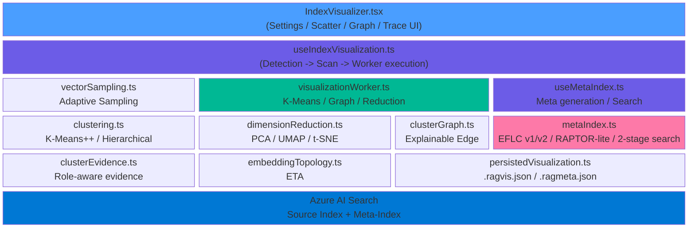
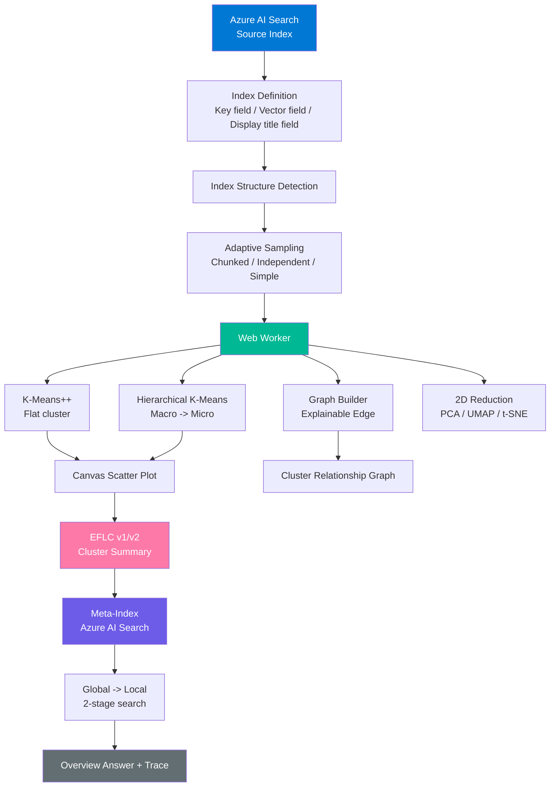
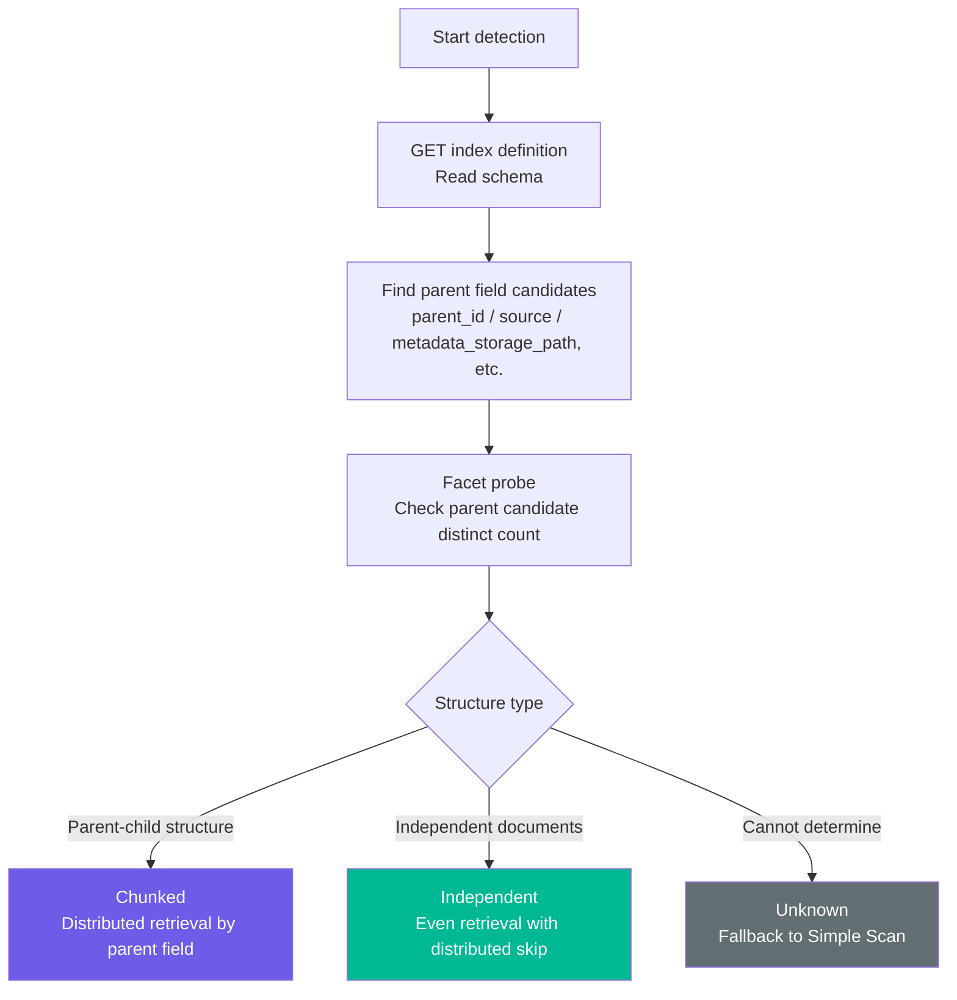
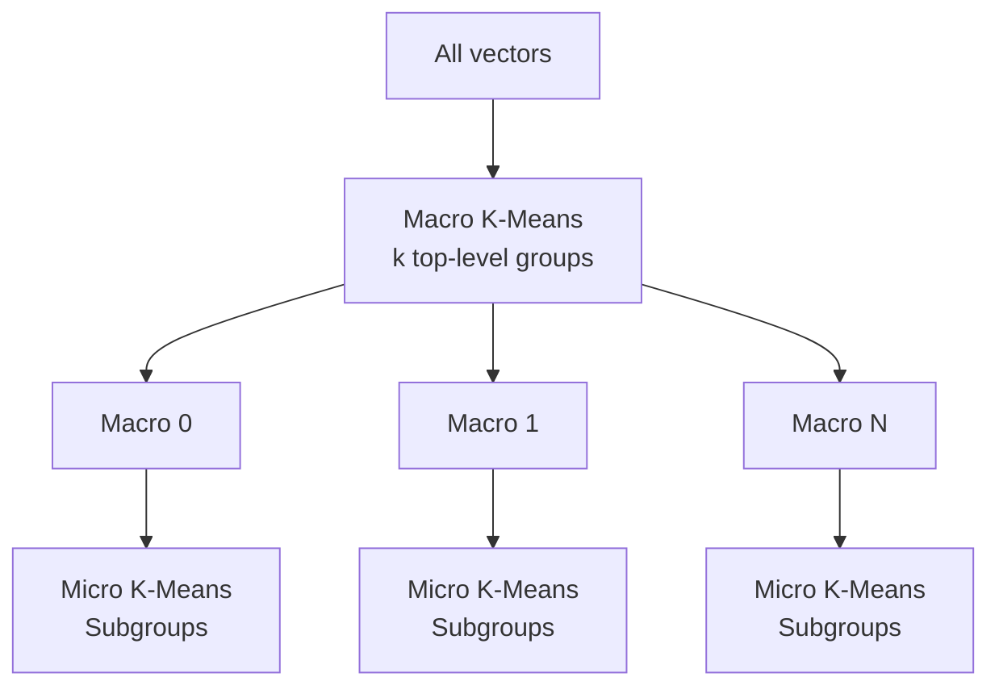
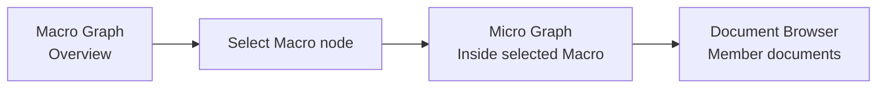
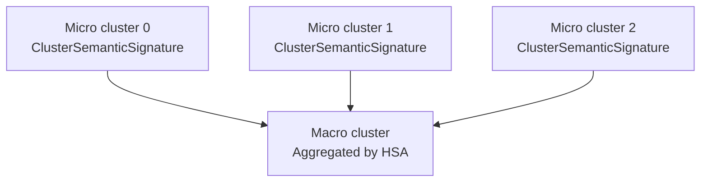
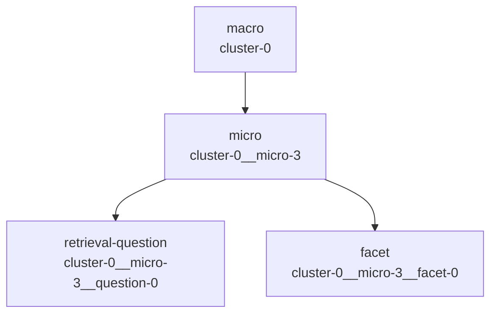
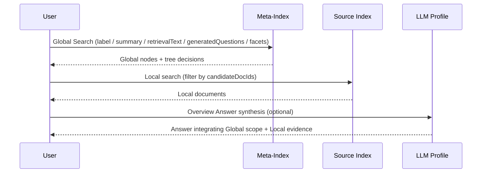
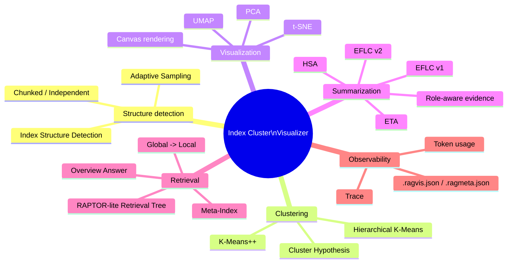

# Index Cluster Visualizer - EFLC-Based Index Structure Visualization and Meta-Index Search

> **EFLC** (**E**mbedding-**F**irst **L**ightweight **C**lustering)

Index Cluster Visualizer retrieves vector fields from an existing Azure AI Search index, clusters the documents, and visualizes the semantic structure of the entire index as a scatter plot, hierarchy view, and cluster relationship graph. It can also store cluster summaries as a meta-index in Azure AI Search and use them for Global (cluster / semantic region) -> Local (source document) 2-stage retrieval.

Index Cluster Visualizer is not just a screen for looking at search results. It is a **workbench for observing which semantic regions an index contains, then reusing that structure for search, evaluation, and improvement**.

---

## Table of Contents

- [Why Index Cluster Visualizer Matters](#why-index-cluster-visualizer-matters)
- [Why EFLC - Differences from GraphRAG](#why-eflc---differences-from-graphrag)
- [Beginner Guide: From Clusters to Search](#beginner-guide-from-clusters-to-search)
- [Architecture Overview](#architecture-overview)
- [Index Structure Detection + Adaptive Sampling](#index-structure-detection--adaptive-sampling)
- [Visualization Pipeline](#visualization-pipeline)
- [Clustering and Dimensionality Reduction](#clustering-and-dimensionality-reduction)
- [Cluster Relationship Graph and Drilldown](#cluster-relationship-graph-and-drilldown)
- [EFLC v1 / v2 Cluster Summaries](#eflc-v1--v2-cluster-summaries)
- [Meta-Index and RAPTOR-lite Retrieval Tree](#meta-index-and-raptor-lite-retrieval-tree)
- [Global -> Local 2-Stage Search](#global---local-2-stage-search)
- [Trace and Observability](#trace-and-observability)
- [Save Formats: .ragvis.json and .ragmeta.json](#save-formats-ragvisjson-and-ragmetajson)
- [Concurrency Control and Cancellation](#concurrency-control-and-cancellation)
- [Persistence Layer](#persistence-layer)
- [Engineering Foundation: Prior Research and Techniques](#engineering-foundation-prior-research-and-techniques)
- [Limitations and Mitigations](#limitations-and-mitigations)
- [Usage in Practice](#usage-in-practice)
- [References](#references)

---

## Why Index Cluster Visualizer Matters

RAG systems often store thousands to hundreds of thousands of chunks or documents in a search index. A normal search UI can tell you what is returned for one query, but it is much harder to understand **which subject regions the whole index contains, where topics are mixed, duplicated, or biased, and how those structures affect retrieval**.

Index Cluster Visualizer uses vectors already stored in an Azure AI Search index to answer questions like these:

| Question | Visualizer view |
|---|---|
| What is this index about as a whole? | Cluster scatter plot, LLM labels, cluster summaries |
| Are chunks biased toward specific sources? | Adaptive Sampling structure detection |
| What is inside an oversized cluster? | Macro -> Micro hierarchical clustering |
| Where do similar clusters connect? | Cluster relationship graph, Bridge Documents, shared facets |
| Which semantic region did a search pass through? | RAPTOR-lite Trace, Global nodes, Local documents |
| Which documents support an LLM summary? | EFLC v2 Trace, role-aware evidence, source field display |

The goal is to treat a search index not as a flat document collection, but as an **observable semantic space**.

---

## Why EFLC - Differences from GraphRAG

GraphRAG extracts entities and relations from documents, builds a graph, and then searches communities or neighborhoods. That design is powerful, but it requires sending all documents through an LLM, which increases both initial build cost and operating cost.

EFLC starts from vector fields that already exist in Azure AI Search. Instead of doing entity extraction first, it **discovers cluster structure in a lightweight way from proximity in embedding space**.

| Aspect | GraphRAG | EFLC |
|---|---|---|
| Initial input | Full raw text | Existing vector fields |
| Main preprocessing | LLM entity / relation extraction | Vector retrieval and clustering |
| LLM cost | Whole-document scale | Representative documents per cluster |
| Storage target | Custom artifacts or graph storage | Azure AI Search meta-index |
| Strength | Knowledge graph construction, relation reasoning | Understanding the index overview, low-cost semantic-region retrieval |

### EFLC Design Principles

```text
1. Reuse existing vectors
   Do not generate additional embeddings by default.

2. Keep clustering in the browser
   Run K-Means++, hierarchical K-Means, and dimensionality reduction in a Web Worker.

3. Use the LLM for cluster explanation, not full-corpus processing
   Generate only cluster labels, summaries, and semantic signatures.

4. Write generated artifacts back to Azure AI Search
   Create a meta-index and manage it through the same Search API surface.

5. Do not separate visualization from retrieval
   Reuse structures observed in scatter plots, graphs, and traces for 2-stage search.
```

---

## Beginner Guide: From Clusters to Search

The goal of this section is not to make you memorize technical terms. It is here so you can understand, in plain language, what the screen is doing and why each step exists.

In one sentence, Index Cluster Visualizer **turns a large set of documents into a map, then uses that map for search**.

```text
Read document features
  -> Put similar documents into groups
  -> Place those groups on the screen as dots
  -> Inspect how the groups are related
  -> Give each group a name and explanation
  -> Save those explanations as a searchable index
  -> Search the group first, then search the original documents
```

The technical names are included only so you can recognize them later in this document. You do not need to memorize them here.

| Phase | Explanation | Technical name you will see later |
|---|---|---|
| 1. Read document features | The tool takes the numeric fingerprint that represents each document's content. This lets it compare documents without asking an LLM to reread all the text. | Vector field |
| 2. Avoid biased sampling | The tool avoids collecting too many chunks from the same PDF or the same source. A map of the index is misleading if the sample only represents one part of it. | Index Structure Detection, Adaptive Sampling |
| 3. Group similar documents | Documents about similar things are placed into the same group. Thousands of documents become easier to inspect as topic groups. | K-Means++ |
| 4. Split oversized groups | A large group can be broken into smaller topic groups. This helps when one broad group hides several different topics inside it. | Hierarchical K-Means |
| 5. Show the map on screen | Similar documents are placed near each other as dots. Raw numeric fingerprints are impossible to inspect directly, so the UI turns them into a visual map. | PCA, UMAP, t-SNE |
| 6. Inspect relationships | The tool shows nearby groups and documents that sit between groups. This helps find overlaps, boundaries, and topics worth comparing. | Cluster relationship graph, Bridge Document |
| 7. Add a quick name | Representative documents are used to give the group a short name and summary. This gives a fast, low-cost answer to "what is this group about?" | EFLC v1 |
| 8. Add a more careful explanation | The tool looks beyond only the most typical documents and includes edge cases too. This avoids vague or misleading names when a group contains mixed topics. | EFLC v2 |
| 9. Build a larger explanation from smaller ones | Smaller group explanations are used to explain the larger group. A large group is easier to explain by combining smaller topics than by guessing one label directly. | HSA |
| 10. Save it for search | Group names, explanations, and related document IDs are saved into a separate searchable index. The map becomes reusable as a search entry point. | Meta-index |
| 11. Search group first, document second | The tool first finds the relevant topic group, then searches the original documents inside that scope. This makes the path from broad topic to evidence document easier to explain. | Global -> Local search, RAPTOR-lite |
| 12. Keep the reasoning trail | The tool keeps a record of which documents were used and which path the search followed. A human can later check why a label or answer was produced. | Trace |

### Simple Q&A

**Q. Why not ask the LLM to read every document first?**  
A. That is expensive and slow. This feature first uses existing numeric fingerprints to find groups of similar documents, then asks the LLM to explain those groups.

**Q. Why is clustering needed?**  
A. It is hard to inspect an entire search index one document at a time. Grouping similar documents lets you see areas such as product information, troubleshooting, or policy content.

**Q. Why are there v1 and v2 modes?**  
A. v1 is the quick mode for giving groups simple names. v2 is the careful mode for checking whether a group contains mixed topics and which documents support the explanation.

**Q. Why create a meta-index?**  
A. It saves the group names and explanations in a searchable form, so the structure found in the visualization can be reused during later searches.

**Q. Why use Global -> Local 2-stage search?**  
A. First it finds the topic area that is likely to matter, then it retrieves the actual evidence documents. This makes the route from broad topic to source document easier to explain.

---

## Architecture Overview

Index Cluster Visualizer consists of four layers: UI, visualization pipeline, meta-index generation, and 2-stage search.



### Modules

| Module | Role |
|---|---|
| `IndexVisualizer.tsx` | Integrated UI for settings, scatter plot, hierarchy view, cluster relationship graph, meta-index operations, 2-stage search, and Trace display |
| `useIndexVisualization.ts` | Manages index definition retrieval, vector field detection, display title field resolution, Adaptive Sampling, and Web Worker execution |
| `vectorSampling.ts` | Reuses `detectIndexStructure()` and runs vector sampling according to Chunked / Independent / Unknown structure |
| `visualizationWorker.ts` | Runs K-Means++, hierarchical K-Means, cluster relationship graph construction, and dimensionality reduction off the main thread |
| `clustering.ts` | Provides K-Means++, hierarchical K-Means, cosine similarity, Silhouette score, and Elbow method |
| `dimensionReduction.ts` | Provides PCA, UMAP, t-SNE, and PCA -> UMAP 2D projection |
| `clusterGraph.ts` | Builds explainable edges from centroid similarity, Bridge Documents, shared facets, and shared keywords |
| `clusterEvidence.ts` | Selects role-aware evidence: Prototype / Diverse / Boundary / Outlier |
| `embeddingTopology.ts` | Provides ETA, which computes cohesion, separation, boundary ratio, outlier ratio, and ambiguity from a KNN graph |
| `metaIndex.ts` | Provides EFLC v1/v2 summaries, HSA, RAPTOR-lite node generation, meta-index creation, 2-stage search, and Overview Answer |
| `persistedVisualization.ts` | Provides save / restore for `.ragvis.json` and `.ragmeta.json` |

### End-to-End Flow



---

## Index Structure Detection + Adaptive Sampling

### Why Adaptive Sampling Is Needed

Azure AI Search RAG indexes commonly have two structures.

| Structure | Example | Problem |
|---|---|---|
| **Chunked** | One PDF or web page is split into multiple chunks | A simple first-page scan can over-sample chunks from the same parent document |
| **Independent** | FAQ entries, products, articles, tickets | A simple first-page scan can inherit index-order bias |

Index Cluster Visualizer reuses the same `detectIndexStructure()` used by Eval Dataset Generator. It estimates the index structure through schema heuristics and facet probes, then switches scan strategy.



### Three Scan Strategies

| Strategy | Implementation | Description |
|---|---|---|
| Simple Scan | `scanVectorsSimple()` | Parallel paging with `$skip` + `$top`. Maximum 10,000 documents. `$skip` stays within Azure AI Search's 100,000 limit |
| Chunked Sampling | `scanVectorsFromChunkedIndex()` | Lists parent values with facets, shuffles parent sources, then retrieves the required number of chunks from each source |
| Distributed Sampling | `scanVectorsDistributed()` | Calculates a stride from the total document count and retrieves from distributed `$skip` offsets |

Main control values in the current implementation:

| Item | Current value |
|---|---:|
| Maximum sample count | 10,000 documents |
| Simple Scan batch size | 100 documents |
| Distributed Sampling batch size | 50 documents |
| Simple / Independent concurrency | 6 |
| Chunked Sampling concurrency | 5 |
| `$skip` limit | 100,000 |

### Display Title Field Resolution

Titles shown in the scatter plot and document browser are auto-detected when the user does not specify a display title field. Detection order:

```text
1. Semantic configuration titleField
2. Common names such as title / name / displayName / metadata_storage_name / path / url
3. Searchable Edm.String field
4. Key field
```

When the user specifies a display title field, the app validates that it exists in the index definition, is `Edm.String`, and is not `retrievable: false`. For vector fields, `retrievable: false` and `stored: false` are also rejected with explicit errors because those vectors cannot be retrieved.

---

## Visualization Pipeline

The visualization pipeline is managed by `useIndexVisualization`, and heavy computation is delegated to `visualizationWorker.ts`.

```text
Phase 1: Detect
  Classify index structure as Chunked / Independent / Unknown

Phase 2: Scan
  Retrieve vector, key, and display title fields

Phase 3: Cluster
  Run K-Means++ and optionally build a Macro -> Micro hierarchy

Phase 4: Graph
  Build candidate inter-cluster edges and explanatory evidence

Phase 5: Project
  Project high-dimensional vectors to 2D

Phase 6: Visualize
  Render Canvas scatter plot, legend, tooltip, and graph
```

### Pipeline Phases

| Phase | Internal state | Main process | Output |
|---|---|---|---|
| Detect | `detecting` | `detectIndexStructure()` | `IndexStructureInfo` |
| Scan | `scanning` | `scanVectorsAdaptive()` or `scanVectorsSimple()` | `ScannedDoc[]` |
| Cluster | `clustering` | K-Means++, hierarchical K-Means | `ClusterResult`, `HierarchicalClusterResult` |
| Graph | `graphing` | Bridge Documents, edges, force-directed layout | `ClusterGraphData` |
| Project | `projecting` | PCA / UMAP / t-SNE / PCA -> UMAP | `PcaResult` |
| Done | `done` | UI display | `VisualizationData` |

### Core Visualization Types

```typescript
type VisualizationData = {
  docs: ScannedDoc[]
  cluster: ClusterResult
  pca: PcaResult
  hierarchical?: HierarchicalClusterResult
  graph?: ClusterGraphData
}
```

`ScannedDoc` is the minimal unit needed for visualization.

```typescript
type ScannedDoc = {
  id: string
  title: string
  vector: Float32Array
}
```

---

## Clustering and Dimensionality Reduction

### K-Means++

The base clustering algorithm is `kMeans()` in `clustering.ts`.

| Item | Details |
|---|---|
| Initialization | K-Means++ |
| Distance | Squared Euclidean distance |
| Randomness | Seeded PRNG with `mulberry32`; default seed is 42 |
| Maximum iterations | 50 |
| Memory | Uses `Float32Array` and `Uint16Array` |

K-Means++ is a lightweight algorithm where the user specifies the cluster count `k`. It runs well in the browser and can use vectors retrieved from Azure AI Search as-is.

### Hierarchical K-Means

When hierarchical mode is enabled, `hierarchicalKMeans()` performs two-level clustering.



| Type | Description |
|---|---|
| `macroLabels` | Macro cluster ID for each document |
| `microLabels` | Globally unique Micro cluster ID for each document |
| `microToMacro` | Mapping from Micro ID to parent Macro ID |
| `microClusters` | Per-Macro Micro clustering result |
| `totalMicroClusters` | Total number of Micro clusters |

The hierarchy view can switch the scatter plot between Flat and Hierarchy modes. In Hierarchy mode, Micro clusters are displayed while Micro clusters under the same Macro share related color shades.

### Dimensionality Reduction

High-dimensional vectors are projected into 2D by `dimensionReduction.ts`.

| Method | Implementation | Characteristics |
|---|---|---|
| PCA | `pcaReduce2D()` | Fast. Good for understanding the overall shape. Can show explained variance ratio |
| UMAP | `umapReduce2D()` | Useful when you want to inspect both local and global structure |
| t-SNE | `tsneReduce2D()` | Useful for checking local cluster separation |
| PCA -> UMAP | `pcaUmapReduce2D()` | Faster path that reduces high-dimensional vectors to 50 dimensions before UMAP |

2D projection is an approximation for visualization. Points that look close in the scatter plot do not always have the same distance relationship in the original high-dimensional space. The cluster relationship graph and 2-stage search also use centroid similarity in the original vector space and Search API results.

---

## Cluster Relationship Graph and Drilldown

The cluster relationship graph is not meant to assert that clusters are definitively related. It first creates candidate edges from centroid similarity, then treats edges with additional evidence as explained edges.

### Edge Evidence

| Evidence | Implementation | Description |
|---|---|---|
| Centroid similarity | `buildClusterEdges()` | Cosine similarity between cluster centroids |
| Bridge Document | `findBridgeNodes()` | Boundary documents assigned to one cluster but also close to neighboring clusters |
| Shared Facet | `signatureJson` / `facetLabels` | Shared viewpoints from EFLC v2 semantic signatures |
| Shared Keyword | `keywords` / `inclusionCriteria` | Shared terms extracted from summaries and criteria |
| Signature overlap | `signatureJson` | Auxiliary score that combines facet and keyword overlap |

In the implementation, the graph generated immediately after visualization is built by `buildClusterGraph()` in the Web Worker and mainly uses evidence computable from raw vectors: Centroid similarity and Bridge Documents. Shared Facet / Shared Keyword / Signature overlap are used when EFLC v2 summaries or a meta cache have been loaded and the graph is rebuilt from meta summaries with `rebuildClusterGraphFromMeta()`.

### Edge Confidence

| confidence | relationKind | Meaning |
|---|---|---|
| `low` | `candidate` | Candidate edge based only on close centroids |
| `medium` | `explained` | Has Bridge Document evidence or semantic signature overlap |
| `high` | `explained` | Has both Bridge Document evidence and semantic signature overlap |

In the UI, edge thickness, opacity, and line style vary by similarity and confidence. Clicking an edge shows the reasons behind it.

### Macro -> Micro Drilldown

When hierarchical clustering is available, the user can select a Macro node in the Macro graph and expand into a Micro graph inside that Macro.



Micro graphs are generated session-locally with `buildHierarchicalClusterGraph()`. Micro node IDs keep the same global IDs as `hierarchical.microLabels`, so the document browser can use the same labels to extract member documents.

A Macro-only graph rebuilt from the meta-index cannot fully reproduce Micro drilldown when original vectors and `VisualizationData.hierarchical` are unavailable. To mitigate this, `.ragmeta.json` can include a `VisualizationSnapshot` when needed.

---

## EFLC v1 / v2 Cluster Summaries

Clustering results are numeric groups, which can be difficult for humans to interpret directly. During meta-index generation, the selected LLM profile generates cluster labels, summaries, keywords, and semantic signatures.

### v1: Lightweight Cluster Summary

v1 gathers representative documents per cluster and asks the LLM to generate a short label, summary, and keywords in JSON. The current implementation also uses role-aware evidence so representative candidates are not biased only toward centroid-nearest documents.

```text
Cluster members
  -> Centroid evidence
  -> Role-aware evidence
  -> Select representative documents within token budget
  -> LLM JSON output
  -> label / summary / keywords
```

v1 is low-cost and fast. It is suitable when you want a first overview or when the number of clusters is small.

### v2: Semantic Signatures for High-Cardinality Indexes

v2 generates a more structured `ClusterSemanticSignature` so cluster explanations remain useful even for high-variance or high-cardinality indexes.

| Element | Description |
|---|---|
| `primaryLabel` | Primary label that distinguishes this cluster from sibling clusters |
| `shortSummary` | Short summary of the cluster |
| `facets` | Major viewpoints in the cluster. Each facet has a label, summary, keywords, and representative document IDs |
| `inclusionCriteria` | Conditions for including content in this cluster |
| `exclusionCriteria` | Similar-but-excluded conditions |
| `evidenceDocIds` | Document IDs used as evidence |
| `splitCandidate` | Whether the cluster is a candidate for splitting as a mixed cluster |

v2 uses the following auxiliary signals.

| Signal | Implementation | Purpose |
|---|---|---|
| Role-aware evidence | `selectRoleAwareEvidence()` | Mix Prototype / Diverse / Boundary / Outlier evidence to reduce representative-document bias |
| Sibling contrast | `buildSiblingContexts()` | Add contrasts with nearby sibling clusters to the prompt |
| ETA | `analyzeEmbeddingTopology()` | Reflect cohesion, separation, boundary ratio, outlier ratio, and ambiguity in the summary |
| Quality scoring | `scoreSignature()` | Check whether labels are too generic and whether splitting is needed |
| Content Filter retry | `contentFilterRetryUserPrompts` | Fall back to safer retry prompts that omit raw text when Azure OpenAI Content Filter is triggered |

### HSA: Hierarchical Signature Aggregation

When hierarchical clustering and v2 are used together, Micro cluster semantic signatures are generated first, then aggregated bottom-up into Macro cluster signatures. This is treated as HSA (Hierarchical Signature Aggregation).



HSA avoids forcing a large Macro cluster into one LLM summary call. Instead, it builds the Macro-level concept from Micro semantic signatures.

---

## Meta-Index and RAPTOR-lite Retrieval Tree

The meta-index is a separate Azure AI Search index that stores cluster summaries and Retrieval Tree nodes. By default, its name is `{sourceIndex}-meta`.

### Main Meta-Index Fields

| Field | Purpose |
|---|---|
| `id` | Meta-document key. Examples: `cluster-0`, `cluster-0__micro-2` |
| `clusterId` | Corresponding Macro cluster ID |
| `nodeKind` | `macro` / `micro` / `retrieval-question` / `facet` / `bridge`, etc. |
| `level` | Level in the tree |
| `parentId` / `childIds` | Parent-child relationship in the RAPTOR-lite tree |
| `label` / `summary` | Main explanation fields for semantic search |
| `retrievalText` | Search surface that combines labels, summaries, questions, facets, and criteria |
| `generatedQuestions` | Natural-language queries that the node can answer well |
| `retrievalIntents` | Retrieval intents such as overview, comparison, and troubleshooting |
| `facetLabels` / `facetSummaries` | Viewpoints from v2 semantic signatures |
| `inclusionCriteria` / `exclusionCriteria` | Criteria used to guide query interpretation |
| `memberDocIds` | Candidate document IDs on the Source Index side |
| `referenceDocIds` | Evidence document IDs for summaries or question nodes |
| `centroidVector` | Cluster centroid vector for future vector search expansion on the meta-index |
| `signatureJson` / `qualityJson` / `topologyJson` / `hierarchyJson` | Structured metadata for Trace and UI display |

### RAPTOR-lite Nodes

When v2 and hierarchical clustering are used together, not only Macro summaries but also Micro nodes, Retrieval Question nodes, and Facet nodes are uploaded to the meta-index.



This design implements RAPTOR's idea of searching summary nodes at different abstraction levels in a lightweight way on top of an Azure AI Search meta-index. It does not port full RAPTOR. Instead, it derives retrieval surfaces from EFLC Macro / Micro / generated questions / facets that have already been created by EFLC v2 / HSA.

---

## Global -> Local 2-Stage Search

2-stage search first finds semantic regions in the meta-index, then searches the Source Index using candidate document IDs from those regions.



### Current Global Search

When the RAPTOR-lite schema is available, Global Search uses these retrieval surface fields:

```typescript
const RAPTOR_META_SEARCH_FIELDS = [
  'label',
  'summary',
  'retrievalText',
  'generatedQuestions',
  'retrievalIntents',
  'facetLabels',
  'facetSummaries',
  'inclusionCriteria',
]
```

For older meta-index schemas, it falls back to legacy Global Search centered on `label` / `summary` / `keywords`.

### Node Decision

The matched Global nodes determine how candidate documents are collected.

| Hit node | Typical action | Description |
|---|---|---|
| `macro` | `use-node` / `descend-children` | Use a broad subject region, or descend to child nodes |
| `micro` | `use-node` | Narrow candidates to a more specific semantic unit |
| `retrieval-question` | `ascend-parent` | Go back from a question node to its parent Micro / Macro and use related documents |
| `facet` | `ascend-parent` | Go back from a viewpoint node to the parent cluster and use documents for that facet |
| `bridge` | `expand-bridge` | Design slot for expanding boundary / comparison queries across clusters |

Local Search puts candidate document IDs into a `search.in()` filter and searches the Source Index. If filter-based search fails, it falls back to unfiltered search.

### Overview Answer

When Local documents are available, the selected LLM profile generates one Overview Answer. Global nodes explain search scope and intent, while factual claims are grounded primarily in Local documents. Trace records Global nodes, Local documents, reference IDs, answer synthesis activity, and token usage.

---

## Trace and Observability

Index Cluster Visualizer keeps Trace data so users can inspect which evidence the LLM used to generate cluster summaries and answers.

### MetaClusterTrace

| Item | Description |
|---|---|
| `clusterId` | Target cluster ID |
| `summaryMode` | `v1` or `v2` |
| `traceLevel` | `flat` / `micro` / `macro` |
| `systemPrompt` / `userPrompt` | Prompts sent to the LLM |
| `response` / `error` | LLM response or error |
| `promptTokens` / `completionTokens` / `totalTokens` | Token usage |
| `representativeDocIds` | Document IDs used as evidence |
| `evidenceStats` | Evidence role distribution |
| `indexFields` | Source Index fields used to produce summaries |
| `pipelineSteps` | Step-by-step EFLC v2 processing record |
| `output` | Final semantic signature, ETA, and HSA information |

### EFLC v2 Pipeline Steps

Flat / Micro v2 Trace includes `evidence-selection`. In hierarchical v2 Macro Trace, the input is Micro semantic signatures rather than raw document evidence, so `hierarchical-aggregation` is included.

```text
member-collection
  Collect cluster member documents

evidence-selection
  Select Prototype / Diverse / Boundary / Outlier evidence

hierarchical-aggregation
  In HSA Macro Trace, aggregate Macro signature candidates bottom-up from Micro signatures

topology-analysis
  Compute cohesion, separation, and mixedness with ETA

sibling-contrast
  Add contrasts against nearby sibling clusters

llm-signature
  Generate ClusterSemanticSignature with the LLM

quality-scoring
  Check overly generic labels and split candidates

meta-document
  Shape the output for storage in the meta-index
```

The Trace modal shows the Source Index key field, vector field, display title field, and summary content fields that were used. This makes it possible to inspect which fields supported a summary even after loading a `.ragmeta.json` file later.

---

## Save Formats: .ragvis.json and .ragmeta.json

Index Cluster Visualizer clearly separates visualization structure from LLM / Meta state.

| Format | Purpose | Includes | Does not include |
|---|---|---|---|
| `.ragvis.json` | Save and share visualization structure | Settings, document IDs and titles, cluster labels, centroids, coordinates, hierarchy, graph | Original vectors, LLM summaries, Trace |
| `.ragmeta.json` | Cache Meta generation results | Cluster summaries, Trace, token usage, optional visualization snapshot | The actual Azure AI Search meta-index |

### .ragvis.json

`.ragvis.json` is a snapshot for reproducing the scatter plot and graph. To keep file size under control, it does not store original vectors. After loading, it restores the cluster labels, centroids, and 2D coordinates from the saved run rather than reclustering.

Main fields:

```typescript
interface VisualizationSnapshot {
  version: 1
  kind?: 'ragops.visualization'
  createdAt: string
  indexName: string
  vectorField: string
  settings: {
    k: number
    microK: number
    maxDocs: number
    enableHierarchical: boolean
    enableGraph: boolean
    graphEdgeThreshold: number
    reductionMethod: string
    enableAdaptiveSampling: boolean
  }
  docs: Array<{ id: string; title: string }>
  labels: number[]
  centroids: number[][]
  counts: number[]
  inertia: number
  coords: [number, number][]
  explainedVariance: [number, number]
  hierarchical?: {
    macroLabels: number[]
    microLabels: number[]
    microToMacro: number[]
    totalMicroClusters: number
    microClusters?: Array<{
      labels: number[]
      centroids: number[][]
      counts: number[]
      inertia: number
    }>
  }
  graph?: ClusterGraphData
}
```

Current `.ragvis.json` exports do not include LLM summaries. The reader still has room for backward compatibility with older summary-bearing snapshots, but new saves separate visualization structure into `.ragvis.json` and LLM / Meta state into `.ragmeta.json`.

### .ragmeta.json

`.ragmeta.json` caches cluster summaries, Trace, and Meta preview state so development and validation can reuse LLM outputs without rerunning the summarization pipeline.

```typescript
interface MetaIndexSnapshot {
  version: 1
  kind: 'ragops.meta-index-cache'
  createdAt: string
  indexName: string
  vectorField: string
  summaryMode: 'v1' | 'v2'
  metaIndexName?: string | null
  metaTokenUsage?: { prompt: number; completion: number; total: number }
  clusterSummaries: ClusterSummary[]
  metaTraces?: MetaClusterTrace[]
  visualization?: VisualizationSnapshot
}
```

The important rule is: **do not overlay a `.ragmeta.json` from a different clustering run onto a new `.ragvis.json`**. Cluster IDs are meaningful only for the K-Means run that produced them. When a new visualization is run, existing meta summaries, Trace data, rebuilt graphs, and related state are cleared.

---

## Concurrency Control and Cancellation

### Visualization Pipeline

The visualization pipeline can be cancelled with a combination of `AbortController` and Web Worker termination.

- During scanning, the `AbortSignal` is passed to Search REST API calls.
- During clustering, graph construction, and dimensionality reduction, the Web Worker is terminated.
- The UI shows a two-level progress bar.
  - First bar: overall phase (Detect / Scan / Cluster / Graph / Project)
  - Second bar: progress inside the current phase. Scan shows retrieved count; Worker phases use indeterminate progress.

```typescript
type Phase =
  | 'idle'
  | 'detecting'
  | 'scanning'
  | 'clustering'
  | 'graphing'
  | 'projecting'
  | 'done'
  | 'error'
```

### Meta Generation Pipeline

Meta-index generation also has a two-level progress bar.

```typescript
type MetaIndexPhase =
  | 'idle'
  | 'fetching-texts'
  | 'summarizing'
  | 'creating-index'
  | 'uploading'
  | 'done'
  | 'error'
```

During `summarizing`, the UI shows processed cluster count, total cluster count, and the current cluster label. If LLM calls fail for some clusters, the UI displays the failure count and errors as a warning, while using fallback labels where possible.

---

## Persistence Layer

| Layer | Storage | Contents |
|---|---|---|
| Visualization snapshot | `.ragvis.json` | Main UI save / load path. Keeps cluster structure, coordinates, hierarchy, and graph |
| Meta cache | `.ragmeta.json` | Keeps LLM summaries, Trace, token usage, and optional visualization snapshot |
| Small snapshot API | `localStorage` | CRUD functions in `persistedVisualization.ts`. File save is recommended for large data |
| Azure AI Search | `{sourceIndex}-meta` | Actual meta-index with searchable cluster summaries and Retrieval Tree nodes |

The `Clear` action removes visualization data, meta summaries, Trace, search results, rebuilt graphs, and related UI state, but does not delete the meta-index in Azure AI Search. To remove the Azure resource itself, explicitly run the meta-index delete action.

---

## Engineering Foundation: Prior Research and Techniques

Index Cluster Visualizer is not just a scatter plot. It combines techniques from information retrieval, clustering, visualization, and RAG-oriented summarization in a lightweight implementation.



### Cluster Hypothesis

The Cluster Hypothesis in information retrieval states that related documents tend to be close to each other. In Azure AI Search indexes that use dense embeddings, semantically close documents tend to be close in vector space, so clustering can reveal subject regions.

### K-Means++ and Hierarchical Clustering

K-Means++ chooses initial centroids with distance-proportional sampling, making clustering more stable than naive random initialization. Index Cluster Visualizer uses this lightweight property to run clustering inside a browser Web Worker.

Hierarchical K-Means works well with retrieval units at different abstraction levels, similar to RAPTOR. Macro represents broad groups across the index, and Micro represents finer groups inside each Macro.

### PCA / UMAP / t-SNE

Dimensionality reduction projects embedding-space structure into 2D so humans can inspect it.

- PCA is fast, deterministic, and useful for overview inspection.
- UMAP is useful for balancing local and global structure.
- t-SNE emphasizes local separation, making it useful for checking cluster separation.

These projections are for visualization and do not perfectly preserve original high-dimensional distance.

### Role-Aware Evidence and MMR-Like Diversification

If cluster summaries use only centroid-nearest documents, they can describe typical examples well but miss peripheral topics and boundary documents. The current implementation mixes Prototype, Diverse, Boundary, and Outlier evidence to reduce representative-document bias.

This is close to the MMR (Maximal Marginal Relevance) idea of balancing relevance and diversity.

### ETA and HSA

ETA (Embedding Topology Analysis) measures how cohesive a cluster is, how much it overlaps with neighboring clusters, and how many outliers it contains. EFLC v2 includes ETA in prompts and Trace so ambiguous clusters are not forced into a single overconfident label.

HSA (Hierarchical Signature Aggregation) aggregates Micro semantic signatures into Macro signatures. For mixed large clusters, bottom-up composition from finer signatures is often easier to explain than summarizing the entire Macro cluster at once.

### RAPTOR-lite

RAPTOR searches tree-structured summary nodes at different abstraction levels. Index Cluster Visualizer does not port full RAPTOR. Instead, it implements RAPTOR-lite by storing EFLC Macro / Micro / generated question / facet nodes in the Azure AI Search meta-index.

This lets Trace show which abstraction-level node was matched, which parent-child path was followed, and how candidate documents were reached.

---

## Limitations and Mitigations

Index Cluster Visualizer is powerful, but it assumes browser-side computation and Azure AI Search REST APIs, so it has several limitations.

| Limitation | Details | Mitigation |
|---|---|---|
| `$skip` limit | Azure AI Search `$skip` cannot exceed 100,000 | Use Adaptive Sampling and explicitly control maximum document count |
| Browser memory | Vectors are stored as `Float32Array`, so large datasets consume memory | Move heavy computation to Web Worker and start with 500-1,000 documents |
| K-Means dependency on k | Bad `k` values can create mixed or overly fragmented clusters | Use larger k for high-cardinality indexes and enable hierarchy mode |
| 2D projection misreading | Scatter plot distances do not perfectly represent original high-dimensional distances | Treat scatter plot as an overview, and combine it with graph and Trace evidence |
| LLM summary quality | Domain terms, noise, very short text, and mixed clusters can reduce summary quality | Use EFLC v2, role-aware evidence, ETA, HSA, and Trace inspection |
| Content Filter | Representative document text may trigger Azure OpenAI Content Filter | Gradually fall back to retry prompts that omit raw text |
| Meta JSON mismatch | Overlaying `.ragmeta.json` from another clustering run can break labels | Treat `.ragvis.json` and `.ragmeta.json` as artifacts from the same run |
| Meta-index cost | `{sourceIndex}-meta` is a real Azure AI Search index | Explicitly delete it when it is no longer needed |

### Recommended Settings for High-Cardinality Indexes

| Index type | Recommended k | Recommended mode |
|---|---:|---|
| Technical-document chunks | 5-10 | Adaptive Sampling + Flat / Hierarchy |
| FAQ / support articles | 5-15 | Flat |
| Wikipedia-style independent documents | 15-30 | Adaptive Sampling + Hierarchy |
| Product catalog | 10-20 | Hierarchy |
| Academic paper corpus | 10-25 | Hierarchy + EFLC v2 |

---

## Usage in Practice

For the current implementation, this is the safest workflow.

```text
1. Start with 500-1,000 documents
2. Enable Adaptive Sampling and inspect the detected structure
3. Use PCA for the overview, then try UMAP or t-SNE if needed
4. Adjust k, and enable hierarchy mode when many clusters are mixed
5. Inspect nearby clusters and Bridge Documents in the cluster relationship graph
6. Generate a meta-index with EFLC v1 for low-cost inspection, or EFLC v2 for higher-precision inspection
7. Check fields used, evidence, ETA, HSA, and token usage in Trace
8. Save `.ragvis.json` and `.ragmeta.json` separately
9. Inspect the Global node -> Local document flow with 2-stage search
10. Delete the meta-index from Azure AI Search when it is no longer needed
```

### Choosing the Right Operation

| Goal | Recommended operation |
|---|---|
| Understand the index overview | PCA + Flat view + v1 summary |
| Split mixed clusters | Hierarchy view + Micro graph |
| Inspect boundary topics | Cluster graph + Bridge Document |
| Generate higher-quality cluster names | EFLC v2 + Trace inspection |
| Revalidate while reducing LLM cost | Load `.ragmeta.json` |
| Share only visualization results | Share `.ragvis.json` |
| Reduce search space for a large index | Generate meta-index + Global -> Local 2-stage search |

This tool does not automatically guarantee final search quality. Its best role is as an instrument for **observing semantic structure, cluster granularity, summary evidence, and retrieval paths in a search index so you can identify where to improve**.

---

## References

| # | Paper / Project | Year | Usage in this feature |
|---|---|---:|---|
| 1 | Microsoft Research. **From Local to Global: A Graph RAG Approach to Query-Focused Summarization** | 2024 | Design reference for Global / Local Search and Community Summary |
| 2 | Sarthi et al. **RAPTOR: Recursive Abstractive Processing for Tree-Organized Retrieval** | 2024 | Design reference for RAPTOR-lite Retrieval Tree |
| 3 | Arthur, D. and Vassilvitskii, S. **K-Means++: The Advantages of Careful Seeding** | 2007 | K-Means++ initialization |
| 4 | McInnes et al. **UMAP: Uniform Manifold Approximation and Projection for Dimension Reduction** | 2018 | UMAP 2D projection |
| 5 | van der Maaten and Hinton. **Visualizing Data using t-SNE** | 2008 | t-SNE 2D projection |
| 6 | Carbonell and Goldstein. **The Use of MMR, Diversity-Based Reranking for Reordering Documents and Producing Summaries** | 1998 | Design reference for role-aware evidence diversification |
| 7 | Mehrotra et al. **TnT-LLM: Text Mining at Scale with Large Language Models** | 2024 | Design reference for large-scale label generation and refinement |
| 8 | Pham et al. **TopicGPT: A Prompt-based Topic Modeling Framework** | 2024 | Design reference for LLM-based topic naming and hierarchical labeling |
| 9 | Azure AI Search Documentation | 2024- | Specifications for indexes, semantic search, vector search, CORS, and REST APIs |
