# RAGOps Studio — for Azure AI Search

[English version](INTRODUCTION.md)

> **📖 [詳しい日本語紹介記事](https://qiita.com/nohanaga/items/f5d6ec340f238c8220be)**

**RAGOps, from query to quality.**

本番 RAG（Retrieval-Augmented Generation）システムにおいて、検索品質の継続的な改善は最も重要な課題のひとつです。しかし、Azure AI Search の高度な機能を活用しようとすると、複雑な REST API パラメータの設定、ベクトル検索やハイブリッド検索の最適化、Knowledge Retrieval API（Agentic retrieval）の実装など、開発者は多くの技術的ハードルに直面します。

これらの課題を解決するために、Azure AI Search の高度な機能を最大限に活用し、RAG システムの開発・運用を劇的に効率化するオープンソースの **RAGOps プラットフォーム**「**RAGOps Studio — for Azure AI Search**」を開発しました。

このツールは単なる GUI クライアントではありません。**検索クエリから品質改善までのエンドツーエンドのライフサイクル**を支援する、プロフェッショナルな開発・運用統合環境です。

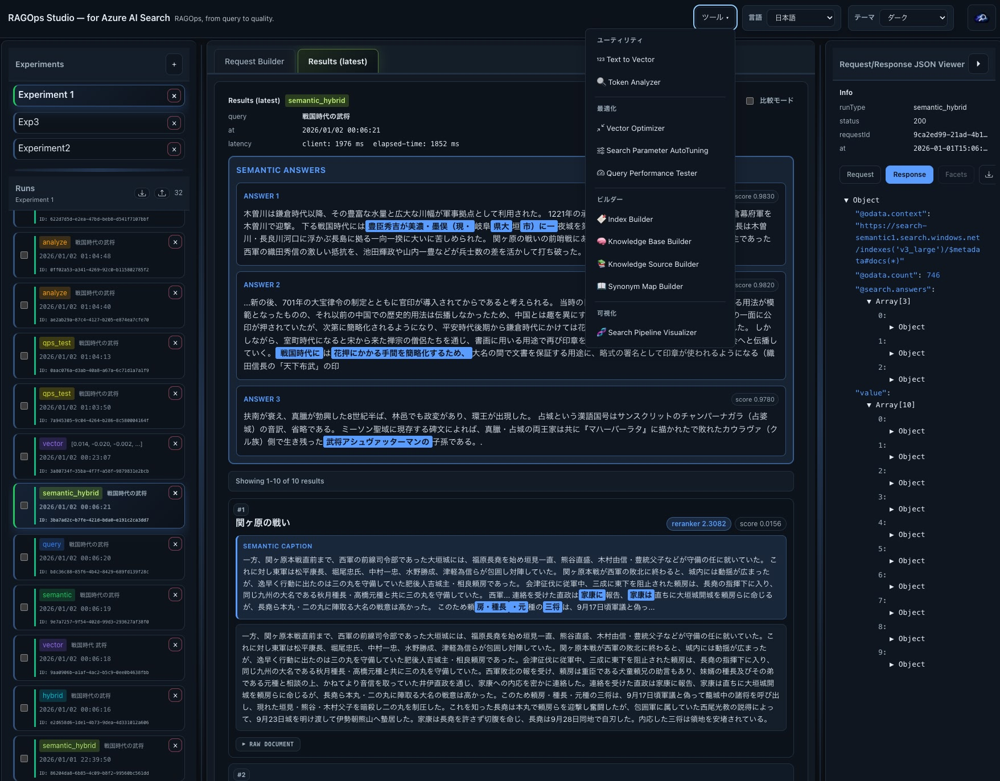

# RAGOps とは？

RAGOps は、[MLOps](https://learn.microsoft.com/training/paths/introduction-machine-learn-operations/) や DevOps の概念を RAG システムに適用した新しい運用思想です。

- **検索品質の継続的な計測と改善**
- **実験管理とパラメータチューニングの自動化**
- **パフォーマンスモニタリングと最適化**
- **開発環境から本番環境までの一貫したワークフロー**

**RAGOps Studio — for Azure AI Search** は、RAGOps の実践を可能にする初めての包括的ツールとして設計されました。実は 4 年前に [Simple-Cognitive-Search-Tester](https://github.com/nohanaga/Simple-Cognitive-Search-Tester) を開発しており、それを大幅にアップデートしたものです。

https://qiita.com/nohanaga/items/2a90539f7667fa9e486a

# なぜこのツールが必要なのか？

## 開発者が直面する課題

本番環境で RAG システムを構築・運用する際、開発者は以下のような高度な要件に直面します：

- **最新 API 機能の活用**: Knowledge Retrieval API などのプレビュー機能を迅速に検証
- **複雑なパラメータのチューニング**: ベクトル検索パラメータ（`vectorThresholdKind`、`vectorOversampling`、`vectorFilterOverride` など）を体系的にテスト
- **実験管理とトレーサビリティ**: クエリ履歴、結果比較、パラメータチューニング履歴を一元管理
- **定量的なパフォーマンス評価**: QPS 測定やレイテンシ分析を含む包括的なベンチマーク
- **エンドツーエンドのワークフロー**: インデックス管理、Knowledge Base 作成、検索テスト、評価を統合環境で実行

## RAGOps Studio — for Azure AI Search が提供する価値

これらの開発者ニーズに対して、**RAGOps Studio — for Azure AI Search** は以下を提供します：

1. **最新 API への即時対応**: Azure AI Search の最新プレビュー機能を含むすべての機能に完全対応（[Knowledge Retrieval API](https://learn.microsoft.com/rest/api/searchservice/knowledge-retrieval/retrieve?view=rest-searchservice-2025-11-01-preview&tabs=HTTP) 2025-11-01-preview）
2. **エンドツーエンドの実験管理**: クエリ作成から実行、結果保存、比較、評価までを統合
3. **パラメータ最適化の自動化**: Search Parameter AutoTuning による科学的アプローチ
4. **本番対応の分析**: QPS テスト、Search Pipeline Visualizer による 4 段階検索比較
5. **最大限の開発者体験**: 直感的な UI とプロフェッショナル機能のバランス

# 🧠 Azure AI Search の高度な機能を完全カバー

このツール最大の革新は、**MLOps の概念を RAG システムに持ち込んだこと**です。

## 革新①：実験管理コンセプトの導入 → RAGOps の実現

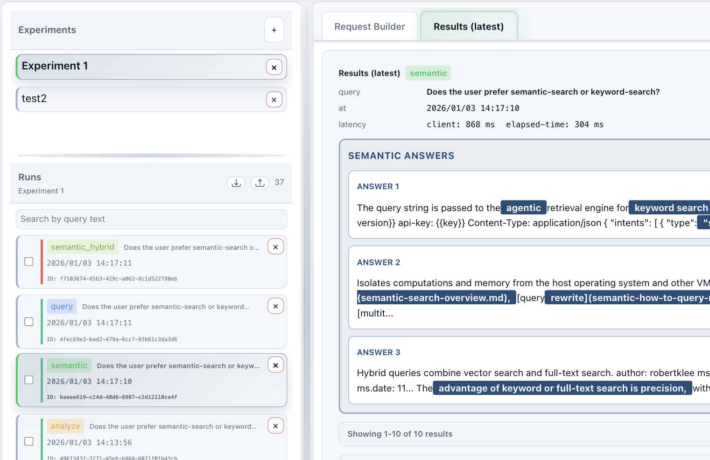

従来の検索システム開発では、パラメータチューニングは「試行錯誤の繰り返し」でした。しかし、**RAGOps Studio — for Azure AI Search** は **MLOps の実験管理の概念を RAG に適用**し、体系的な品質改善を可能にします。

**Experiment → Run → Artifact の階層構造**：
- **再現性**: すべての検索パラメータと結果を自動保存
- **比較可能性**: 最大 10 件の Run を並列表示し、差異を可視化
- **トレーサビリティ**: どのパラメータがどの結果を生み出したかを追跡
- **環境移行**: Export/Import により開発から本番まで一貫性を確保

### 比較可能性
これは私のお気に入りの機能のひとつです。

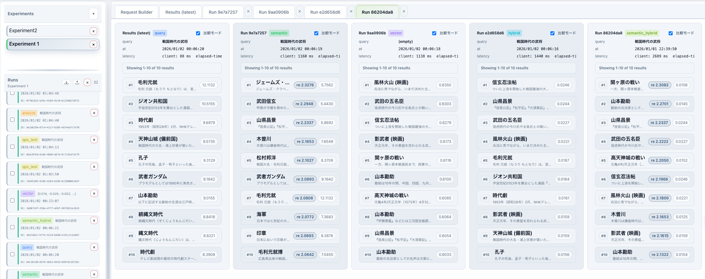

**最大 10 件の Run を同時比較**
- タブ形式で複数の結果を並列表示
- 各タブを個別に閉じることが可能
- 比較モードでコンパクトな結果表示

これは検索システムに機械学習の実験管理ツールの思想を持ち込む、**私にとって初めての試み**です。

## 革新②：AutoML コンセプトの導入 → Search Parameter AutoTuning

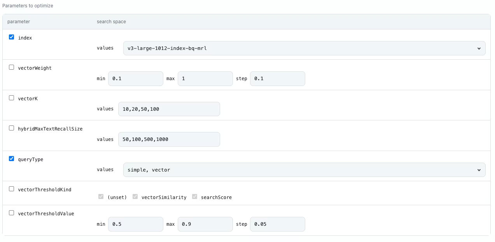

**Search Parameter AutoTuning** は、AutoML（自動機械学習）の概念を検索システムに適用したものです。

**AutoML との比較**
| 観点 | AutoML | Search Parameter AutoTuning |
|------|--------|----------------------------|
| 目的 | モデルの自動最適化 | 検索パラメータの自動最適化 |
| 手法 | ハイパーパラメータ探索 | グリッドサーチ＋評価指標 |
| 評価 | Accuracy、F1 スコア、AUC | Precision@k、Recall@k、NDCG、MRR |
| 出力 | 最適モデル | 最適検索設定 |

**従来の課題**
- パラメータの組み合わせ爆発（`vectorWeight` × `vectorK` × `queryType` × ... ＝ 数百の組み合わせ）
- 手動評価の限界（主観的で再現不可能）
- 属人化したベストプラクティス

**AutoTuning による解決**
- **自動探索**: すべてのパラメータ組み合わせを体系的に評価
- **客観的評価**: 情報検索の標準指標（NDCG、MRR）で定量化
- **知識の民主化**: JSON でベスト設定を共有

これにより、**データサイエンティストが機械学習モデルを最適化するように、検索システムの科学的最適化**が可能になります。

## 革新③：Visual Skill Pipeline Builder — IDE ライクなスキルセットオーサリングをブラウザで実現

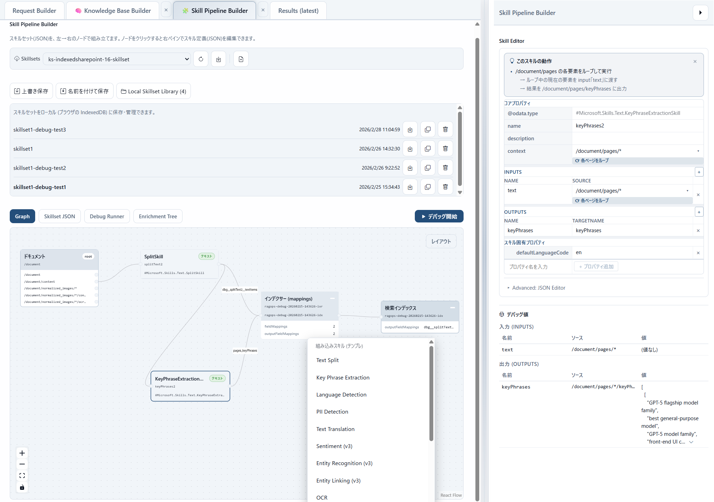

Azure AI Search の**スキルセット**は、AI エンリッチメントパイプラインの基盤です。ドキュメントの解析、分析、埋め込み、エンリッチメントが検索インデックスに到達するまでのプロセスを管理します。しかし従来は、深くネストされた JSON を手動編集し、`/document/…` のエンリッチメントパスを頭の中で追跡し、動作確認のためにインデクサーをデプロイする必要がありました。

**Skill Pipeline Builder** は、RAGOps Studio 内に**ビジュアル DAG（有向非巡回グラフ）エディタ**を直接導入することで、これを変革します。

**従来のアプローチとの比較**
| 観点 | 従来の JSON 編集 | Skill Pipeline Builder |
|------|--------|----------------------------|
| スキルの接続 | `/document/…` パスを手動でコピー＆ペースト | ノード間のエッジをドラッグ＆ドロップ |
| パイプライン全体像 | 数百行の JSON をスクロール | 左から右へのビジュアルフローを一目で確認 |
| スキルの追加 | ドキュメントからボイラープレート JSON を記述 | 15 個の組み込みテンプレートからワンクリック |
| デバッグ＆検証 | インデクサーデプロイ → インデックス確認 → 原因推測 | Debug Runner: プロビジョン → 実行 → フェッチ → プレビュー、すべてブラウザ内 |
| エンリッチメントパス | context / output / input パスを暗記 | ツリープレビュー付き自動補完 EnrichmentPathPicker |
| 配列処理 | context と sources に手動で `/*` を追加 | Collection 型出力のワイルドカード自動伝播 |

**主な機能**
- **15 個の組み込みスキルテンプレート**: Text Split、Key Phrase Extraction、OCR、Azure OpenAI Embedding、ChatCompletion、Custom Web API など
- **エンリッチメントツリーの可視化**: すべての `/document/…` パス、生成元、消費先を確認
- **Debug Runner**: 一時的なリソース（データソース、インデックス、インデクサー、スキルセット）を Azure Blob Storage に対して自動プロビジョニングし、エンリッチメントを実行、Knowledge Store 経由で結果をフェッチ、クリーンアップ — すべてビルダー内で完結
- **インデクサー統合**: 既存のインデクサーを読み込み、`outputFieldMappings` をビジュアル編集
- **パイプライン状態の永続化**: LocalStorage に複数のパイプライン設定を保存・復元

これにより、最新の IDE に開発者が期待する**反復的でビジュアルな開発体験**を、Azure AI Search のスキルセットオーサリングの世界に持ち込みます。

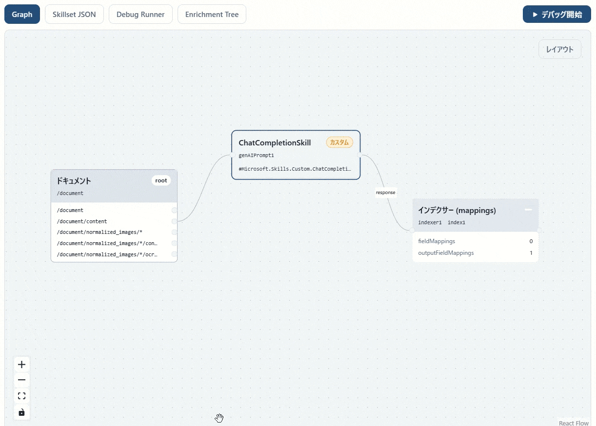

# 🧪 4 つの Search Lab モード — Azure AI Search の全機能を完全カバー

## 1. Query モード — クラシック検索をマスター

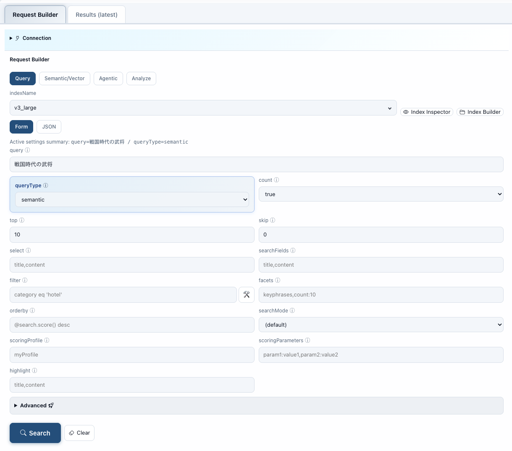

Azure AI Search の基盤となる全文検索機能を完全サポート

**主要サポートパラメータ**
- **Lucene クエリ構文**: `simple` モードと `full` モードの両方をサポート、ワイルドカード・正規表現・近接検索を含む高度なクエリ
- **OData フィルター**: GUI で複雑な条件式を直感的に構築、プレビューしながら調整
- **カスタムスコアリング**: Scoring Profile と Scoring Parameters でビジネスロジックを反映
- **ファセット集計**: カテゴリ分類やドリルダウン検索を実装
- **ハイライト**: クエリのマッチ箇所を自動抽出・表示
- **レプリカカバレッジ**: `minimumCoverage` による可用性とレイテンシのバランス調整

## 2. Semantic-Vector モード — ハイブリッド検索の最適化

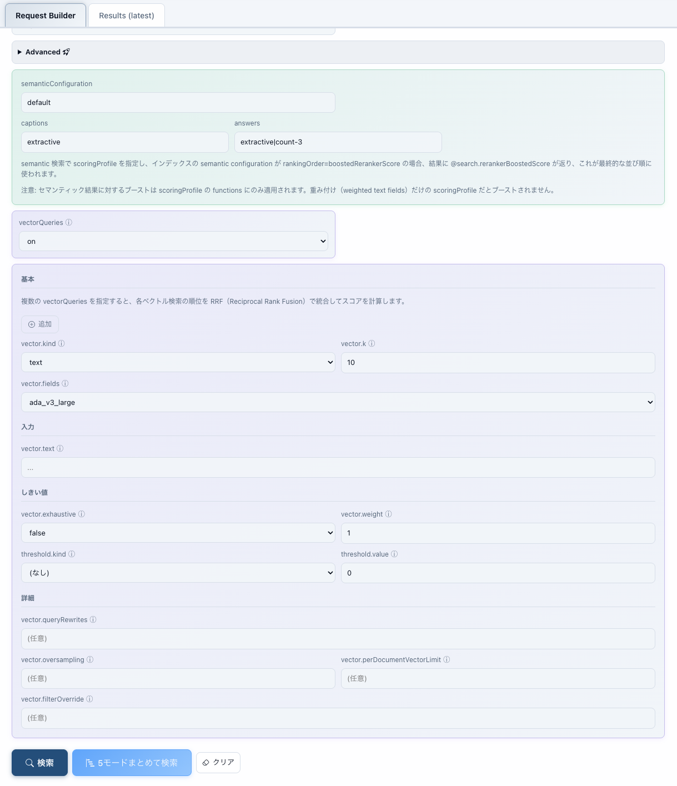

Azure AI Search の最新ベクトル検索・セマンティック検索機能を統合。

**セマンティック検索の完全サポート**
- **L2 Semantic Ranker**: Microsoft の言語理解モデルによる意味ベースの再ランキング
- **Captions and Answers**: クエリに対する抽出的要約の自動生成
- **50 以上の言語サポート**: `queryLanguage` による多言語最適化
- **スペル補正**: `lexicon` モードでの自動修正

**ベクトル検索の高度な制御**
- **複数ベクトルクエリ**: 異なる埋め込みモデル（`text-embedding-ada-002`、`text-embedding-3-large`）の結果を統合
- **マルチモーダル検索**: テキスト、画像 URL、画像バイナリの混合クエリ
- **Exhaustive モード**: HNSW の全探索による最大精度

**ハイブリッド検索の最適化**
- **vectorWeight**: 全文検索とベクトル検索のバランス調整（0.0-1.0）
- **RRF (Reciprocal Rank Fusion)**: 複数検索結果の統合アルゴリズム
- **vectorFilterMode**: プレフィルター vs ポストフィルターの選択（パフォーマンスへの大きな影響）
- **hybridMaxTextRecallSize**: テキスト検索の取得件数制限によるコスト最適化
- **oversampling**: HNSW グラフの探索精度向上（品質とレイテンシのトレードオフ）
- **perDocumentVectorLimit**: マルチベクトルドキュメントの最適化

## 3. Agentic モード — Knowledge Retrieval API の高速実装

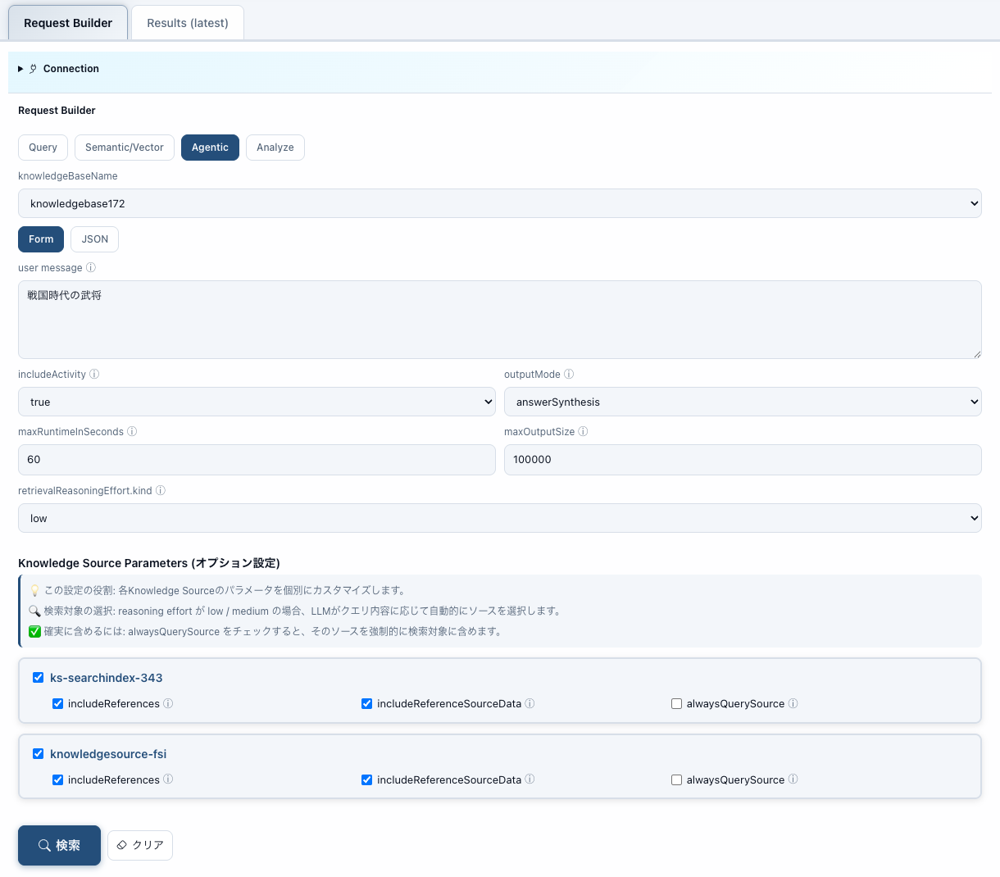

Azure AI Search の最新機能（2025-11-01-preview）に最速対応。

**Knowledge Retrieval API の革新**

**Agentic Search の実現**
- 従来のシンプルな「クエリ → 結果」フローを超越
- マルチステップ推論と検索を組み合わせた高度な情報取得
- 自然言語の意図を理解し、最適な検索戦略を自動選択
- クエリ書き換え、クロス Knowledge Source 検索、結果統合を自動化

https://qiita.com/nohanaga/items/26c27574f552c4bfc033

**Activity Logs による透明性**
- エージェントがどのようにクエリを書き換えたか
- どの Knowledge Source が検索されたか
- いくつのドキュメントが取得されたか
- 最終応答の生成にいくつのトークンが使用されたか

**Agentic Activity Timeline**

新しい **Agentic Activity Timeline** コンポーネントは、Agentic Retrieval プロセス全体の階層的フロー可視化を提供します：

- **ラウンドベースのグルーピング**: アクティビティは `modelQueryPlanning` → ソース検索（並列） → `agenticReasoning` → `modelAnswerSynthesis` のフローに従い、ラウンドごとに自動分類
- **並列レーン表示**: ラウンド内の複数ソース検索をパラレルグリッドレイアウトで表示
- **ステップごとのメトリクス**: 各ステップで経過時間（ms）、入力/出力/推論トークン数、ヒット数をカラーピルで表示
- **検索クエリ表示**: 各 Knowledge Source に送信された検索クエリをインラインコードで表示
- **展開可能な生 JSON**: 各アクティビティステップの生レスポンスデータをクリックで展開・確認
- **サマリーバー**: 合計ステップ数、合計経過時間、合計トークン使用量を一目で確認

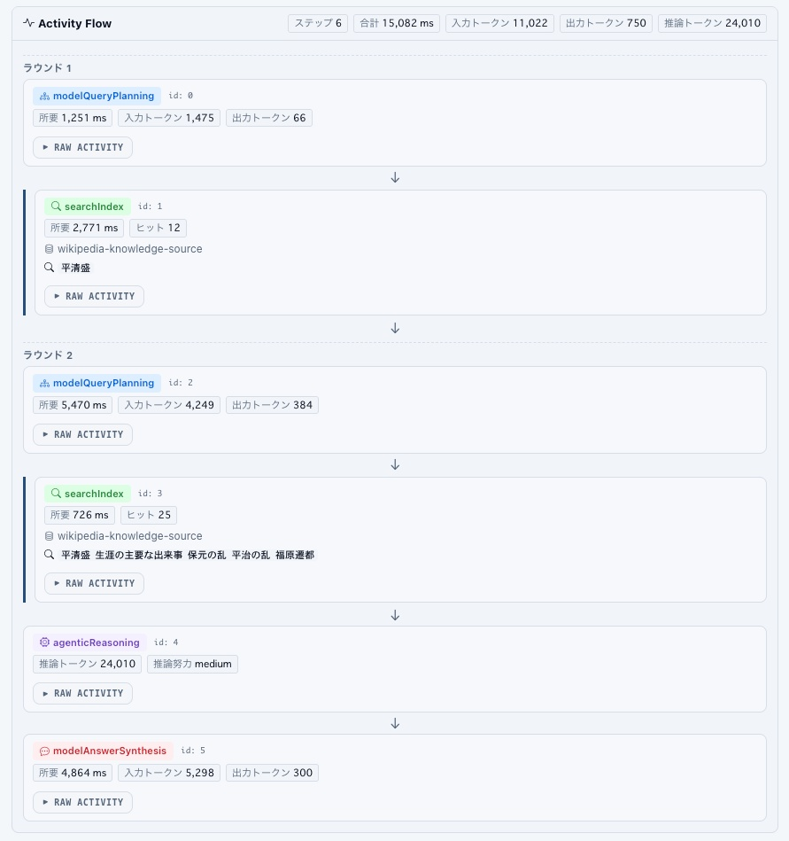

Activity Logs を**ステップごとに可視化する**ことで、Agentic Retrieval のブラックボックスを解明できます。

## 4. Analyze モード — テキスト分析の深い理解

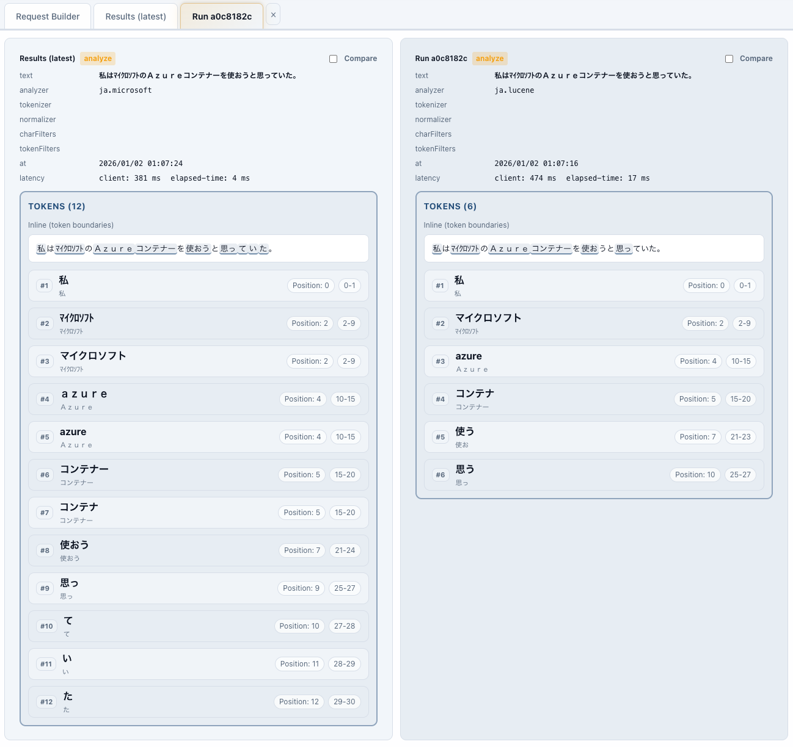

トークナイザーやアナライザーの動作を可視化し、検索品質の基礎を理解します。

**3 つの分析パターン**
- **アナライザー指定**: `standard`、`ja.lucene`、`ja.microsoft` などの組み込みアナライザーやカスタムアナライザーをテスト
- **トークナイザー＋フィルターの組み合わせ**: 個別コンポーネントの動作を検証
- **ノーマライザー**: 正規化処理（大文字/小文字、アクセント記号など）を確認

**実用的なユースケース**
- **日本語検索の最適化**: `ja.lucene` vs `ja.microsoft` の比較
- **カスタムアナライザーのデバッグ**: トークン化が期待通りに動作するか検証
- **Synonym Map の有効性検証**: 同義語展開が正しく機能するか確認
- **ステミング/レンマタイゼーション**: 語幹抽出の動作を検証
- **Char Filter の検証**: HTML タグ除去、特殊文字変換などの前処理

https://qiita.com/nohanaga/items/7296505f7b63e23f94a6

# 🛠️ RAGOps を支えるプロフェッショナルツール

## 1. Search Parameter AutoTuning — 科学的パラメータ最適化

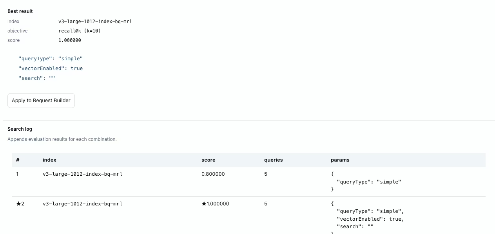

RAG システムの品質改善で最も時間がかかるのが「パラメータチューニング」です。**RAGOps Studio — for Azure AI Search** はこの作業を自動化します。

**最適化対象パラメータ**
- **インデックス選択**: 複数インデックス間の検索品質を比較
- **vectorWeight**: ハイブリッド検索のウェイト（0.0-1.0 を 0.1 刻みで探索）
- **vectorK**: ベクトル検索の結果件数（5, 10, 20, 50, 100 など）
- **hybridMaxTextRecallSize**: テキスト検索の件数制限（100, 500, 1000）
- **queryType**: クエリ構文の選択（`simple`、`full`、`semantic`）
- **vectorThreshold**: 閾値設定（`vectorSimilarity`、`searchScore`）

**サポートする評価指標**: Precision@k、Recall@k、NDCG、MRR

**グリッドサーチの実行**
- すべてのパラメータ組み合わせを生成し、体系的に評価
- 複数パラメータセットの並列実行による高速化
- 進捗をリアルタイム表示、中間結果を確認
- ベストパラメータを自動抽出し、即座に適用
- 結果を IndexedDB に保存し、後から比較

## 2. Search Pipeline Visualizer — 4 段階検索の可視化

検索パイプラインを分解し、セマンティックハイブリッド検索の仕組みを理解するために内部を「見える化」します。ドキュメントをクリックすると、各検索モードでのランキングが自動的にハイライトされます。

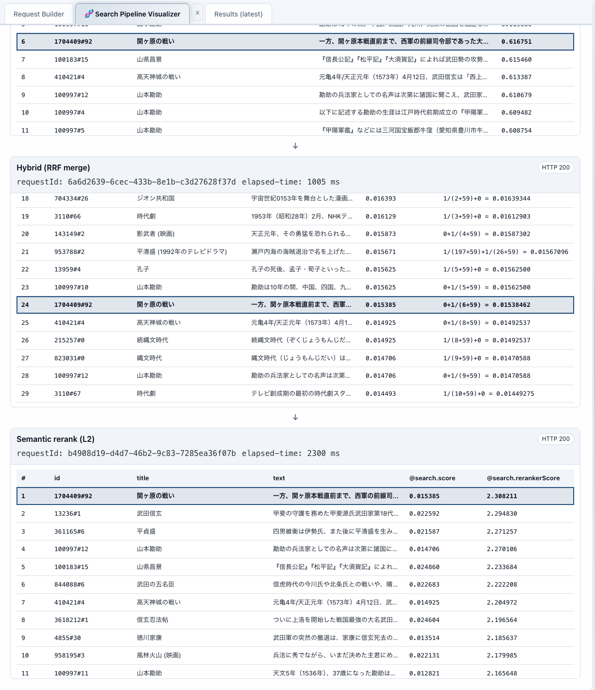

### 4 つの検索段階に対応
- Text Search
- Vector Search
- Hybrid (RRF)
- Semantic Hybrid

**可視化の価値**
1. **デバッグの容易化**: 関連ドキュメントがどの段階で脱落したかを特定
2. **Vector vs Text の比較**: どちらがより効果的かを評価
3. **Semantic Reranking の効果測定**: スコア再計算によるランキング変化の把握
4. **最適検索戦略の選定**: 全段階の結果を比較し最適解を発見

## 3. Query Performance Tester（QPS テスター）
本番環境の負荷を事前にシミュレーション

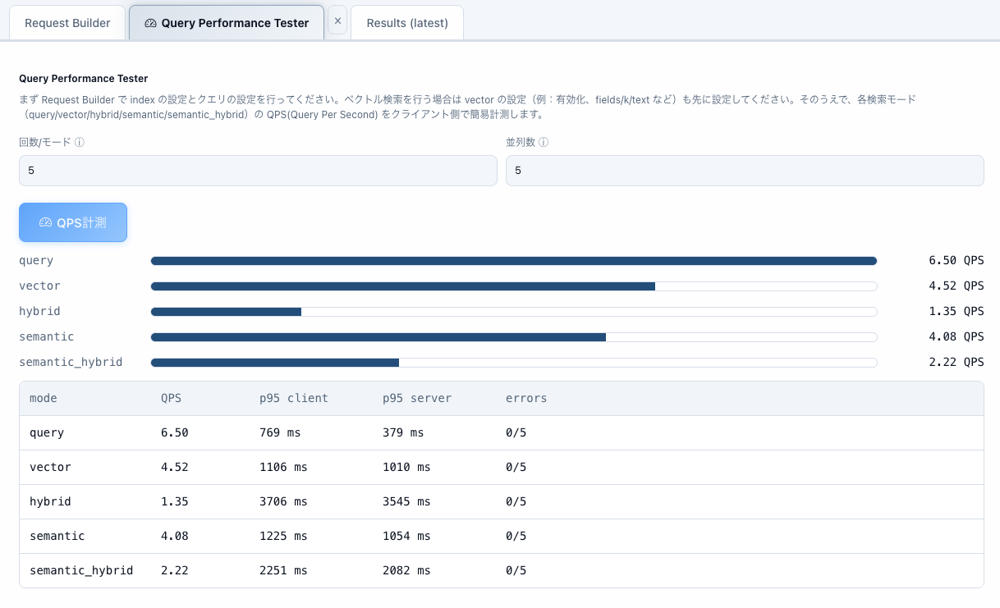

**測定項目**
- **5 つの検索モード**: 全文検索（`query`）、セマンティック検索（`semantic`）、ベクトル検索（`vector`）、ハイブリッド検索（`hybrid`）、セマンティックハイブリッド検索（`semantic_hybrid`）を個別に測定
- **QPS (Queries Per Second)**: 1 秒あたりの処理能力
- **レイテンシ**: p50/p95 レイテンシの測定
- **エラー数**: リクエストエラー数と詳細表示

**ユースケース**
- **キャパシティプランニング**: 必要な SKU サイズの決定
- **パフォーマンスリグレッション検出**: インデックス変更後のパフォーマンス比較
- **レイテンシ SLA 検証**: p95 レイテンシが目標値以下であることを確認
- **スケールアウトテスト**: レプリカ追加後の効果測定

## 4. Vector Optimizer — ベクトル検索のコスト最適化

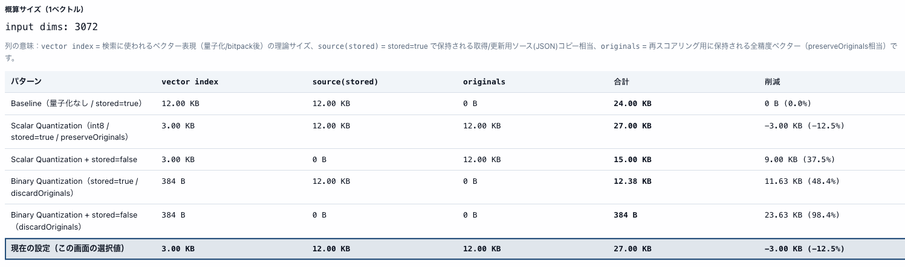

ベクトル検索の設計においては、「精度向上」だけでなく**ストレージとレイテンシの現実的な制約**（ベクトルの次元数、保存方式、量子化、リスコアリング用のオリジナル保持など）を考慮した意思決定が必要です。

Vector Optimizer は、ベクトル設定候補の**理論的サイズ（バイト数）の内訳**を比較し、情報に基づいた設計判断を支援するツールです。

- **入力ベクトル形式**: `float32 (Edm.Single)` / `float16 (Edm.Half)`
- **量子化**: `scalarQuantization (int8)` / `binaryQuantization (1 bit/dim)` / なし
- **ストレージとリスコアリング**:
    - `stored=true/false` によるソースベクトル（JSON）の保存有無
    - 量子化時のリスコアリング用 `originals`（フル精度）の保持/破棄
- **MRL（次元削減）**: 量子化使用時、次元削減した場合のサイズ比較

さらに、Text-to-Vector（埋め込み生成）統合により、実データを使って**実際の埋め込み次元数を検証**し、サイズ見積もりに即座に反映できます。

https://qiita.com/nohanaga/items/dcc933fc185b0e82df58#%E3%83%99%E3%82%AF%E3%83%88%E3%83%AB%E6%A4%9C%E7%B4%A2%E6%9C%80%E9%81%A9%E5%8C%96%E6%88%A6%E7%95%A5%E3%81%AB%E9%96%A2%E3%81%99%E3%82%8B-ga

## 5. Builder ツール — 統合管理環境

### Index Builder
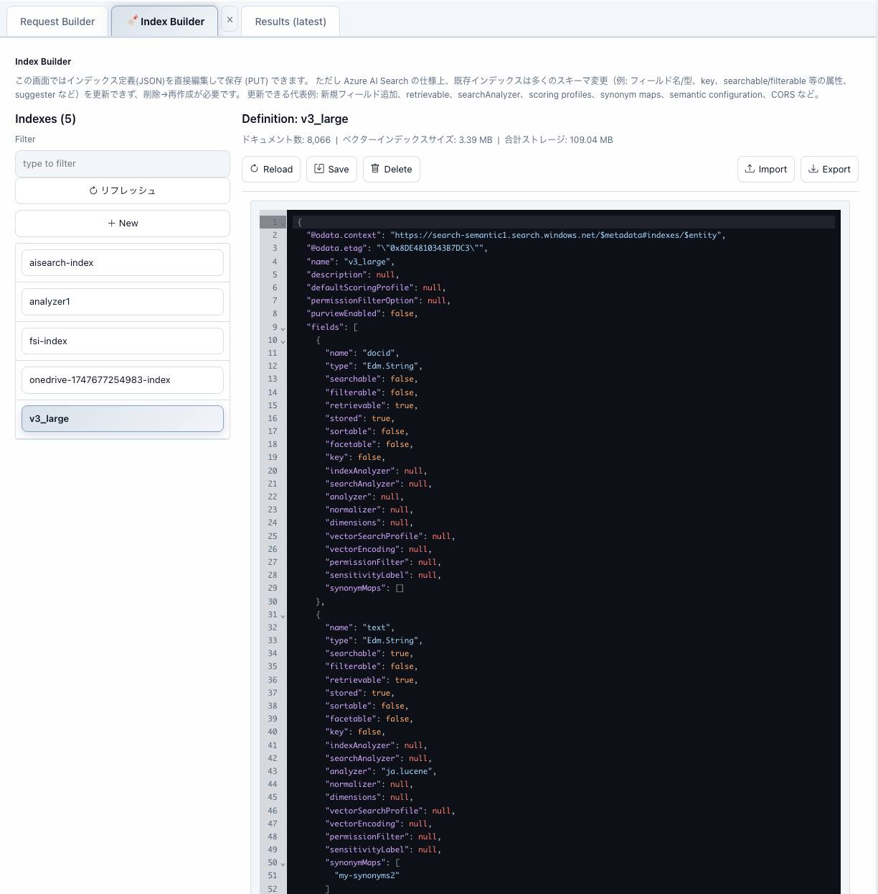

**完全なインデックス管理**
- 接続サービスのすべてのインデックスをリスト表示
- JSON エディタでスキーマを直接編集（構文ハイライト、エラー検出）
- すべての Vector Search 設定をサポート（HNSW、Quantization、MRL）
- 統計情報（`documentCount`、`storageSize`、`vectorIndexSize`）をリアルタイム表示
- CRUD 操作: GUI からの作成、更新、削除
- Import/Export: JSON ファイルからのインポート、クリップボードへのエクスポート

### Knowledge Base & Knowledge Source Builder

Azure AI Search の最新機能を完全サポート。

**Knowledge Source 管理**

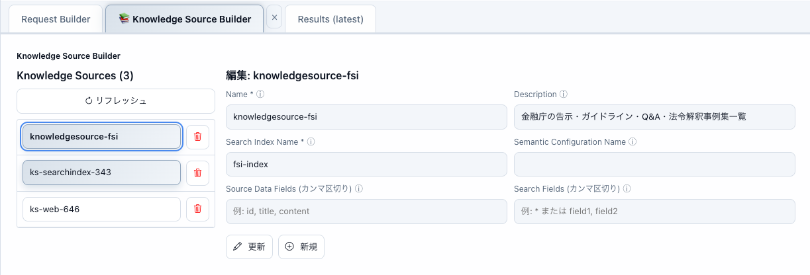

- 検索インデックスを Knowledge Source として登録
- Semantic Configuration との統合
- ソースデータフィールドと検索フィールドの指定

**Knowledge Base 構築**

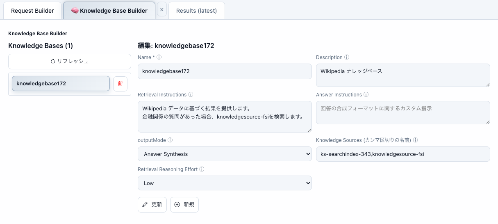

- 複数の Knowledge Source を統合する Knowledge Base を作成
- マルチソース検索の基盤を構築
- Agentic モードで使用する Knowledge Base を管理

### Synonym Map Builder

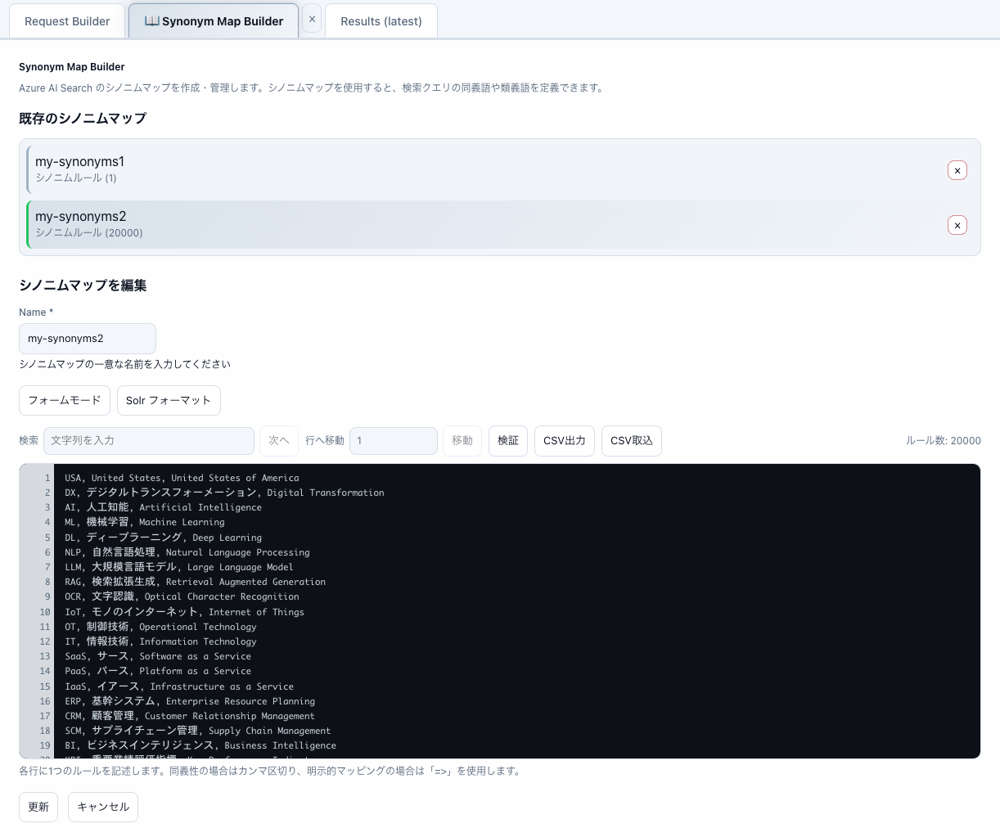

同義語管理のための革新的な UI/UX。

**従来の課題（Solr 形式での手動編集）**
- テキストファイルの直接編集が必要
- フォーマットエラーが発生しやすい
- 20,000 ルール制限の確認が困難

**RAGOps Studio — for Azure AI Search による解決**
- **GUI フォーム編集**: ルールをひとつずつ追加、直感的な管理
- **2 種類のルール**: Equivalency と Explicit Mapping の切り替え
- **バリデーション**: 20,000 ルール制限のリアルタイムチェック、フォーマット検証
- **ファイルインポート**: CSV ファイルからの一括インポート
- **プレビュー機能**: 保存前に Solr 形式を確認

### Skill Pipeline Builder

Azure AI Search スキルセットをオーサリングするための**ビジュアル DAG エディタ**。各スキルはノードとして表現され、入出力は左から右へのフローでエッジとして接続されます。

**ビジュアルオーサリング**
- ReactFlow + dagre による自動レイアウト DAG 可視化
- 4 層構造: Document → Skills → Indexer → Index
- 15 個の組み込みスキルテンプレート（Text Split、OCR、Azure OpenAI Embedding、ChatCompletion、Custom Web API など）
- パス自動補完とツリープレビュー付き EnrichmentPathPicker

**Debug Runner**
- 一時的なデバッグリソース（データソース、インデックス、インデクサー、スキルセット）を自動プロビジョニング
- Knowledge Store プロジェクションによる実データスキル出力プレビュー
- 4 ステップのワークフロー: プロビジョン → 実行 → フェッチ → クリーンアップ
- Shaper スキルの自動生成と自動クリーンアップ

**差分確認付き Azure パブリッシュ**
- ビルダーから Azure AI Search にスキルセットを直接パブリッシュ（作成/更新）
- 2 つの表示モードを備えたフルスクリーン差分確認ダイアログ：
  - **セマンティック差分**: 追加/削除/変更/並び替えされたスキルとプロパティをカラーバッジで表示する構造変更テーブル
    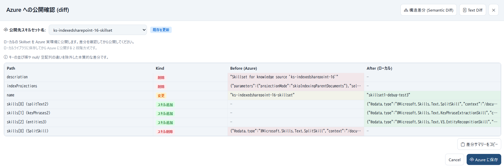
  - **テキスト差分**: CodeMirror での行ハイライト付き正規化 JSON サイドバイサイド比較
    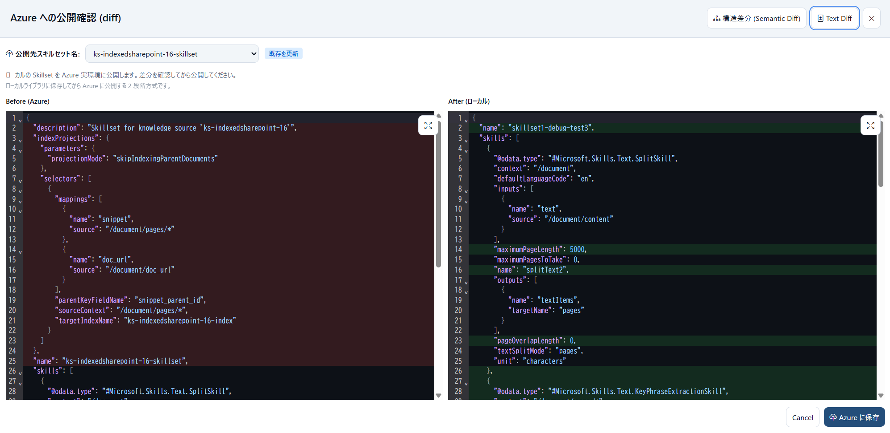
- ターゲットスキルセットの選択: 既存のスキルセットから選択するか、新規作成
- 新規 vs 更新の自動検出と CREATE NEW / UPDATE EXISTING バッジ
- インテリジェントなノイズ低減: `@odata.etag`、JSON キー順序、`null` vs 未定義、空配列 vs 未定義を無視
- 差分サマリーのクリップボードコピーとフォーマットのみの変更検出

**既存リソースとの連携**
- 検索サービスから既存のスキルセットとインデクサーを読み込み
- `outputFieldMappings` のビジュアル編集
- LocalStorage によるパイプライン状態の保存/復元

### Custom Skill LiveEditor

Azure AI Search カスタムスキルの構築、テスト、デプロイを RAGOps Studio から離れることなく高速に行う**ブラウザ統合 Python 開発環境**。

**従来のアプローチとの比較**
| 観点 | 従来のワークフロー | Custom Skill LiveEditor |
|------|--------|----------------------------|
| 開発環境 | ローカル Python + IDE + Azure Functions/Container Apps のセットアップ | ブラウザで直接 Python を記述 |
| テスト | デプロイ → スキルセット設定 → インデクサー実行 → 結果確認 | Pyodide（WebAssembly）によるワンクリックローカル実行 |
| デプロイ | 手動での Docker ビルド、ACR プッシュ、ACA リビジョン | Blob にアップロード → ランタイムが自動ロード、コンテナ再構築不要 |
| コード同期 | 手動ファイル管理、バージョンを見失いやすい | SHA-256 ハッシュ追跡とビジュアル同期ステータスバッジ |
| デバッグ | 複数のツールとログに分散 | stdout/stderr キャプチャと実行時間を備えた統合テストパネル |

**3 タブワークスペース**
- **Code タブ**: Python 構文ハイライト付き CodeMirror エディタ、コード内で参照されるスキル入出力を示す I/O 接続パネル
- **Test タブ**: JSON テスト入出力エディタ、実行ログ、バリデーション通知、ローカルおよびリモート実行
- **Settings タブ**: ランタイム URL 設定、ヘルスチェック、ロード/パブリッシュ制御

**2 つの実行モード**
- **Local Run (Pyodide)**: WebAssembly を使用してブラウザ内で Python コードを直接実行 — サーバー不要、即座にフィードバック
- **Remote Run**: 本番に近いテストのためにクラウドランタイム（Azure Container Apps + FastAPI）でコードを実行

**クラウドランタイムアーキテクチャ**
- Azure Container Apps 上の FastAPI ベース Skill Host
- 動的スキルロード: スキルコードを Azure Blob Storage に保存し、コンテナ再デプロイなしにランタイムでロード
- 6 つの HTTP エンドポイント: `/health`、`/simulate`、`/execute`、`/upload`、`/skills/{name}`、`/skills/{name}/code`
- Azure Container Apps 用デプロイスクリプト同梱（`deploy-aca.ps1`、`deploy-aca.sh`）

**Skill Pipeline との統合**
- Skill Pipeline Builder のスキルノードから直接起動
- スキルの入出力定義に基づくサンプル Python コードの自動生成
- アップロード成功後に Custom Web API スキルの URI を自動更新
- ドラフト永続化: リンクされたスキルノードごとにエディタ状態を自動保存

**高度な機能**
- **差分モード**: ローカルとリモートのコードが異なる場合にハンク間ナビゲーション付きサイドバイサイド比較
- **I/O 接続バリデーション**: カラーコード付きインジケーター（緑 = 接続済み、黄 = テストデータ不足、赤 = 未接続）
- **同期ステータス追跡**: ローカルエディタと Blob Storage 間の SHA-256 ハッシュ比較とビジュアルバッジ（Synced / Dirty / Unknown）

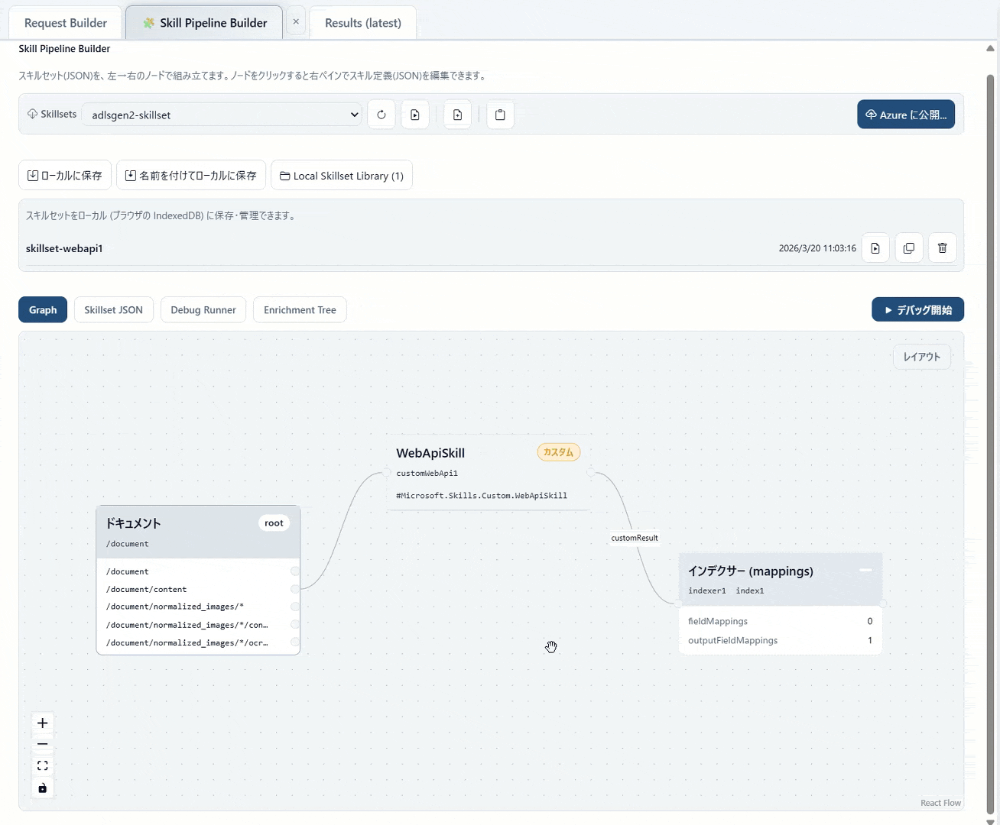

### Eval Dataset Generator

> **📖 [Eval Dataset Generator — 詳細ドキュメント](EVAL_DATASET_GENERATOR.jp.md)**

検索品質ベンチマーク用の評価データセットを手動で作成することは、RAG システム開発で最も時間がかかるタスクのひとつです。**Eval Dataset Generator** は Azure OpenAI を活用して、検索インデックスの実ドキュメントから現実的なクエリを自動生成することで、このプロセスを自動化します。

**従来のアプローチとの比較**
| 観点 | 手動データセット作成 | Eval Dataset Generator |
|------|--------|----------------------------|
| クエリ作成 | ドメイン専門家が手書き | LLM が実インデックスドキュメントからクエリを生成 |
| 多様性 | 人間の創造性と時間に限定 | Ragas 4 象限分類で体系的なカバレッジを確保 |
| 品質保証 | 手動レビューのみ | 多段階フィルター: ラウンドトリップ整合性、重複排除、グラウンディング |
| 難易度制御 | 主観的な評価 | Evol-Instruct による書き換えとハードネガティブマイニング |
| スケール | 数時間かけて数十クエリ | 数分で数百クエリ |
| AutoTuning 統合 | 手動で JSONL フォーマット | ワンクリックエクスポートまたは AutoTuning への直接送信 |
| ファインチューニングデータ | 別の手動パイプライン | RAFT モードで評価データと同時に CoT 訓練データを生成 |

**2 つの生成モード**
- **Classic モード**: N ドキュメントをサンプリング、ドキュメントあたり M クエリを生成 — シンプルで高速
- **Ragas モード**: 4 象限（Single/Multi × Specific/Abstract）にまたがるシナリオを計画し、直交軸（Persona、Style、Length）で多様で実世界に近いクエリ分布を生成

**多段階品質パイプライン**
1. **表面的重複排除**: Jaccard 類似度に基づく重複排除で類似クエリを除去
2. **ラウンドトリップ整合性（Promptagator）**: ソースドキュメントが top-k 検索結果に現れないクエリを棄却 — 幻覚クエリをフィルタ
3. **セマンティック重複排除**: Azure OpenAI 埋め込みによるコサイン類似度に基づく重複排除
4. **難易度進化（Evol-Instruct）**: パラフレーズ/否定/集約/抽象化によるクエリ書き換え
5. **ハードネガティブマイニング（DPR スタイル）**: 期待されないドキュメントの top-k を対照例として記録

**高度な機能**
- **ドメインスキーマ注入（RAGEval）**: ドメインエンティティ、関係、制約を注入し、事実性を向上
- **NDCG 互換関連性グレード**: NDCG/XDCG 評価器で使用するための段階的関連性スコアを自動割り当て
- **Entity-KG**: ドキュメントごとの LLM エンティティ抽出による精緻なマルチホップペアリング
- **RAFT（Retrieval Augmented Fine-Tuning）**: オラクル＋ディストラクタードキュメントを用いた Chain-of-Thought ファインチューニングデータセットの生成、RAFT JSONL としてエクスポート（Zhang et al., 2024）
- **データセット永続化**: 生成したデータセットをブラウザの localStorage に保存/読み込み/削除、JSONL としてエクスポート。保存したデータセットはブラウザ/サイトストレージがクリアされると失われる場合があります。

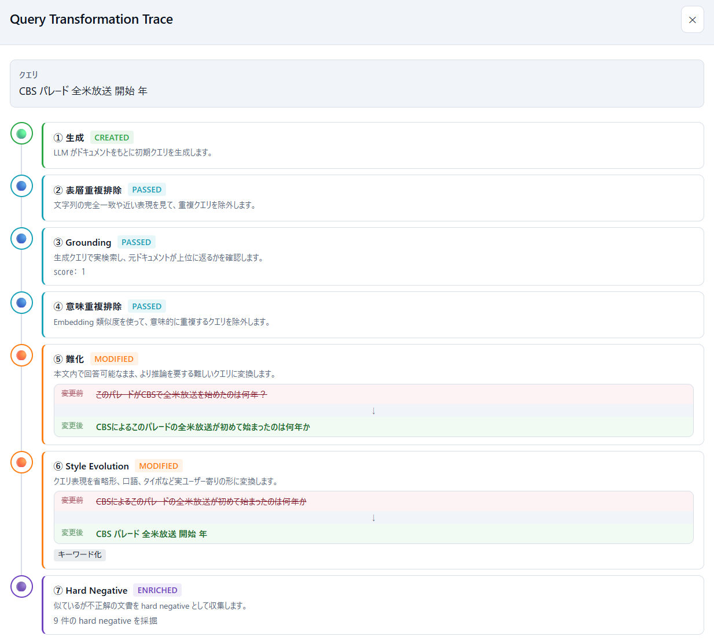

### Feature Portal

**Feature Portal** は、RAGOps Studio のすべての機能の包括的なディレクトリとして機能するインタラクティブなウェルカム画面です。新規ユーザーが機能を発見し、経験豊富なユーザーが特定のツールに素早くアクセスできるよう設計されています。

**カードベースの機能ディレクトリ**
- すべての機能を 6 カテゴリに整理: Search Modes、Builder Tools、Optimization & Testing、Developer Tools、Experiment Management、Azure AI Search Features (Coming Soon)
- 各カードに機能名、アイコン、説明を表示
- カードをクリックして機能を直接起動

**ステップバイステップのガイド付きウォークスルー**
- 任意のカードの `?` アイコンをクリックしてインタラクティブガイドを起動
- **2 つの詳細レベル**: Basic（初心者向けの短いウォークスルー）と Advanced（エキスパートティップス付きの詳細版）
- **モーダルモード**: Portal からフルガイドオーバーレイを起動
- **コンパニオンモード**: 機能起動後、ガイドがフローティングパネルとして残り、各ステップで関連する UI 要素をハイライト — 実際にツールを使いながらハンズオン学習が可能
- **Tips セクション**: 各機能に対する専門家のヒントとベストプラクティス
- **ドキュメントリンク**: 公式 Microsoft Learn ドキュメントへの直接リンク

**起動制御**
- 「起動時に表示しない」チェックボックスで自動表示を無効化（localStorage に保存）
- ヘッダーからいつでも再表示可能

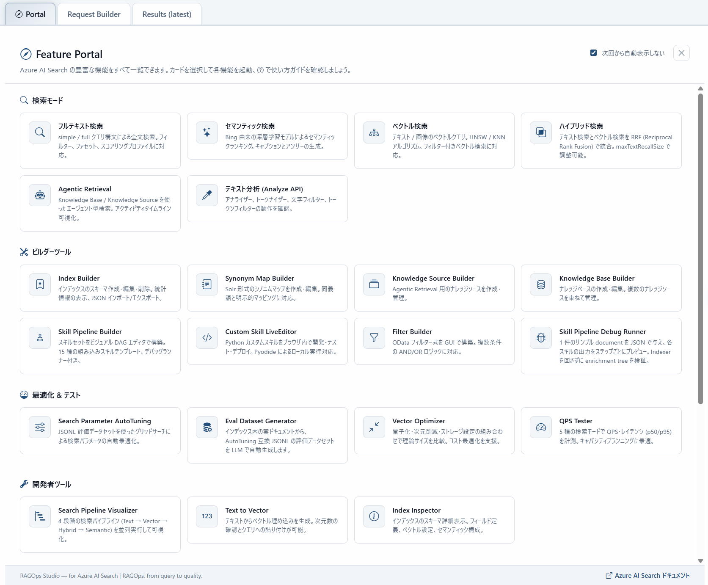

# 🧑‍💻 最大限の開発者体験（DX）

## 1. 実験管理ワークフロー

**Experiment → Run → Artifact の階層構造**

- **Experiment**: プロジェクトレベルでの管理
- **Run（実行履歴）**: 個々の検索実行結果を保存、画面上に最大 200 件表示
- **Experiment Note**: 実行前にメモを記録し、Run にコンテキスト、仮説、所見を付与
    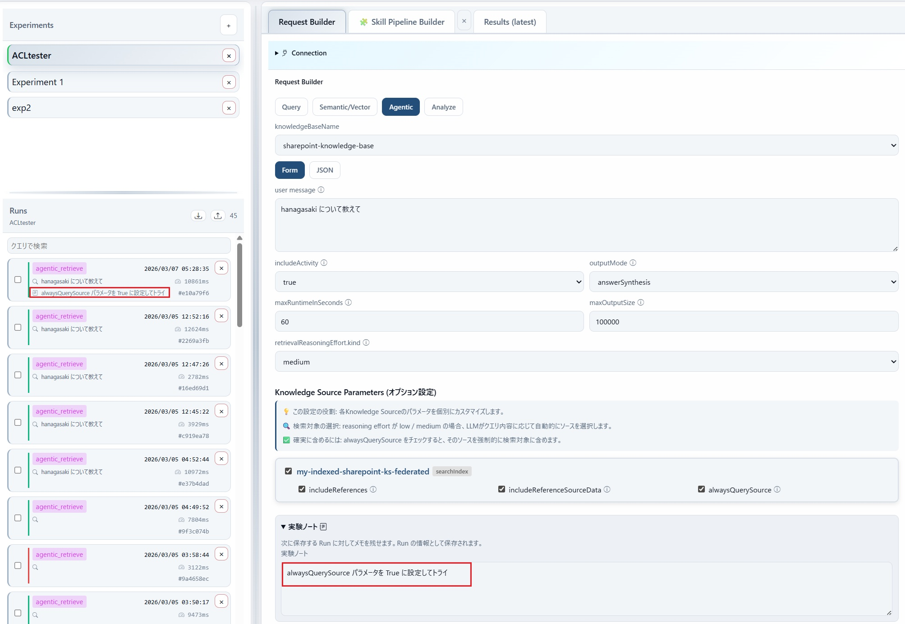

- **Artifact**: QPS テストと AutoTuning の結果を永続化
    - IndexedDB
    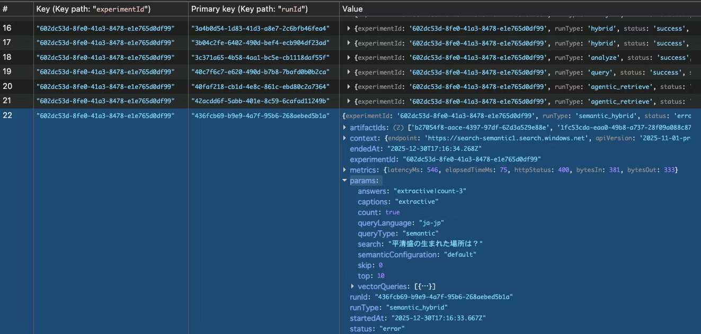

## 3. Export/Import による環境移行

- Run と Artifact を JSON 形式で一括エクスポート
- メタデータ（エクスポート日時、実験名）を含む

## 4. UI/UX の細部へのこだわり

- ドラッグリサイズ対応の 3 ペイン構造
- 多言語対応（日本語/英語）
- 6 テーマ（System、Dark、Light、Midnight、Forest、Solarized）
    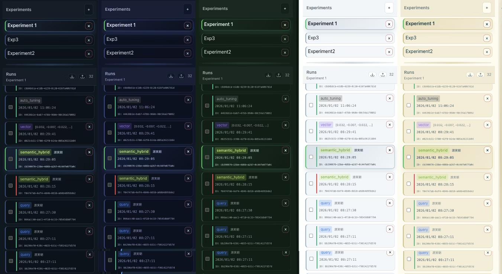
- Filter Query Builder: 複雑なフィルター式を簡単に構築
    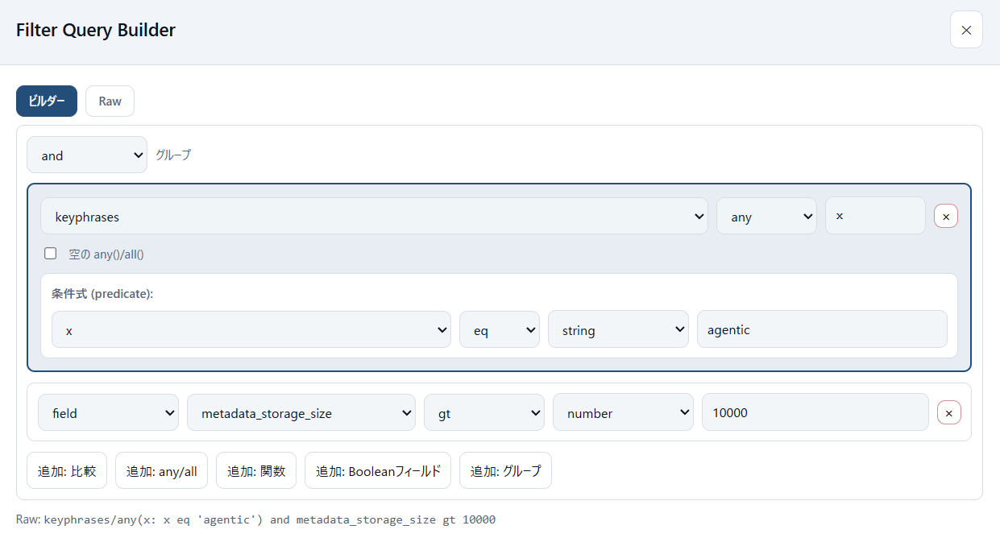
- すべてのパラメータに ⓘ Info Tooltip で最新機能の学習を加速
    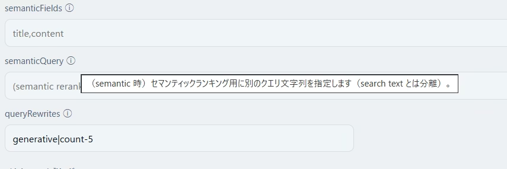

# GitHub
https://github.com/nohanaga/ragops-studio

# License
MIT License
