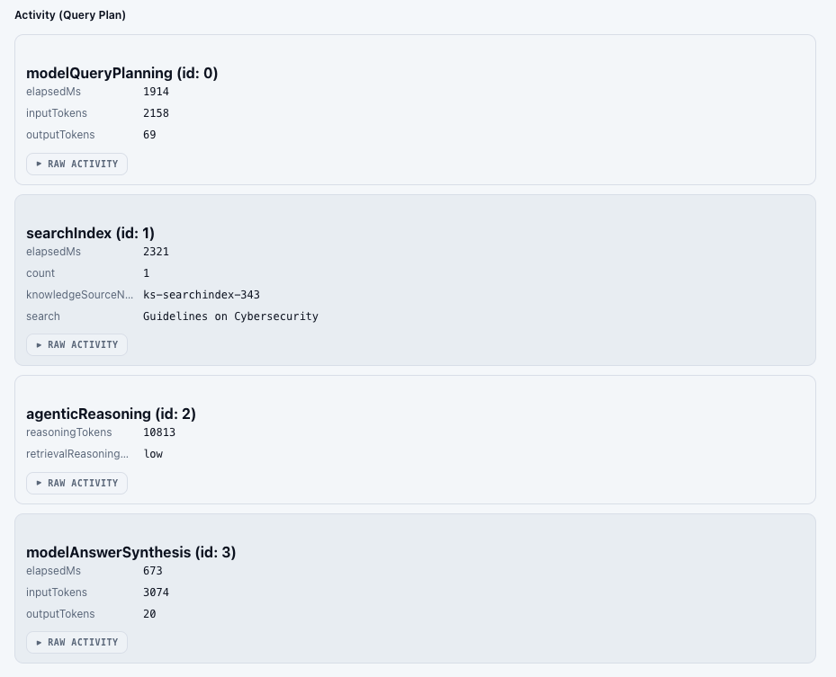

# RAGOps Studio — for Azure AI Search

**RAGOps, from query to quality.**

In production RAG (Retrieval-Augmented Generation) systems, continuous improvement of search quality is one of the most critical challenges. However, when attempting to leverage the advanced features of Azure AI Search, developers face numerous technical hurdles, including complex REST API parameter configurations, optimization of vector and hybrid search, and implementation of the Knowledge Retrieval API (Agentic retrieval).

To address these challenges, we have developed "**RAGOps Studio — for Azure AI Search**" as an open-source **RAGOps platform** that maximally utilizes the advanced features of Azure AI Search and dramatically streamlines the development and operation of RAG systems.

This tool is not just a GUI client. It is a professional development and operations integrated environment that supports the **end-to-end lifecycle from search queries to quality improvement**.

# What is RAGOps?

RAGOps is a new operational philosophy that applies the concepts of [MLOps](https://learn.microsoft.com/training/paths/introduction-machine-learn-operations/) and DevOps to RAG systems.

- **Continuous measurement and improvement of search quality**
- **Automation of experiment management and parameter tuning**
- **Performance monitoring and optimization**
- **Consistent workflow from development to production environments**

**RAGOps Studio — for Azure AI Search** was designed as the first comprehensive tool to enable the practice of RAGOps. In fact, I developed [Simple-Cognitive-Search-Tester](https://github.com/nohanaga/Simple-Cognitive-Search-Tester) four years ago, and this represents a major update from that project.

https://qiita.com/nohanaga/items/2a90539f7667fa9e486a

# Why is this Tool Needed?

## Challenges Faced by Developers

In building and operating RAG systems in production, developers face the following advanced requirements:

- **Leveraging the latest API features**: Quickly validate preview features such as the Knowledge Retrieval API
- **Tuning complex parameters**: Systematically test vector search parameters (`vectorThresholdKind`, `vectorOversampling`, `vectorFilterOverride`, etc.)
- **Experiment management and traceability**: Centrally manage query history, result comparisons, and parameter tuning history
- **Quantitative performance evaluation**: Comprehensive benchmarks including QPS measurement and latency analysis
- **End-to-end workflow**: Execute index management, Knowledge Base creation, search testing, and evaluation in an integrated environment

## Value Provided by RAGOps Studio — for Azure AI Search

To address these developer needs, **RAGOps Studio — for Azure AI Search** delivers the following:

1. **Immediate support for the latest APIs**: Full support for all features including Azure AI Search's latest preview features ([Knowledge Retrieval API](https://learn.microsoft.com/rest/api/searchservice/knowledge-retrieval/retrieve?view=rest-searchservice-2025-11-01-preview&tabs=HTTP) 2025-11-01-preview)
2. **End-to-end experiment management**: Integration from query creation to execution, result storage, comparison, and evaluation
3. **Automated parameter optimization**: Scientific approach through Search Parameter AutoTuning
4. **Production-ready analysis**: QPS testing, 4-stage search comparison via Search Pipeline Visualizer
5. **Maximum developer experience**: Balance of intuitive UI and professional features

# 🧠 Complete Coverage of Azure AI Search's Advanced Features

The greatest innovation of this tool is **bringing the concepts of MLOps to RAG systems**.

## Innovation ①: Introduction of Experiment Management Concept → Realization of RAGOps

In traditional search system development, parameter tuning was "repetitive trial and error". However, **RAGOps Studio — for Azure AI Search** applies **the concept of MLOps experiment management to RAG**, enabling systematic quality improvement.

**Hierarchical structure of Experiment → Run → Artifact**:
- **Reproducibility**: Automatically save all search parameters and results
- **Comparability**: Display up to 10 Runs in parallel and visualize differences
- **Traceability**: Track which parameters produced which results
- **Environment migration**: Ensure consistency from development to production through Export/Import

### Comparability
This is one of my favorite features.

**Compare up to 10 Runs simultaneously**
- Display multiple results in parallel in tab format
- Each tab can be closed individually
- Compact result display in comparison mode

This is **my first attempt ever** to bring the philosophy of machine learning experiment management tools to search systems.

## Innovation ②: Introduction of AutoML Concepts → Search Parameter AutoTuning

**Search Parameter AutoTuning** applies the concept of AutoML (automated machine learning) to search systems.

**Comparison with AutoML**
| Aspect | AutoML | Search Parameter AutoTuning |
|------|--------|----------------------------|
| Purpose | Automatic model optimization | Automatic search parameter optimization |
| Method | Hyperparameter search | Grid search + evaluation metrics |
| Evaluation | Accuracy, F1 score, AUC | Precision@k, Recall@k, NDCG, MRR |
| Output | Optimal model | Optimal search configuration |

**Traditional Challenges**
- Combinatorial explosion of parameters (`vectorWeight` × `vectorK` × `queryType` × ... = hundreds of combinations)
- Limits of manual evaluation (subjective, non-reproducible)
- Personalized best practices

**Solutions through AutoTuning**
- **Automatic exploration**: Systematically evaluate all parameter combinations
- **Objective evaluation**: Quantify with information retrieval standard metrics (NDCG, MRR)
- **Democratization of knowledge**: Share best configurations via JSON

This enables **scientific optimization of search systems, just as data scientists optimize machine learning models**.

# 🧪 Four Search Lab Modes - Complete Coverage of All Azure AI Search Features

## 1. Query Mode - Mastering Classic Search

Full support for the full-text search features that form the foundation of Azure AI Search

**Key Supported Parameters**
- **Lucene query syntax**: Support for both `simple` and `full` modes, advanced queries including wildcards, regex, and proximity search
- **OData filters**: Intuitively construct complex conditional expressions with GUI, adjust while previewing
- **Custom scoring**: Reflect business logic through Scoring Profile and Scoring Parameters
- **Facet aggregation**: Implement category classification and drill-down search
- **Highlighting**: Automatic extraction and display of query match locations
- **Replica coverage**: Balance availability and latency through `minimumCoverage`

## 2. Semantic-Vector Mode - Optimization of Hybrid Search

Integration of Azure AI Search's latest vector and semantic search capabilities.

**Full Support for Semantic Search**
- **L2 Semantic Ranker**: Meaning-based reranking using Microsoft's language understanding model
- **Captions and Answers**: Automatic generation of extractive summaries for queries
- **50+ language support**: Multilingual optimization through `queryLanguage`
- **Spell correction**: Automatic correction in `lexicon` mode

**Advanced Control of Vector Search**
- **Multiple vector queries**: Integration of results from different embedding models (`text-embedding-ada-002`, `text-embedding-3-large`)
- **Multimodal search**: Mixed queries of text, image URLs, and image binaries
- **Exhaustive mode**: Maximum accuracy through full exploration of HNSW

**Optimization of Hybrid Search**
- **vectorWeight**: Balance adjustment between full-text and vector search (0.0-1.0)
- **RRF (Reciprocal Rank Fusion)**: Integration algorithm for multiple search results
- **vectorFilterMode**: Selection of pre-filter vs post-filter (significant impact on performance)
- **hybridMaxTextRecallSize**: Cost optimization through text search retrieval limits
- **oversampling**: Improved exploration accuracy of HNSW graph (trade-off between quality and latency)
- **perDocumentVectorLimit**: Optimization for multi-vector documents

## 3. Agentic Mode - Lightning-Fast Implementation of Knowledge Retrieval API

Fastest support for Azure AI Search's latest features (2025-11-01-preview).

**Innovation of Knowledge Retrieval API**

**Realization of Agentic Search**
- Transcends the traditional simple flow of "query → results"
- Advanced information retrieval combining multi-step reasoning and search
- Understands natural language intent and automatically selects optimal search strategies
- Automates query rewriting, cross-Knowledge Source search, and result integration

https://qiita.com/nohanaga/items/26c27574f552c4bfc033

**Transparency through Activity Logs**
- How the agent rewrote queries
- Which Knowledge Sources were searched
- How many documents were retrieved
- How many tokens were used in generating the final response

By **visualizing these processes step-by-step**, we can demystify the black box of Agentic Retrieval.

## 4. Analyze Mode - Deep Understanding of Text Analysis

Visualize the behavior of tokenizers and analyzers to understand the fundamentals of search quality.

**Three Analysis Patterns**
- **Analyzer specification**: Test built-in analyzers like `standard`, `ja.lucene`, `ja.microsoft`, or custom analyzers
- **Tokenizer + Filter combination**: Verify behavior of individual components
- **Normalizer**: Confirm normalization processing (uppercase/lowercase, accent marks, etc.)

**Practical Use Cases**
- **Japanese search optimization**: Comparison of `ja.lucene` vs `ja.microsoft`
- **Custom analyzer debugging**: Verify that tokenization works as expected
- **Synonym Map effectiveness verification**: Check if synonym expansion works correctly
- **Stemming/Lemmatization**: Verify stem extraction behavior
- **Char Filter verification**: Pre-processing such as HTML tag removal, special character conversion

https://qiita.com/nohanaga/items/7296505f7b63e23f94a6

# 🛠️ Professional Tools Supporting RAGOps

## 1. Search Parameter AutoTuning - Scientific Parameter Optimization

"Parameter tuning" takes the most time in improving RAG system quality. **RAGOps Studio — for Azure AI Search** automates this task.

**Parameters to Optimize**
- **Index selection**: Compare search quality across multiple indexes
- **vectorWeight**: Weight for hybrid search (explore 0.0-1.0 in 0.1 increments)
- **vectorK**: Number of results for vector search (5, 10, 20, 50, 100, etc.)
- **hybridMaxTextRecallSize**: Text search limit (100, 500, 1000)
- **queryType**: Query syntax selection (`simple`, `full`, `semantic`)
- **vectorThreshold**: Threshold configuration (`vectorSimilarity`, `searchScore`)

**Supported Evaluation Metrics**: Precision@k, Recall@k, NDCG, MRR

**Executing Grid Search**
- Generate all parameter combinations and systematically evaluate
- Accelerate through parallel execution of multiple parameter sets
- Display progress in real-time, check intermediate results
- Automatically extract and immediately apply best parameters
- Save results to IndexedDB for later comparison

## 2. Search Pipeline Visualizer - Visualization of 4-Stage Search

Visualize and make "visible" the internals by breaking down the search pipeline to understand how semantic hybrid search works. Click on a document to automatically highlight its ranking in each search mode.

### Corresponding to Four Search Stages
- Text Search
- Vector Search
- Hybrid (RRF)
- Semantic Hybrid

**Value of Visualization**
1. **Easier debugging**: Identify at which stage relevant documents dropped out
2. **Vector vs Text comparison**: Evaluate which is more effective
3. **Semantic Reranking effectiveness measurement**: How much does ranking change with score recalculation
4. **Optimal search strategy selection**: Compare results across all stages to discover optimal solutions

## 3. Query Performance Tester (QPS Tester)
Simulate production environment loads in advance

**Measurement Items**
- **5 search modes**: Measure full-text search (`query`), semantic search (`semantic`), vector search (`vector`), hybrid search (`hybrid`), semantic hybrid search (`semantic_hybrid`) individually
- **QPS (Queries Per Second)**: Processing capacity per second
- **Latency**: Measurement of p50/p95 latency
- **Error count**: Number of request errors and detailed display

**Use Cases**
- **Capacity planning**: Determine necessary SKU size
- **Performance regression detection**: Compare performance after index changes
- **Latency SLA verification**: Confirm p95 latency is below target value
- **Scale-out testing**: Measure effects after adding replicas

## 4. Vector Optimizer - Cost Optimization for Vector Search

In vector search design, decision-making must consider not only "improving accuracy" but also **realistic constraints of storage and latency** (vector dimensions, storage method, quantization, retaining originals for rescoring, etc.).

Vector Optimizer is a tool for comparing **theoretical size (byte count) breakdowns** for vector configuration candidates to help make informed design decisions.

- **Input vector format**: `float32 (Edm.Single)` / `float16 (Edm.Half)`
- **Quantization**: `scalarQuantization (int8)` / `binaryQuantization (1 bit/dim)` / none
- **Storage and rescoring**:
    - Whether to save source vector (JSON) with `stored=true/false`
    - Retention/disposal of `originals` (full precision) for rescoring with quantization
- **MRL (dimensionality reduction)**: When using quantization, compare size when reducing dimensions

Furthermore, with integrated Text-to-Vector (embedding generation), you can **verify actual embedding dimensions** using real data and immediately reflect them in size estimates.

https://qiita.com/nohanaga/items/dcc933fc185b0e82df58#%E3%83%99%E3%82%AF%E3%83%88%E3%83%AB%E6%A4%9C%E7%B4%A2%E6%9C%80%E9%81%A9%E5%8C%96%E6%88%A6%E7%95%A5%E3%81%AB%E9%96%A2%E3%81%99%E3%82%8B-ga

## 5. Builder Tools - Integrated Management Environment

### Index Builder

**Complete Index Management**
- Display all indexes of connected services in list view
- Direct schema editing in JSON editor (syntax highlighting, error detection)
- Support for all Vector Search configurations (HNSW, Quantization, MRL)
- Real-time display of statistics (`documentCount`, `storageSize`, `vectorIndexSize`)
- CRUD operations: Create, update, delete from GUI
- Import/Export: Import from JSON files, export to clipboard

### Knowledge Base & Knowledge Source Builder

Full support for Azure AI Search's latest features.

**Knowledge Source Management**

- Register search indexes as Knowledge Sources
- Integration with Semantic Configuration
- Specify source data fields and search fields

**Knowledge Base Construction**

- Create Knowledge Bases integrating multiple Knowledge Sources
- Build foundation for multi-source search
- Manage Knowledge Bases used in Agentic Mode

### Synonym Map Builder

Revolutionary UI/UX for synonym management.

**Traditional Challenges (manual editing in Solr format)**
- Direct text file editing required
- Format errors easily occur
- Difficult to verify 20,000 rule limit

**Solutions from RAGOps Studio — for Azure AI Search**
- **GUI form editing**: Add rules one by one, intuitive management
- **2 types of rules**: Switch between Equivalency and Explicit Mapping
- **Validation**: Real-time checking of 20,000 rule limit, format verification
- **File import**: Bulk import from CSV files
- **Preview function**: Confirm Solr format before saving

# 🧑‍💻 Maximum Developer Experience (DX)

## 1. Experiment Management Workflow

**Hierarchical structure of Experiment → Run → Artifact**

- **Experiment**: Management at project level
- **Run (execution history)**: Save individual search execution results, display up to 200 items on screen
- **Artifact**: Persist QPS test and AutoTuning results
    - IndexedDB
    

## 3. Environment Migration via Export/Import

- Bulk export Runs and Artifacts in JSON format
- Includes metadata (export date/time, experiment name)

## 4. Attention to UI/UX Details

- 3-pane structure with drag resizing support
- 6 themes (System, Dark, Light, Midnight, Forest, Solarized)
- Multi-language support (Japanese/English)

# GitHub
https://github.com/nohanaga/ragops-studio

# License
MIT License
